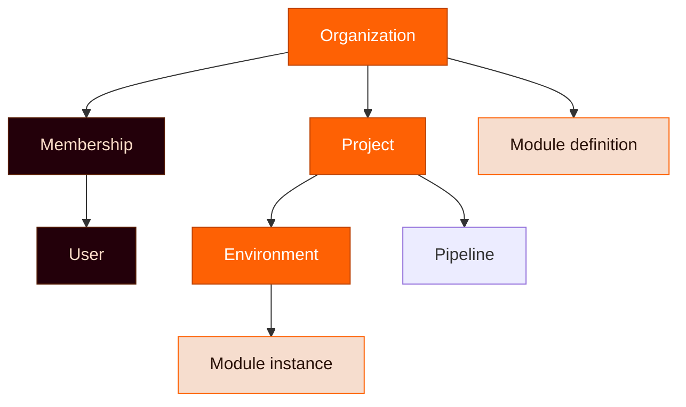
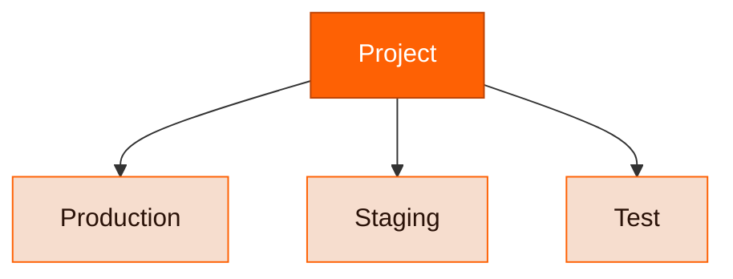

Your Ravion organization is the root container for users and projects. Enterprise companies can have multiple Ravion organizations with unified billing.

Projects and environments are lightweight containers for all your infrastructure and pipelines.

## Projects

Use projects to organize your modules.

A project can contain many or few modules. Small companies may have a single project for all their infrastructure. Or you can have a separate project for each sub-system for your app. It's up to you.

You can always move modules to another project to re-organize later.

Projects can have many environments.

## Environments

Use environments to separate between **production** and other environments like **staging** and **test**.

Typically you'll have the same modules in each environment, but you don't have to.

