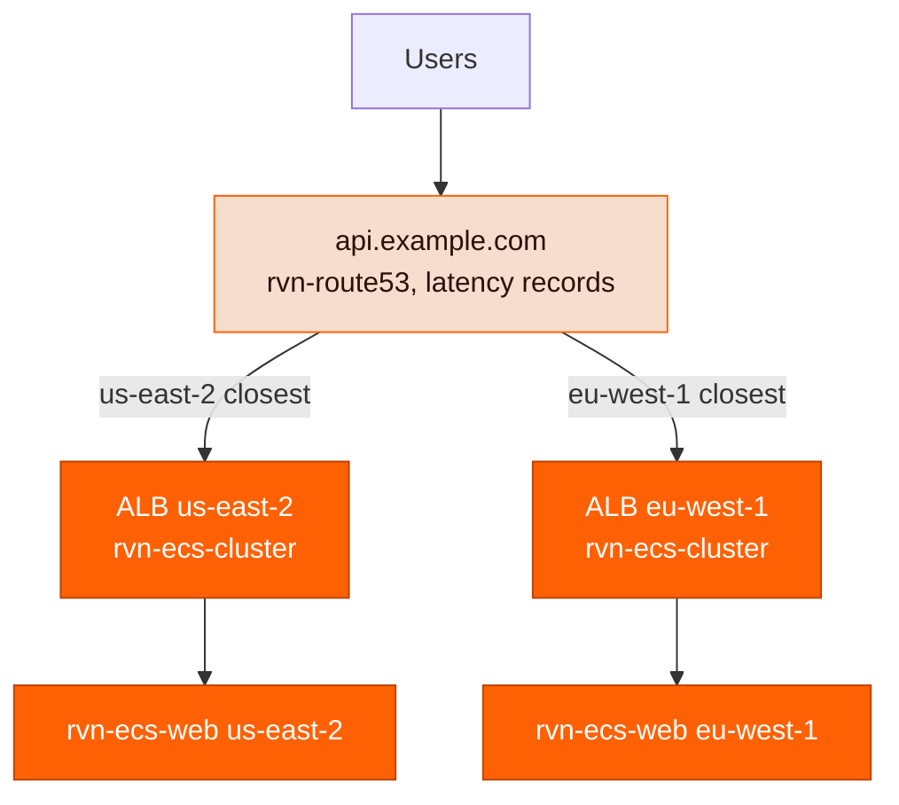

A multi-region setup in Ravion is a **copy of your regional stack per region**, plus one **global DNS layer** that decides which copy a user reaches. Nothing is region-aware inside a module: every module instance has an `aws_region` input, so you run one set of instances per region and tie them together with a [Route 53](/module-definitions/catalog/rvn-route53) module using **latency routing**.

Use this when you want lower latency for users spread across continents, or when you want a region outage to route around itself instead of taking your service down.

This guide builds on [Custom domains](/guides/custom-domains). You should already be comfortable requesting an ACM certificate, attaching it to a load balancer or CloudFront, and pointing a Route 53 record at an endpoint.

## How multi-region fits together

There are three layers:

1. **Regional stacks.** A network, ECS cluster, web service, and regional ACM certificate in each region. These are independent copies — separate module instances with different `aws_region` values and region-suffixed `givenId`s.
2. **Latency-routed DNS.** One Route 53 hostname with several **A alias records** of the same name, one per region, each pointing at that region's load balancer and tagged with `latency_routing_policy_region`. Route 53 answers each query with the region that has the lowest measured latency from the resolver's location, and skips regions whose load balancer is unhealthy.
3. **Optional CloudFront.** A single global distribution in front of the latency-routed hostname. Users always hit CloudFront; each edge location resolves the origin hostname itself, so it lands on the region closest to *that edge*.



### Choose a topology

| Topology                                             | Users hit                                                    | Latency records live on                        | Choose when                                                                                                                       |
| ---------------------------------------------------- | ------------------------------------------------------------ | ---------------------------------------------- | --------------------------------------------------------------------------------------------------------------------------------- |
| **DNS only**                                         | The regional ALB directly (A alias or CNAME)                                  | The public hostname, such as `api.example.com` | You want the simplest setup, or you're serving an API or WebSocket traffic that doesn't benefit from a CDN                        |
| **CloudFront in front**                              | One CloudFront distribution at `app.example.com`             | An origin hostname, such as `origin.example.com` | You want edge TLS termination, caching, WAF, HTTP/3, or a single place to manage redirects and headers across regions             |
| **External DNS + CloudFront**                        | One CloudFront distribution                                  | An origin hostname in Route 53                 | Your public zone lives in another DNS provider. Route 53 only needs to own the origin hostname; the public record stays a CNAME   |

The two Route 53 patterns are the same records — only the name changes. In the DNS-only topology the public hostname *is* the latency-routed record. In the CloudFront topology the public hostname is a normal alias to CloudFront, and the latency-routed record sits behind it as CloudFront's **custom origin domain**.

<Note>
  Route 53 latency routing needs a hostname that Route 53 owns. If your public domain is managed
  elsewhere, delegate a subdomain such as `origin.example.com` (or the whole `example.com` zone) to
  a Route 53 hosted zone, then use the CloudFront topology with your external provider's CNAME
  pointing at the distribution.
</Note>

## Step 1: Duplicate the regional stack

Add one copy of your network, cluster, web service, and regional certificate per region. Give every instance a region-suffixed `givenId` so references stay unambiguous, and set `aws_region` on the modules that take it. The example below uses the [project config file](/config-as-code/project-config-file); the dashboard equivalent is adding the same module instances in each region.

```yaml ravion.yaml highlight={7,16,24,44,53,61}
modules:
  # ---------- us-east-2 ----------
  - givenId: vpc-use2
    name: VPC us-east-2
    type: rvn-aws-network
    version: 1.1.0
    input:
      aws_account_id: my-aws-account
      aws_region: us-east-2
      name: api-production-use2
      vpc_cidr: 10.10.0.0/16
      nat_gateway_enabled: true

  - givenId: api-cert-use2
    name: API certificate us-east-2
    type: rvn-acm-certificate
    version: 1.0.1
    input:
      aws_account_id: my-aws-account
      aws_region: us-east-2
      domain_name: "*.example.com"
      route53_validation_records_creation_enabled: true
      route53_zone_id: Z1234567890ABC
      certificate_validation_wait_enabled: true

  - givenId: ecs-cluster-use2
    name: ECS cluster us-east-2
    type: rvn-ecs-cluster
    version: 1.0.1
    input:
      network:
        moduleGivenIdRef: vpc-use2
      name: api-production-use2
      fargate_enabled: true
      public_alb_enabled: true
      public_alb_certificate:
        moduleGivenIdRef: api-cert-use2

  - givenId: api-use2
    name: API us-east-2
    type: rvn-ecs-web
    version: 1.3.0
    input:
      cluster:
        moduleGivenIdRef: ecs-cluster-use2
      name: api-production-use2
      public_web_service_enabled: true
      host_header_values:
        - api.example.com
      build_type: dockerfile
      source_repo: my-org/my-api
      dockerfile: Dockerfile
      container_port: 8080
      health_check_path: /healthz

  # ---------- eu-west-1 ----------
  - givenId: vpc-euw1
    name: VPC eu-west-1
    type: rvn-aws-network
    version: 1.1.0
    input:
      aws_account_id: my-aws-account
      aws_region: eu-west-1
      name: api-production-euw1
      vpc_cidr: 10.20.0.0/16
      nat_gateway_enabled: true

  - givenId: api-cert-euw1
    name: API certificate eu-west-1
    type: rvn-acm-certificate
    version: 1.0.1
    input:
      aws_account_id: my-aws-account
      aws_region: eu-west-1
      domain_name: "*.example.com"
      route53_validation_records_creation_enabled: true
      route53_zone_id: Z1234567890ABC
      certificate_validation_wait_enabled: true

  - givenId: ecs-cluster-euw1
    name: ECS cluster eu-west-1
    type: rvn-ecs-cluster
    version: 1.0.1
    input:
      network:
        moduleGivenIdRef: vpc-euw1
      name: api-production-euw1
      fargate_enabled: true
      public_alb_enabled: true
      public_alb_certificate:
        moduleGivenIdRef: api-cert-euw1

  - givenId: api-euw1
    name: API eu-west-1
    type: rvn-ecs-web
    version: 1.3.0
    input:
      cluster:
        moduleGivenIdRef: ecs-cluster-euw1
      name: api-production-euw1
      public_web_service_enabled: true
      host_header_values:
        - api.example.com
      build_type: dockerfile
      source_repo: my-org/my-api
      dockerfile: Dockerfile
      container_port: 8080
      health_check_path: /healthz
```

A few rules that are easy to miss:

- **Certificates are regional.** ACM certificates for an ALB must be issued in the ALB's region, so each region needs its own `rvn-acm-certificate` instance. The same certificate module *can* validate against a single Route 53 hosted zone from every region — only the `aws_region` differs. A wildcard (`*.example.com`) keeps one certificate valid for both the public hostname and any origin hostname you add later.
- **Use non-overlapping VPC CIDRs** (`10.10.0.0/16`, `10.20.0.0/16`, …). Nothing requires it today, but you'll want it the moment you peer regions or add a Transit Gateway.
- **Every region gets the same `host_header_values`.** Whichever region a request lands in, the ALB listener rule must match the hostname users typed — or, with CloudFront, the hostname CloudFront forwards.
- **Deploys are per region.** Each `rvn-ecs-web` instance has its own build and deploy pipeline. Pushing to the repo triggers all of them, but they roll out independently; there is no cross-region coordination.

Apply the config:

```bash
ravion project config apply <project-id> --file ravion.yaml --autoapprove
```

## Step 2: Collect each region's load balancer details

Route 53 alias records need two values per region: the load balancer's **DNS name** and its **canonical hosted zone ID**. Both are stack outputs of the module that owns the ALB. (CNAME records, covered below, only need the DNS name.)

| Load balancer owner                                              | DNS name output          | Hosted zone ID output    |
| ---------------------------------------------------------------- | ------------------------ | ------------------------ |
| [rvn-ecs-cluster](/module-definitions/catalog/rvn-ecs-cluster) public ALB | `public_alb_dns_name`    | `public_alb_zone_id`     |
| [rvn-ecs-web](/module-definitions/catalog/rvn-ecs-web) with its own load balancer | `load_balancer_dns_name` | `load_balancer_zone_id`  |
| [rvn-aws-alb](/module-definitions/catalog/rvn-aws-alb) standalone | `alb_dns_name`           | `alb_zone_id`            |

Read them from the module's **Outputs** tab in the dashboard, or from the CLI:

```bash
ravion stack get <stack-id> --json | jq '.outputs | {public_alb_dns_name, public_alb_zone_id}'
```

The hosted zone ID is per region and per load balancer type. `Z3AADJGX6KTTL2` is the ALB zone for `us-east-2`, `Z32O12XQLNTSW2` for `eu-west-1`; NLBs use different IDs. Always copy the value from the stack output rather than from memory.

<Note>
  Today you copy these two values into the Route 53 module by hand. The `rvn-route53` records
  input doesn't yet accept a `moduleGivenIdRef` to a cluster or service, so if you recreate a load
  balancer, update the alias values in the DNS module too.
</Note>

## Step 3: Create latency records

Add an `rvn-route53` module (or extend an existing one) with **one A alias record per region**, all sharing the same name. Three fields turn a plain alias into a latency record:

- `routing_policy: latency`
- `set_identifier` — any unique label per record; the region name is the obvious choice
- `latency_routing_policy_region` — the AWS region Route 53 should measure latency to, which should be the region the load balancer is actually in

```yaml ravion.yaml highlight={13-15,23-25}
- givenId: dns
  name: DNS
  type: rvn-route53
  version: 1.0.3
  input:
    aws_account_id: my-aws-account
    aws_region: us-east-1
    zone_creation_enabled: false
    zone_id: Z1234567890ABC
    records:
      - type: A
        name: api.example.com
        target_type: alias
        alias_name: api-production-use2-123456.us-east-2.elb.amazonaws.com
        alias_zone_id: Z3AADJGX6KTTL2 # public_alb_zone_id from ecs-cluster-use2
        alias_evaluate_target_health: true
        routing_policy: latency
        set_identifier: us-east-2
        latency_routing_policy_region: us-east-2

      - type: A
        name: api.example.com
        target_type: alias
        alias_name: api-production-euw1-654321.eu-west-1.elb.amazonaws.com
        alias_zone_id: Z32O12XQLNTSW2 # public_alb_zone_id from ecs-cluster-euw1
        alias_evaluate_target_health: true
        routing_policy: latency
        set_identifier: eu-west-1
        latency_routing_policy_region: eu-west-1
```

Set **`alias_evaluate_target_health: true`** on every record. With it, Route 53 checks the ALB's target health before answering: if the `eu-west-1` ALB reports unhealthy, Route 53 stops returning that record and European users fail over to `us-east-2` automatically. Without it, a dead region keeps receiving traffic. This works with no extra Route 53 health check, because Route 53 reads ALB target health directly.

<Warning>
  Route 53 evaluates an ALB alias **per target group**: the alias is healthy only when every
  target group attached to the load balancer has at least one healthy target. On a shared cluster
  ALB, one unrelated service with zero healthy tasks (or an empty target group) marks the whole
  region unhealthy and drains its traffic. If several services share the ALB, either keep them all
  healthy, give the multi-region service its own load balancer, or replace
  `alias_evaluate_target_health` with a Route 53 health check against your service's
  `/healthz` path and set its ID in `health_check_id`.
</Warning>

If you also serve IPv6, repeat the same records with `type: AAAA` — Route 53 treats A and AAAA record sets independently, so each needs its own latency records.

### CNAME variant

Latency routing also works with plain `CNAME` records. Use `target_type: standard` and put the load balancer hostname in `record_value`; no hosted zone ID is needed, and the target doesn't have to be an AWS resource at all (a Cloudflare tunnel or another provider's endpoint works the same way).

```yaml ravion.yaml highlight={4-5,8-10}
records:
  - type: CNAME
    name: api.example.com
    target_type: standard
    record_value: api-production-use2-123456.us-east-2.elb.amazonaws.com
    ttl: 60
    health_check_id: abcdef12-3456-7890-abcd-ef1234567890 # Route 53 health check for the us-east-2 endpoint
    routing_policy: latency
    set_identifier: us-east-2
    latency_routing_policy_region: us-east-2

  - type: CNAME
    name: api.example.com
    target_type: standard
    record_value: api-production-euw1-654321.eu-west-1.elb.amazonaws.com
    ttl: 60
    health_check_id: 12345678-90ab-cdef-1234-567890abcdef
    routing_policy: latency
    set_identifier: eu-west-1
    latency_routing_policy_region: eu-west-1
```

Two differences from the alias form:

- **Failover needs a health check.** `alias_evaluate_target_health` only exists for alias records, so a CNAME latency record stays in rotation while its region is down unless you attach a Route 53 health check through `health_check_id`. Create one per region against the regional hostname (for example an HTTPS check on `/healthz` with the `Host` header set to `api.example.com`).
- **No zone apex.** DNS forbids a CNAME at the root of a zone, so `example.com` itself must use alias records; `api.example.com` or `www.example.com` are fine.

Keep `ttl` low (60 seconds) so resolvers pick up a failover quickly; alias records get this for free from the ALB's own TTL.

<Note>
  Latency routing picks the region with the lowest latency **from the DNS resolver making the
  query**, based on AWS's own latency measurements. A user on a VPN or a distant public resolver can
  be routed to an unexpected region. Alias records have no TTL of their own; they inherit the
  target's, which is 60 seconds for ALBs, so failover typically takes a minute or two.
</Note>

Apply the change and skip to [Step 5](#step-5-verify-routing) if you're using the DNS-only topology.

## Step 4 (optional): Put CloudFront in front

To serve all regions through one CloudFront distribution, keep the latency records from Step 3 but move them to an **origin hostname**, and add a public record that points at CloudFront.

<Steps>
  <Step title="Rename the latency records to an origin hostname">
    Change `name` on each latency record from `api.example.com` to something users never see,
    such as `origin.example.com`. Everything else stays the same.
  </Step>
  <Step title="Add a CloudFront module with a custom origin">
    Use `origin_source: custom` and point `origin_domain_name` at the latency-routed hostname.
    The distribution needs its own certificate in `us-east-1` for its alias, separate from the
    regional ALB certificates, so add one more `rvn-acm-certificate` instance alongside the
    CloudFront module:

    ```yaml ravion.yaml highlight={7,20-21,23}
    - givenId: api-cert-use1
      name: API certificate us-east-1 (CloudFront)
      type: rvn-acm-certificate
      version: 1.0.1
      input:
        aws_account_id: my-aws-account
        aws_region: us-east-1 # CloudFront certificates must be in us-east-1
        domain_name: "*.example.com"
        route53_validation_records_creation_enabled: true
        route53_zone_id: Z1234567890ABC
        certificate_validation_wait_enabled: true

    - givenId: cdn
      name: CDN
      type: rvn-cloudfront
      version: 1.3.1
      input:
        aws_account_id: my-aws-account
        origin_source: custom
        origin_domain_name: origin.example.com
        origin_protocol_policy: https-only
        distribution_aliases:
          - api.example.com
        certificate:
          moduleGivenIdRef: api-cert-use1
    ```

    CloudFront's default origin request policy forwards the **viewer's Host header**
    (`api.example.com`) to the origin, so keep `api.example.com` in each region's
    `host_header_values`. With `https-only`, CloudFront checks each regional ALB's certificate
    against the forwarded Host (`api.example.com`), and the ALB also serves it for
    `origin.example.com` — the wildcard certificate from Step 1 covers both names.

  </Step>
  <Step title="Point the public hostname at CloudFront">
    Add a normal alias record for `api.example.com` to the distribution. If your public zone is
    in Route 53:

    ```yaml ravion.yaml
    - type: A
      name: api.example.com
      target_type: alias
      alias_name: d1234abcd.cloudfront.net # distribution_domain_name output of the cdn module
      alias_zone_id: Z2FDTNDATAQYW2 # CloudFront's fixed hosted zone ID
      alias_evaluate_target_health: false
    ```

    If the public zone is in another DNS provider, create a `CNAME` from `api.example.com` to
    the distribution domain there instead. Only `origin.example.com` needs to live in Route 53.

  </Step>
</Steps>

Why this works: each CloudFront edge location resolves `origin.example.com` on its own. Route 53 sees the query coming from that edge and answers with the region closest to *it*. A viewer in Frankfurt is served by the Frankfurt edge, which connects to `eu-west-1`; a viewer in Chicago is served by a US edge, which connects to `us-east-2`. Regional failover still comes from `alias_evaluate_target_health` on the origin records, because CloudFront re-resolves the origin as the record's TTL expires.

Compared with DNS-only, you also get TLS termination at the edge, connection reuse to the origin, HTTP/2 and HTTP/3, optional WAF, and [redirect rules](/module-definitions/catalog/rvn-cloudfront) managed in one place instead of per region.

## Step 5: Verify routing

<Steps>
  <Step title="Confirm every regional endpoint serves the hostname">
    Test each ALB directly, before trusting DNS, by forcing the connection to it:

    ```bash
    curl -sv https://api.example.com/healthz \
      --resolve api.example.com:443:$(dig +short api-production-euw1-654321.eu-west-1.elb.amazonaws.com | head -1)
    ```

    Repeat per region. A TLS error means the regional certificate doesn't cover the hostname; a
    404 or 421 means `host_header_values` doesn't match.

  </Step>
  <Step title="Ask Route 53 what it would answer from another location">
    Route 53 honors the EDNS client subnet extension, so you can ask an authoritative name server
    how it would answer for a resolver in a given network without leaving your desk:

    ```bash
    # Grab one of the zone's name servers
    NS=$(dig +short NS example.com | head -1)

    # A resolver in Germany should get the eu-west-1 ALB
    dig @$NS api.example.com +subnet=85.214.0.0/24 +short

    # A resolver in the US should get the us-east-2 ALB
    dig @$NS api.example.com +subnet=8.8.8.0/24 +short
    ```

    In the CloudFront topology, query `origin.example.com` instead — `api.example.com` always
    returns CloudFront IPs.

  </Step>
  <Step title="Add a region header to make the serving region visible">
    Have your app return a header such as `X-Served-Region: us-east-2` from an environment
    variable set per service, then check it end to end:

    ```bash
    curl -sI https://api.example.com/healthz | grep -i x-served-region
    ```

    This is the fastest way to confirm real users, monitoring probes, and CloudFront edges are
    landing where you expect.

  </Step>
  <Step title="Rehearse a regional failover">
    Scale one region's web service to zero tasks or deploy a build whose health check fails, then
    watch `dig +subnet` for that region's networks flip to the other region within a couple of
    minutes. Roll back afterward and confirm traffic returns.
  </Step>
</Steps>

## What multi-region doesn't solve

Latency routing spreads **stateless compute**. Everything else needs its own plan:

- **Databases and caches are regional.** An `rvn-rds`, `rvn-aurora`, or `rvn-elasticache` instance lives in one region. Either accept cross-region latency from the other regions to a single primary, or use a replicated data store (Aurora Global Database, DynamoDB global tables) and point each region's service at its local endpoint through environment variables.
- **Secrets are regional.** Secrets Manager secrets referenced with `valueFrom` must exist in the region of the service that reads them. Create them per region, or replicate them from a primary region. See [Managing secrets](/guides/managing-secrets).
- **Sessions and uploads.** Anything stored on the instance or in a single-region S3 bucket won't follow a user who gets routed to a different region. Use signed cookies or tokens for sessions and S3 Cross-Region Replication, or a single bucket behind CloudFront, for objects.
- **Rollouts are not coordinated.** Each region deploys on its own. Use each service's [deploy strategy](/modules/deploy) to keep a bad build from reaching users, and expect a short window where regions run different versions.

## Troubleshooting

| Symptom                                                                        | Likely cause                                                                                                    | Fix                                                                                                                                          |
| ------------------------------------------------------------------------------ | --------------------------------------------------------------------------------------------------------------- | -------------------------------------------------------------------------------------------------------------------------------------------- |
| Apply fails with `set_identifier` or "record already exists"                   | Two latency records share a name without unique `set_identifier`s, or a plain (simple) record has the same name | Give every record a distinct `set_identifier` and remove any simple record for that name                                                     |
| Everyone is routed to one region                                               | `latency_routing_policy_region` is the same on every record, or the other region's ALB has no healthy targets   | Set each record's region to where its ALB actually runs; check target health in the cluster's metrics                                        |
| A dead region still receives traffic                                           | `alias_evaluate_target_health` is `false`                                                                       | Set it to `true` on every latency record                                                                                                     |
| Route 53 answers with `NXDOMAIN` for the origin hostname                       | The origin hostname is in a zone Route 53 doesn't serve                                                         | Create the record in a hosted zone Route 53 is authoritative for, and delegate that name from your external provider if needed                |
| CloudFront returns 502 for one region only                                     | That region's ALB certificate doesn't cover `origin.example.com` or the forwarded Host                          | Use a wildcard certificate or add both names to the regional certificate; or set `origin_protocol_policy: http-only` if the ALB has no HTTPS |
| CloudFront returns 421 or 404 for one region only                              | That region's service is missing `api.example.com` in `host_header_values`                                      | Add the same host rules to every region's service                                                                                            |
| Recreated a cluster and DNS broke                                              | ALB DNS name and hosted zone ID changed but the Route 53 alias still has the old values                         | Copy the new `public_alb_dns_name` and `public_alb_zone_id` outputs into the record                                                          |
