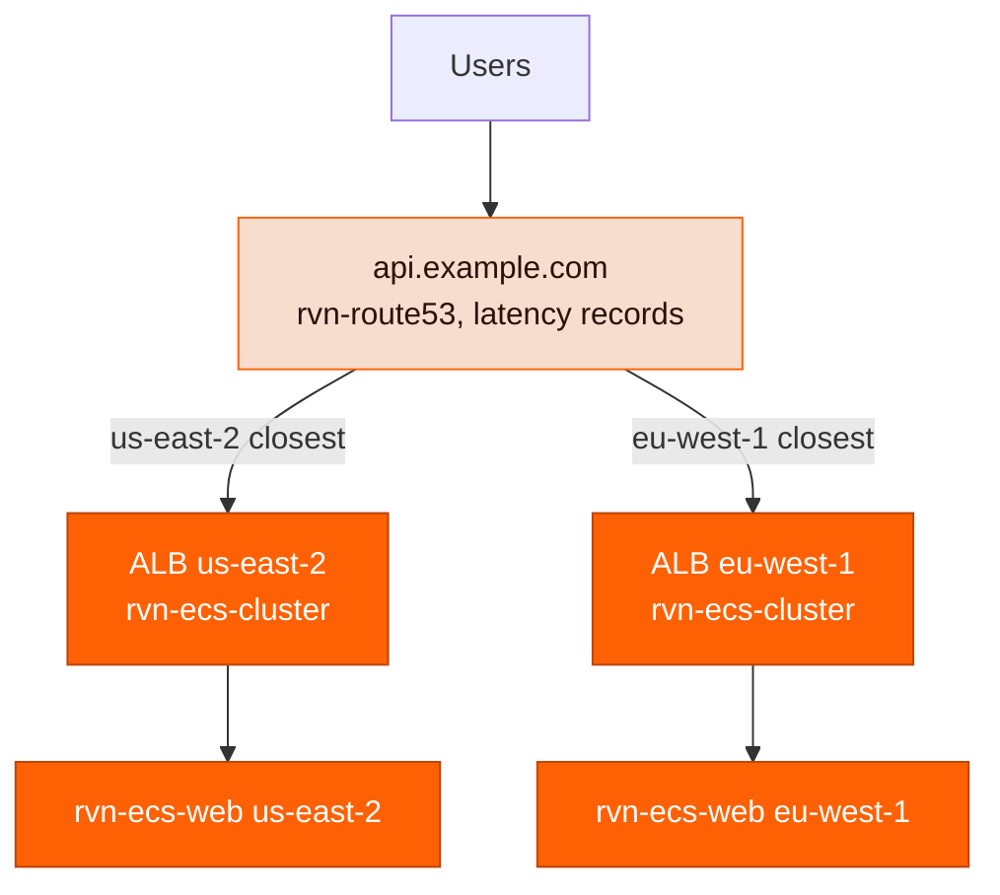

A multi-region setup in Ravion is a **copy of your regional stack per region** plus one **global DNS layer** that decides which copy a user reaches. Modules aren't region-aware: every instance has an `aws_region`, so you run one set of instances per region and tie them together with a [Route 53](/module-definitions/catalog/rvn-route53) module using **latency routing**. Route 53 answers each query with the region closest to the resolver and skips regions whose load balancer is unhealthy.

This guide builds on [Custom domains](/guides/custom-domains).



## Choose a topology

| Topology                      | Users hit                                        | Latency records live on                          | Choose when                                                                                            |
| ----------------------------- | ------------------------------------------------ | ------------------------------------------------ | ------------------------------------------------------------------------------------------------------ |
| **Load balancer only**        | The regional ALB directly (A alias or CNAME)     | The public hostname, such as `api.example.com`   | You want the simplest setup, or serve API or WebSocket traffic that doesn't benefit from a CDN         |
| **CloudFront in front**       | One CloudFront distribution                      | An origin hostname, such as `origin.example.com` | You want edge TLS, caching, WAF, HTTP/3, or one place to manage redirects and headers across regions   |
| **External DNS + CloudFront** | One CloudFront distribution                      | An origin hostname in Route 53                   | Your public zone lives with another DNS provider; Route 53 only needs to own the origin hostname       |

The Route 53 records are the same in every topology — only the record name changes. Latency routing needs a hostname Route 53 owns, so if your public domain is managed elsewhere, delegate a subdomain such as `origin.example.com` to a Route 53 hosted zone and use the CloudFront topology.

## Step 1: Duplicate the regional stack

Add one copy of your network, certificate, cluster, and web service per region. Use region-suffixed `givenId`s and set `aws_region` on the modules that take it. Give each web service `build_source: ecr` so Ravion manages an ECR repository in that region without a per-region build; the pipeline in the next section pushes the image to all of them.

```yaml ravion.yaml highlight={8,18,46,56,66,94}
modules:
  # ---------- us-east-2 ----------
  - givenId: vpc-use2
    type: rvn-aws-network
    version: 1.1.0
    input:
      aws_account_id: my-aws-account
      aws_region: us-east-2
      name: api-production-use2
      vpc_cidr: 10.10.0.0/16
      nat_gateway_enabled: true

  - givenId: api-cert-use2
    type: rvn-acm-certificate
    version: 1.0.1
    input:
      aws_account_id: my-aws-account
      aws_region: us-east-2
      domain_name: "*.example.com"
      route53_validation_records_creation_enabled: true
      route53_zone_id: Z1234567890ABC
      certificate_validation_wait_enabled: true

  - givenId: ecs-cluster-use2
    type: rvn-ecs-cluster
    version: 1.0.1
    input:
      network:
        moduleGivenIdRef: vpc-use2
      name: api-production-use2
      fargate_enabled: true
      public_alb_enabled: true
      public_alb_certificate:
        moduleGivenIdRef: api-cert-use2

  - givenId: api-use2
    type: rvn-ecs-web
    version: 1.4.0
    input:
      cluster:
        moduleGivenIdRef: ecs-cluster-use2
      name: api-production-use2
      public_web_service_enabled: true
      host_header_values:
        - api.example.com
      build_source: ecr
      container_port: 8080
      health_check_path: /healthz

  # ---------- eu-west-1 ----------
  - givenId: vpc-euw1
    type: rvn-aws-network
    version: 1.1.0
    input:
      aws_account_id: my-aws-account
      aws_region: eu-west-1
      name: api-production-euw1
      vpc_cidr: 10.20.0.0/16
      nat_gateway_enabled: true

  - givenId: api-cert-euw1
    type: rvn-acm-certificate
    version: 1.0.1
    input:
      aws_account_id: my-aws-account
      aws_region: eu-west-1
      domain_name: "*.example.com"
      route53_validation_records_creation_enabled: true
      route53_zone_id: Z1234567890ABC
      certificate_validation_wait_enabled: true

  - givenId: ecs-cluster-euw1
    type: rvn-ecs-cluster
    version: 1.0.1
    input:
      network:
        moduleGivenIdRef: vpc-euw1
      name: api-production-euw1
      fargate_enabled: true
      public_alb_enabled: true
      public_alb_certificate:
        moduleGivenIdRef: api-cert-euw1

  - givenId: api-euw1
    type: rvn-ecs-web
    version: 1.4.0
    input:
      cluster:
        moduleGivenIdRef: ecs-cluster-euw1
      name: api-production-euw1
      public_web_service_enabled: true
      host_header_values:
        - api.example.com
      build_source: ecr
      container_port: 8080
      health_check_path: /healthz
```

Two rules that are easy to miss:

- **Certificates are regional.** An ALB's ACM certificate must be issued in the ALB's region, so each region needs its own `rvn-acm-certificate`. A wildcard keeps one certificate valid for the public hostname and any origin hostname you add later.
- **Every region gets the same `host_header_values`.** Whichever region a request lands in, the listener rule must match the hostname users typed — or, with CloudFront, the hostname CloudFront forwards.

Apply the config:

```bash
ravion project config apply <project-id> --file ravion.yaml --autoapprove
```

## Step 2: Build once, deploy everywhere

Use a single [pipeline](/concepts/pipelines): one `build:image` step pushes the same image to every region's ECR repository, then a `deploy` step per region releases that one digest. Each service's repository ARN is the `ecr_repository_arn` output of its stack.

```yaml pipeline.yaml highlight={13-19,28,33}
inputs:
  - id: commit
    type: string
steps:
  - id: build_api
    type: build:image
    source:
      type: git
      repo: https://github.com/my-org/my-api
      ref: << pipeline.input.commit >>
    builder:
      type: dockerfile
    destinations:
      - id: ecr_use2
        type: ecr
        repository_arn: arn:aws:ecr:us-east-2:123456789012:repository/api-production-use2 # ecr_repository_arn from api-use2
      - id: ecr_euw1
        type: ecr
        repository_arn: arn:aws:ecr:eu-west-1:123456789012:repository/api-production-euw1 # ecr_repository_arn from api-euw1
    infrastructure:
      type: ec2
      instance_size: medium
  - parallel:
      - id: deploy_use2
        type: deploy
        module_instance: << pipeline.variant.id >>.api-use2
        input:
          image_ref: << steps.build_api.output.image_digest >>
      - id: deploy_euw1
        type: deploy
        module_instance: << pipeline.variant.id >>.api-euw1
        input:
          image_ref: << steps.build_api.output.image_digest >>
```

Make the deploys sequential instead of `parallel` if one region should act as a canary. There is no atomic multi-region switch: while the deploy steps run, regions briefly serve different versions.

## Step 3: Create latency records

Route 53 alias records need each region's load balancer **DNS name** and **hosted zone ID**. Both are outputs of the module that owns the ALB; read them from the module's **Outputs** tab or `ravion stack get <stack-id> --json`.

| Load balancer owner                                                                | DNS name output          | Hosted zone ID output   |
| ---------------------------------------------------------------------------------- | ------------------------ | ----------------------- |
| [rvn-ecs-cluster](/module-definitions/catalog/rvn-ecs-cluster) public ALB          | `public_alb_dns_name`    | `public_alb_zone_id`    |
| [rvn-ecs-web](/module-definitions/catalog/rvn-ecs-web) with its own load balancer  | `load_balancer_dns_name` | `load_balancer_zone_id` |
| [rvn-aws-alb](/module-definitions/catalog/rvn-aws-alb) standalone                  | `alb_dns_name`           | `alb_zone_id`           |

<Note>
  Today you copy these values into the Route 53 module by hand — the `records` input doesn't yet
  accept a `moduleGivenIdRef`. If you recreate a load balancer, update the alias values too.
</Note>

Add an `rvn-route53` module with **one A alias record per region**, all sharing the same name. Three fields turn an alias into a latency record: `routing_policy: latency`, a unique `set_identifier`, and `latency_routing_policy_region` set to the region the load balancer is in.

```yaml ravion.yaml highlight={17-19,27-29}
- givenId: dns
  name: DNS
  type: rvn-route53
  version: 1.0.3
  input:
    aws_account_id: my-aws-account
    aws_region: us-east-1
    zone_creation_enabled: false
    zone_id: Z1234567890ABC
    records:
      - type: A
        name: api.example.com
        target_type: alias
        alias_name: api-production-use2-123456.us-east-2.elb.amazonaws.com
        alias_zone_id: Z3AADJGX6KTTL2 # public_alb_zone_id from ecs-cluster-use2
        alias_evaluate_target_health: true
        routing_policy: latency
        set_identifier: us-east-2
        latency_routing_policy_region: us-east-2

      - type: A
        name: api.example.com
        target_type: alias
        alias_name: api-production-euw1-654321.eu-west-1.elb.amazonaws.com
        alias_zone_id: Z32O12XQLNTSW2 # public_alb_zone_id from ecs-cluster-euw1
        alias_evaluate_target_health: true
        routing_policy: latency
        set_identifier: eu-west-1
        latency_routing_policy_region: eu-west-1
```

Set **`alias_evaluate_target_health: true`** on every record. Route 53 then reads the ALB's own target health — no extra health check needed — and stops returning a region whose targets are unhealthy, so users fail over to the next-closest region within a minute or two. Repeat the records with `type: AAAA` if you serve IPv6.

<Warning>
  Route 53 evaluates an ALB alias **per target group**: one unrelated service on a shared cluster
  ALB with zero healthy tasks marks the whole region unhealthy. If several services share the
  ALB, give the multi-region service its own load balancer, or replace
  `alias_evaluate_target_health` with a Route 53 health check on your `/healthz` path via
  `health_check_id`.
</Warning>

### CNAME variant

Latency routing also works with plain `CNAME` records: use `target_type: standard`, put the hostname in `record_value`, and skip the zone ID. The target doesn't have to be an AWS resource.

```yaml ravion.yaml highlight={4-10,14-20}
records:
  - type: CNAME
    name: api.example.com
    target_type: standard
    record_value: api-production-use2-123456.us-east-2.elb.amazonaws.com
    ttl: 60
    health_check_id: abcdef12-3456-7890-abcd-ef1234567890 # Route 53 health check for the us-east-2 endpoint
    routing_policy: latency
    set_identifier: us-east-2
    latency_routing_policy_region: us-east-2

  - type: CNAME
    name: api.example.com
    target_type: standard
    record_value: api-production-euw1-654321.eu-west-1.elb.amazonaws.com
    ttl: 60
    health_check_id: 12345678-90ab-cdef-1234-567890abcdef
    routing_policy: latency
    set_identifier: eu-west-1
    latency_routing_policy_region: eu-west-1
```

Two differences from the alias form: CNAMEs can't use `alias_evaluate_target_health`, so attach a Route 53 health check per region through `health_check_id` or a dead region stays in rotation; and DNS forbids a CNAME at the zone apex, so `example.com` itself must use alias records. Keep `ttl` low so resolvers pick up a failover quickly.

Skip to [Step 5](#step-5-verify-routing) if you're using the load-balancer-only topology.

## Step 4 (optional): Put CloudFront in front

Keep the latency records from Step 3 but rename them to an **origin hostname**, then add a CloudFront distribution and a public record that points at it.

<Steps>
  <Step title="Rename the latency records">
    Change `name` on each latency record from `api.example.com` to `origin.example.com`. Everything
    else stays the same.
  </Step>
  <Step title="Add a CloudFront module with a custom origin">
    Point `origin_domain_name` at the latency-routed hostname. CloudFront needs its own certificate
    in `us-east-1`:

    ```yaml ravion.yaml highlight={7,19-20,24-25}
    - givenId: api-cert-use1
      name: API certificate us-east-1 (CloudFront)
      type: rvn-acm-certificate
      version: 1.0.1
      input:
        aws_account_id: my-aws-account
        aws_region: us-east-1 # CloudFront certificates must be in us-east-1
        domain_name: "*.example.com"
        route53_validation_records_creation_enabled: true
        route53_zone_id: Z1234567890ABC
        certificate_validation_wait_enabled: true

    - givenId: cdn
      name: CDN
      type: rvn-cloudfront
      version: 1.3.1
      input:
        aws_account_id: my-aws-account
        origin_source: custom
        origin_domain_name: origin.example.com
        origin_protocol_policy: https-only
        distribution_aliases:
          - api.example.com
        certificate:
          moduleGivenIdRef: api-cert-use1
    ```

    CloudFront forwards the viewer's `Host` header (`api.example.com`) to the origin, so keep it in
    each region's `host_header_values`. The wildcard certificate from Step 1 covers both names.

  </Step>
  <Step title="Point the public hostname at CloudFront">
    In Route 53, add a plain alias for `api.example.com`:

    ```yaml ravion.yaml
    - type: A
      name: api.example.com
      target_type: alias
      alias_name: d1234abcd.cloudfront.net # distribution_domain_name output of the cdn module
      alias_zone_id: Z2FDTNDATAQYW2 # CloudFront's fixed hosted zone ID
      alias_evaluate_target_health: false
    ```

    If the public zone is with another DNS provider, create a `CNAME` to the distribution domain
    there instead. Only `origin.example.com` needs to live in Route 53.

  </Step>
</Steps>

Each CloudFront edge resolves `origin.example.com` itself, so Route 53 answers with the region closest to *that edge*: a viewer in Frankfurt reaches `eu-west-1`, a viewer in Chicago reaches `us-east-2`. Regional failover still comes from `alias_evaluate_target_health` on the origin records.

## Step 5: Verify routing

<Steps>
  <Step title="Test each regional endpoint directly">
    ```bash
    curl -sv https://api.example.com/healthz \
      --resolve api.example.com:443:$(dig +short api-production-euw1-654321.eu-west-1.elb.amazonaws.com | head -1)
    ```

    A TLS error means the regional certificate doesn't cover the hostname; a 404 or 421 means
    `host_header_values` doesn't match.

  </Step>
  <Step title="Ask Route 53 what it answers from another location">
    Route 53 honors EDNS client subnet, so you can query an authoritative name server as if you
    were a resolver elsewhere:

    ```bash
    NS=$(dig +short NS example.com | head -1)
    dig @$NS api.example.com +subnet=85.214.0.0/24 +short   # Germany -> eu-west-1 ALB
    dig @$NS api.example.com +subnet=8.8.8.0/24 +short      # US -> us-east-2 ALB
    ```

    In the CloudFront topology, query `origin.example.com` instead.

  </Step>
  <Step title="Rehearse a failover">
    Scale one region's service to zero tasks, watch `dig +subnet` for that region flip to the
    other one within a couple of minutes, then roll back.
  </Step>
</Steps>

## What multi-region doesn't solve

Latency routing spreads **stateless compute**. Everything else needs its own plan:

- **Databases and caches are regional.** Either accept cross-region latency to a single primary, or use a replicated store (Aurora Global Database, DynamoDB global tables) and point each region's service at its local endpoint.
- **Parameter Store is regional; Secrets Manager isn't.** Replicate a Secrets Manager secret to every region and use the regional replica ARN in each service's `valueFrom`. Parameter Store has no replication, so create parameters per region. See [Managing secrets](/guides/managing-secrets).
- **Sessions and uploads.** Anything on the instance or in a single-region bucket won't follow a user routed elsewhere. Use tokens for sessions and S3 Cross-Region Replication, or one bucket behind CloudFront, for objects.

## Troubleshooting

| Symptom                                                      | Likely cause                                                                                                  | Fix                                                                                              |
| ------------------------------------------------------------ | ------------------------------------------------------------------------------------------------------------- | ------------------------------------------------------------------------------------------------ |
| Apply fails with `set_identifier` or "record already exists" | Two latency records share a name without unique `set_identifier`s, or a simple record has the same name       | Give every record a distinct `set_identifier` and remove any simple record for that name         |
| Everyone is routed to one region                             | `latency_routing_policy_region` is the same on every record, or the other region's ALB has no healthy targets | Set each record's region to where its ALB runs; check target health in the cluster's metrics     |
| A dead region still receives traffic                         | `alias_evaluate_target_health` is `false`, or a CNAME record has no `health_check_id`                          | Enable it on every alias record; attach a health check to every CNAME record                     |
| CloudFront returns 502 for one region only                   | That region's ALB certificate doesn't cover the forwarded Host                                                | Use a wildcard certificate or add both names to the regional certificate                          |
| CloudFront returns 421 or 404 for one region only            | That region's service is missing `api.example.com` in `host_header_values`                                    | Add the same host rules to every region's service                                                |
| Recreated a cluster and DNS broke                            | ALB DNS name and hosted zone ID changed but the alias still has the old values                                | Copy the new `public_alb_dns_name` and `public_alb_zone_id` outputs into the record              |
