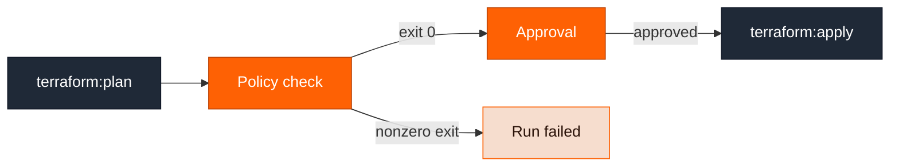

Every stack runs through a Ravion-managed [system pipeline](/modules/stack#system-pipelines-and-customization) that plans, waits for approval, and applies. System pipelines are global and read-only, so to enforce your own rules — required tags, forbidden instance types, blast-radius limits — you copy one into your own project, insert a policy check step, and make your copy the default for an organization, project, or environment.

The process at a glance:

1. [Copy the system pipeline config](#step-1-copy-the-system-pipeline-config) you want to extend.
2. [Create your own pipeline](#step-2-create-your-own-pipeline) in the project that should own it.
3. [Add the policy check step](#step-3-add-the-policy-check-step) between plan and approval.
4. [Make it the default](#step-4-make-your-pipeline-the-default) at the scope you want it enforced.

## How a policy check stops a run

Steps run in order, and a step that exits nonzero fails the run. Put the check after `terraform:plan` and before `approval`, and a violation stops the run before anyone can approve it — so nothing reaches `terraform:apply`.



The policy step is a [`custom` step](/pipelines/step-types#custom): it checks out your Terraform code and runs whatever commands you give it on an EC2 runner in your own cloud account. Your code, variables, and policy rules never leave your account.

## Before you start

- The ID of the project that should own the pipeline — run `ravion project list`.
- A policy tool that exits nonzero on violations. Any CLI works, because the step is plain shell.
- The [Ravion CLI](/cli/overview) authenticated against your organization.

## Step 1: Copy the system pipeline config

List your pipelines and find **Terraform Change Pipeline**, the system pipeline with the given ID `tf-change-pipeline`. It appears in every organization, and its pipeline ID starts with `pipe_`:

```bash
ravion pipeline list
```

Pull its config into a file you can edit and commit:

```bash
ravion pipeline config pull <system-pipeline-id> --file change-pipeline.yaml
```

Starting from the system config keeps the plan, approval, and apply wiring that stacks depend on. See [Pipeline config file](/config-as-code/pipeline-config-file) for the pull, edit, apply workflow.

## Step 2: Create your own pipeline

Create an empty pipeline in the project that should own it, then note the returned pipeline ID:

```bash
ravion pipeline create \
  --given-id tf-change-with-policy \
  --name "Terraform change with policy checks" \
  --project-id <project-id>
```

<Warning>
  Keep these parts of the copied config intact, or stack runs fail:

  - The `inputs` block. Stacks pass `repo`, `branch`, `ref`, `base_path`, `stack_id`, `tool`, `tool_version`, `terraform_variables`, and the AWS targeting inputs by name.
  - The `standard` [variant](/pipelines/variants). Stack configs request the variant named in `stack.pipelines.defaults.variant`, which is `standard` for the standard library modules.
  - `plan_file_uri: << steps.plan.output.plan_file_uri >>` on the apply step, so the apply uses exactly the plan your policy check inspected.
  - The `autoapprove` input. Ravion only passes autoapprove to a change run when the pipeline declares that input, so removing it makes every change run wait for approval.
</Warning>

## Step 3: Add the policy check step

Insert the step between `plan` and `approve` in `change-pipeline.yaml`. This example runs [Checkov](https://www.checkov.io) against the checked-out Terraform code, but any command works — swap in `tflint`, `conftest`, an OPA bundle, or your own script:

```yaml
steps:
  - id: plan
    # ...unchanged from the system pipeline
  - id: policy
    name: Policy check
    type: custom
    if: << steps.plan.output.has_changes >>
    source:
      type: git
      repo: << pipeline.input.repo >>
      branch: << pipeline.input.branch >>
      ref: << pipeline.input.ref >>
      base_path: << pipeline.input.base_path >>
    commands:
      - pip3 install --quiet checkov==3.3.11
      - checkov --directory . --framework terraform --compact
    infrastructure:
      type: ec2
      instance_size: t3.medium
      region: << pipeline.input.aws_region >>
      aws_account_id: << pipeline.input.aws_account_id >>
      execution_environment_id: << pipeline.input.execution_environment_id >>
  - id: approve
    # ...unchanged from the system pipeline
  - id: apply
    # ...unchanged from the system pipeline
```

Reusing the `pipeline.input.*` values means the step checks out the same commit and runs in the same account and region as the plan. See [Templating](/pipelines/templating) for the available expressions and [step types](/pipelines/step-types) for every `custom` step field.

Three things worth knowing:

- **Pin the tool version.** Installing the latest release on every run lets a new release change your policy results, or a registry outage block stack changes, with no config change on your side.
- **Skip the check when nothing changed.** `if: << steps.plan.output.has_changes >>` keeps no-op runs fast.
- **Gate on the plan's blast radius.** The plan step publishes change counts, so you can require a second approval only when resources would be destroyed:

  ```yaml
  - id: approve_deletions
    name: Approve resource deletion
    type: approval
    if: << steps.plan.output.change_summary.destroy_count > 0 >>
  ```

<Note>
  To inspect the plan itself rather than the source, your commands must fetch and decode it: `plan_file_uri` is an S3 URI for a binary plan file, so the step needs the same IaC tool and version, an initialized working directory, and read access to that bucket — grant it with `infrastructure.permissions.attach`. Checking the checked-out configuration needs none of that, so start there unless your rules depend on the diff.
</Note>

Apply the edited config to your pipeline:

```bash
ravion pipeline config apply <your-pipeline-id> --file change-pipeline.yaml
```

## Step 4: Make your pipeline the default

Stacks resolve their pipelines from [default values](/cli/reference/default-value) whose definition given IDs are `change_pipeline_id` and `destroy_pipeline_id`. Find the definition ID:

```bash
ravion default-value definition list
```

Then set your pipeline at the scope where it should apply:

<CodeGroup>

```bash Organization
ravion default-value create \
  --default-value-definition-id <definition-id> \
  --parent-type organization --parent-id <org-id> \
  --value <your-pipeline-id>
```

```bash Project
ravion default-value create \
  --default-value-definition-id <definition-id> \
  --parent-type project --parent-id <project-id> \
  --value <your-pipeline-id>
```

```bash Environment
ravion default-value create \
  --default-value-definition-id <definition-id> \
  --parent-type environment --parent-id <environment-id> \
  --value <your-pipeline-id>
```

</CodeGroup>

The most specific scope wins: an environment value overrides a project value, which overrides the organization value. So a safe rollout is to set the environment value for staging first, confirm a run, then move the value up to the organization.

Existing stacks pick the new default up on their next run — you don't have to touch module config. To change or remove a value later:

```bash
ravion default-value list --definition-id <definition-id>
ravion default-value update <default-value-id> --value <other-pipeline-id>
ravion default-value delete <default-value-id>   # falls back to the broader scope
```

<Note>
  A module definition can pin an explicit pipeline through `stack.pipelines.change.pipeline_id` or
  `stack.pipelines.destroy.pipeline_id`, which wins over the resolved default. The standard library
  modules set these to `<< defaults.change_pipeline_id >>` and `<< defaults.destroy_pipeline_id >>`,
  so defaults apply — but a definition that sets a literal pipeline ID ignores them. See the [module
  definition schema](/module-definitions/definition-schema).
</Note>

## Cover destroys too

The change pipeline runs when a module is created or changed. Deleting a module runs the destroy pipeline instead, so policies that must also govern teardown — for example requiring an extra approver for production deletions — need the same treatment on a copy of **Terraform Destroy Pipeline** (given ID `tf-destroy-pipeline`), pointed at through `destroy_pipeline_id`.

The destroy config is the same shape, with `plan_type: destroy` on its plan step. Destroy runs always stop for approval, because Ravion only passes autoapprove to change runs.

## Verify the check

Trigger a change run against a stack and watch it:

```bash
ravion stack trigger-pipeline <stack-id> --pipeline-type change --description "Verify policy check"
ravion pipeline run wait <pipeline-run-id> --watch
```

Confirm both directions before you widen the scope: a compliant stack reaches the approval step, and a stack that violates a rule fails at the policy step with your tool's output in the step logs.
