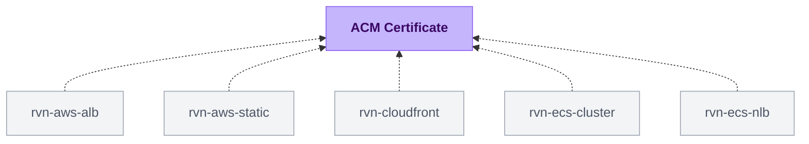

{/* Generated by scripts/sync-module-catalog.mjs from the Ravion module catalog. Do not edit by hand. */}

**Type:** `rvn-acm-certificate` · **Latest version:** `1.0.1`

## Dependencies and consumers

_Every dependency input can be specified manually to reference existing external infrastructure rather than a Ravion module._

## Readme

Requests an AWS Certificate Manager public certificate with DNS validation.

### Overview

Use this module when an application, load balancer, or CloudFront distribution needs a public TLS certificate managed by AWS Certificate Manager. The module creates the ACM certificate request, exposes DNS validation records, and can optionally create Route53 validation records and wait until ACM issues the certificate.

By default, the module does not create DNS records and does not block the apply waiting for issuance. This keeps first-time provisioning useful when DNS is managed outside the stack or when validation records need to be copied into another provider.

### Use cases

| Scenario | Benefit |
| --- | --- |
| Public ALB HTTPS | Create a regional ACM certificate in the same AWS Region as the ALB. |
| CloudFront custom domain | Request the certificate in us-east-1, which CloudFront requires. |
| External DNS provider | Output validation CNAME records so they can be created manually or outside Ravion. |
| Route53-managed DNS | Let the stack create validation records in a single public hosted zone. |

### Certificate domains

Add every fully qualified domain name to the required Domains list. The first domain, such as api.example.com, is the certificate's primary domain. Every remaining domain becomes a subject alternative name. Domain names must be unique.

### DNS validation

ACM public certificates use DNS validation. The stack outputs validation record details after apply so you can create the required CNAME records wherever DNS is managed.

Enable Create Route53 validation records when the validation records should be created automatically in one Route53 public hosted zone. When that option is enabled, Route53 hosted zone ID is required.

Enable Wait for certificate issuance only when DNS validation can complete during the apply. If DNS is external or validation records will be added later, leave it off so the stack can finish while the certificate remains pending validation.

### Regional behavior

Choose the AWS Region based on where the certificate will be used:

| Destination | Region guidance |
| --- | --- |
| Application Load Balancer | Use the same AWS Region as the ALB. |
| CloudFront | Use us-east-1, regardless of where the rest of the application runs. |

### Configuration

| Setting | Required | Default | Notes |
| --- | --- | --- | --- |
| AWS account | Yes | None | AWS account where the certificate is requested. |
| Region | Yes | None | AWS Region for ACM. Use us-east-1 for CloudFront. |
| Terraform execution environment | No | None | Optional runner environment override for the stack pipeline. |
| Name slug | Yes | Project, environment, and module given IDs | Name prefix used for certificate tags. |
| Domains | Yes | None | Ordered FQDNs. The first is primary and the remainder are subject alternative names. |
| Create Route53 validation records | No | false | Creates validation CNAMEs in Route53. |
| Route53 hosted zone ID | When Route53 records are enabled | None | Public hosted zone used for validation records. |
| Wait for certificate issuance | No | false | Waits until ACM issues the certificate during apply. |
| Tags | No | Standard Ravion tags | Additional tags merged with Ravion ownership and identity tags. |
| Advanced Terraform variables | No | Empty object | Escape hatch for one-off Terraform variable overrides. |
| Ravion Terraform workspace name | No | Generated from project, environment, module, and stack IDs | Override only when you need a specific backend workspace name. |

### Design decisions

The default mode favors non-blocking certificate requests. It creates the ACM certificate and returns DNS validation records without assuming DNS is managed by Route53 or available during the first apply.

Route53 automation is intentionally scoped to a single hosted zone. If SANs require validation records in multiple zones, leave Route53 automation off and create the returned validation records in the appropriate DNS zones.

Ravion adds standard tags for ownership and traceability. User-provided Tags are merged on top for team, cost, or environment metadata.

### Learn more

- [AWS Certificate Manager DNS validation](https://docs.aws.amazon.com/acm/latest/userguide/dns-validation.html)
- [AWS Certificate Manager certificates for CloudFront](https://docs.aws.amazon.com/AmazonCloudFront/latest/DeveloperGuide/cnames-and-https-requirements.html)
- [Source module](https://github.com/ravionhq/modules/tree/rvn-acm-certificate@1.0.1/security/acm_certificate)

## Inputs reference

All inputs for `rvn-acm-certificate` version `1.0.1`. Use the `name` shown for each field as the input key in module config.

### AWS account & region

<ResponseField name="aws_account_id" type="string" required>
  **AWS account.**

  - Immutable after creation
</ResponseField>

<ResponseField name="aws_region" type="string" required>
  **Region.** Must be the same region as the load balancer, or us-east-1 for CloudFront.

  - Immutable after creation
</ResponseField>

### Certificate

<ResponseField name="name" type="string" required>
  **Name slug.** Name prefix used for tagging the ACM certificate.

  - Default: `<<project.given_id>>-<<environment.given_id>>-<<module.given_id>>`
  - Pattern: `^[a-z0-9]([a-z0-9-]{0,62}[a-z0-9])?$` — Use 1-64 lowercase letters, numbers, or hyphens, starting and ending with a letter or number.
</ResponseField>

<ResponseField name="domains" type="string_array" required>
  **Domains.** Fully qualified domain names for the certificate. The first domain is primary and the remaining domains are subject alternative names.

  - Immutable after creation
</ResponseField>

### DNS validation

<ResponseField name="route53_validation_records_creation_enabled" type="boolean">
  **Create Route53 validation records.** Use only when the domain already has a Route53 public hosted zone and all primary/SAN validation records belong in that zone.

  - Default: `false`
  - Immutable after creation
</ResponseField>

<ResponseField name="route53_zone_id" type="string" required>
  **Route53 hosted zone ID.** Public hosted zone used for validation records. Required when Route53 validation records are enabled.

  - Immutable after creation
  - Pattern: `^Z[0-9A-Z]+$` — Use a valid Route53 hosted zone ID, for example Z1234567890ABC.
  - Shown when: `{"route53_validation_records_creation_enabled":true}`
</ResponseField>

<ResponseField name="certificate_validation_wait_enabled" type="boolean">
  **Wait for certificate issuance.** Wait for ACM to issue the certificate during apply. Enable after DNS validation can complete.

  - Default: `false`
</ResponseField>

### Misc

<ResponseField name="tags" type="keyvalue">
  **Tags.** A map of tags to assign to all resources. Default tags are `Owner`, `ProjectGivenId`, `EnvironmentGivenId`, `ModuleGivenId`, `ModuleId`
</ResponseField>

### Terraform settings

<ResponseField name="opentofu_version" type="string">
  **OpenTofu version override.** Override the environment's default version for this module
</ResponseField>

<ResponseField name="ravion_state_backend_workspace" type="string">
  **Ravion Terraform workspace name.** Override Terraform state backend workspace name. Defaults to project + environment + module given ids.

  - Immutable after creation
</ResponseField>

<ResponseField name="advanced_terraform_variables" type="object">
  **Advanced Terraform variables.** Optional raw Terraform variable overrides for advanced module inputs or one-off overrides. Values here override the generated variables above.

  - Default: `{}`
</ResponseField>

<ResponseField name="execution_environment_id" type="string">
  **Terraform execution environment.** Override the VPC, subnet, and security group for Terraform runners. Must use the same AWS account as selected above.
</ResponseField>
