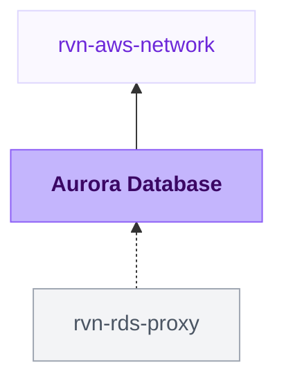

{/* Generated by scripts/sync-module-catalog.mjs from the Ravion module catalog. Do not edit by hand. */}

**Type:** `rvn-aurora` · **Latest version:** `1.3.0`

## Dependencies and consumers

_Every dependency input can be specified manually to reference existing external infrastructure rather than a Ravion module._

## Readme

Creates and manages an Amazon Aurora cluster. Supports Aurora PostgreSQL and Aurora MySQL with provisioned or Serverless v2 capacity.

### Overview

Use this module when an application needs a managed, highly available relational database cluster in AWS. It provisions an Aurora cluster with writer and reader instances, subnet placement, security group access, backups, monitoring, optional reader autoscaling, and optional advanced Aurora features.

Aurora PostgreSQL and Aurora MySQL are supported. Choose the engine major version and, when needed, a minor version for exact engine pinning. Choose provisioned instances for predictable capacity or Serverless v2 when the workload needs capacity that scales in Aurora Capacity Units.

### Use cases

| Scenario | Benefit |
| --- | --- |
| Application database | Create a private Aurora cluster attached to an existing Ravion VPC network. |
| Production database | Enable deletion protection, automated backups, final snapshots, Performance Insights, and CloudWatch alarms. |
| Read-heavy workload | Add reader instances and optionally scale them with reader autoscaling. |
| Variable workload | Use Serverless v2 capacity to scale compute between configured ACU limits. |
| Cross-region database | Configure global database settings and write forwarding where supported by the selected engine. |

### Networking

Select a VPC network first. Ravion maps the network's AWS account, region, VPC ID, and private and public subnet IDs into this module. Aurora requires at least two subnets in different Availability Zones, and private subnets are the normal choice for application databases. AWS places cluster instances across the Availability Zones of the selected subnets.

Public access is disabled by default, and the DB subnet group uses the private subnet IDs. When Publicly accessible is enabled, the DB subnet group switches to the public subnet IDs because AWS requires public subnets for public database access. Changing this setting after creation replaces the DB subnet group and the cluster.

Keep public access disabled for production databases and allow access through security group IDs from application services or controlled CIDR blocks. You can create a module-managed security group or attach an existing one.

### Capacity modes

Provisioned capacity uses a fixed DB instance class for the writer and, by default, for readers. Serverless v2 uses Aurora Capacity Units; set the minimum and maximum ACUs to control the scaling range. The module uses `db.serverless` for cluster instances when Serverless v2 is selected.

### Availability and readers

Reader settings live together in the Readers section. Choose the number of reader instances, an optional separate reader instance class, and an optional default failover promotion tier. Readers default to 0; add at least one reader in another Availability Zone for production failover.

Reader autoscaling can adjust the number of read replicas based on CPU utilization and, optionally, database connections. Configure min and max reader capacity carefully because autoscaling can increase cost.

### Credentials and security

Master password management in AWS Secrets Manager is enabled by default, so AWS creates and stores the master password for the cluster. Before importing a cluster whose existing password is managed outside Secrets Manager, disable password management and enable Preserve existing master password. Leaving password management enabled causes AWS to generate a new master password. Preservation verifies that the named cluster already exists in AWS, preventing a new cluster from reaching AWS without any source of master credentials. Provide a Secrets Manager KMS key ARN when you need a customer-managed key for a managed secret.

Storage encryption is enabled by the Terraform module. Provide a storage KMS key ARN when you need a customer-managed key for cluster storage. IAM database authentication and the Aurora Data API HTTP endpoint are optional.

### Availability, backups, and maintenance

Aurora creates a writer instance and the configured number of reader instances. Backup retention defaults to 7 days and must be at least 1 day for Aurora. Final snapshots and deletion protection are enabled by default to reduce accidental data loss.

Maintenance windows, automatic minor upgrades, major version upgrades, and immediate apply are configurable. Major version upgrades and immediate changes are opt-in because they can affect database availability.

Aurora MySQL exposes backtrack and local write forwarding settings. Aurora PostgreSQL exposes global write forwarding according to this module's Terraform validation.

### Observability

Performance Insights is enabled by default with 7 days of retention. Enhanced monitoring can be enabled by setting a monitoring interval.

CloudWatch alarms monitor CPU utilization, freeable memory, database connections, cluster storage capacity, and read/write IOPS. Aurora MySQL uses remaining volume space (default 100 GiB); PostgreSQL uses volume bytes used (default 115 TiB, configurable for the engine storage limit). Both storage alarms support Serverless v2. IOPS alarms use the cluster maximum to cover writers and readers, including autoscaled readers. Tune the default 1000 IOPS thresholds to the workload. Storage periods are at least 5 minutes, and IOPS periods at least 1 minute, matching metric resolution. Supply alarm action ARNs to receive notifications. The freeable memory alarm threshold is entered in MiB in Ravion and converted to bytes for Terraform.

CloudWatch log exports offer engine-specific log types: postgresql for Aurora PostgreSQL, or audit, error, general, and slowquery for Aurora MySQL. Each enabled log type is shown on the module Logs tab.

The Ravion UI charts Aurora CloudWatch metrics for CPU utilization, freeable memory, database connections, serverless capacity and ACU utilization, storage used, read and write latency, replica lag, buffer cache hit ratio, commit latency, deadlocks, network throughput, and volume IOPS.

### Connection pooling

Enable RDS Proxy to place a managed connection pool in front of the cluster. The proxy authenticates with the Secrets Manager master user secret by default, requires TLS, and allows the same security group and CIDR sources configured for the cluster. Pool sizing, idle timeouts, session pinning, IAM authentication, and custom auth secrets are configurable in the Connection pooling section.

Creating the proxy does not change how applications reach the cluster. Update your application connection string to the proxy endpoint output to route traffic through the pool.

### Configuration

| Field | Required | Default | Notes |
| --- | --- | --- | --- |
| VPC network | Yes | None | Supplies AWS account, region, VPC ID, and private and public subnet IDs. |
| Name slug | Yes | Project and environment given IDs | Name of the Aurora cluster and prefix for related resources. |
| Engine | Yes | Aurora PostgreSQL | Aurora PostgreSQL and Aurora MySQL are supported. |
| Engine major version | Yes | None | Use values such as 16 for Aurora PostgreSQL or 8.0 for Aurora MySQL. |
| Engine minor version | No | Blank | For PostgreSQL, 4 becomes 16.4. For MySQL, 3.08.0 becomes 8.0.mysql_aurora.3.08.0. |
| Capacity mode | Yes | Provisioned instances | Choose provisioned instances or Serverless v2. |
| Instance class | Yes for provisioned | db.t4g.medium | Writer DB instance class for provisioned capacity. |
| Min and max capacity | Yes for Serverless v2 | 1 to 4 ACUs | Serverless v2 scaling bounds. |
| Reader count | No | 0 | Number of reader instances. Add readers for high availability and read scaling. |
| Database name | No | Blank | Creates an initial database on new clusters when provided. |
| Username | Yes for new clusters | dbadmin | Master database user. |
| Manage password in Secrets Manager | No | true | Stores generated master credentials in AWS Secrets Manager. Disable before importing an externally managed password. |
| Preserve existing master password | No | false | Verifies the cluster exists in AWS and leaves its externally managed password unchanged. |
| Publicly accessible | No | false | Switches the DB subnet group to public subnets. Leave disabled unless public database access is intentional. |
| Security group creation | No | true | Creates ingress rules from allowed security groups and CIDRs. |
| Backup retention days | No | 7 | Aurora requires at least 1 day. |
| Deletion protection | No | true | Helps prevent accidental deletion. |
| Performance insights | No | true | Enables AWS Performance Insights. |
| CloudWatch alarms | No | true | Adds CPU, memory, connection, storage capacity, and read/write IOPS alarms. |
| RDS Proxy | No | false | Creates an RDS Proxy connection pool in front of the cluster. |
| Global database | No | false | Create or join an Aurora global database. |
| Activity stream | No | false | Enables Database Activity Streams with a required KMS key. |
| Tags | No | Blank | Merged with Ravion standard tags. |

### Advanced configuration

Use cluster parameter groups for cluster-level engine settings and DB parameter groups for instance-level engine settings. The Misc section holds less common cluster features: Database Activity Streams, custom endpoints for reader or any-instance routing, and IAM role associations that attach feature-specific IAM roles for capabilities such as S3 import, S3 export, or Lambda invocation.

Use advanced Terraform variables for one-off overrides not represented directly in the UI. Values in advanced Terraform variables override generated variables.

Terraform settings let you override the OpenTofu version, Terraform execution environment inherited from the VPC network, and Ravion state backend workspace name.

### Design decisions

Aurora clusters are placed in private subnets by default through the VPC network reference. Secrets Manager password management, encryption at rest, Performance Insights, final snapshots, and deletion protection default on because they are safer defaults for long-lived databases.

The module keeps primary database, capacity, networking, backup, and monitoring choices visible while placing engine-specific, autoscaling, parameter group, global database, activity stream, custom endpoint, IAM association, and Terraform settings behind focused advanced controls.

### Learn more

- [Amazon Aurora documentation](https://docs.aws.amazon.com/AmazonRDS/latest/AuroraUserGuide/CHAP_AuroraOverview.html)
- [Aurora DB instance classes](https://docs.aws.amazon.com/AmazonRDS/latest/AuroraUserGuide/Concepts.DBInstanceClass.html)
- [Aurora Serverless v2](https://docs.aws.amazon.com/AmazonRDS/latest/AuroraUserGuide/aurora-serverless-v2.html)
- [Aurora global databases](https://docs.aws.amazon.com/AmazonRDS/latest/AuroraUserGuide/aurora-global-database.html)
- [Aurora monitoring](https://docs.aws.amazon.com/AmazonRDS/latest/AuroraUserGuide/CHAP_Monitoring.html)
- [Terraform source](https://github.com/ravionhq/modules/tree/rvn-aurora@1.3.0/database/aurora)

## Inputs reference

All inputs for `rvn-aurora` version `1.3.0`. Use the `name` shown for each field as the input key in module config.

<ResponseField name="network" type="$ref:rvn-aws-network" required>
  **VPC network.**

  - Immutable after creation
</ResponseField>

### Database

<ResponseField name="name" type="string" required>
  **Name slug.** Name of the Aurora cluster and prefix for related resources.

  - Default: `<<project.given_id>>-<<environment.given_id>>`
  - Immutable after creation
  - Pattern: `^[a-z]([a-z0-9-]{0,61}[a-z0-9])?$` — 1-63 lowercase letters, numbers, and hyphens. Start with a letter and end with a letter or number.
</ResponseField>

<ResponseField name="restore_mode" type="string" required>
  **Create or restore.**

  - Default: `none`
  - Allowed values: `none` (New empty database), `snapshot` (Restore from snapshot), `point_in_time` (Point-in-time restore)
  - Immutable after creation
</ResponseField>

<ResponseField name="database_name" type="string">
  **Database name.** Name for an automatically created database on the cluster.

  - Immutable after creation
  - Pattern: `^[A-Za-z][A-Za-z0-9_]{0,63}$` — 1-64 letters, numbers, and underscores. Start with a letter.
  - Shown when: `{"restore_mode":"none"}`
</ResponseField>

<ResponseField name="master_username" type="string" required>
  **Username.**

  - Default: `dbadmin`
  - Immutable after creation
  - Pattern: `^[A-Za-z][A-Za-z0-9_]{0,62}$` — Invalid Aurora master username. Start with a letter. Letters, numbers, and underscores only.
  - Shown when: `{"restore_mode":"none"}`
</ResponseField>

<ResponseField name="snapshot_identifier" type="string" required>
  **Snapshot to restore.** Snapshot identifier or ARN to restore into this new Aurora cluster.

  - Immutable after creation
  - Shown when: `{"restore_mode":"snapshot"}`
</ResponseField>

<ResponseField name="point_in_time_source_cluster_identifier" type="string" required>
  **Source cluster identifier.** Source Aurora cluster identifier to restore from.

  - Immutable after creation
  - Shown when: `{"restore_mode":"point_in_time"}`
</ResponseField>

<ResponseField name="point_in_time_restore_type" type="string" required>
  **Restore type.**

  - Default: `full-copy`
  - Allowed values: `full-copy` (Full copy), `copy-on-write` (Copy on write)
  - Immutable after creation
  - Shown when: `{"restore_mode":"point_in_time"}`
</ResponseField>

<ResponseField name="point_in_time_use_latest_restorable_time" type="boolean">
  **Use latest restorable time.** Restore to the latest time AWS can recover from the selected source cluster backup.

  - Default: `true`
  - Immutable after creation
  - Shown when: `{"restore_mode":"point_in_time"}`
</ResponseField>

<ResponseField name="point_in_time_restore_time" type="string">
  **Restore time.** Restore to this UTC timestamp instead of the latest restorable time.

  - Immutable after creation
  - Shown when: `{"point_in_time_use_latest_restorable_time":false,"restore_mode":"point_in_time"}`
</ResponseField>

### Version

<ResponseField name="engine" type="string" required>
  **Engine.**

  - Default: `aurora-postgresql`
  - Allowed values: `aurora-postgresql` (Aurora PostgreSQL), `aurora-mysql` (Aurora MySQL)
  - Immutable after creation
</ResponseField>

<ResponseField name="engine_major_version" type="string" required>
  **Engine major version.** Examples: 16 for Aurora PostgreSQL or 8.0 for Aurora MySQL.
</ResponseField>

<ResponseField name="engine_minor_version" type="string">
  **Engine minor version.** Optional minor engine version appended to the major version. Example: 4 becomes 16.4 for Aurora PostgreSQL; 3.08.0 becomes 8.0.mysql_aurora.3.08.0 for Aurora MySQL.
</ResponseField>

<ResponseField name="minor_version_auto_upgrade_enabled" type="boolean">
  **Auto minor version upgrades.** Enable automatic minor engine version upgrades during the configured maintenance window.

  - Default: `true`
</ResponseField>

### Capacity

<ResponseField name="capacity_mode" type="string" required>
  **Capacity mode.** Choose fixed DB instances or Aurora Serverless v2 capacity.

  - Default: `provisioned`
  - Allowed values: `provisioned` (Provisioned instances), `serverless_v2` (Serverless v2)
</ResponseField>

<ResponseField name="instance_class" type="string" required>
  **Instance class.** Aurora writer instance size, such as db.t4g.medium or db.r6g.large.

  - Default: `db.t4g.medium`
  - Shown when: `{"capacity_mode":"provisioned"}`
</ResponseField>

<ResponseField name="serverless_min_capacity" type="number" required>
  **Min capacity (ACUs).** Minimum Aurora Serverless v2 capacity units. Must not exceed max capacity.

  - Default: `1`
  - Min: `1`
  - Max: `256`
  - Shown when: `{"capacity_mode":"serverless_v2"}`
</ResponseField>

<ResponseField name="serverless_max_capacity" type="number" required>
  **Max capacity (ACUs).** Maximum Aurora Serverless v2 capacity units. Must be at least min capacity.

  - Default: `4`
  - Min: `1`
  - Max: `256`
  - Shown when: `{"capacity_mode":"serverless_v2"}`
</ResponseField>

### Storage & cluster

<ResponseField name="storage_type" type="string">
  **Storage type.**

  - Default: `aurora`
  - Allowed values: `aurora` (Aurora Standard), `aurora-iopt1` (Aurora I/O-Optimized)
</ResponseField>

<ResponseField name="kms_key_id" type="string">
  **Storage KMS key ARN.**

  - Immutable after creation
</ResponseField>

<ResponseField name="ca_certificate_identifier" type="string">
  **CA certificate identifier.**
</ResponseField>

<ResponseField name="network_type" type="string">
  **Network type.**

  - Default: `IPV4`
  - Allowed values: `IPV4` (IPv4), `DUAL` (Dual-stack)
</ResponseField>

### Network access

<ResponseField name="public_access_enabled" type="boolean">
  **Publicly accessible.** Keep disabled for production databases unless public access is intentional.

  - Default: `false`
</ResponseField>

<ResponseField name="port" type="number">
  **Port.** Leave blank to use the engine default port: 5432 for PostgreSQL or 3306 for MySQL.

  - Min: `1`
  - Max: `65535`
</ResponseField>

<ResponseField name="security_group_creation_enabled" type="boolean">
  **Security group creation.**

  - Default: `true`
  - Immutable after creation
</ResponseField>

<ResponseField name="security_group_id" type="string">
  **Existing security group ID.**

  - Shown when: `{"security_group_creation_enabled":false}`
</ResponseField>

<ResponseField name="allowed_security_group_ids" type="string_array">
  **Allowed security groups.**

  - Shown when: `{"security_group_creation_enabled":true}`
</ResponseField>

<ResponseField name="allowed_cidr_blocks" type="string_array">
  **Allowed CIDR blocks.**

  - Shown when: `{"security_group_creation_enabled":true}`
</ResponseField>

### Connection pooling

<ResponseField name="proxy_creation_enabled" type="boolean">
  **RDS Proxy.** Create an RDS Proxy in front of the cluster for connection pooling and improved failover handling. Applications keep connecting to the cluster endpoint until you update their connection string to the proxy endpoint output.

  - Default: `false`
</ResponseField>

<ResponseField name="proxy_auth_secret_arns" type="string_array">
  **Auth secret ARNs.** Secrets Manager secrets containing database credentials for the proxy. Leave blank to use the managed master user secret.

  - Shown when: `{"proxy_creation_enabled":true}`
</ResponseField>

<ResponseField name="proxy_secret_kms_key_arns" type="string_array">
  **Auth secret KMS key ARNs.** KMS keys used to encrypt the auth secrets when using customer-managed keys. The master user secret KMS key is included automatically.

  - Shown when: `{"proxy_creation_enabled":true}`
</ResponseField>

<ResponseField name="proxy_iam_auth_enabled" type="boolean">
  **IAM authentication.** Require IAM authentication for client connections to the proxy.

  - Default: `false`
  - Shown when: `{"proxy_creation_enabled":true}`
</ResponseField>

<ResponseField name="proxy_tls_requirement_enabled" type="boolean">
  **Require TLS.** Require TLS for client connections to the proxy.

  - Default: `true`
  - Shown when: `{"proxy_creation_enabled":true}`
</ResponseField>

<ResponseField name="proxy_debug_logging_enabled" type="boolean">
  **Debug logging.** Log detailed connection information, including SQL statements, to CloudWatch Logs.

  - Default: `false`
  - Shown when: `{"proxy_creation_enabled":true}`
</ResponseField>

<ResponseField name="proxy_idle_client_timeout" type="number">
  **Idle client timeout (seconds).**

  - Default: `1800`
  - Min: `1`
  - Max: `28800`
  - Shown when: `{"proxy_creation_enabled":true}`
</ResponseField>

<ResponseField name="proxy_connection_borrow_timeout" type="number">
  **Connection borrow timeout (seconds).**

  - Default: `120`
  - Min: `0`
  - Shown when: `{"proxy_creation_enabled":true}`
</ResponseField>

<ResponseField name="proxy_max_connections_percent" type="number">
  **Max connections (%).** Maximum size of the connection pool as a percentage of the database max_connections setting.

  - Default: `100`
  - Min: `1`
  - Max: `100`
  - Shown when: `{"proxy_creation_enabled":true}`
</ResponseField>

<ResponseField name="proxy_max_idle_connections_percent" type="number">
  **Max idle connections (%).** Maximum idle connections kept open, as a percentage of the database max_connections setting.

  - Default: `50`
  - Min: `0`
  - Max: `100`
  - Shown when: `{"proxy_creation_enabled":true}`
</ResponseField>

<ResponseField name="proxy_session_pinning_filters" type="string_array">
  **Session pinning filters.**

  - Allowed values: `EXCLUDE_VARIABLE_SETS`
  - Shown when: `{"proxy_creation_enabled":true}`
</ResponseField>

<ResponseField name="proxy_init_query" type="string">
  **Initialization query.** SQL statements the proxy runs when opening each new database connection.

  - Shown when: `{"proxy_creation_enabled":true}`
</ResponseField>

### Readers

<ResponseField name="reader_count" type="number">
  **Reader count.** Number of reader instances to create.

  - Default: `0`
  - Min: `0`
  - Max: `15`
</ResponseField>

<ResponseField name="reader_instance_class" type="string">
  **Reader instance class.** Reader instance class. Leave blank to use the writer instance class.

  - Shown when: `{"capacity_mode":"provisioned"}`
</ResponseField>

<ResponseField name="promotion_tier" type="number">
  **Promotion tier.** Default failover priority for instances. Lower values have higher priority.

  - Min: `0`
  - Max: `15`
</ResponseField>

<ResponseField name="autoscaling_enabled" type="boolean">
  **Reader autoscaling.**

  - Default: `false`
</ResponseField>

<ResponseField name="autoscaling_min_capacity" type="number">
  **Min reader capacity.** Must not exceed max reader capacity.

  - Default: `1`
  - Min: `0`
  - Shown when: `{"autoscaling_enabled":true}`
</ResponseField>

<ResponseField name="autoscaling_max_capacity" type="number">
  **Max reader capacity.** Must be at least min reader capacity.

  - Default: `3`
  - Min: `1`
  - Shown when: `{"autoscaling_enabled":true}`
</ResponseField>

<ResponseField name="autoscaling_target_cpu" type="number">
  **Target CPU utilization (%).**

  - Default: `70`
  - Min: `1`
  - Max: `100`
  - Shown when: `{"autoscaling_enabled":true}`
</ResponseField>

<ResponseField name="autoscaling_target_connections" type="number">
  **Target connections.**

  - Min: `1`
  - Shown when: `{"autoscaling_enabled":true}`
</ResponseField>

<ResponseField name="autoscaling_scale_in_cooldown" type="number">
  **Scale-in cooldown seconds.**

  - Default: `300`
  - Min: `0`
  - Shown when: `{"autoscaling_enabled":true}`
</ResponseField>

<ResponseField name="autoscaling_scale_out_cooldown" type="number">
  **Scale-out cooldown seconds.**

  - Default: `300`
  - Min: `0`
  - Shown when: `{"autoscaling_enabled":true}`
</ResponseField>

### Credentials & authentication

<ResponseField name="master_user_password_management_enabled" type="boolean">
  **Manage password in Secrets Manager.** Let AWS generate and manage the master password in Secrets Manager. Disable before importing a cluster whose existing password is managed externally.

  - Default: `true`
</ResponseField>

<ResponseField name="master_user_password_preservation_enabled" type="boolean">
  **Preserve existing master password.** Preserve the externally managed password of an imported cluster. Ravion verifies that the named cluster already exists in AWS.

  - Default: `false`
  - Shown when: `{"master_user_password_management_enabled":false}`
</ResponseField>

<ResponseField name="master_user_secret_kms_key_id" type="string">
  **Secrets Manager KMS key ARN.**

  - Shown when: `{"master_user_password_management_enabled":true,"restore_mode":"none"}`
</ResponseField>

<ResponseField name="iam_database_authentication_enabled" type="boolean">
  **IAM database authentication.**

  - Default: `false`
</ResponseField>

<ResponseField name="http_endpoint_enabled" type="boolean">
  **Data API (HTTP endpoint).** Enable the Aurora Data API HTTP endpoint.

  - Default: `false`
</ResponseField>

### MySQL settings

<ResponseField name="backtrack_window" type="number">
  **Backtrack window (seconds).** Target backtrack window in seconds. Set 0 to disable.

  - Default: `0`
  - Min: `0`
  - Max: `259200`
  - Shown when: `{"engine":"aurora-mysql"}`
</ResponseField>

<ResponseField name="local_write_forwarding_enabled" type="boolean">
  **Local write forwarding.**

  - Default: `false`
  - Shown when: `{"engine":"aurora-mysql"}`
</ResponseField>

### Backups

<ResponseField name="backup_retention_period" type="number">
  **Backup retention days.**

  - Default: `7`
  - Min: `1`
  - Max: `35`
</ResponseField>

<ResponseField name="preferred_backup_window" type="string">
  **Backup window.**
</ResponseField>

<ResponseField name="snapshot_tag_copying_enabled" type="boolean">
  **Copy tags to snapshots.**

  - Default: `true`
</ResponseField>

<ResponseField name="final_snapshot_creation_enabled" type="boolean">
  **Create final snapshot.**

  - Default: `true`
</ResponseField>

<ResponseField name="final_snapshot_identifier" type="string">
  **Final snapshot identifier.**

  - Shown when: `{"final_snapshot_creation_enabled":true}`
</ResponseField>

<ResponseField name="deletion_protection_enabled" type="boolean">
  **Deletion protection.**

  - Default: `true`
</ResponseField>

### Maintenance

<ResponseField name="preferred_maintenance_window" type="string">
  **Maintenance window.**
</ResponseField>

<ResponseField name="major_version_upgrade_enabled" type="boolean">
  **Allow major version upgrades.**

  - Default: `false`
</ResponseField>

<ResponseField name="immediate_apply_enabled" type="boolean">
  **Apply changes immediately.**

  - Default: `false`
</ResponseField>

### Parameter groups

<ResponseField name="cluster_parameter_group_creation_enabled" type="boolean">
  **Cluster parameter group creation.** Create a cluster parameter group for this database. Disable this only when you want to attach an existing parameter group.

  - Default: `true`
  - Immutable after creation
</ResponseField>

<ResponseField name="cluster_parameter_group_name" type="string">
  **Existing cluster parameter group name.** Name of an existing cluster parameter group to attach when this module is not creating one.

  - Immutable after creation
  - Shown when: `{"cluster_parameter_group_creation_enabled":false}`
</ResponseField>

<ResponseField name="cluster_parameter_group_family" type="string">
  **Cluster parameter group family.** Cluster parameter group family. Leave blank to derive it from the selected engine version.

  - Immutable after creation
  - Shown when: `{"cluster_parameter_group_creation_enabled":true}`
</ResponseField>

<ResponseField name="cluster_parameters" type="object_array">
  **Cluster parameters.** Custom cluster parameters to apply to the created cluster parameter group.

  - Default: `[]`
  - Shown when: `{"cluster_parameter_group_creation_enabled":true}`

  <Expandable title="item fields">
    <ResponseField name="name" type="string" required>
      **Name.** Engine parameter name, such as rds.force_ssl.
    </ResponseField>
    <ResponseField name="value" type="string" required>
      **Value.** Parameter value to set.
    </ResponseField>
    <ResponseField name="apply_method" type="string">
      **Apply method.** Apply immediately when supported, or wait until the next database reboot.

      - Default: `immediate`
      - Allowed values: `immediate`, `pending-reboot`
    </ResponseField>
  </Expandable>
</ResponseField>

<ResponseField name="db_parameter_group_creation_enabled" type="boolean">
  **DB parameter group creation.** Create a DB parameter group for cluster instances. Disable this only when you want to attach an existing parameter group.

  - Default: `true`
  - Immutable after creation
</ResponseField>

<ResponseField name="db_parameter_group_name" type="string">
  **Existing DB parameter group name.** Name of an existing DB parameter group to attach when this module is not creating one.

  - Immutable after creation
  - Shown when: `{"db_parameter_group_creation_enabled":false}`
</ResponseField>

<ResponseField name="db_parameter_group_family" type="string">
  **DB parameter group family.** DB parameter group family. Leave blank to derive it from the selected engine version.

  - Immutable after creation
  - Shown when: `{"db_parameter_group_creation_enabled":true}`
</ResponseField>

<ResponseField name="db_parameters" type="object_array">
  **DB parameters.** Custom instance parameters to apply to the created DB parameter group.

  - Default: `[]`
  - Shown when: `{"db_parameter_group_creation_enabled":true}`

  <Expandable title="item fields">
    <ResponseField name="name" type="string" required>
      **Name.** Engine parameter name, such as shared_preload_libraries.
    </ResponseField>
    <ResponseField name="value" type="string" required>
      **Value.** Parameter value to set.
    </ResponseField>
    <ResponseField name="apply_method" type="string">
      **Apply method.** Apply immediately when supported, or wait until the next database reboot.

      - Default: `immediate`
      - Allowed values: `immediate`, `pending-reboot`
    </ResponseField>
  </Expandable>
</ResponseField>

### Monitoring

<ResponseField name="enabled_cloudwatch_logs_exports" type="string_array">
  **CloudWatch log exports.** Engine logs exported to CloudWatch. Each enabled log type is shown on the module Logs tab.

  - Allowed values: `postgresql`, `audit`, `error`, `general`, `slowquery`
</ResponseField>

<ResponseField name="monitoring_interval" type="number">
  **Enhanced monitoring interval.**

  - Default: `0`
  - Allowed values: `0` (0), `1` (1), `5` (5), `10` (10), `15` (15), `30` (30), `60` (60)
</ResponseField>

<ResponseField name="monitoring_role_creation_enabled" type="boolean">
  **Monitoring IAM role creation.**

  - Default: `true`
  - Immutable after creation
  - Shown when: `{"monitoring_interval":{"not":0}}`
</ResponseField>

<ResponseField name="monitoring_role_arn" type="string">
  **Monitoring IAM role ARN.**

  - Shown when: `{"monitoring_interval":{"not":0},"monitoring_role_creation_enabled":false}`
</ResponseField>

<ResponseField name="performance_insights_enabled" type="boolean">
  **Performance insights.**

  - Default: `true`
</ResponseField>

<ResponseField name="performance_insights_retention_period" type="number">
  **Performance insights retention days.** AWS supports 7 days, multiples of 31 days up to 23 months, or 731 days.

  - Default: `7`
  - Allowed values: `7` (7 days), `31` (1 month (31 days)), `62` (2 months (62 days)), `93` (3 months (93 days)), `186` (6 months (186 days)), `372` (12 months (372 days)), `731` (24 months (731 days))
  - Shown when: `{"performance_insights_enabled":true}`
</ResponseField>

<ResponseField name="performance_insights_kms_key_id" type="string">
  **Performance insights KMS key ARN.**

  - Shown when: `{"performance_insights_enabled":true}`
</ResponseField>

### CloudWatch alarms

<ResponseField name="cloudwatch_alarms_creation_enabled" type="boolean">
  **Create CloudWatch alarms.**

  - Default: `true`
</ResponseField>

<ResponseField name="cloudwatch_alarm_cpu_threshold" type="number">
  **CPU alarm threshold (%).**

  - Default: `80`
  - Min: `0`
  - Max: `100`
  - Shown when: `{"cloudwatch_alarms_creation_enabled":true}`
</ResponseField>

<ResponseField name="cloudwatch_alarm_memory_threshold_mib" type="number">
  **Freeable memory alarm threshold (MiB).** Triggers when the cluster average falls below this value.

  - Default: `256`
  - Min: `1`
  - Shown when: `{"cloudwatch_alarms_creation_enabled":true}`
</ResponseField>

<ResponseField name="cloudwatch_alarm_storage_threshold_gib" type="number">
  **Remaining storage alarm threshold (GiB).** Minimum remaining cluster volume space, including Serverless v2.

  - Default: `100`
  - Min: `1`
  - Shown when: `{"cloudwatch_alarms_creation_enabled":true,"engine":"aurora-mysql"}`
</ResponseField>

<ResponseField name="cloudwatch_alarm_volume_bytes_used_threshold_tib" type="number">
  **Used storage alarm threshold (TiB).** Maximum cluster volume usage, including Serverless v2. Tune below the storage limit supported by your engine version.

  - Default: `115`
  - Min: `1`
  - Shown when: `{"cloudwatch_alarms_creation_enabled":true,"engine":"aurora-postgresql"}`
</ResponseField>

<ResponseField name="cloudwatch_alarm_read_iops_threshold" type="number">
  **Read IOPS alarm threshold.** Maximum across cluster instances, in operations per second. Tune to workload capacity.

  - Default: `1000`
  - Min: `1`
  - Shown when: `{"cloudwatch_alarms_creation_enabled":true}`
</ResponseField>

<ResponseField name="cloudwatch_alarm_write_iops_threshold" type="number">
  **Write IOPS alarm threshold.** Maximum across cluster instances, in operations per second. Tune to workload capacity.

  - Default: `1000`
  - Min: `1`
  - Shown when: `{"cloudwatch_alarms_creation_enabled":true}`
</ResponseField>

<ResponseField name="cloudwatch_alarm_connections_threshold" type="number">
  **Connections alarm threshold.**

  - Default: `100`
  - Min: `1`
  - Shown when: `{"cloudwatch_alarms_creation_enabled":true}`
</ResponseField>

<ResponseField name="cloudwatch_alarm_evaluation_periods" type="number">
  **Alarm evaluation periods.**

  - Default: `2`
  - Min: `1`
  - Shown when: `{"cloudwatch_alarms_creation_enabled":true}`
</ResponseField>

<ResponseField name="cloudwatch_alarm_period" type="number">
  **Alarm period seconds.** Storage uses at least five minutes; I/O uses at least one minute.

  - Default: `300`
  - Allowed values: `10` (10), `30` (30), `60` (60), `300` (300), `900` (900), `3600` (3600)
  - Shown when: `{"cloudwatch_alarms_creation_enabled":true}`
</ResponseField>

<ResponseField name="cloudwatch_alarm_actions" type="string_array">
  **Alarm action ARNs.**

  - Shown when: `{"cloudwatch_alarms_creation_enabled":true}`
</ResponseField>

<ResponseField name="cloudwatch_ok_actions" type="string_array">
  **OK action ARNs.**

  - Shown when: `{"cloudwatch_alarms_creation_enabled":true}`
</ResponseField>

### Global database

<ResponseField name="global_cluster_creation_enabled" type="boolean">
  **Global cluster creation.**

  - Default: `false`
  - Immutable after creation
</ResponseField>

<ResponseField name="global_cluster_identifier" type="string">
  **Global cluster identifier.** Global cluster identifier. Set this to create a new global cluster or join an existing global cluster.

  - Immutable after creation
</ResponseField>

<ResponseField name="source_region" type="string">
  **Source region.** Source region for cross-region replication in a global database.

  - Immutable after creation
</ResponseField>

<ResponseField name="global_write_forwarding_enabled" type="boolean">
  **Global write forwarding.**

  - Default: `false`
  - Shown when: `{"engine":"aurora-postgresql"}`
</ResponseField>

### Misc

<ResponseField name="activity_stream_enabled" type="boolean">
  **Activity stream.** Enable Database Activity Streams for the cluster.

  - Default: `false`
</ResponseField>

<ResponseField name="activity_stream_mode" type="string">
  **Activity stream mode.**

  - Default: `async`
  - Allowed values: `async`, `sync`
  - Shown when: `{"activity_stream_enabled":true}`
</ResponseField>

<ResponseField name="activity_stream_kms_key_id" type="string" required>
  **Activity stream KMS key ARN.**

  - Shown when: `{"activity_stream_enabled":true}`
</ResponseField>

<ResponseField name="custom_endpoints" type="object_map">
  **Custom endpoints.** Custom Aurora cluster endpoints for reader or any-instance routing.

  - Default: `{}`

  <Expandable title="item fields">
    <ResponseField name="type" type="string" required>
      **Type.**

      - Default: `READER`
      - Allowed values: `READER` (Reader), `ANY` (Any instance)
    </ResponseField>
    <ResponseField name="static_members" type="string_array">
      **Static members.** Instance identifiers to include. Do not combine with excluded members.
    </ResponseField>
    <ResponseField name="excluded_members" type="string_array">
      **Excluded members.** Instance identifiers to exclude. Do not combine with static members.
    </ResponseField>
    <ResponseField name="tags" type="keyvalue">
      **Tags.**
    </ResponseField>
  </Expandable>
</ResponseField>

<ResponseField name="iam_role_associations" type="object_map">
  **IAM role associations.** IAM roles associated with the Aurora cluster for features such as S3_IMPORT, S3_EXPORT, or LAMBDA_INVOKE.

  - Default: `{}`

  <Expandable title="item fields">
    <ResponseField name="role_arn" type="string" required>
      **Role ARN.**
    </ResponseField>
    <ResponseField name="feature_name" type="string" required>
      **Feature name.**
    </ResponseField>
  </Expandable>
</ResponseField>

<ResponseField name="tags" type="keyvalue">
  **Tags.** A map of tags to assign to all resources. Default tags are `Owner`, `ProjectGivenId`, `EnvironmentGivenId`, `ModuleGivenId`, `ModuleId`
</ResponseField>

### Terraform settings

<ResponseField name="opentofu_version" type="string">
  **OpenTofu version override.** Override the environment's default version for this module
</ResponseField>

<ResponseField name="ravion_state_backend_workspace" type="string">
  **Ravion Terraform workspace name.** Override Terraform state backend workspace name. Defaults to project + environment + module given ids.

  - Immutable after creation
</ResponseField>

<ResponseField name="advanced_terraform_variables" type="object">
  **Advanced Terraform variables.** Optional raw Terraform variable overrides for advanced module inputs or one-off overrides. Values here override the generated variables above.

  - Default: `{}`
</ResponseField>
