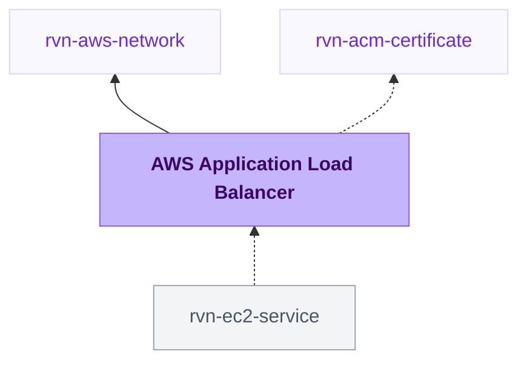

{/* Generated by scripts/sync-module-catalog.mjs from the Ravion module catalog. Do not edit by hand. */}

**Type:** `rvn-aws-alb` · **Latest version:** `1.0.1`

## Dependencies and consumers

_Every dependency input can be specified manually to reference existing external infrastructure rather than a Ravion module._

## Readme

Standalone Application Load Balancer (ALB) with HTTP/HTTPS listeners that multiple services can attach listener rules to.

### Overview

Use this module to create an Application Load Balancer inside a VPC that is shared by one or more services. Select a VPC network and Ravion provisions the load balancer, its security group, HTTP and HTTPS listeners with a fixed default response, optional access logging, and optional WAF association.

The load balancer intentionally serves no traffic by itself. Services that reference this module, such as EC2 services, create their own target groups and listener rules on the shared listeners.

Terraform source: [ravionhq/modules/networking/alb](https://github.com/ravionhq/modules/tree/rvn-aws-alb@1.0.1/networking/alb)

### Use cases

| Scenario | Benefit |
| --- | --- |
| Several services on one domain | Share one load balancer, route by host or path rules per service. |
| Public web apps and APIs | Internet-facing load balancer in the public subnets with HTTPS. |
| Internal services | Internal load balancer reachable only inside the VPC. |
| Cost control | One load balancer instead of one per service. |

### Placement and security

The load balancer is internet-facing in the public subnets by default. Enable Internal load balancer to place it in the private subnets, reachable only inside the VPC.

The module creates a dedicated security group. Internet-facing load balancers allow 0.0.0.0/0 and ::/0 on the listener ports by default. Internal load balancers allow the RFC1918 IPv4 ranges and no IPv6 ingress by default. Restrict or remove access with Ingress IPv4 CIDRs and Ingress IPv6 CIDRs; an explicitly empty list creates no rules for that IP version. Services that attach to the load balancer allow traffic from this security group on their app ports.

### Listeners and TLS

HTTP is enabled on port 80 by default. Enable HTTPS and select a primary ACM Certificate module in the same AWS account and region. Add Additional certificate ARNs when the listener should serve more certificates through SNI. When both listeners are enabled, HTTP traffic redirects to HTTPS by default. The HTTP and HTTPS listener ports remain configurable for workloads that cannot use ports 80 and 443.

Requests that match no service listener rule receive a fixed 503 response, so an unmatched host or path never reaches a service by accident.

### Access logs and WAF

Enable Access logs to write load balancer access logs to S3. Leave the bucket ARN blank to create a bucket with the configured retention, or point at an existing bucket. Associate a WAFv2 Web ACL by providing its ARN.

### Configuration

| Field | Required | Default | Description |
| --- | --- | --- | --- |
| VPC network | Yes | - | Existing rvn-aws-network module instance |
| Name slug | Yes | \{project\}-\{env\}-\{module\} | Name for the load balancer, 32 characters max |
| Internal load balancer | No | false | Place the load balancer in private subnets |
| Deletion protection | No | true | Prevent accidental deletion |
| Idle timeout (seconds) | No | 60 | Connection idle timeout |
| HTTP | No | true | Create an HTTP listener |
| HTTP port | No | 80 | HTTP listener port |
| HTTPS | No | false | Create an HTTPS listener |
| HTTPS port | No | 443 | HTTPS listener port |
| Certificate | Yes* | - | Primary ACM certificate module for HTTPS |
| Additional certificate ARNs | No | [] | Additional ACM certificates attached for SNI |
| SSL policy | No | TLS 1.3 policy | SSL policy for HTTPS |
| Redirect HTTP to HTTPS | No | true | Applies when both listeners are enabled |
| Ingress IPv4/IPv6 CIDRs | No | Visibility-dependent | Sources allowed to reach the load balancer; empty lists create no ingress rules |
| WAF web ACL ARN | No | - | WAFv2 Web ACL to associate |
| Access logs | No | false | Write access logs to S3 |
| Access logs bucket ARN | No | Created bucket | Existing bucket for access logs |
| Access logs retention (days) | No | 90 | Retention for the created bucket |
| Tags | No | Standard Ravion tags | Additional tags applied to resources |
| Advanced Terraform variables | No | \{\} | Raw lower-level overrides for exceptional cases |
| OpenTofu version override | No | Ravion default | Override the OpenTofu version for the stack |
| Ravion Terraform workspace name | No | \{project\}-\{env\}-\{module\} | Override the state backend workspace name |

*Required when HTTPS is enabled.

### Design decisions

- The default listener action is a fixed 503 response. Routing is owned by the services that attach listener rules, so the load balancer stays service-agnostic.
- Internal placement uses the network's private subnets and internet-facing placement uses the public subnets; subnet selection is not exposed separately.
- Internal ingress defaults to RFC1918 IPv4 ranges with no IPv6 ingress, while internet-facing ingress defaults to all IPv4 and IPv6 sources.
- HTTP-only is allowed for development, but production load balancers should enable HTTPS with an ACM certificate.
- Advanced ALB behaviors such as desync mitigation, header handling, and HTTP/2 keep their safe Terraform defaults and are available through Advanced Terraform variables.

### Learn more

- [Application Load Balancers](https://docs.aws.amazon.com/elasticloadbalancing/latest/application/introduction.html)
- [Listener rules](https://docs.aws.amazon.com/elasticloadbalancing/latest/application/listener-update-rules.html)
- [ACM certificates](https://docs.aws.amazon.com/acm/latest/userguide/acm-overview.html)
- [AWS WAF](https://docs.aws.amazon.com/waf/latest/developerguide/waf-chapter.html)

## Inputs reference

All inputs for `rvn-aws-alb` version `1.0.1`. Use the `name` shown for each field as the input key in module config.

<ResponseField name="network" type="$ref:rvn-aws-network" required>
  **VPC network.**

  - Immutable after creation
</ResponseField>

### Load balancer

<ResponseField name="name" type="string" required>
  **Name slug.** Name for the load balancer and related resources.

  - Default: `<<project.given_id>>-<<environment.given_id>>-<<module.given_id>>`
  - Immutable after creation
  - Pattern: `^[a-z0-9]([a-z0-9-]{0,30}[a-z0-9])?$` — 1-32 lowercase letters, numbers, and hyphens. Start and end with a letter or number.
</ResponseField>

<ResponseField name="internal_load_balancer_enabled" type="boolean">
  **Internal load balancer.** Create an internal load balancer reachable only inside the VPC. Turn off for an internet-facing load balancer in the public subnets.

  - Default: `false`
</ResponseField>

<ResponseField name="deletion_protection_enabled" type="boolean">
  **Deletion protection.** Prevent accidental deletion of the load balancer via the AWS API.

  - Default: `true`
</ResponseField>

<ResponseField name="idle_timeout" type="number">
  **Idle timeout (seconds).** Seconds a connection is allowed to be idle before the load balancer closes it.

  - Default: `60`
  - Min: `1`
  - Max: `4000`
</ResponseField>

### Listeners

<ResponseField name="http_listener_enabled" type="boolean">
  **HTTP.** Create an HTTP listener.

  - Default: `true`
</ResponseField>

<ResponseField name="http_listener_port" type="number">
  **HTTP port.**

  - Default: `80`
  - Min: `1`
  - Max: `65535`
  - Shown when: `{"http_listener_enabled":true}`
</ResponseField>

<ResponseField name="https_listener_enabled" type="boolean">
  **HTTPS.** Create an HTTPS listener. Select an ACM certificate when enabled.

  - Default: `false`
</ResponseField>

<ResponseField name="https_listener_port" type="number">
  **HTTPS port.**

  - Default: `443`
  - Min: `1`
  - Max: `65535`
  - Shown when: `{"https_listener_enabled":true}`
</ResponseField>

<ResponseField name="certificate" type="$ref:rvn-acm-certificate" required>
  **Certificate.** Primary ACM certificate module for HTTPS. The certificate must use the same AWS account and region as the load balancer.

  - Shown when: `{"https_listener_enabled":true}`
</ResponseField>

<ResponseField name="additional_certificate_arns" type="string_array">
  **Additional certificate ARNs.** Additional ACM certificate ARNs attached to the HTTPS listener for SNI.

  - Default: `[]`
  - Shown when: `{"https_listener_enabled":true}`
</ResponseField>

<ResponseField name="ssl_policy" type="string">
  **SSL policy.** SSL policy for the HTTPS listener.

  - Shown when: `{"https_listener_enabled":true}`
</ResponseField>

<ResponseField name="http_to_https_redirect_enabled" type="boolean">
  **Redirect HTTP to HTTPS.** Redirect HTTP traffic to the HTTPS listener. Applies only when both listeners are enabled.

  - Default: `true`
  - Shown when: `{"http_listener_enabled":true,"https_listener_enabled":true}`
</ResponseField>

### Security

<ResponseField name="ingress_cidr_blocks" type="string_array">
  **Ingress IPv4 CIDRs.** IPv4 CIDR blocks allowed to reach the load balancer. Defaults to public internet access for an internet-facing load balancer and RFC1918 private ranges for an internal load balancer. Use an empty list to allow no IPv4 ingress.
</ResponseField>

<ResponseField name="ingress_ipv6_cidr_blocks" type="string_array">
  **Ingress IPv6 CIDRs.** IPv6 CIDR blocks allowed to reach the load balancer. Defaults to public internet access for an internet-facing load balancer and no IPv6 ingress for an internal load balancer. Use an empty list to allow no IPv6 ingress.
</ResponseField>

<ResponseField name="web_acl_arn" type="string">
  **WAF web ACL ARN.** WAFv2 Web ACL to associate with the load balancer.
</ResponseField>

### Access logs

<ResponseField name="access_logs_enabled" type="boolean">
  **Access logs.** Write load balancer access logs to S3.

  - Default: `false`
</ResponseField>

<ResponseField name="access_logs_bucket_arn" type="string">
  **Access logs bucket ARN.** Existing S3 bucket for access logs. Leave blank to create a bucket.

  - Shown when: `{"access_logs_enabled":true}`
</ResponseField>

<ResponseField name="access_logs_retention_days" type="number">
  **Access logs retention (days).** Days to retain access logs in the created bucket.

  - Default: `90`
  - Min: `1`
  - Shown when: `{"access_logs_enabled":true}`
</ResponseField>

### Misc

<ResponseField name="tags" type="keyvalue">
  **Tags.** A map of tags to assign to all resources. Default tags are `Owner`, `ProjectGivenId`, `EnvironmentGivenId`, `ModuleGivenId`, `ModuleId`
</ResponseField>

### Terraform settings

<ResponseField name="opentofu_version" type="string">
  **OpenTofu version override.** Override the environment's default version for this module
</ResponseField>

<ResponseField name="ravion_state_backend_workspace" type="string">
  **Ravion Terraform workspace name.** Override Terraform state backend workspace name. Defaults to project + environment + module given ids.

  - Immutable after creation
</ResponseField>

<ResponseField name="advanced_terraform_variables" type="object">
  **Advanced Terraform variables.** Optional raw Terraform variable overrides for advanced module inputs or one-off overrides. Values here override the generated variables above.

  - Default: `{}`
</ResponseField>
