{/* Generated by scripts/sync-module-catalog.mjs from the Ravion module catalog. Do not edit by hand. */}

**Type:** `rvn-aws-network` · **Latest version:** `1.0.1`

## Dependencies and consumers

```mermaid
flowchart BT
  rvn_aurora["rvn-aurora"] --> rvn_aws_network["<strong>VPC Network</strong>"]
  rvn_aws_alb["rvn-aws-alb"] --> rvn_aws_network
  rvn_ec2_service["rvn-ec2-service"] --> rvn_aws_network
  rvn_ecs_cluster["rvn-ecs-cluster"] --> rvn_aws_network
  rvn_efs["rvn-efs"] --> rvn_aws_network
  rvn_elasticache["rvn-elasticache"] --> rvn_aws_network
  rvn_lambda["rvn-lambda"] -.-> rvn_aws_network
  rvn_rds["rvn-rds"] --> rvn_aws_network

  class rvn_aws_network current
  class rvn_aurora,rvn_aws_alb,rvn_ec2_service,rvn_ecs_cluster,rvn_efs,rvn_elasticache,rvn_lambda,rvn_rds consumer

  classDef current fill:#C4B5FD,stroke:#8B5CF6,color:#3B0764
  classDef dependency fill:#FAF8FF,stroke:#DDD6FE,color:#6D28D9
  classDef consumer fill:#F3F4F6,stroke:#9CA3AF,color:#4B5563
  classDef upstream fill:#F8FAFC,stroke:#CBD5E1,color:#94A3B8

  click rvn_aurora "/module-definitions/catalog/rvn-aurora" "Open rvn-aurora docs"
  click rvn_aws_alb "/module-definitions/catalog/rvn-aws-alb" "Open rvn-aws-alb docs"
  click rvn_ec2_service "/module-definitions/catalog/rvn-ec2-service" "Open rvn-ec2-service docs"
  click rvn_ecs_cluster "/module-definitions/catalog/rvn-ecs-cluster" "Open rvn-ecs-cluster docs"
  click rvn_efs "/module-definitions/catalog/rvn-efs" "Open rvn-efs docs"
  click rvn_elasticache "/module-definitions/catalog/rvn-elasticache" "Open rvn-elasticache docs"
  click rvn_lambda "/module-definitions/catalog/rvn-lambda" "Open rvn-lambda docs"
  click rvn_rds "/module-definitions/catalog/rvn-rds" "Open rvn-rds docs"
```

_Every dependency input can be specified manually to reference existing external infrastructure rather than a Ravion module._

## Readme

Production-ready AWS VPC with public and private subnets, NAT gateways, and compliance-ready flow logs.

### Overview

A VPC (Virtual Private Cloud) is the foundational networking layer for your AWS infrastructure. This module creates an isolated virtual network with public and private subnets spanning multiple availability zones, giving you complete control over your networking environment.

The VPC module provides:

- **Public and private subnets** across multiple availability zones for high availability
- **NAT Gateway** options for outbound internet access from private subnets
- **VPC Flow Logs** for network traffic monitoring and SOC 2 compliance
- **VPC Peering** to connect with existing VPCs across accounts or regions

 Terraform source: [ravionhq/modules/networking/vpc](https://github.com/ravionhq/modules/tree/rvn-aws-network@1.0.1/networking/vpc)

### Use cases

| Scenario                     | VPC helps by...                                            |
| ---------------------------- | ---------------------------------------------------------- |
| Running production workloads | Isolating resources in private subnets with NAT egress     |
| Deploying ECS/EKS clusters   | Providing subnet IDs and security groups for services      |
| Connecting to RDS databases  | Hosting databases in private subnets without public access |
| SOC 2 compliance             | Enabling flow logs for network traffic auditing            |
| Multi-region architecture    | Peering VPCs across regions for low-latency communication  |
| Partner IP allowlisting      | Using stable NAT Gateway IPs with pre-allocated EIPs       |

### Subnet types

#### Public subnets

Public subnets have direct internet access via a free Internet Gateway. Resources in public subnets do not receive public IP addresses automatically; attach public IPs explicitly when needed. Use these for:

- Load balancers (ALB, NLB)
- Bastion hosts
- NAT Gateways

#### Private subnets

Private subnets have no direct internet access. Outbound traffic routes through NAT Gateway(s) when enabled. Use these for:

- Application servers (ECS tasks, EKS pods)
- RDS databases
- ElastiCache clusters
- Lambda functions with VPC access

### NAT Gateway

NAT Gateway gives your private subnets two things:

1. **Internet access** — Resources can reach the internet for updates, API calls, and external services
2. **Static public IP** — All outbound traffic exits through the same IP, so partners can allowlist your IP address

| Mode              | Description                                          | Cost    |
| ----------------- | ---------------------------------------------------- | ------- |
| Disabled          | No outbound internet from private subnets            | $0      |
| Single (default)  | One NAT Gateway serves all availability zones        | ~$32/mo |
| High availability | One NAT Gateway per AZ, avoids cross-AZ data charges | ~$96/mo |

#### Keeping your IP stable

By default, the module creates a new Elastic IP for each NAT Gateway. If you ever reprovision the VPC, that IP changes.

To keep the same IP permanently, create your Elastic IPs separately and pass in the allocation IDs. This way, even if you destroy and recreate the entire VPC, your NAT Gateway will use the same public IP — no need to update partner allowlists or firewall rules.

### Configuration

| Field                          | Required | Default              | Description                                                            |
| ------------------------------ | -------- | -------------------- | ---------------------------------------------------------------------- |
| AWS Account                    | Yes      | —                    | AWS account to deploy the VPC                                          |
| Region                         | Yes      | —                    | AWS region (recommend avoiding us-east-1 for reliability)              |
| Name                           | Yes      | `{project}-{env}`    | Name prefix for all resources (1-36 chars, lowercase, hyphens allowed) |
| VPC CIDR                       | No       | `10.0.0.0/16`        | IPv4 address range for the VPC                                         |
| Subnet pairs                   | No       | Auto                 | Up to 3 public/private subnet pairs, capped by available AZs           |
| NAT Gateway                    | No       | `true`               | Enable outbound internet from private subnets                          |
| NAT Gateway High Availability  | No       | `false`              | Deploy one NAT per AZ instead of a single shared NAT                   |
| NAT Gateway EIP Allocation IDs | No       | —                    | Pre-allocated EIPs for stable NAT public IPs                           |
| Flow Logs                      | No       | `false`              | Enable VPC Flow Logs (required for SOC 2)                              |
| Tags                           | No       | Environment, Project | Custom tags applied to all resources                                   |

### VPC Peering

Connect this VPC to existing VPCs for private communication without traversing the internet. Peering supports:

- **Same-account, same-region:** Auto-accepts and configures routes in both directions
- **Cross-account or cross-region:** Creates the peering request; peer must accept and configure return routes

| Field                        | Description                                                           |
| ---------------------------- | --------------------------------------------------------------------- |
| Peer VPC ID                  | The VPC ID to peer with                                               |
| Peer CIDR Blocks             | CIDR blocks of the peer VPC (routes are added automatically)          |
| Peer Owner ID                | AWS account ID for cross-account peering                              |
| Peer Region                  | AWS region for cross-region peering                                   |
| Add to Public/Private Routes | Whether to add routes in this VPC's route tables                      |
| Peer Route Table IDs         | Route tables in the peer VPC to add return routes (same-account only) |

### SOC 2 compliance

Enable **Flow Logs** to capture network traffic metadata for security auditing. Flow logs record:

- Source and destination IP addresses
- Ports and protocols
- Packet and byte counts
- Accept/reject actions

Logs are stored in CloudWatch Logs with configurable retention. This satisfies SOC 2 requirements for network traffic monitoring and audit trails.

### Design decisions

This VPC follows [AWS VPC best practices](https://docs.aws.amazon.com/vpc/latest/userguide/vpc-security-best-practices.html):

- **Availability zone spread:** Subnets are provisioned across up to 3 AZs by default, capped by the AZs available in the selected region and AWS account
- **Automatic CIDR allocation:** Subnets are /24 blocks carved from your VPC CIDR. With the default `10.0.0.0/16`, the first three public subnets get `10.0.1.0/24`, `10.0.2.0/24`, `10.0.3.0/24` and private subnets get `10.0.11.0/24`, `10.0.12.0/24`, `10.0.13.0/24`.
- **DNS enabled:** DNS support and hostnames are enabled for service discovery
- **Single route table for public:** All public subnets share one route table with an Internet Gateway route
- **Per-AZ route tables when HA NAT:** Each private subnet gets its own route table pointing to the NAT in its AZ

### Learn more

**AWS VPC**

- [AWS VPC User Guide](https://docs.aws.amazon.com/vpc/latest/userguide/) — Official documentation
- [VPC Design Best Practices](https://docs.aws.amazon.com/vpc/latest/userguide/vpc-security-best-practices.html) — Security recommendations
- [NAT Gateway Pricing](https://aws.amazon.com/vpc/pricing/) — Cost breakdown for NAT Gateways

**Network Architecture**

- [Plan your VPC](https://docs.aws.amazon.com/vpc/latest/userguide/vpc-getting-started.html) — AWS guide to VPC planning
- [Building Scalable and Secure Multi-VPC Infrastructure](https://docs.aws.amazon.com/whitepapers/latest/building-scalable-secure-multi-vpc-network-infrastructure/welcome.html) — AWS whitepaper on VPC design patterns
- [Availability Zones](https://aws.amazon.com/about-aws/global-infrastructure/regions_az/) — Understanding AZ redundancy

## Inputs reference

All inputs for `rvn-aws-network` version `1.0.1`. Use the `name` shown for each field as the input key in module config.

### AWS account & region

<ResponseField name="aws_account_id" type="string" required>
  **AWS account.**

  - Immutable after creation
</ResponseField>

<ResponseField name="aws_region" type="string" required>
  **Region.** Recommend anything but us-east-1 as it has the most outages.

  - Immutable after creation
</ResponseField>

### VPC config

<ResponseField name="name" type="string" required>
  **Name slug.** Name prefix for all resources created by this module.

  - Default: `<<project.given_id>>-<<environment.given_id>>`
  - Immutable after creation
  - Pattern: `^[a-z0-9]([a-z0-9-]{0,34}[a-z0-9])?$` — The name must be 1-36 characters, contain only lowercase letters, numbers, and hyphens, and start and end with a letter or number.
</ResponseField>

<ResponseField name="vpc_cidr" type="string">
  **VPC CIDR.** The IPv4 CIDR block for the VPC.

  - Default: `10.0.0.0/16`
  - Immutable after creation
</ResponseField>

<ResponseField name="subnet_count" type="number">
  **Subnet pairs.** Leave empty to create up to 3 public/private subnet pairs, capped by the availability zones available in the selected region and AWS account.

  - Min: `1`
  - Max: `6`
</ResponseField>

### NAT gateway

<ResponseField name="nat_gateway_enabled" type="boolean">
  **NAT gateway.** Needed if you want to access the internet from within private subnets

  - Default: `true`
</ResponseField>

<ResponseField name="nat_gateway_high_availability_enabled" type="boolean">
  **NAT gateway high availability.** High availability adds NAT Gateway to every AZ. Otherwise single NAT gateway serves all AZs.

  - Default: `false`
</ResponseField>

<ResponseField name="nat_gateway_eip_allocation_ids" type="string_array">
  **NAT gateway Elastic IP allocation IDs.** A list of pre-allocated Elastic IP allocation IDs (for example from the
  networking/eips module) to associate with the NAT Gateway(s). When null
  or empty (default), the module allocates new EIPs internally.
  
  The list length must match the number of NAT Gateways the module will create:
    - 1 when nat_gateway_high_availability_enabled = false
    - the resolved subnet pair count when nat_gateway_high_availability_enabled = true
  
  Supplied EIPs must already exist with domain = "vpc". This is useful for
  keeping NAT public IPs stable across VPC replacements (e.g. for partner
  allowlists or firewall rules).
</ResponseField>

### SOC 2

<ResponseField name="flow_logs_enabled" type="boolean">
  **Flow logs.** Enable VPC Flow Logs for network traffic monitoring. Required for SOC 2.

  - Default: `false`
</ResponseField>

### Misc

<ResponseField name="tags" type="keyvalue">
  **Tags.** A map of tags to assign to all resources. Default tags are `Owner`, `ProjectGivenId`, `EnvironmentGivenId`, `ModuleGivenId`, `ModuleId`
</ResponseField>

### VPC peering

<ResponseField name="vpc_peering_connections" type="object_map">
  **Peering connections.** Connect this VPC to other VPCs
  
  NOTE: For cross-account or cross-region peerings, this module cannot manage the
  peer VPC's route tables. The owner of the peer VPC is responsible for adding
  return routes pointing at the peering connection.
  

  <Expandable title="item fields">
    <ResponseField name="peer_vpc_id" type="string" required>
      **Peer VPC ID.** The ID of the existing VPC to peer with.
    </ResponseField>
    <ResponseField name="peer_cidr_blocks" type="string_array" required>
      **Peer CIDR blocks.** CIDR blocks of the peer VPC. Routes will be added in this VPC's route tables for each CIDR pointing at the peering connection.
    </ResponseField>
    <ResponseField name="peer_owner_id" type="string">
      **Peer AWS account ID number.** AWS account ID that owns the peer VPC. Defaults to the current account. Required for cross-account peering.
    </ResponseField>
    <ResponseField name="peer_region" type="string">
      **Peer region.** AWS region of the peer VPC. Defaults to the current region. Required for cross-region peering.
    </ResponseField>
    <ResponseField name="remote_vpc_dns_resolution_enabled" type="boolean">
      **Remote VPC DNS resolution.** Allow DNS resolution of private hostnames in the peer VPC from this VPC. Only valid for same-account, same-region peerings.

      - Default: `false`
    </ResponseField>
    <ResponseField name="public_route_table_routes_enabled" type="boolean">
      **Public route table routes.** Add routes for peer_cidr_blocks to this VPC's public route table.

      - Default: `true`
    </ResponseField>
    <ResponseField name="private_route_table_routes_enabled" type="boolean">
      **Private route table routes.** Add routes for peer_cidr_blocks to this VPC's private route table(s).

      - Default: `true`
    </ResponseField>
    <ResponseField name="peer_route_table_ids" type="string_array">
      **Peer route table IDs.** Optional list of route table IDs in the peer VPC to add return routes to (destination = this VPC's CIDR, target = the peering connection). Only supported for same-account, same-region peerings, since the AWS provider used by this module must have access to the peer's route tables. For cross-account or cross-region peerings, manage the return routes from the peer side instead.
    </ResponseField>
  </Expandable>
</ResponseField>

### Terraform settings

<ResponseField name="opentofu_version" type="string">
  **OpenTofu version override.** Override the environment's default version for this module
</ResponseField>

<ResponseField name="ravion_state_backend_workspace" type="string">
  **Ravion Terraform workspace name.** Override Terraform state backend workspace name. Defaults to project + environment + module given ids.

  - Immutable after creation
</ResponseField>

<ResponseField name="advanced_terraform_variables" type="object">
  **Advanced Terraform variables.** Optional raw Terraform variable overrides for advanced module inputs or one-off overrides. Values here override the generated variables above.

  - Default: `{}`
</ResponseField>

<ResponseField name="execution_environment_id" type="string">
  **Terraform execution environment.** Override the VPC, subnet, and security group for Terraform runners. Must use the same AWS account as selected above.
</ResponseField>
