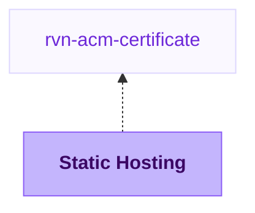

{/* Generated by scripts/sync-module-catalog.mjs from the Ravion module catalog. Do not edit by hand. */}

**Type:** `rvn-aws-static` · **Latest version:** `1.0.1`

## Dependencies and consumers

_Every dependency input can be specified manually to reference existing external infrastructure rather than a Ravion module._

## Readme

Static file hosting for S3-backed sites and assets delivered through CloudFront.

### Overview

The Static Hosting module creates an AWS S3 hosting bucket, a CloudFront distribution, CloudFront KeyValueStore version routing, and the supporting edge functions needed to serve versioned static files.

Use it for single-page apps, generated documentation, static marketing sites, downloadable assets, or any static file tree that should be served through CloudFront. Ravion can build files from a Git repository with Railpack or a Dockerfile, or you can disable builds and promote an existing S3 directory at deploy time.

Every deployment is versioned. The deploy step promotes an S3 directory by updating the CloudFront KeyValueStore active pointer. CloudFront rewrites viewer requests to the active version prefix before it reads from S3.

Terraform source: [ravionhq/modules/hosting/static_site](https://github.com/ravionhq/modules/tree/rvn-aws-static@1.0.1/hosting/static_site)

### Use cases

| Scenario | Static Hosting helps by... |
| --- | --- |
| Hosting a SPA | Rewriting client-side routes to the active version's root object |
| Hosting docs or generated static files | Serving filesystem-style paths from S3 through CloudFront |
| Using custom domains | Attaching CloudFront aliases and an ACM certificate |
| Tuning cache behavior | Managing HTML and asset Cache-Control headers separately |
| Custom 404 pages | Serving your build's 404.html with a proper 404 status |
| Protecting the site | Attaching a WAF web ACL and default security headers |
| Serving high traffic | Enabling Origin Shield to boost cache hit ratio |
| Auditing access | Viewing CloudFront access logs in Ravion or delivering them to S3 |

### Hosting and routing

Choose an AWS account and Region for the S3 bucket. CloudFront and the CloudFront KeyValueStore are global services and use us-east-1 behind the scenes; the Region field controls the hosting bucket region.

Name slug is required and is used for the bucket name and resource prefixes. Because S3 bucket names are globally unique, use a stable slug that is unlikely to collide with another AWS account.

Routing mode controls how viewer paths resolve inside the active version prefix.

| Routing mode | Use it for | Behavior |
| --- | --- | --- |
| Single page app | React, Vue, TanStack Router, and other client-side routers | Non-asset routes resolve to the active version's root object |
| Filesystem | Astro, Hugo, MkDocs, and static file trees | Clean paths resolve to matching files or index files |

Default root object defaults to index.html. Default version prefix defaults to main and is used before any deploy has promoted a different active version.

### Error pages

Requests for files that do not exist return a proper 404 status. A genuine 403 always means the request was blocked (for example by WAF), never that a file is missing.

When a requested file does not exist, CloudFront serves your 404.html with a 404 status — never a 200, so search engines do not index error pages. Emit 404.html at the root of your build output (the default convention in Astro, Hugo, Eleventy, SvelteKit, and most static site generators). If no 404.html exists, viewers get a correct plain 404 response.

In Single page app routing mode, paths without a file extension are rewritten to the app shell, so the 404 page only applies to missing files such as assets. Client-side routes handle their own not-found views.

The 404 page is served through a no-cache behavior, so an updated 404.html is served immediately for URLs that do not yet have a cached 404 response. URLs that already have a cached 404 response refresh after the error caching TTL (default 1 day) or when that path is invalidated.

### Build options

| Build source | When to use it |
| --- | --- |
| Railpack | Let Ravion detect the static app stack and run the build with Railpack |
| Dockerfile | Build static files with a Dockerfile in the selected repository |
| Manual upload to S3 | Build or upload files outside Ravion, then promote the uploaded S3 directory |

For Railpack and Dockerfile builds, select a Git repository, optional Base path, and output directory. The output directory is the folder Ravion uploads to the hosting bucket after the build.

Railpack settings let you optionally pin the Railpack version and override install and build commands. Leave them blank to use Railpack defaults and autodetection.

Docker settings let you choose the Dockerfile path and Docker build context. Inject environment variables in Dockerfile passes build environment variables as Docker build arguments.

Build environment variables are available to static builds and can be plain values or references loaded from Parameter Store or Secrets Manager.

### CloudFront distribution

The module exposes one CloudFront distribution. Domain aliases are optional. Leave them empty to use the default cloudfront.net domain. If you set domain aliases, select an ACM certificate module created in us-east-1.

The first domain alias is used as the CloudFront distribution comment. The distribution is always created enabled.

The module UI links to the site's primary domain: the first domain alias when aliases are configured, otherwise the default cloudfront.net domain.

Price class controls the CloudFront edge location footprint. PriceClass_All uses all edge locations. PriceClass_200 and PriceClass_100 can reduce edge coverage for cost-sensitive workloads.

Geo restriction can be none, whitelist, or blacklist. When whitelist or blacklist is selected, provide ISO country codes in Geo restriction country codes.

WAF web ACL ARN optionally associates a global (CloudFront) WAFv2 web ACL with the distribution.

Origin Shield adds an extra CloudFront caching layer in front of the S3 bucket. For high-traffic sites this improves the cache hit ratio and reduces origin load. The Origin Shield region is chosen automatically: the bucket region when CloudFront offers Origin Shield there, otherwise the nearest supported region per the AWS mapping.

### Cache and headers

Caching happens at two independent layers, controlled by two different settings:

1. CloudFront edge caching is controlled by the Cache policy. It decides how long CloudFront keeps responses fetched from S3 at its edge locations. The default module-managed policy caches objects for up to a year with compression enabled. Long edge caching is safe here because every deploy is promoted under a new version prefix: the prefix is part of the CDN cache key, so a promotion switches CloudFront to fresh cache entries immediately and old entries simply stop being requested. You rarely need to change this policy.

2. Browser caching is controlled by the Cache-Control headers from Manage Cache-Control headers, which is enabled by default. A CloudFront Function writes these headers onto responses as they leave CloudFront for the viewer. By that point CloudFront has already made its own caching decision, so these headers are used only by the browser and never affect edge caching.

The browser headers split responses into two groups:

| Setting | Default | Purpose |
| --- | --- | --- |
| HTML Cache-Control | Blank | Blank applies public, max-age=0, must-revalidate, so browsers store HTML but revalidate on every navigation with a cheap conditional request that CloudFront answers from its edge cache, and a new deploy is visible on the next page load |
| Asset Cache-Control | Blank | Blank applies public, max-age=31536000, immutable, because hashed assets never change at a given URL across versions, so browsers cache them for a year and skip revalidation entirely |
| HTML cache path overrides | Blank | Blank covers service workers, manifests, favicon, robots, and sitemap, treating stable root files as HTML-like responses instead of immutable assets |
| No-cache path patterns | [] | Bypasses CloudFront edge caching for selected path patterns |
| Cache policy ID | Blank | Blank uses a module-managed 1-year policy; controls how CloudFront caches responses from S3 at the edge |
| Origin request policy ID | Blank | Blank uses the AWS managed CORS-S3Origin policy; controls what CloudFront forwards to S3 |

Managed response headers selects AWS managed response header sets. Security headers is selected by default and adds HSTS, X-Content-Type-Options nosniff, X-Frame-Options SAMEORIGIN, and Referrer-Policy to every response; remove it if the site must be embeddable in cross-origin iframes. Add CORS or CORS with preflight to allow cross-origin requests from any origin. CloudFront allows one response headers policy per distribution behavior, so the selections combine into the single matching AWS managed policy (CORS with preflight supersedes CORS when both are selected).

Use Response headers policy ID to attach an existing CloudFront response headers policy. Use Managed response headers policy when this module should create one for security headers, CORS, custom headers, or removed headers. Either option replaces the Managed response headers selection, so carry equivalent security headers in your own policy. Avoid putting Cache-Control into a response headers policy unless you intentionally want to override the cache-control function.

### Monitoring

The module dashboard shows the default CloudFront distribution metrics: requests, total error rate, 4xx error rate, 5xx error rate, bytes downloaded, and bytes uploaded. CloudFront publishes these at no additional CloudWatch cost. A 4xx spike usually means missing files or newly broken links; because missing files return real 404s and blocked requests return 403s, the two are distinguishable in the access logs.

### Access logging

CloudFront access logging is on by default, delivered to CloudWatch Logs and viewable in Ravion. Choose where logs are delivered:

| Destination | How it works |
| --- | --- |
| CloudWatch Logs (default) | CloudFront standard logging v2 delivers access logs to a module-managed CloudWatch Logs group, and the module UI shows them in the Logs panel. Log ingestion costs more than S3 at very high traffic. |
| S3 bucket | Legacy standard logging delivers compressed log files to an automatically created S3 bucket. Cheapest for high-traffic sites; not viewable in Ravion. |

Logging retention days defaults to 90 and controls the CloudWatch log group retention or the S3 bucket lifecycle expiry, depending on the destination. CloudWatch retention must be one of the standard CloudWatch Logs retention values (1, 3, 5, 7, 14, 30, 60, 90, 120, 150, 180, 365, and larger).

### Deploy behavior

The deploy step uses an S3 directory value. For Ravion builds, use the directory produced by the build/upload flow. For Manual upload to S3, enter the S3 prefix you uploaded that contains the files to promote.

CloudFront invalidation paths defaults to empty, and normal deploys do not need any. Every promotion switches CloudFront to a fresh set of edge cache entries because the version prefix is part of the cache key, and the custom 404 page is served from a no-cache behavior, so new deploys are visible immediately without invalidation. Skipping invalidation also makes promotions complete faster.

Add /* when files change inside an already-promoted S3 directory instead of arriving in a new one: manual S3 uploads to a fixed directory, re-syncing the default version prefix, or patching files inside a version you roll back to. In those cases the cache key does not change and the edge would otherwise keep serving old content. /* counts as one path toward CloudFront's free invalidation tier (1,000 paths per month).

Successful deploys to retain defaults to 20. Older deploy directories are pruned from the hosting bucket based on this setting.

### Builder config

Builder config is only used for Railpack and Dockerfile builds.

| Field | Default | Purpose |
| --- | --- | --- |
| Builder instance type | EC2 | Choose EC2 or EC2 Spot for build runners |
| Builder instance size | c7a.4xlarge | Select the EC2 size used for builds |
| Builder execution environment | unset | Override where build runners execute |
| Builder AMI | unset | Use a custom build runner AMI |

EC2 Spot can reduce build cost, but builds may wait longer or be interrupted. Start with the default builder size, then adjust based on build resource usage.

### Configuration

| Section | Field | Required | Default | Notes |
| --- | --- | --- | --- | --- |
| AWS account & region | AWS account | Yes | none | Account where S3 and supporting resources are created |
| AWS account & region | Region | Yes | us-east-1 | Region for the S3 bucket |
| Static hosting | Name slug | Yes | Generated from project, environment, and module IDs | Must be globally unique as an S3 bucket name |
| Static hosting | Routing mode | Yes | Single page app | Choose SPA or filesystem URL handling |
| Static hosting | Default root object | No | index.html | Root object for distribution root requests |
| Static hosting | Default version prefix | Yes | main | Initial and fallback version prefix |
| Build config | Build source | Yes | Railpack | Railpack, Dockerfile, or Manual upload to S3 |
| Build config | Git repository | Required for Railpack and Dockerfile | none | Source repository for builds |
| Build config | Source base path | No | . | Path from repository root to source code |
| Build config | Output directory | Required for Railpack and Dockerfile | dist | Directory uploaded to S3 after build |
| Build config | Railpack version | No | Ravion default | Optional version for Railpack builds |
| CloudFront settings | ACM certificate | Required when using aliases | none | Certificate module must be in us-east-1 |
| CloudFront settings | Domain aliases | No | [] | Custom CloudFront aliases |
| CloudFront settings | Price class | No | PriceClass_All | Edge location coverage |
| CloudFront settings | Geo restriction | No | none | Optional country allow or deny list |
| CloudFront settings | WAF web ACL ARN | No | none | Global WAFv2 web ACL for the distribution |
| CloudFront settings | Origin Shield | No | false | Extra caching layer; region chosen automatically |
| Cache and headers | Manage Cache-Control headers | No | true | Attaches the cache-control function |
| Cache and headers | Managed response headers | No | Security headers | AWS managed header sets; add CORS or CORS with preflight |
| Access logging | CloudFront access logging | No | true | Delivers logs to CloudWatch Logs or S3 |
| Access logging | Logging destination | No | CloudWatch Logs | Visible when logging is enabled; CloudWatch shows logs in Ravion |
| Access logging | Logging retention days | No | 90 | Visible when logging is enabled; CloudWatch retention or S3 lifecycle expiry |
| Deploy config | CloudFront invalidation paths | No | [] | Only needed when overwriting an already-promoted S3 directory |
| Deploy config | Successful deploys to retain | No | 20 | Old S3 deploy prefixes to retain |
| Terraform settings | Terraform execution environment | No | unset | Override Terraform runner environment |
| Terraform settings | OpenTofu version | No | first available version | OpenTofu version for infrastructure changes |
| Terraform settings | Ravion Terraform workspace name | No | Generated from project, environment, and module IDs | Override state backend workspace name |
| Terraform settings | Advanced Terraform variables | No | \{\} | Escape hatch for uncommon Terraform inputs |
| Terraform settings | Tags | No | none | Additional tags; Ravion also adds standard ownership tags |

### Design decisions

The module exposes one CloudFront distribution instead of the full Terraform distributions map. This keeps the Ravion form focused on the common case while still supporting custom domains and certificate configuration.

The CloudFront distribution is always enabled. If traffic should not yet use the distribution, leave DNS records pointed elsewhere until ready.

Access logging manages its own delivery infrastructure when enabled — a CloudWatch log group for the default destination, or an automatically created logging bucket for S3. This avoids requiring users to pre-create and wire log storage for the common audit trail use case.

CloudFront and KVS behavior is intentionally versioned. Promotions change which S3 prefix is active rather than overwriting files in place.

Missing files return real 404s instead of the S3 default 403. The bucket policy lets CloudFront distinguish a missing key from a denied request, which keeps 403 meaningful as "blocked" and makes monitoring and SEO behave correctly.

The custom 404 page is served with a 404 status, not a 200. Search engines should never index error pages, and missing assets should fail loudly rather than receive HTML.

### Learn more

- [Amazon CloudFront documentation](https://docs.aws.amazon.com/cloudfront/)
- [CloudFront KeyValueStore](https://docs.aws.amazon.com/AmazonCloudFront/latest/DeveloperGuide/kvs-with-functions.html)
- [Serving static websites with S3 and CloudFront](https://docs.aws.amazon.com/AmazonS3/latest/userguide/WebsiteHosting.html)
- [CloudFront response headers policies](https://docs.aws.amazon.com/AmazonCloudFront/latest/DeveloperGuide/understanding-response-headers-policies.html)

## Inputs reference

All inputs for `rvn-aws-static` version `1.0.1`. Use the `name` shown for each field as the input key in module config.

### AWS account & region

<ResponseField name="aws_account_id" type="string" required>
  **AWS account.**

  - Immutable after creation
</ResponseField>

<ResponseField name="aws_region" type="string" required>
  **Region.** Region for the S3 bucket. CloudFront and KVS always use us-east-1.

  - Default: `us-east-1`
  - Immutable after creation
</ResponseField>

### Static hosting config

<ResponseField name="name" type="string" required>
  **Name slug.** Name for the bucket and other resources' prefix. Must be globally unique.

  - Default: `<<project.given_id>>-<<environment.given_id>>-<<module.given_id>>`
  - Immutable after creation
  - Pattern: `^[a-z0-9][a-z0-9.-]*[a-z0-9]$` — Use a valid S3 bucket name: lowercase letters, numbers, hyphens, and periods; start and end with a letter or number.
</ResponseField>

<ResponseField name="routing" type="string" required>
  **Routing mode.** Use single page app for client-side routers, or Filesystem for static file trees where paths map to index files.

  - Default: `spa`
  - Allowed values: `spa` (Single page app), `filesystem` (Filesystem)
</ResponseField>

<ResponseField name="default_root_object" type="string">
  **Default root object.** Object name resolved when a viewer requests the distribution root.

  - Default: `index.html`
</ResponseField>

<ResponseField name="default_version" type="string" required>
  **Default version prefix.** Fallback version prefix and initial active KVS value.

  - Default: `main`
</ResponseField>

### Build config

<ResponseField name="build_source" type="string" required>
  **Build source.**

  - Default: `railpack`
  - Allowed values: `railpack` (Railpack), `dockerfile` (Dockerfile), `s3_directory` (Manual upload to S3)
</ResponseField>

<ResponseField name="source_repo" type="gitrepo" required>
  **Git repository.** Repository containing the application source for Dockerfile or Railpack builds.

  - Shown when: `{"build_source":["dockerfile","railpack","nixpacks"]}`
</ResponseField>

<ResponseField name="source_base_path" type="string">
  **Source base path.** Repository-relative source and build root.

  - Default: `.`
  - Shown when: `{"build_source":["dockerfile","railpack","nixpacks"]}`
</ResponseField>

<ResponseField name="output_directory" type="string" required>
  **Output directory.** Directory produced by the build and uploaded to S3.

  - Default: `dist`
  - Shown when: `{"build_source":["dockerfile","railpack","nixpacks"]}`
</ResponseField>

### Docker

<ResponseField name="dockerfile" type="string">
  **Dockerfile path.** Path to the Dockerfile to use for the build, relative to the repository root or configured source base path.

  - Shown when: `{"build_source":"dockerfile"}`
</ResponseField>

<ResponseField name="dockerfile_context" type="string">
  **Docker build context path.** Directory to use as the Docker build context, relative to the repository root or configured source base path.

  - Shown when: `{"build_source":"dockerfile"}`
</ResponseField>

### Railpack

<ResponseField name="railpack_version" type="string">
  **Railpack version.** Optional Railpack version to use for the build. Leave blank to use the Ravion default.

  - Pattern: `^(|latest|v?[0-9]+\.[0-9]+\.[0-9]+(?:[-+][0-9A-Za-z.-]+)?)$` — Leave blank, use latest, a semantic version like 0.29.0, or a v-prefixed version like v0.29.0.
  - Shown when: `{"build_source":["railpack","nixpacks"]}`
</ResponseField>

<ResponseField name="railpack_install_cmd" type="string">
  **Install command.** Optional dependency installation command. Leave blank to use Railpack detection.

  - Shown when: `{"build_source":["railpack","nixpacks"]}`
</ResponseField>

<ResponseField name="railpack_build_cmd" type="string">
  **Build command.** Optional application build command. Leave blank to use Railpack detection.

  - Shown when: `{"build_source":["railpack","nixpacks"]}`
</ResponseField>

<ResponseField name="build_environment_variables" type="object">
  **Build environment variables.** Environment variables available during builds. Values can be plain strings or references loaded from Parameter Store or Secrets Manager.

  - Shown when: `{"build_source":["dockerfile","railpack","nixpacks"]}`
</ResponseField>

<ResponseField name="dockerfile_inject_env_variables" type="boolean">
  **Inject environment variables in Dockerfile.** Pass build environment variables into Dockerfile builds as build arguments.

  - Default: `false`
  - Shown when: `{"build_source":"dockerfile"}`
</ResponseField>

### CloudFront settings

<ResponseField name="distribution_acm_certificate" type="$ref:rvn-acm-certificate">
  **ACM certificate.** Required if using domain aliases. The certificate module must be in us-east-1.
</ResponseField>

<ResponseField name="distribution_aliases" type="string_array">
  **Domain aliases.** Custom domain names like app.example.com. Leave empty to use the default cloudfront.net domain.

  - Default: `[]`
</ResponseField>

<ResponseField name="price_class" type="string">
  **Price class.** You can reduce edge locations for some cost savings if it becomes an issue.

  - Default: `PriceClass_All`
  - Allowed values: `PriceClass_All` (All edge locations), `PriceClass_200` (Most edge locations), `PriceClass_100` (US, Canada, Europe)
</ResponseField>

<ResponseField name="geo_restriction_type" type="string">
  **Geo restriction.**

  - Default: `none`
  - Allowed values: `none` (None), `whitelist` (Whitelist), `blacklist` (Blacklist)
</ResponseField>

<ResponseField name="geo_restriction_locations" type="string_array">
  **Geo restriction country codes.**

  - Default: `[]`
  - Shown when: `{"geo_restriction_type":["whitelist","blacklist"]}`
</ResponseField>

<ResponseField name="web_acl_id" type="string">
  **WAF web ACL ARN.** Optional WAFv2 web ACL to associate with the distribution. Must be a global (CloudFront) web ACL.
</ResponseField>

<ResponseField name="origin_shield_enabled" type="boolean">
  **Origin Shield.** Add a CloudFront Origin Shield caching layer in front of the S3 bucket to improve cache hit ratio and reduce S3 load for high-traffic sites. The Origin Shield region is chosen automatically based on the bucket region.

  - Default: `false`
</ResponseField>

### Cache and headers

<ResponseField name="cache_control_enabled" type="boolean">
  **Manage Cache-Control headers.** Attach a CloudFront Function that sets Cache-Control headers for HTML and asset responses.

  - Default: `true`
</ResponseField>

<ResponseField name="html_cache_control" type="string">
  **HTML Cache-Control.** Cache-Control header for HTML responses, routes without file extensions, dotted paths, and configured HTML path overrides. Steers browser caching only. Defaults to public, max-age=0, must-revalidate so browsers pick up new deploys on the next navigation.

  - Shown when: `{"cache_control_enabled":true}`
</ResponseField>

<ResponseField name="assets_cache_control" type="string">
  **Asset Cache-Control.** Cache-Control header for versioned static assets such as JavaScript, CSS, images, and fonts. Defaults to public, max-age=31536000, immutable

  - Shown when: `{"cache_control_enabled":true}`
</ResponseField>

<ResponseField name="html_path_overrides" type="string_array">
  **HTML cache path overrides.** Exact viewer paths that should receive the HTML Cache-Control header even when they have a file extension.

  - Shown when: `{"cache_control_enabled":true}`
</ResponseField>

<ResponseField name="response_headers_presets" type="string_array">
  **Managed response headers.** AWS managed response header sets applied when no custom response headers policy is configured. Selections combine into a single AWS managed policy.

  - Default: `["security_headers"]`
  - Allowed values: `security_headers` (Security headers), `cors` (CORS), `cors_preflight` (CORS with preflight)
</ResponseField>

<ResponseField name="response_headers_policy_id" type="string">
  **Response headers policy ID.** Optional externally managed CloudFront response headers policy ID for security headers, CORS, or custom headers. Replaces the default security headers policy.
</ResponseField>

<ResponseField name="response_headers_policy" type="object">
  **Managed response headers policy.** Optional module-managed CloudFront response headers policy for security headers, CORS, custom headers, and removed headers.
</ResponseField>

<ResponseField name="cache_policy_id" type="string">
  **Cache policy ID.** CloudFront cache policy ID for the default behavior. By default the module manages a policy that caches at the edge for up to a year, which is safe because every deploy changes the cache key.
</ResponseField>

<ResponseField name="origin_request_policy_id" type="string">
  **Origin request policy ID.** CloudFront origin request policy ID. Defaults to AWS managed CORS-S3Origin.
</ResponseField>

<ResponseField name="no_cache_paths" type="string_array">
  **No-cache path patterns.** Path patterns that should bypass CloudFront caching. Versioned deploys usually do not need this.

  - Default: `[]`
</ResponseField>

### Access logging

<ResponseField name="logging_enabled" type="boolean">
  **CloudFront access logging.** Enable CloudFront access logging. Logs are delivered to CloudWatch Logs by default and can be viewed in Ravion.

  - Default: `true`
</ResponseField>

<ResponseField name="logging_destination" type="string">
  **Logging destination.** Where CloudFront delivers access logs.

  - Default: `cloudwatch`
  - Allowed values: `cloudwatch` (CloudWatch Logs), `s3` (S3 bucket)
  - Shown when: `{"logging_enabled":true}`
</ResponseField>

<ResponseField name="logging_retention_days" type="number">
  **Logging retention days.** Days to retain CloudFront access logs in CloudWatch Logs or the automatically created S3 logging bucket.

  - Default: `90`
  - Min: `1`
  - Shown when: `{"logging_enabled":true}`
</ResponseField>

### Builder config

<ResponseField name="build_infrastructure_type" type="string" required>
  **Builder instance type.** Use on-demand EC2 for predictable availability or EC2 Spot for lower cost with possible capacity delays or interruption.

  - Default: `ec2`
  - Allowed values: `ec2` (EC2), `ec2-spot` (EC2 spot)
  - Shown when: `{"build_source":["dockerfile","railpack","nixpacks"]}`
</ResponseField>

<ResponseField name="build_instance_size" type="string" required>
  **Builder instance size.** EC2 instance type for builds. Start with the default value, then increase or decrease it based on the resource usage report at the end of builds.

  - Default: `c7a.4xlarge`
  - Shown when: `{"build_source":["dockerfile","railpack","nixpacks"]}`
</ResponseField>

<ResponseField name="build_execution_environment_id" type="string">
  **Builder execution environment.** Optional execution environment ID or given ID for builds. Defaults to the module Terraform execution environment.

  - Shown when: `{"build_source":["dockerfile","railpack","nixpacks"]}`
</ResponseField>

<ResponseField name="build_ami" type="string">
  **Builder AMI.** Optional AMI ID for build runners. Leave empty to use the default runner image.

  - Shown when: `{"build_source":["dockerfile","railpack","nixpacks"]}`
</ResponseField>

### Deploy config

<ResponseField name="cloudfront_invalidation_paths" type="string_array">
  **CloudFront invalidation paths.** CloudFront paths to invalidate after promotion. Normal deploys need none, every promotion switches to a fresh edge cache automatically. Add /* if you overwrite files in an already-promoted S3 directory instead of deploying a new one, such as manual S3 uploads to a fixed directory.

  - Default: `[]`
</ResponseField>

<ResponseField name="keep_latest_successful_deploy_count" type="number">
  **Successful deploys to retain.** Old deploys are automatically removed from the s3 bucket based on this config.

  - Default: `20`
  - Min: `0`
</ResponseField>

### Terraform settings

<ResponseField name="opentofu_version" type="string">
  **OpenTofu version override.** Override the environment's default version for this module
</ResponseField>

<ResponseField name="ravion_state_backend_workspace" type="string">
  **Ravion Terraform workspace name.** Override Terraform state backend workspace name. Defaults to project + environment + module given ids.

  - Immutable after creation
</ResponseField>

<ResponseField name="advanced_terraform_variables" type="object">
  **Advanced Terraform variables.** Optional raw Terraform variable overrides for advanced module inputs or one-off overrides. Values here override the generated variables above.

  - Default: `{}`
</ResponseField>

<ResponseField name="execution_environment_id" type="string">
  **Terraform execution environment.** Override the execution environment for Terraform runners. Must use the same AWS account as selected above.
</ResponseField>

<ResponseField name="tags" type="keyvalue">
  **Tags.** A map of tags to assign to all resources. Default tags are `Owner`, `ProjectGivenId`, `EnvironmentGivenId`, `ModuleGivenId`, `ModuleId`
</ResponseField>
