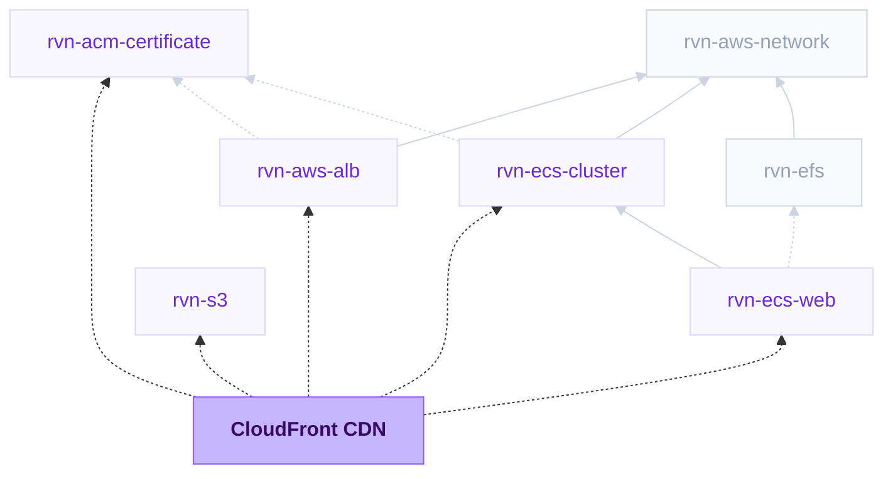

{/* Generated by scripts/sync-module-catalog.mjs from the Ravion module catalog. Do not edit by hand. */}

**Type:** `rvn-cloudfront` · **Latest version:** `1.3.1`

## Dependencies and consumers

_Every dependency input can be specified manually to reference existing external infrastructure rather than a Ravion module._

## Readme

CloudFront distribution that serves web applications and private S3 buckets from ECS services, standalone ALBs, S3 origins, and other custom origins.

### Overview

The CloudFront module puts the AWS CloudFront edge network in front of a dynamic web application or private S3 bucket. Point it at an existing ECS web service, an ECS cluster load balancer, a standalone ALB, an S3 bucket, or any custom domain, and Ravion provisions the distribution, origin configuration, cache behaviors, optional access logging bucket, and metrics.

The default configuration is safe for dynamic apps: responses are cached at the edge only when your app returns Cache-Control headers, and the full viewer request, including the Host header, cookies, and query strings, is forwarded to the origin. You get TLS termination close to users, HTTP/2 and HTTP/3, connection reuse to the origin, optional WAF, and per-path caching for static assets.

Terraform source: [ravionhq/modules/cdn/cloudfront](https://github.com/ravionhq/modules/tree/rvn-cloudfront@1.3.1/cdn/cloudfront)

### Use cases

| Scenario | CloudFront helps by... |
| --- | --- |
| Fronting one ECS web service | Using the service's load balancer as the origin with one click |
| Fronting a whole ECS cluster | Serving every service behind the cluster's public ALB through one distribution |
| Fronting a standalone ALB | Using an existing ALB module as a public or private CloudFront origin |
| Restricting direct origin access | Adding a custom header that the load balancer requires before routing requests |
| Serving private attachments | Using an S3 origin with Origin Access Control and optional signed URLs |
| Speeding up global users | Terminating TLS and HTTP/3 at the nearest edge location |
| Caching static assets | Adding a cache behavior such as /assets/* with the CachingOptimized policy |
| Splitting traffic by path | Routing paths like /api/* to additional origins |
| Redirecting legacy routes | Matching named path segments and returning redirects at the edge |
| Protecting an app | Associating a global WAFv2 web ACL and geo restrictions |
| Auditing traffic | Viewing CloudFront access logs in Ravion or delivering them to S3 |

### How load balancer connections work

ECS and standalone ALBs route requests using listener rules that match the request's host and path. CloudFront preserves that behavior: the default origin request policy (AWS managed AllViewer) forwards the viewer's Host header to the load balancer, so the same listener rules keep routing each request to the right service.

That means the origin is really the load balancer, not an individual service:

| Origin source | What it does |
| --- | --- |
| ECS web service | Uses the selected service's load balancer DNS name as the origin. The service must run rvn-ecs-web 0.8.0 or later and have applied its stack so the DNS name output exists. |
| ECS cluster | Uses the cluster's public ALB DNS name as the origin. Every service behind that ALB is reachable through the distribution. |
| Application Load Balancer | Uses the selected standalone ALB module's DNS name as the origin. An internal ALB can use a CloudFront VPC origin. |
| S3 bucket | Uses the selected bucket's regional S3 domain name as a private origin with CloudFront Origin Access Control. After this CloudFront stack applies, add the distribution ARN to the S3 bucket's CloudFront OAC read policy template. |
| Custom domain | Any origin domain name, such as an external load balancer, API endpoint, or S3 website endpoint. |

Both ECS options resolve to the same ALB when the service runs on that cluster, so pick whichever is easier to select. A standalone ALB can be selected directly when it is managed by the rvn-aws-alb module. One distribution can front all services behind the load balancer.

#### Domain aliases and host routing

If your services route by Domain host rules, the forwarded Host header must match those rules:

- Add each domain to Domain aliases (for example app.example.com and api.example.com).
- Point the domains' DNS at the CloudFront distribution domain.
- Keep the same domains in the ECS services' Domain host rules.

Without aliases, CloudFront forwards its default cloudfront.net domain as the Host header. That only works when services route by path rules (or a /* rule), not by host.

Cache behaviors are path-based only. If different domains need different edge settings, such as caching, WAF, or geo restrictions, create one CloudFront module instance per domain group. All of them can share the same load balancer origin.

#### Origin custom headers

Origin custom headers are added to every request CloudFront sends to the configured origin. The primary custom or load balancer origin and each additional origin can have their own headers. They can provide a shared value for an ALB listener rule, allowing the origin to route requests only when they came through this distribution. Configure the matching header name and value on the ALB rule separately.

Do not use the viewer `Host` header as the shared value. Choose a dedicated header name, use a different value for each protected service or distribution, and rotate the value if it is exposed. The configured value is part of the module configuration, so do not treat it as a general-purpose application secret.

#### TLS between CloudFront and the origin

Origin protocol policy defaults to HTTPS only. For that to work, the load balancer must have an HTTPS listener with a certificate that is valid for the forwarded Host domain, which is the same certificate the ALB already needs to serve those domains directly. Use HTTP only when the load balancer has no HTTPS listener; traffic from CloudFront to the origin is then unencrypted.

#### Private S3 origins

S3 origins use CloudFront Origin Access Control so the bucket can stay private. Use the None origin request policy unless you intentionally need CORS headers, because forwarding the viewer Host header to S3 can break OAC-signed origin requests.

The bucket policy must allow CloudFront to read objects, scoped to this distribution ARN. For rvn-s3 buckets, apply the CloudFront stack first, then edit the S3 bucket and add the CloudFront OAC read policy template with the CloudFront distribution ARN.

#### Signed URLs

Enable Require signed URLs to set trusted key groups on the default cache behavior. Each custom cache behavior can also require signed URLs for only that path and must provide its own trusted key group IDs. Ravion does not create key groups in this module; provide existing CloudFront key group IDs and keep the private signing key in your application.

### Edge redirects

Redirect rules run at viewer request time before CloudFront checks its cache or contacts an origin. Rules are evaluated in order and the first match wins. Sources and destinations accept absolute HTTPS URLs or host-agnostic paths. Use `:name` to capture one path segment and a final `:name*` to capture the remaining path, then place those named values anywhere in the destination. Query preservation is optional and disabled by default.

The managed viewer-request function is attached to the default cache behavior and every custom cache behavior when redirect rules are configured. CloudFront allows only one viewer-request edge association per behavior, so redirects cannot be combined with a viewer-request CloudFront Function or Lambda@Edge association supplied through Advanced Terraform variables.

The module prevents a rule from redirecting back into its own source pattern. It cannot detect cycles spanning multiple independently matching rules, so review rule ordering and destinations when defining bidirectional or multi-domain redirects.

#### Avoid overlapping same-host rules

Before returning a redirect, the edge function checks whether the destination would match the same source pattern on the same host. If it would, the function skips that rule and evaluates the next rule. If no later rule matches, CloudFront sends the original request to the configured origin. This prevents an infinite loop, but it can make an overlapping rule appear inactive.

For example, a source of `https://example.cloudfront.net/:path*` and destination of `https://example.cloudfront.net/docs/:path*` does not redirect. The destination `/docs/guide` still matches the broad source and would otherwise become `/docs/docs/guide` on the next request.

Use different hosts for a domain migration, such as `https://docs.example.com/:path*` to `https://www.example.com/docs/:path*`. For same-host testing, use non-overlapping namespaces such as `https://example.cloudfront.net/old/:path*` to `https://example.cloudfront.net/docs/:path*`. To redirect only the root, use the exact source `https://example.cloudfront.net` without a path parameter.

Redirect patterns do not currently support exclusions such as "all paths except `/docs`".

### Certificates

Domain aliases require a certificate issued in us-east-1, because CloudFront is a global service. Select an ACM Certificate module instance in the ACM certificate field; its certificate ARN is mapped automatically. In that certificate's Domains list, put the primary domain first and add any other aliases after it.

This certificate is for viewers connecting to CloudFront. The load balancer keeps its own regional certificate for the origin leg.

### Caching

The default cache behavior applies to all requests that do not match a custom cache behavior path:

| Setting | Default | Why |
| --- | --- | --- |
| Cache policy | UseOriginCacheControlHeaders-QueryStrings | Caches only responses where the app sends Cache-Control headers and includes query strings in the cache key |
| Origin request policy | AllViewer | Forwards Host, cookies, and query strings so app sessions and ALB routing work |
| Require signed URLs | false | Allows public viewer access unless enabled with trusted key groups |
| Allowed methods | Read only | Only GET and HEAD reach the origin; choose Read and OPTIONS or All methods to accept form posts and API writes |
| Viewer protocol policy | Redirect to HTTPS | Viewers are upgraded to HTTPS automatically |

With the recommended cache policy, nothing is cached until the app opts in by returning Cache-Control headers such as public, max-age=300. Responses without caching headers always go to the origin. The cache key includes query strings, and the origin request policy controls what else reaches the origin, so keep AllViewer selected when load balancer listener rules depend on the viewer Host header. Choose CachingDisabled to turn off edge caching entirely, or CachingOptimized to cache aggressively regardless of origin headers. Pick Custom policy ID to use a cache policy you created in your own account.

Response headers policy is optional and adds headers such as the SecurityHeadersPolicy set or CORS headers to every response.

To cache static content, add Custom cache behaviors. A typical setup adds /assets/* or /static/* with the CachingOptimized policy and GET, HEAD methods. Each behavior can also target an additional origin for path-based traffic splitting. Per-behavior policies use the managed policy lists; for a custom per-path policy, override ordered_cache_behaviors in Advanced Terraform variables.

CloudFront accepts only three allowed-method combinations per behavior: GET,HEAD; GET,HEAD,OPTIONS; or all seven methods.

### Distribution settings

| Field | Default | Notes |
| --- | --- | --- |
| Price class | All edge locations | Reduce edge coverage for cost savings if needed |
| HTTP version | HTTP/2 and HTTP/3 | Maximum protocol version for viewers |
| WAF web ACL ARN | None | Must be a global (CloudFront) WAFv2 web ACL |
| Geo restriction | None | Whitelist or blacklist ISO country codes |

### Monitoring

The dashboard always shows the default CloudFront distribution metrics: requests, total error rate, 4xx error rate, 5xx error rate, bytes downloaded, and bytes uploaded. CloudFront publishes these default metrics to CloudWatch at no additional CloudWatch metric cost.

You can also enable all additional metrics charts for cache hit rate, origin latency, and per-status error rates. AWS enables all 8 additional metrics together and CloudWatch charges a flat per-metric monthly rate, about $2.40 per month per distribution at the standard $0.30 per metric rate. This cost does not change with request volume.

| Additional metric | Useful for |
| --- | --- |
| Cache hit rate | Checking how much traffic is served from edge cache |
| Origin latency | Seeing how long origins take to start responding to CloudFront |
| 401, 403, 404 error rates | Separating authentication, authorization, and not-found issues |
| 502, 503, 504 error rates | Separating bad gateway, unavailable origin, and timeout issues |

### Access logging

CloudFront access logging is on by default, delivered to CloudWatch Logs and viewable in Ravion. Choose where logs are delivered:

| Destination | How it works |
| --- | --- |
| CloudWatch Logs (default) | CloudFront standard logging v2 delivers access logs to a module-managed CloudWatch Logs group, and the module UI shows them in the Logs panel. Log ingestion costs more than S3 at very high traffic. |
| S3 bucket | Legacy standard logging delivers compressed log files to an automatically created S3 bucket. Cheapest for high-traffic sites; not viewable in Ravion. |

Logging retention days defaults to 90 and controls the CloudWatch log group retention or the S3 bucket lifecycle expiry, depending on the destination. CloudWatch retention must be one of the standard CloudWatch Logs retention values (1, 3, 5, 7, 14, 30, 60, 90, 120, 150, 180, 365, and larger).

### Configuration

| Field | Required | Default | Notes |
| --- | --- | --- | --- |
| AWS account | Yes | None | Account for the distribution and logging bucket |
| Region | Yes | us-east-1 | Used for the optional S3 logging bucket; CloudFront is global and access logs go to CloudWatch Logs in us-east-1 by default |
| Name slug | Yes | Generated from project, environment, and module IDs | Prefix for distribution comment, OAC, and logging bucket |
| Domain aliases | No | [] | Custom domains; empty uses the cloudfront.net domain |
| ACM certificate | When aliases are set | None | rvn-acm-certificate instance issued in us-east-1 |
| Origin source | Yes | ECS web service | ECS web service, ECS cluster, standalone ALB, S3 bucket, or custom domain |
| ECS web service | When origin source is ECS web service | None | Service on rvn-ecs-web 0.8.0 or later |
| ECS cluster | When origin source is ECS cluster | None | Cluster with a public ALB |
| Application Load Balancer | When origin source is ALB | None | Existing rvn-aws-alb module; internal when using a VPC origin |
| S3 bucket | When origin source is S3 bucket | None | Private bucket served through OAC |
| Origin domain name | When origin source is custom | None | Any reachable origin domain |
| Origin protocol policy | Yes | HTTPS only | Origin needs a certificate valid for the forwarded host |
| Origin custom headers | No | [] | Headers added to every request sent to the primary custom or load balancer origin |
| Additional origins | No | [] | Extra origins with optional custom headers for path-based cache behaviors |
| Redirect rules | No | [] | Ordered URL-pattern redirects returned before contacting an origin |
| Viewer protocol policy | Yes | Redirect to HTTPS | How viewers connect to CloudFront |
| Allowed methods | Yes | Read only | GET and HEAD only; switch to Read and OPTIONS or All methods for apps that write |
| Cache policy | Yes | UseOriginCacheControlHeaders-QueryStrings | AWS managed policies by name, or a custom policy ID |
| Origin request policy | Yes | AllViewer | AWS managed policies by name, or a custom policy ID |
| Require signed URLs | No | false | Requires signed URLs or signed cookies on the default behavior |
| Trusted key group IDs | When signed URLs are enabled | [] | Existing CloudFront key groups trusted for signatures |
| Response headers policy | No | None | Managed security headers or CORS policies, or a custom policy ID |
| Custom cache behaviors | No | [] | Path-based caching and routing before the default behavior |
| Price class | No | All edge locations | Edge location coverage |
| Additional metrics | No | false | Enables all 8 CloudFront additional metrics and their flat CloudWatch cost |
| CloudFront access logging | No | true | Delivers logs to CloudWatch Logs or S3 |
| Logging destination | No | CloudWatch Logs | Visible when logging is enabled; CloudWatch shows logs in Ravion |
| Tags | No | Standard Ravion tags | Additional tags merged with Ravion ownership tags |
| Advanced Terraform variables | No | \{\} | Raw lower-level overrides for exceptional cases |

### Design decisions

- The primary origin is always the load balancer or domain you select, with the fixed origin ID primary. ECS and ALB references discover an existing load balancer's DNS name and ARN; they do not create per-service origins, because listener rules already fan traffic out behind one origin.
- Caching is disabled by default. A wrong edge cache on dynamic responses is worse than no cache, so caching is an explicit per-path opt-in.
- The AllViewer origin request policy is the default so Host-based listener rules, cookies, and query strings keep working unchanged behind CloudFront.
- Redirects use one managed CloudFront Function shared by the module's distributions and attached to every cache behavior.
- One module instance manages one distribution. Create additional instances when domains need different edge configuration; they can share the same origin.
- The certificate is referenced from an ACM Certificate module instance so the us-east-1 requirement is explicit and reusable.

### Learn more

- [Amazon CloudFront developer guide](https://docs.aws.amazon.com/AmazonCloudFront/latest/DeveloperGuide/Introduction.html)
- [Using managed cache and origin request policies](https://docs.aws.amazon.com/AmazonCloudFront/latest/DeveloperGuide/using-managed-cache-policies.html)
- [Requirements for using alternate domain names](https://docs.aws.amazon.com/AmazonCloudFront/latest/DeveloperGuide/CNAMEs.html#alternate-domain-names-requirements)
- [Amazon CloudFront metrics](https://docs.aws.amazon.com/AmazonCloudFront/latest/DeveloperGuide/programming-cloudwatch-metrics.html)

## Inputs reference

All inputs for `rvn-cloudfront` version `1.3.1`. Use the `name` shown for each field as the input key in module config.

### AWS account & region

<ResponseField name="aws_account_id" type="string" required>
  **AWS account.**

  - Immutable after creation
</ResponseField>

<ResponseField name="aws_region" type="string" required>
  **Region.** CloudFront is global. Access logs go to CloudWatch Logs in us-east-1 by default; this region is used for the optional S3 logging bucket.

  - Default: `us-east-1`
  - Immutable after creation
</ResponseField>

### Distribution

<ResponseField name="name" type="string" required>
  **Name slug.** Name prefix for the distribution comment, origin access control, and logging bucket.

  - Default: `<<project.given_id>>-<<environment.given_id>>-<<module.given_id>>`
  - Immutable after creation
  - Pattern: `^[a-zA-Z][a-zA-Z0-9-]{0,62}$` — 1-63 letters, numbers, or hyphens. Start with a letter.
</ResponseField>

<ResponseField name="distribution_aliases" type="string_array">
  **Domain aliases.** Custom domain names like app.example.com. Leave empty to use the default cloudfront.net domain. Aliases must match the domain host rules on the origin load balancer when it routes by host.

  - Default: `[]`
</ResponseField>

<ResponseField name="certificate" type="$ref:rvn-acm-certificate">
  **ACM certificate.** Certificate for the domain aliases. Required when aliases are set. CloudFront requires the certificate to be issued in us-east-1.
</ResponseField>

### Origin

<ResponseField name="origin_source" type="string" required>
  **Origin source.** Choose an existing ECS module, standalone ALB module, private S3 bucket, or custom origin domain name.

  - Default: `ecs_web_service`
  - Allowed values: `ecs_web_service` (ECS web service), `ecs_cluster` (ECS cluster), `alb` (Application Load Balancer), `s3_bucket` (S3 bucket), `custom` (Custom domain)
</ResponseField>

<ResponseField name="ecs_web_service" type="$ref:rvn-ecs-web">
  **ECS web service.** ECS web service whose load balancer becomes the origin. The service must be on rvn-ecs-web 0.8.0 or later so its stack exposes the load balancer DNS name.

  - Shown when: `{"origin_source":"ecs_web_service"}`
</ResponseField>

<ResponseField name="alb" type="$ref:rvn-aws-alb">
  **Application Load Balancer.** Existing standalone ALB whose DNS name becomes the origin. The ALB must be internal when private origin is enabled.

  - Shown when: `{"origin_source":"alb"}`
</ResponseField>

<ResponseField name="origin_vpc_enabled" type="boolean">
  **Private origin (VPC origin).** Connect to the ECS web service's load balancer or standalone ALB through a CloudFront VPC origin instead of over the public internet. Use when the load balancer is internal.

  - Default: `false`
  - Shown when: `{"origin_source":["ecs_web_service","alb"]}`
</ResponseField>

<ResponseField name="origin_vpc_domain_name" type="string" required>
  **VPC origin domain name.** Host name CloudFront uses as the origin domain and Host header. With HTTPS to the origin, it must be covered by the load balancer's TLS certificate and match the ECS service's or standalone ALB's host-based listener rule. No public DNS record is required.

  - Shown when: `{"origin_vpc_enabled":true}`
</ResponseField>

<ResponseField name="ecs_cluster" type="$ref:rvn-ecs-cluster">
  **ECS cluster.** ECS cluster whose public ALB becomes the origin. Listener rules on the ALB keep routing requests to the right services.

  - Shown when: `{"origin_source":"ecs_cluster"}`
</ResponseField>

<ResponseField name="origin_domain_name" type="string" required>
  **Origin domain name.** Domain name CloudFront connects to for the primary origin.

  - Shown when: `{"origin_source":"custom"}`
</ResponseField>

<ResponseField name="s3_bucket" type="$ref:rvn-s3">
  **S3 bucket.** Private S3 bucket to serve through CloudFront Origin Access Control. After this CloudFront stack applies, add its distribution ARN to the S3 bucket's CloudFront OAC read policy template.

  - Shown when: `{"origin_source":"s3_bucket"}`
</ResponseField>

<ResponseField name="origin_protocol_policy" type="string" required>
  **Origin protocol policy.** How CloudFront connects to the origin. HTTPS only requires the origin load balancer to serve a certificate valid for the forwarded host.

  - Default: `https-only`
  - Allowed values: `https-only` (HTTPS only), `http-only` (HTTP only), `match-viewer` (Match viewer)
  - Shown when: `{"origin_source":["ecs_web_service","ecs_cluster","alb","custom"]}`
</ResponseField>

<ResponseField name="origin_custom_headers" type="object_array">
  **Origin custom headers.** Headers CloudFront adds to every request sent to the primary origin. Use them for origin authentication or routing.

  - Default: `[]`
  - Shown when: `{"origin_source":["ecs_web_service","ecs_cluster","alb","custom"]}`

  <Expandable title="item fields">
    <ResponseField name="name" type="string" required>
      **Header name.**
    </ResponseField>
    <ResponseField name="value" type="string" required>
      **Header value.**
    </ResponseField>
  </Expandable>
</ResponseField>

<ResponseField name="additional_origins" type="object_array">
  **Additional origins.** Optional extra origins that custom cache behaviors can route paths to. Each origin needs a unique ID.

  - Default: `[]`

  <Expandable title="item fields">
    <ResponseField name="origin_id" type="string" required>
      **Origin ID.** Unique identifier referenced by cache behaviors. The primary origin uses the ID primary.
    </ResponseField>
    <ResponseField name="domain_name" type="string" required>
      **Domain name.**
    </ResponseField>
    <ResponseField name="origin_path" type="string">
      **Origin path.** Optional path prefix CloudFront adds to requests sent to this origin.
    </ResponseField>
    <ResponseField name="origin_protocol_policy" type="string" required>
      **Origin protocol policy.**

      - Default: `https-only`
      - Allowed values: `https-only` (HTTPS only), `http-only` (HTTP only), `match-viewer` (Match viewer)
    </ResponseField>
    <ResponseField name="custom_headers" type="object_array">
      **Custom headers.** Headers CloudFront adds to every request sent to this origin.

      - Default: `[]`

      <Expandable title="item fields">
        <ResponseField name="name" type="string" required>
          **Header name.**
        </ResponseField>
        <ResponseField name="value" type="string" required>
          **Header value.**
        </ResponseField>
      </Expandable>
    </ResponseField>
  </Expandable>
</ResponseField>

### Edge redirects

<ResponseField name="redirect_rules" type="object_array">
  **Redirect rules.** Optional URL-pattern redirects handled by a CloudFront Function at viewer request time.

  - Default: `[]`

  <Expandable title="item fields">
    <ResponseField name="source" type="string" required>
      **Source.** Absolute HTTPS URL or host-agnostic path to match. Use :name for one segment and a final :name* to capture the remaining path.
    </ResponseField>
    <ResponseField name="destination" type="string" required>
      **Destination.** Absolute HTTPS URL or host-agnostic path. Named parameters are replaced with values captured by the source.
    </ResponseField>
    <ResponseField name="preserve_query_string" type="boolean">
      **Preserve query string.** Append the request query parameters to the redirect location.

      - Default: `false`
    </ResponseField>
    <ResponseField name="redirect_non_read_methods" type="boolean">
      **Redirect non-read methods.** Redirect methods other than GET and HEAD. Requires status 307 or 308 so clients preserve the request method and body.

      - Default: `false`
    </ResponseField>
    <ResponseField name="status_code" type="number" required>
      **Status code.** HTTP redirect status. Use 308 for permanent redirects that preserve the request method.

      - Default: `308`
      - Allowed values: `308` (308 Permanent redirect), `307` (307 Temporary redirect), `301` (301 Moved permanently), `302` (302 Found)
    </ResponseField>
  </Expandable>
</ResponseField>

### Default cache behavior

<ResponseField name="viewer_protocol_policy" type="string" required>
  **Viewer protocol policy.** How viewers connect to CloudFront.

  - Default: `redirect-to-https`
  - Allowed values: `redirect-to-https` (Redirect to HTTPS), `https-only` (HTTPS only), `allow-all` (Allow all)
</ResponseField>

<ResponseField name="allowed_methods" type="string" required>
  **Allowed methods.** HTTP methods CloudFront forwards to the origin. Use all methods for apps that accept form posts or API writes.

  - Default: `read`
  - Allowed values: `all` (All methods), `read_options` (Read and OPTIONS), `read` (Read only)
</ResponseField>

<ResponseField name="cache_policy" type="string" required>
  **Cache policy.** Controls edge caching for the default behavior. The recommended option respects your app's Cache-Control headers and includes query strings in the cache key.

  - Default: `4cc15a8a-d715-48a4-82b8-cc0b614638fe`
  - Allowed values: `4cc15a8a-d715-48a4-82b8-cc0b614638fe` (UseOriginCacheControlHeaders-QueryStrings (recommended)), `83da9c7e-98b4-4e11-a168-04f0df8e2c65` (UseOriginCacheControlHeaders), `4135ea2d-6df8-44a3-9df3-4b5a84be39ad` (CachingDisabled), `658327ea-f89d-4fab-a63d-7e88639e58f6` (CachingOptimized), `custom` (Custom policy ID)
</ResponseField>

<ResponseField name="cache_policy_custom_id" type="string" required>
  **Custom cache policy ID.** ID of a cache policy from your AWS account.

  - Pattern: `^[0-9a-f]{8}-[0-9a-f]{4}-[0-9a-f]{4}-[0-9a-f]{4}-[0-9a-f]{12}$` — Invalid CloudFront policy ID. Use the 36-character policy ID, not the name or ARN.
  - Shown when: `{"cache_policy":"custom"}`
</ResponseField>

<ResponseField name="origin_request_policy" type="string" required>
  **Origin request policy.** Controls what CloudFront forwards to the origin. Use None for private S3 origins so CloudFront can sign OAC requests without forwarding the viewer Host header.

  - Default: `216adef6-5c7f-47e4-b989-5492eafa07d3`
  - Allowed values: `none` (None), `216adef6-5c7f-47e4-b989-5492eafa07d3` (AllViewer (recommended)), `b689b0a8-53d0-40ab-baf2-68738e2966ac` (AllViewerExceptHostHeader), `33f36d7e-f396-46d9-90e0-52428a34d9dc` (AllViewerAndCloudFrontHeaders-2022-06), `59781a5b-3903-41f3-afcb-af62929ccde1` (CORS-CustomOrigin), `88a5eaf4-2fd4-4709-b370-b4c650ea3fcf` (CORS-S3Origin), `custom` (Custom policy ID)
</ResponseField>

<ResponseField name="origin_request_policy_custom_id" type="string" required>
  **Custom origin request policy ID.** ID of an origin request policy from your AWS account.

  - Pattern: `^[0-9a-f]{8}-[0-9a-f]{4}-[0-9a-f]{4}-[0-9a-f]{4}-[0-9a-f]{12}$` — Invalid CloudFront policy ID. Use the 36-character policy ID, not the name or ARN.
  - Shown when: `{"origin_request_policy":"custom"}`
</ResponseField>

<ResponseField name="cache_behaviors" type="object_array">
  **Custom cache behaviors.** Optional path-based behaviors evaluated before the default behavior, such as caching /assets/* or routing /api/* to another origin.

  - Default: `[]`

  <Expandable title="item fields">
    <ResponseField name="path_pattern" type="string" required>
      **Path pattern.**
    </ResponseField>
    <ResponseField name="target_origin_id" type="string" required>
      **Target origin ID.** Origin this behavior routes to. Use primary for the main origin or the ID of an additional origin.

      - Default: `primary`
    </ResponseField>
    <ResponseField name="viewer_protocol_policy" type="string" required>
      **Viewer protocol policy.**

      - Default: `redirect-to-https`
      - Allowed values: `redirect-to-https` (Redirect to HTTPS), `https-only` (HTTPS only), `allow-all` (Allow all)
    </ResponseField>
    <ResponseField name="allowed_methods" type="string" required>
      **Allowed methods.** HTTP methods CloudFront forwards for this path. CloudFront supports only these three combinations.

      - Default: `read`
      - Allowed values: `read` (Read only), `read_options` (Read and OPTIONS), `all` (All methods)
    </ResponseField>
    <ResponseField name="cache_policy_id" type="string" required>
      **Cache policy.** Controls edge caching for this path. For a custom cache policy, override ordered_cache_behaviors in Advanced Terraform variables.

      - Default: `658327ea-f89d-4fab-a63d-7e88639e58f6`
      - Allowed values: `658327ea-f89d-4fab-a63d-7e88639e58f6` (CachingOptimized), `b2884449-e4de-46a7-ac36-70bc7f1ddd6d` (CachingOptimizedForUncompressedObjects), `4135ea2d-6df8-44a3-9df3-4b5a84be39ad` (CachingDisabled), `83da9c7e-98b4-4e11-a168-04f0df8e2c65` (UseOriginCacheControlHeaders), `4cc15a8a-d715-48a4-82b8-cc0b614638fe` (UseOriginCacheControlHeaders-QueryStrings)
    </ResponseField>
    <ResponseField name="origin_request_policy_id" type="string">
      **Origin request policy.** What CloudFront forwards to the origin for this path. Leave empty to forward only what the cache policy includes.

      - Allowed values: `216adef6-5c7f-47e4-b989-5492eafa07d3` (AllViewer), `b689b0a8-53d0-40ab-baf2-68738e2966ac` (AllViewerExceptHostHeader), `33f36d7e-f396-46d9-90e0-52428a34d9dc` (AllViewerAndCloudFrontHeaders-2022-06), `59781a5b-3903-41f3-afcb-af62929ccde1` (CORS-CustomOrigin), `88a5eaf4-2fd4-4709-b370-b4c650ea3fcf` (CORS-S3Origin)
    </ResponseField>
    <ResponseField name="signed_urls_enabled" type="boolean">
      **Require signed URLs.** Require requests matching this path to use a signed URL or signed cookie from one of the trusted key groups.

      - Default: `false`
    </ResponseField>
    <ResponseField name="trusted_key_group_ids" type="string_array" required>
      **Trusted key group IDs.** Existing CloudFront key group IDs whose public keys are trusted for signed URLs or signed cookies on this path.

      - Default: `[]`
      - Pattern: `^[0-9a-f]{8}-[0-9a-f]{4}-[0-9a-f]{4}-[0-9a-f]{4}-[0-9a-f]{12}$` — Invalid CloudFront key group ID. Use the 36-character key group ID from CloudFront key management, not the public key ID.
      - Shown when: `{"signed_urls_enabled":true}`
    </ResponseField>
  </Expandable>
</ResponseField>

### Signed URLs

<ResponseField name="signed_urls_enabled" type="boolean">
  **Require signed URLs.** Require signed URLs or signed cookies for the default cache behavior. Unsigned requests receive 403 responses from CloudFront.

  - Default: `false`
</ResponseField>

<ResponseField name="trusted_key_group_ids" type="string_array" required>
  **Trusted key group IDs.** Existing CloudFront key group IDs whose public keys are trusted for signed URLs or signed cookies. Add at least one key group before enabling Require signed URLs on the default behavior or any custom cache behavior.

  - Default: `[]`
  - Pattern: `^[0-9a-f]{8}-[0-9a-f]{4}-[0-9a-f]{4}-[0-9a-f]{4}-[0-9a-f]{12}$` — Invalid CloudFront key group ID. Use the 36-character key group ID from CloudFront key management, not the public key ID.
  - Shown when: `{"signed_urls_enabled":true}`
</ResponseField>

<ResponseField name="response_headers_policy" type="string">
  **Response headers policy.** Optional headers CloudFront adds to responses, such as security headers or CORS. Leave empty to add none.

  - Allowed values: `67f7725c-6f97-4210-82d7-5512b31e9d03` (SecurityHeadersPolicy), `60669652-455b-4ae9-85a4-c4c02393f86c` (SimpleCORS), `5cc3b908-e619-4b99-88e5-2cf7f45965bd` (CORS-With-Preflight), `e61eb60c-9c35-4d20-a928-2b84e02af89c` (CORS-and-SecurityHeadersPolicy), `eaab4381-ed33-4a86-88ca-d9558dc6cd63` (CORS-with-preflight-and-SecurityHeadersPolicy), `custom` (Custom policy ID)
</ResponseField>

<ResponseField name="response_headers_policy_custom_id" type="string" required>
  **Custom response headers policy ID.** ID of a response headers policy from your AWS account.

  - Pattern: `^[0-9a-f]{8}-[0-9a-f]{4}-[0-9a-f]{4}-[0-9a-f]{4}-[0-9a-f]{12}$` — Invalid CloudFront policy ID. Use the 36-character policy ID, not the name or ARN.
  - Shown when: `{"response_headers_policy":"custom"}`
</ResponseField>

### Distribution settings

<ResponseField name="price_class" type="string">
  **Price class.** You can reduce edge locations for some cost savings if it becomes an issue.

  - Default: `PriceClass_All`
  - Allowed values: `PriceClass_All` (All edge locations), `PriceClass_200` (Most edge locations), `PriceClass_100` (US, Canada, Europe)
</ResponseField>

<ResponseField name="http_version" type="string">
  **HTTP version.**

  - Default: `http2and3`
  - Allowed values: `http2and3` (HTTP/2 and HTTP/3), `http2` (HTTP/2), `http1.1` (HTTP/1.1)
</ResponseField>

<ResponseField name="web_acl_id" type="string">
  **WAF web ACL ARN.** Optional WAFv2 web ACL to associate with the distribution. Must be a global (CloudFront) web ACL.
</ResponseField>

<ResponseField name="geo_restriction_type" type="string">
  **Geo restriction.**

  - Default: `none`
  - Allowed values: `none` (None), `whitelist` (Whitelist), `blacklist` (Blacklist)
</ResponseField>

<ResponseField name="geo_restriction_locations" type="string_array">
  **Geo restriction country codes.**

  - Default: `[]`
  - Shown when: `{"geo_restriction_type":["whitelist","blacklist"]}`
</ResponseField>

### Monitoring

<ResponseField name="additional_metrics_enabled" type="boolean">
  **Additional metrics.** Enable `CacheHitRate`, `OriginLatency`, and `401/403/404/502/503/504` error rate charts. Adds a flat CloudWatch cost of about $2.40/month per distribution.

  - Default: `false`
</ResponseField>

### Access logging

<ResponseField name="logging_enabled" type="boolean">
  **CloudFront access logging.** Enable CloudFront access logging. Logs are delivered to CloudWatch Logs by default and can be viewed in Ravion.

  - Default: `true`
</ResponseField>

<ResponseField name="logging_destination" type="string">
  **Logging destination.** Where CloudFront delivers access logs.

  - Default: `cloudwatch`
  - Allowed values: `cloudwatch` (CloudWatch Logs), `s3` (S3 bucket)
  - Shown when: `{"logging_enabled":true}`
</ResponseField>

<ResponseField name="logging_bucket_retention_days" type="number">
  **Logging retention days.** Days to retain CloudFront access logs in CloudWatch Logs or the automatically created S3 logging bucket.

  - Default: `90`
  - Min: `1`
  - Shown when: `{"logging_enabled":true}`
</ResponseField>

### Misc

<ResponseField name="tags" type="keyvalue">
  **Tags.** A map of tags to assign to all resources. Default tags are `Owner`, `ProjectGivenId`, `EnvironmentGivenId`, `ModuleGivenId`, `ModuleId`
</ResponseField>

### Terraform settings

<ResponseField name="opentofu_version" type="string">
  **OpenTofu version override.** Override the environment's default version for this module
</ResponseField>

<ResponseField name="ravion_state_backend_workspace" type="string">
  **Ravion Terraform workspace name.** Override Terraform state backend workspace name. Defaults to project + environment + module given ids.

  - Immutable after creation
</ResponseField>

<ResponseField name="advanced_terraform_variables" type="object">
  **Advanced Terraform variables.** Optional raw Terraform variable overrides for advanced module inputs or one-off overrides. Values here override the generated variables above.

  - Default: `{}`
</ResponseField>

<ResponseField name="execution_environment_id" type="string">
  **Terraform execution environment.** Override the execution environment for Terraform runners. Must use the same AWS account as selected above.
</ResponseField>
