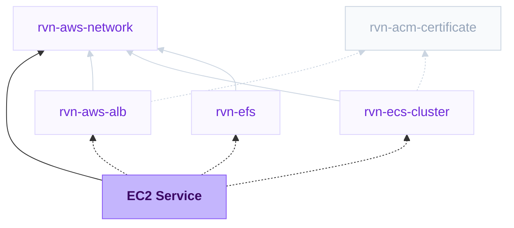

{/* Generated by scripts/sync-module-catalog.mjs from the Ravion module catalog. Do not edit by hand. */}

**Type:** `rvn-ec2-service` · **Latest version:** `1.6.1`

## Dependencies and consumers



_Every dependency input can be specified manually to reference existing external infrastructure rather than a Ravion module._

## Readme

Runs supervised workloads on a stable EC2 Auto Scaling Group, with optional shared ALB routing and switchable container or manual in-place deploys.

### Overview

The EC2 Service module deploys supervisord-managed workloads across an EC2 Auto Scaling Group. Deploys update the existing hosts in place instead of creating a new task or instance for every release. Container mode replaces a Docker container on each host; Manual mode runs host-level preparation commands and then starts a foreground command. You can switch modes without replacing the group.

Ravion provisions the launch template, Auto Scaling Group, instance role and security group, SSM deploy document, app log group, and optional target group and listener rule. Web services can attach to a standalone Application Load Balancer or reuse the public or private ALB from an ECS cluster. The selected network and load balancer must use the same AWS account, region, and VPC.

Instances are as stable as an EC2 instance you launch yourself in the AWS console. Deploys, app restarts, and stack updates do not replace them, so each instance keeps its root and optional data volume, and everything on those disks, for its whole life. Even changing the AMI leaves running instances alone: the change becomes a new launch template version that only applies to instances launched later, because the module does not run an instance refresh. An instance is replaced when you deliberately terminate or recycle it, for example to roll out that new AMI, when the group scales in, or when it fails its Auto Scaling health check (EC2 by default, or load balancer health when `health_check_type` is set to `ELB`). Replacement is what destroys the volumes, so take regular EBS snapshots or back up off-instance if critical data lives on the disk.

Terraform source: [ravionhq/modules/compute/ec2_service](https://github.com/ravionhq/modules/tree/rvn-ec2-service@1.6.1/compute/ec2_service)

### Use cases

| Scenario | Why this module fits | Example |
| --- | --- | --- |
| Existing host-installed application | Manual deploys can update files and dependencies directly on every host | A legacy Node, Ruby, or JVM service that is not packaged as a container |
| Host customization is part of the workload | A custom AMI and Additional user data can install agents, libraries, or host services | A vendor runtime that needs an OS package or host monitoring agent |
| Local state on disk should stay put across releases | In-place deploys retain each instance's encrypted root and optional data volume | A SQLite database, model files, build artifacts, or a warm local cache |
| The app needs the host itself | Manual mode and Additional user data give full access to the instance, including the Docker socket, kernel features, and host services | An agent runtime that starts its own sandbox containers |
| A container workload needs stable hosts | Container mode replaces the app container without replacing the EC2 instance | A licensed service tied to host identity, when its license permits scaling |
| Background processing without HTTP routing | Web service can be disabled, leaving a supervised worker group | A queue consumer that specifically needs host access or local cache |
| Several services share one ALB | Each service owns a target group and host/path listener rule | `api.example.com` and `admin.example.com` on one shared ALB |

Instance disks are a reasonable place for application state, including a local SQLite database, as long as you back it up. Use EFS when several instances must read and write the same files, or when files must be available immediately on a replacement instance without a restore step. Use a managed database when you need relational or transactional data with its own backups, failover, and read scaling.

### EC2 Service or ECS?

For a normal stateless containerized web service or worker, prefer an ECS Web Service, ECS Worker Service, or ECS Network Service. ECS gives you immutable task revisions, scheduler-managed replacement, sidecars, Fargate or shared EC2 capacity, and rolling or traffic-shift deployment strategies.

Choose EC2 Service only when a concrete host-level requirement outweighs those ECS benefits:

| Decision | EC2 Service | ECS deployment |
| --- | --- | --- |
| Release model | Updates the app on existing hosts through SSM | Starts new task revisions and replaces old tasks |
| Packaging | Container image or host-level manual commands | Container image |
| Host access | Direct instance access, custom AMI, and bootstrap script | Tasks are the deployment unit; hosts are abstracted or cluster-managed |
| Process model | One supervised app per instance group | App container plus optional sidecars and release tasks |
| Capacity | Dedicated Auto Scaling Group for this app | Fargate, Fargate Spot, or shared/dedicated ECS EC2 capacity |
| Local storage | Instance EBS volumes keep their contents for the life of the instance, at local-disk latency | Task-local storage is ephemeral; EFS can survive task replacement, over the network |
| Host-level access | Full instance access, including the Docker socket and host services | Fargate has no host access; ECS on EC2 hosts are cluster-managed |
| Deployment safety | Sequential in-place updates; a one-instance service has an interruption | Rolling, blue/green, linear, or canary options, depending on the ECS module |

Selecting EC2 capacity for an ECS service does not make it equivalent to this module. ECS on EC2 still deploys replaceable tasks through the ECS scheduler. This module deploys directly to stable hosts and gives the application the whole instance.

### Choosing an instance type

Instance type is the sizing decision this module cannot make for you. Make it in two steps: pick the family that fits the workload, then pick the newest generation of that family that the selected account and region actually offer.

| Family | Memory per vCPU | Use for |
| --- | --- | --- |
| `t` burstable | 0.5-4 GB | Small or spiky services, development and staging environments, low-volume workers |
| `m` general purpose | 4 GB | Web services and workers with no strong CPU or memory bias |
| `c` compute optimized | 2 GB | CPU-bound work such as request-heavy APIs, transcoding, or compilation |
| `r` memory optimized | 8 GB | Memory-bound work such as large heaps, in-process caches, or a local database |

In a name like `m8g.large`, the digit is the generation and the letters after it identify the processor: `g` is AWS Graviton (`arm64`), `i` is Intel, `a` is AMD, and older families such as `m5` or `t3` carry no processor letter. A `-flex` variant such as `m8i-flex` costs less for workloads that do not sustain high CPU.

**Always take the highest generation number available for the family you chose.** Each generation is faster and cheaper per unit of work than the one below it, so `m8g` beats `m7g`, which beats `m6i`. This is the most common configuration mistake: an instance type copied from an example, an older project, or an AI assistant's memory is usually one or two generations behind, which pays more for less performance. Read the current generation off the Instance type list rather than assuming it. The one exception is burstable: `t4g`, `t3`, and `t3a` are still the newest burstable families, because AWS has not released a newer one.

The Instance type list shows only what the selected account and region support, which is the authoritative answer for that region. Newest generations reach the largest regions first, so a region may top out a generation behind. The list is region-level, so a type offered in the region can still be missing from an individual Availability Zone; if capacity fails in one subnet, spread the group across more AZs. To check from the command line before configuring the module:

```sh
ravion values aws/ec2/instances --aws-account-id <account-id> --region us-east-1
```

Prefer Graviton whenever the workload can run on it: it is the best price and performance in every family that offers it, and Ravion resolves the matching `arm64` Amazon Linux 2023 AMI from the instance type automatically, so nothing else needs configuring. A Custom AMI ID is used exactly as given, so set one only when it already matches the instance type's architecture. The requirement is that your container image (Container mode) or host-installed dependencies (Manual mode) build for `arm64`. Choose an Intel or AMD type when something in the stack is `x86_64`-only.

Then right-size from measurement rather than guessing: start with the smallest size in the chosen family that holds the working set, watch the service's CPU and memory charts, and move up a size or enable CPU autoscaling from there.

Changing Instance type later applies to instances launched after the change. Running instances keep their current type until you recycle them, and a Graviton/x86 switch changes the AMI for new instances only, so a group can briefly run both architectures mid-recycle. Container images must work on both architectures during that window, or recycle every instance promptly after the change.

### Deploy types

| Deploy type | Build behavior | On each instance |
| --- | --- | --- |
| Container | Dockerfile, Railpack, Managed ECR repository, or image registry | Pull the selected image, replace the app container, and run it under supervisord |
| Manual | Build disabled | Run Deploy commands as root on every host, then run Start command under supervisord |

Instances are prepared for both modes at launch. Supervisord owns the long-running process and restarts it after an unexpected exit. In Container mode, Start command override replaces the image CMD but preserves its ENTRYPOINT. In Manual mode, the start command must remain in the foreground and should explicitly drop root privileges when the app should run as another user.

Container workloads that need to orchestrate sibling containers can enable Docker socket mount. The deploy runner bind-mounts `/var/run/docker.sock` at the identical path inside the app container and adds the host `docker` group's GID at container-start time, so the image must include a `docker` CLI. This is Docker-outside-of-Docker: mounting the host Docker socket grants the container root-equivalent control of the instance, including the ability to start privileged containers, read the host filesystem, and use the instance role. Leave it disabled unless this level of access is required.

### Build sources

| Build source | Build output | Deploy input |
| --- | --- | --- |
| Dockerfile | Build from the selected Git repository and push to the service ECR repository | Image tag or digest |
| Railpack | Detect and build the app from the selected Git repository, then push to service ECR | Image tag or digest |
| Pull from image registry | Skip the build and use Image repository from the module | Tag or digest within that repository |
| Managed ECR repository | Skip the module build and use the ECR repository managed by Ravion | Tag or digest within that repository |

Build settings apply only to Container mode. Manual mode disables the build pipeline and does not create an ECR repository. Managed ECR repository lets a pipeline push images to the Ravion-managed repository without a module build config. Built-image repositories scan images on push by default. Registry username/password credentials are not supported. Public images work directly; same-region private ECR requires repository permissions for the generated `<service-name>-instance` role.

### Worked examples

#### Host-installed application

Use Manual mode when the release genuinely needs to update the host rather than replace a container. For example, bootstrap an `app` user and an initial checkout with Additional user data, then configure:

```text
Deploy type: Manual
Deploy commands:
  runuser -u app -- git -C /srv/orders pull --ff-only
  runuser -u app -- bash -c 'cd /srv/orders && ./bin/install-dependencies'
  runuser -u app -- bash -c 'cd /srv/orders && ./bin/build-assets'
Start command:
  exec runuser -u app -- /srv/orders/bin/server
```

Every Deploy command runs on every instance, so keep commands repeatable and do not put a cluster-wide one-time migration in this list. Select Git repository to have Ravion check out a clean authenticated source before running the commands, or leave it blank when the commands manage their own source or artifacts. Deploy commands and the Start command run from Source base path when source is configured. Use Container mode for digest-addressed image releases; use ECS when you need scheduler-managed rollback or traffic shifting.

#### Container that needs host customization

Choose Container mode with a custom AMI or Additional user data when the app is containerized but also needs host software that ECS does not model for the service. A typical web configuration uses at least two instances, App port `3000`, Health check path `/health`, and host or path rules on a shared ALB. Use Dockerfile or Railpack for Ravion builds, Managed ECR repository when an external pipeline should publish to a Ravion-managed repository, or Pull from image registry when an external pipeline already publishes elsewhere.

If the requirement is only "run my container," use ECS instead. The EC2 choice should come from a real host dependency, stable-host requirement, or manual operational constraint. Access to the Docker socket, a local database on disk with local-disk latency, or shelling into a long-lived host with SSM Session Manager all qualify. In Container mode, only the data volume and EFS mount path are bind-mounted into the app container, so a workload that needs the host's Docker socket or other host paths belongs in Manual mode.

#### Worker with local state on disk

Turn Web service off, keep Container mode, and enable a Data volume mounted at a path such as `/var/lib/app`. Container mode bind-mounts that path into the app container, and its contents stay in place across every deploy and restart. Add a backup for anything you cannot lose, such as an EBS snapshot schedule or a periodic sync to S3, because the volume is deleted if the instance is ever replaced. Choose EFS instead when several instances must share the same files.

### Load balancing and worker mode

With Web service enabled, select a shared Ravion Application Load Balancer. The service creates an HTTP instance target group and a listener rule on the ALB's HTTPS listener when available, otherwise its HTTP listener. Route traffic with Domain host rules, Path rules, or both; when both are empty, the rule matches `/*`.

Several EC2 services (and other services) can attach to the same load balancer with different host or path rules. Slow start can ramp traffic to newly registered instances, and sticky sessions can use either an ALB-managed cookie or an application cookie.

Allowed CIDR blocks permit direct access to the app port on the instances. This bypasses load balancer TLS termination, WAF, authentication, and access logging, so leave the list empty unless direct access is required.

Turn Web service off for worker groups. No target group, listener rule, ALB health check, or local HTTP deploy gate is configured.

### Deploys

Container deploys run through an SSM command document created by the module. On each instance, the deploy:

1. Rebuilds the app environment file and fetches configured secret values on the instance.
2. Pulls the selected image before interrupting the running app.
3. For a web service with another registered target, deregisters and drains this instance.
4. Stops the prior process, replaces the app container, and starts it under supervisord.
5. Polls the local health path for an HTTP response below 400, failing that instance's deploy otherwise.
6. Re-registers a drained instance and waits for the ALB to mark it in service.

A web service with only one registered target skips draining because there is nowhere to move traffic; replacing its process still causes an interruption. Use at least two instances when availability during container deploys matters.

Manual deploys refresh and load the app environment file, stop the prior app, and run Deploy commands as root in order on every instance. Any non-zero exit fails that instance and leaves its prior app stopped. Supervisord starts the Start command only after all preparation commands succeed. Manual mode does not automatically drain the ALB or run a health gate; implement those behaviors in your commands if required.

Maximum concurrent instances controls how many hosts update together, while Maximum deployment errors controls when the rollout stops sending commands to remaining hosts. Defaults are sequential and fail-fast. Per-instance deploy timeout limits each SSM script; the overall deployment has a 24-hour safety limit.

The EC2 deploy manager also runs the current release document against instances launched by autoscaling or replacement so they catch up to the active release.

### Logs and metrics

App stdout and stderr from the supervised process are sent to `/ravion/ec2/<service-name>` in CloudWatch Logs. Every deployment and instance has a distinct stream named `deployment/<deployment-id>/instance/<instance-id>`. SSM preparation and deploy-script stdout and stderr are copied into the same instance stream while remaining available with the deployment command.

Supervisord rotates the log file on the instance so a crash-looping process cannot fill the root volume. Log rotation size (MB) and Rotated log files kept bound on-instance usage to (kept + 1) times the rotation size for each deployment log. Ravion writes the supervisord program configuration after Deploy commands run, so rotation cannot be changed from a deploy command; change these fields instead. Newly launched instances receive the same settings from the launch template.

The dashboard shows desired and in-service instance counts for every service. Web services also show request count, target response time, target 4xx and 5xx responses, and healthy and unhealthy host counts. Worker groups omit load-balancer metrics.

### Storage and durability

| Storage | Survives deploys, restarts, and stack updates | Survives instance replacement |
| --- | --- | --- |
| Root volume | Yes | No |
| Data volume | Yes | No |
| EFS file system | Yes | Yes |

Root and Data volumes are encrypted gp3 EBS volumes attached to the instance. They are durable for the life of the instance: nothing in the normal deploy or update path replaces an instance, so files written to disk stay there, at local-disk latency. This is the same durability model as an EC2 instance you create yourself in the AWS console.

Both volumes are deleted with the instance, which only happens for the three reasons in Instance replacement below. Keep backups of critical data on the disk — an EBS snapshot schedule, database dumps to S3, or a periodic sync — rather than avoiding local storage.

Enable EFS and select a Ravion EFS module when several instances must share the same files, or when a replacement instance must find the data already in place. The service mounts the file system through its access point when present and attaches the EFS client security group to each instance. Container mode bind-mounts the Data and EFS host paths into the app container at the same paths. EFS is a network file system, so latency-sensitive local state such as an embedded database is usually better on the instance's own volume with backups.

### Instance replacement

Only three things replace a running instance. Everything else — deploys, app crashes and restarts, configuration changes, stack updates — leaves the instance and its disks in place.

| Trigger | When it happens | How often to expect it |
| --- | --- | --- |
| You terminate or recycle the instance | Deliberate operator action, typically to roll out a launch template change such as a new AMI | Only when you choose to |
| The group scales in | CPU autoscaling scales down, or you lower Minimum/Desired instances | Never with a fixed one-instance group and autoscaling off |
| The Auto Scaling health check fails | The instance fails its EC2 status checks | Rare |

The default `EC2` health check reflects the AWS instance and system status checks: the instance is unreachable, its network or boot state is broken, or the underlying host has failed. It says nothing about your application. A crashed app process does not fail it, because supervisord restarts the process on the same instance, and a failing HTTP health check does not fail it either.

In practice that makes health-driven replacement an infrequent event tied to underlying hardware or hypervisor failure, not something a bad release or a wedged app triggers. The tradeoff is that a standalone EC2 instance you launch in the console would instead sit impaired until you noticed, while the Auto Scaling Group recovers automatically with a fresh instance and an empty disk.

Load-balancer health checks do not replace instances. `health_check_type` is `EC2` by default on purpose, because in-place deploys briefly deregister an instance from the target group and ELB health checks would read that as unhealthy and replace it mid-deploy. Set `health_check_type` to `ELB` through Advanced Terraform variables only if you accept that, and expect replacement — and disk loss — whenever the ALB considers an instance unhealthy.

### Scaling and instance health

Minimum instances and Maximum instances bound the group. Enable CPU autoscaling to target average EC2 CPU utilization. When autoscaling is off, Desired instances sets the initial group size; later external scaling changes are preserved. Instance health check grace period controls how long new instances have before Auto Scaling begins health evaluation.

Launch template changes such as a new AMI, instance type, volume setting, or Additional user data apply to newly launched instances only. The module does not perform an instance refresh, so a stack update alone never rolls a new AMI onto running instances; recycle them deliberately when a host-level change must go out. Recycling replaces the instance, which deletes its root and data volumes, so restore from a snapshot or backup afterwards if the instance held state you need.

### Application configuration

Runtime environment variables must be single-line values. They are rendered into the app environment file at instance boot and on every deploy. Container mode passes the file to Docker; Manual mode loads it before Deploy commands and the Start command. A configuration change requires a stack update and then a deploy to restart the app with the new values.

Runtime secrets use same-account Secrets Manager or SSM Parameter Store references. Each instance fetches values while rebuilding its environment file, so the values do not enter Terraform state or the SSM document. A rotated value takes effect on the next deploy without a stack change. Multi-line secret values are unsupported.

Build environment variables apply to Railpack and Dockerfile builds; for Dockerfile builds, optionally inject them as build arguments.

### Configuration

#### Service and instances

| Field | Required | Default | Description |
| --- | --- | --- | --- |
| VPC network | Yes | - | Existing network supplying account, region, VPC, and subnets |
| Service name | Yes | \{project\}-\{env\}-\{module\} | Name for the instance group and related resources |
| Deploy type | Yes | container | Switchable Container or Manual in-place deployment |
| Deploy commands | Yes* | - | Root-level, per-instance preparation commands for Manual mode |
| Start command | Yes* | - | Foreground Manual-mode process managed by supervisord |
| Git repository | No | - | Optional authenticated source checkout for Manual mode |
| Source base path | No | . | Working directory within the selected repository |
| Maximum concurrent instances | No | 1 | Instance count or percentage updated together |
| Maximum deployment errors | No | 0 | Failures tolerated before the rollout stops |
| Per-instance deploy timeout (secs) | No | 1200 | SSM script timeout for either deploy mode |
| Run in private subnets | No | true | Use private subnets without public IPs; outbound access is still required |
| Instance type | Yes | - | EC2 type used for every instance; architecture must match the app |
| Minimum instances / Maximum instances | Yes | 1 / 1 | Auto Scaling Group capacity bounds |
| CPU autoscaling | No | false | Target-tracking scaling on average EC2 CPU utilization |
| CPU target (%) | No | 70 | CPU target used when autoscaling is enabled |
| Desired instances | No | - | Initial target when CPU autoscaling is off; blank starts at the minimum |
| Instance health check grace period (secs) | No | 300 | Startup window before Auto Scaling health checks apply |
| SSH key pair name | No | - | Optional SSH key; Session Manager does not require one |
| Custom AMI ID | No | Latest AL2023 | AMI for future instances; must support the module bootstrap |
| Additional security groups | No | [] | Extra security groups attached to every instance |
| Additional user data | No | - | Root shell script run after Ravion bootstrap on future instances |

#### Container builds

| Field | Required | Default | Description |
| --- | --- | --- | --- |
| Build source | Yes* | dockerfile | Dockerfile, Railpack, Managed ECR repository, or Pull from image registry in Container mode |
| Git repository | Yes* | - | Source repository for Dockerfile and Railpack builds |
| Source base path | No | . | Repository-relative application and build root |
| Dockerfile path / build context | No | Dockerfile / . | Dockerfile build locations relative to the source root |
| Railpack version | No | Ravion default | Optional Railpack version override |
| Railpack install / build / start commands | No | Detected | Optional Railpack command overrides |
| Image repository | Yes* | - | Repository without tag or digest for registry deployments |
| Start command override | No | Image CMD | Container command override; preserves image ENTRYPOINT |
| Docker socket mount | No | false | Mount the host Docker socket and add its group GID for sibling-container orchestration; requires a Docker CLI in the image and grants root-equivalent control of the instance |
| Build environment variables | No | \{\} | Values and secret references available only during image builds |
| Inject environment variables in Dockerfile | No | false | Pass build environment values as Docker build arguments |
| Builder instance type / size | Yes* | ec2 / c7a.4xlarge | On-demand or Spot build runner and its EC2 size |
| Scan images on push | No | true | Run ECR basic vulnerability scanning for built images |
| Force delete image repository | No | false | Permit deletion of a non-empty Ravion-created ECR repository |

Git branch and Git ref are optional inputs on each build run. They default to the repository's default branch and its current head.

#### Web routing and health

A web service can use a standalone Application Load Balancer or the public or private ALB from an ECS cluster. The selected load balancer must belong to the same AWS account, region, and VPC as the selected VPC network. When both HTTPS and HTTP listeners exist, the service attaches its listener rule to HTTPS.

| Field | Required | Default | Description |
| --- | --- | --- | --- |
| Web service | No | true | Attach HTTP routing to a shared ALB; disable for workers |
| Load balancer source | Yes* | Standalone ALB module | Use a standalone ALB or an ALB from an ECS cluster |
| Standalone ALB module | Yes* | - | Standalone Ravion ALB receiving this service's listener rule |
| ALB from ECS Cluster module | Yes* | - | Cluster that supplies a public or private ALB |
| ALB to use from ECS Cluster module | Yes* | Public | Select the cluster's public or private ALB |
| App port | Yes* | 80 | Host app port; Container mode maps the same container port and sets PORT |
| Domain host rules / Path rules | No | empty / empty | Listener conditions; both empty produces `/*` |
| Listener rule priority | No | AWS assigned | Optional explicit ALB rule order |
| Health check path | Yes* | / | Path used by the ALB and local container deploy gate |
| Success codes | Yes* | 200-399 | ALB health matcher; local deploys separately require a status below 400 |
| Interval / Timeout (secs) | No | 10 / 5 | ALB health-check timing |
| Healthy / Unhealthy threshold | No | 2 / 2 | Consecutive ALB checks needed to change health state |
| Slow start duration (secs) | No | 0 | Gradually ramp traffic to new instances; 0 disables it |
| Deregistration delay (secs) | No | 30 | Drain time when another target can serve traffic |
| Sticky sessions | No | false | Keep repeat clients on one instance with an ALB or application cookie |
| Stickiness type / application cookie name | Yes* | Load balancer cookie / - | Select cookie ownership and name application cookies |
| Stickiness cookie duration (secs) | No | 86400 | Cookie lifetime when stickiness is enabled |
| Allowed CIDR blocks | No | [] | Direct app-port access that bypasses the load balancer |

#### Application data and operations

| Field | Required | Default | Description |
| --- | --- | --- | --- |
| Runtime environment variables | No | [] | Plain single-line values refreshed on every deploy |
| Runtime secrets | No | [] | Same-account Secrets Manager or SSM references fetched on each host |
| Root volume size (GB) | No | 30 | Encrypted per-instance gp3 volume that lives as long as the instance |
| Data volume / size / mount path | No | false / 20 / /data | Separate encrypted EBS volume for per-instance application data |
| EFS file system | No | false | Enable shared storage for files several instances must share |
| EFS file system reference / mount path | Yes* | - / /mnt/efs | Ravion EFS module and its host/container mount path |
| Log retention (days) | No | 30 | CloudWatch retention for supervised app logs |
| Log rotation size (MB) | No | 20 | Size at which supervisord rotates the on-instance app log |
| Rotated log files kept | No | 5 | Rotated app log files kept on each instance |
| Tags | No | Standard Ravion tags | Additional tags applied to resources |
| Advanced Terraform variables | No | \{\} | Lower-level overrides for exceptional settings |
| OpenTofu version override | No | Ravion default | Stack OpenTofu version override |
| Ravion Terraform workspace name | No | \{project\}-\{env\}-\{module\}-\{stack\} | State backend workspace override |

*Conditionally required or visible based on Deploy type, Build source, Web service, Load balancer source, CPU autoscaling, Data volume, or EFS file system.

### Design decisions

- ECS is the default recommendation for stateless container services. Use this module when manual host deployment, host customization, or stable-host behavior is an actual requirement.
- Deploys are in place by design. They do not replace instances, so instance disks are durable for the life of the instance; scaling, health recovery, and deliberate recycling for a launch template change are what replace an instance.
- Instances are prepared for both deploy modes so the Deploy type can change without replacing the group.
- Supervisord manages one app process per instance. A one-instance service is interrupted while that process is replaced.
- Supervisor 4.3.0 is installed from PyPI. Instances need outbound access to PyPI or an equivalent package source during bootstrap and when deploys ensure the pinned version.
- One app per instance group. Sharing instances between apps is intentionally out of scope; share the load balancer instead.
- Load balancing stays shared: use either a standalone ALB module or a public/private ALB from an ECS cluster while this service owns its target group and listener rule.
- The ASG health check type defaults to EC2 because in-place deploys briefly deregister instances from the target group.
- Launch template changes do not trigger an instance refresh, preserving per-host state until you choose to recycle instances.
- Worker groups omit load-balancer metrics instead of rendering charts with empty target-group dimensions.

### Learn more

- [Amazon EC2 Auto Scaling](https://docs.aws.amazon.com/autoscaling/ec2/userguide/what-is-amazon-ec2-auto-scaling.html)
- [AWS Systems Manager Run Command](https://docs.aws.amazon.com/systems-manager/latest/userguide/run-command.html)
- [Application Load Balancer listener rules](https://docs.aws.amazon.com/elasticloadbalancing/latest/application/listener-update-rules.html)
- [Amazon ECS services](https://docs.aws.amazon.com/AmazonECS/latest/developerguide/ecs_services.html)
- [Supervisor documentation](https://supervisord.org/)
- [Railpack documentation](https://railpack.com/)

## Inputs reference

All inputs for `rvn-ec2-service` version `1.6.1`. Use the `name` shown for each field as the input key in module config.

<ResponseField name="network" type="$ref:rvn-aws-network" required>
  **VPC network.** Existing Ravion network that supplies the AWS account, region, VPC, and public and private subnets for the instances.

  - Immutable after creation
</ResponseField>

<ResponseField name="private_subnet_placement_enabled" type="boolean">
  **Run in private subnets.** Recommended. Requires a NAT gateway or equivalent for internet access and a static IP.

  - Default: `true`
</ResponseField>

### EC2 service config

<ResponseField name="name" type="string" required>
  **Service name.** Name for the instance group and related resources.

  - Default: `<<project.given_id>>-<<environment.given_id>>-<<module.given_id>>`
  - Immutable after creation
  - Pattern: `^[a-z0-9]([a-z0-9-]{0,26}[a-z0-9])?$` — 1-28 lowercase letters, numbers, and hyphens. Start and end with a letter or number.
</ResponseField>

<ResponseField name="instance_type" type="string" required>
  **Instance type.** Pick the family that matches the workload (`t` burstable, `m` general purpose, `c` CPU-bound, `r` memory-bound), then the highest generation number this list offers for it, such as `m8g` rather than `m7g` or `m6i`. Graviton (`g`) types give the best price and performance and need an `arm64` image. Never copy an instance type from an example or from memory; see the README for the full selection guide.
</ResponseField>

<ResponseField name="ami_id" type="string">
  **Custom AMI ID.** Custom AMI for new instances. Leave blank for the latest architecture-matched Amazon Linux 2023 AMI.
</ResponseField>

<ResponseField name="key_name" type="string">
  **SSH key pair name.** Optional EC2 key pair for SSH access.
</ResponseField>

<ResponseField name="additional_user_data" type="text">
  **Additional user data.** Shell script run as root after Ravion's bootstrap on every newly launched instance.
</ResponseField>

<ResponseField name="http_traffic_enabled" type="boolean">
  **Serve HTTP traffic.** Off for a worker. On to serve HTTP traffic through a load balancer.

  - Default: `true`
</ResponseField>

<ResponseField name="deploy_type" type="string" required>
  **Deploy type.** Choose in-place container image deploys or host-level shell commands.

  - Default: `container`
  - Allowed values: `container` (Container), `manual` (Manual)
</ResponseField>

### Build config

<ResponseField name="build_source" type="string" required>
  **Build source.** Build a container image from source with Dockerfile or Railpack, use a Ravion-managed ECR repository populated by a pipeline, or deploy an existing image from a configured registry repository.

  - Default: `dockerfile`
  - Allowed values: `dockerfile` (Dockerfile), `railpack` (Railpack), `image_registry` (Pull from image registry), `ecr` (Managed ECR repository)
  - Shown when: `{"deploy_type":"container"}`
</ResponseField>

<ResponseField name="source_repo" type="gitrepo" required>
  **Git repository.** Repository containing the application source for Dockerfile or Railpack builds.

  - Shown when: `{"build_source":["dockerfile","railpack"],"deploy_type":"container"}`
</ResponseField>

<ResponseField name="source_base_path" type="string">
  **Source base path.** Repository-relative source and build root.

  - Default: `.`
  - Shown when: `{"build_source":["dockerfile","railpack"],"deploy_type":"container"}`
</ResponseField>

<ResponseField name="image_repository" type="string" required>
  **Image repository.** Repository without a tag or digest, such as `nginx` or `123456789012.dkr.ecr.us-east-1.amazonaws.com/app`. Registries requiring Docker credentials are unsupported. Same-region private ECR also needs a repository policy that lets the service instance role pull images.

  - Shown when: `{"build_source":"image_registry","deploy_type":"container"}`
</ResponseField>

<ResponseField name="container_start_command" type="string">
  **Start command override.** Optional command string that overrides the image CMD. The image ENTRYPOINT is preserved.

  - Shown when: `{"deploy_type":"container"}`
</ResponseField>

<ResponseField name="docker_socket_mount_enabled" type="boolean">
  **Docker socket mount.** Mount the host Docker socket into the container and add the host docker group's GID. This grants the container root-equivalent control of the instance: it can start privileged containers, read the host filesystem, and use the instance role. The container image must include a docker CLI for this to be useful.

  - Default: `false`
  - Shown when: `{"deploy_type":"container"}`
</ResponseField>

### Docker

<ResponseField name="dockerfile" type="string">
  **Dockerfile path.** Path to the Dockerfile to use for the build, relative to the repository root or configured source base path.

  - Shown when: `{"build_source":"dockerfile","deploy_type":"container"}`
</ResponseField>

<ResponseField name="dockerfile_context" type="string">
  **Docker build context path.** Directory to use as the Docker build context, relative to the repository root or configured source base path.

  - Shown when: `{"build_source":"dockerfile","deploy_type":"container"}`
</ResponseField>

### Railpack

<ResponseField name="railpack_version" type="string">
  **Railpack version.** Optional Railpack version to use for the build. Leave blank to use the Ravion default.

  - Pattern: `^(|latest|v?[0-9]+\.[0-9]+\.[0-9]+(?:[-+][0-9A-Za-z.-]+)?)$` — Leave blank, use latest, a semantic version like 0.29.0, or a v-prefixed version like v0.29.0.
  - Shown when: `{"build_source":"railpack","deploy_type":"container"}`
</ResponseField>

<ResponseField name="railpack_install_cmd" type="string">
  **Install command.** Optional dependency installation command. Leave blank to use Railpack detection.

  - Shown when: `{"build_source":"railpack","deploy_type":"container"}`
</ResponseField>

<ResponseField name="railpack_build_cmd" type="string">
  **Build command.** Optional application build command. Leave blank to use Railpack detection.

  - Shown when: `{"build_source":"railpack","deploy_type":"container"}`
</ResponseField>

<ResponseField name="railpack_start_cmd" type="string">
  **Start command.** Optional start command embedded in the Railpack-built image. Leave blank to use Railpack detection.

  - Shown when: `{"build_source":"railpack","deploy_type":"container"}`
</ResponseField>

### Deployment

<ResponseField name="deploy_source_repo" type="gitrepo">
  **Git repository.** Optional repository to check out before manual deploy commands run. Leave blank to run the commands without a managed source checkout.

  - Shown when: `{"deploy_type":"manual"}`
</ResponseField>

<ResponseField name="deploy_source_base_path" type="string">
  **Source base path.** Repository-relative working directory for manual deploy and start commands when a Git repository is selected.

  - Default: `.`
  - Shown when: `{"deploy_source_repo":{"not":""},"deploy_type":"manual"}`
</ResponseField>

<ResponseField name="deploy_commands" type="string_array" required>
  **Deploy commands.** Release preparation commands run as root, in order, on every instance during each manual deploy. Keep them idempotent; any command that exits non-zero fails that instance's deploy.

  - Shown when: `{"deploy_type":"manual"}`
</ResponseField>

<ResponseField name="start_command" type="string" required>
  **Start command.** Long-running foreground app command that supervisord runs as root after preparation and restarts if it exits. Use a wrapper to drop privileges when needed; the command must not daemonize.

  - Shown when: `{"deploy_type":"manual"}`
</ResponseField>

<ResponseField name="deployment_concurrency_max" type="string" required>
  **Maximum concurrent instances.** Maximum instances updated at once. Use an instance count such as 1 or a percentage such as 25%.

  - Default: `1`
  - Pattern: `^([1-9][0-9]*|[1-9][0-9]?%|100%)$` — Positive instance count or percentage from 1% to 100%.
</ResponseField>

<ResponseField name="deployment_errors_max" type="string" required>
  **Maximum deployment errors.** Number or percentage of failed instances tolerated before the deployment stops on remaining instances.

  - Default: `0`
  - Pattern: `^(0|[1-9][0-9]*|[1-9][0-9]?%|100%)$` — Zero, a positive error count, or percentage from 1% to 100%.
</ResponseField>

<ResponseField name="deploy_timeout_seconds" type="number">
  **Per-instance deploy timeout (secs).** Maximum time allowed for the SSM deploy script on each instance, for both container and manual deploys.

  - Default: `1200`
  - Min: `60`
  - Max: `14400`
</ResponseField>

### HTTP routing

<ResponseField name="load_balancer_source" type="string" required>
  **Load balancer source.** Must use the same AWS account, region, and VPC as the VPC network.

  - Default: `standalone_alb`
  - Allowed values: `standalone_alb` (Standalone ALB module), `ecs_cluster` (ALB from ECS Cluster module)
  - Immutable after creation
  - Shown when: `{"http_traffic_enabled":true}`
</ResponseField>

<ResponseField name="alb" type="$ref:rvn-aws-alb" required>
  **Standalone ALB module.** Attach listener rules to this.

  - Immutable after creation
  - Shown when: `{"http_traffic_enabled":true,"load_balancer_source":"standalone_alb"}`
</ResponseField>

<ResponseField name="ecs_cluster" type="$ref:rvn-ecs-cluster" required>
  **ECS Cluster.** Attach listener rules to the ALB in this cluster.

  - Immutable after creation
  - Shown when: `{"http_traffic_enabled":true,"load_balancer_source":"ecs_cluster"}`
</ResponseField>

<ResponseField name="ecs_cluster_alb_visibility" type="string" required>
  **ALB to use from ECS Cluster module.** The selected load balancer must be enabled on the cluster.

  - Default: `public`
  - Allowed values: `public` (Public), `private` (Private)
  - Shown when: `{"http_traffic_enabled":true,"load_balancer_source":"ecs_cluster"}`
</ResponseField>

<ResponseField name="app_port" type="number" required>
  **App port.** Port the host application listens on. Container mode publishes the same container port, and PORT is set automatically.

  - Default: `80`
  - Min: `1`
  - Max: `65535`
  - Immutable after creation
  - Shown when: `{"http_traffic_enabled":true}`
</ResponseField>

### HTTP listener rules

<ResponseField name="host_header_values" type="string_array">
  **Domain host rules.** Hostnames that should route to this service, such as app.example.com or *.example.com. Leave empty to use path-based routing.

  - Shown when: `{"http_traffic_enabled":true}`
</ResponseField>

<ResponseField name="path_pattern_values" type="string_array">
  **Path rules.** Path patterns that should route to this service, such as /*, /api/*, or /app/*. If both domain host rules and path rules are empty, the service routes all paths with /*.

  - Shown when: `{"http_traffic_enabled":true}`
</ResponseField>

<ResponseField name="listener_rule_priority" type="number">
  **Listener rule priority.** Optional ALB listener rule priority. Leave blank to let AWS assign the next available priority.

  - Min: `1`
  - Max: `50000`
  - Shown when: `{"http_traffic_enabled":true}`
</ResponseField>

### Health check

<ResponseField name="health_check_path" type="string" required>
  **Health check path.** HTTP path used by the load balancer health check and by the Container-mode deploy gate on each instance.

  - Default: `/`
  - Shown when: `{"http_traffic_enabled":true}`
</ResponseField>

<ResponseField name="health_check_matcher" type="string" required>
  **Success codes.** HTTP status codes the ALB treats as healthy, such as 200-399.

  - Default: `200-399`
  - Shown when: `{"http_traffic_enabled":true}`
</ResponseField>

<ResponseField name="health_check_interval" type="number">
  **Interval (secs).** Seconds between Application Load Balancer health checks.

  - Default: `10`
  - Min: `5`
  - Max: `300`
  - Shown when: `{"http_traffic_enabled":true}`
</ResponseField>

<ResponseField name="health_check_timeout" type="number">
  **Timeout (secs).** Seconds the Application Load Balancer waits for a health-check response. Must be lower than the interval.

  - Default: `5`
  - Min: `2`
  - Max: `120`
  - Shown when: `{"http_traffic_enabled":true}`
</ResponseField>

<ResponseField name="health_check_healthy_threshold" type="number">
  **Healthy threshold.** Consecutive successful ALB checks required before an instance is healthy.

  - Default: `2`
  - Min: `2`
  - Max: `10`
  - Shown when: `{"http_traffic_enabled":true}`
</ResponseField>

<ResponseField name="health_check_unhealthy_threshold" type="number">
  **Unhealthy threshold.** Consecutive failed ALB checks required before an instance is unhealthy.

  - Default: `2`
  - Min: `2`
  - Max: `10`
  - Shown when: `{"http_traffic_enabled":true}`
</ResponseField>

<ResponseField name="health_check_grace_period" type="number">
  **Instance health check grace period (secs).** Seconds after launch before Auto Scaling health checks apply.

  - Default: `300`
  - Min: `0`
</ResponseField>

<ResponseField name="target_group_slow_start" type="number">
  **Slow start duration (secs).** Seconds the load balancer gradually increases traffic to a newly healthy instance. Use 0 to disable.

  - Default: `0`
  - Min: `0`
  - Max: `900`
  - Shown when: `{"http_traffic_enabled":true}`
</ResponseField>

<ResponseField name="deregistration_delay" type="number">
  **Deregistration delay (secs).** Seconds allowed for in-flight requests to drain before a Container-mode in-place swap.

  - Default: `30`
  - Min: `0`
  - Max: `3600`
  - Shown when: `{"http_traffic_enabled":true}`
</ResponseField>

<ResponseField name="target_group_stickiness_enabled" type="boolean">
  **Sticky sessions.** Keep repeat requests on the same instance using a load balancer or application cookie.

  - Default: `false`
  - Shown when: `{"http_traffic_enabled":true}`
</ResponseField>

<ResponseField name="target_group_stickiness_type" type="string" required>
  **Stickiness type.** Use a load-balancer-generated cookie or an application cookie.

  - Default: `lb_cookie`
  - Allowed values: `lb_cookie` (Load balancer cookie), `app_cookie` (Application cookie)
  - Shown when: `{"http_traffic_enabled":true,"target_group_stickiness_enabled":true}`
</ResponseField>

<ResponseField name="target_group_stickiness_cookie_name" type="string" required>
  **Application cookie name.** Application cookie name used for target stickiness.

  - Shown when: `{"http_traffic_enabled":true,"target_group_stickiness_enabled":true,"target_group_stickiness_type":"app_cookie"}`
</ResponseField>

<ResponseField name="target_group_stickiness_cookie_duration" type="number">
  **Stickiness cookie duration (secs).** How long the cookie keeps a client routed to the same instance.

  - Default: `86400`
  - Min: `1`
  - Max: `604800`
  - Shown when: `{"http_traffic_enabled":true,"target_group_stickiness_enabled":true}`
</ResponseField>

### Storage

<ResponseField name="root_volume_size" type="number">
  **Root volume size (GB).** Required encrypted boot disk for the operating system, Docker, and local files. Its contents persist across deploys, restarts, and stack updates, and are deleted only if the instance itself is replaced.

  - Default: `30`
  - Min: `8`
  - Max: `16384`
</ResponseField>

<ResponseField name="data_volume_creation_enabled" type="boolean">
  **Data volume.** Attach a second encrypted EBS disk to keep application data separate from the boot disk, for example a local database, uploads, or a cache. Each instance gets its own disk, which persists for the life of that instance.

  - Default: `false`
</ResponseField>

<ResponseField name="data_volume_size" type="number">
  **Data volume size (GB).** Size of the dedicated EBS data volume attached to each instance. Take EBS snapshots or back up elsewhere if it holds critical data.

  - Default: `20`
  - Min: `1`
  - Max: `16384`
  - Shown when: `{"data_volume_creation_enabled":true}`
</ResponseField>

<ResponseField name="data_volume_mount_path" type="string" required>
  **Data volume mount path.** Absolute host path for the data volume.

  - Default: `/data`
  - Pattern: `^/` — Use an absolute path.
  - Shown when: `{"data_volume_creation_enabled":true}`
</ResponseField>

<ResponseField name="efs_enabled" type="boolean">
  **EFS file system.** Mount a shared network filesystem that every instance can access. Use it when multiple instances need the same files, or when files must survive instance replacement without a restore step.

  - Default: `false`
</ResponseField>

<ResponseField name="efs" type="$ref:rvn-efs" required>
  **EFS file system.**

  - Shown when: `{"efs_enabled":true}`
</ResponseField>

<ResponseField name="efs_mount_path" type="string" required>
  **EFS mount path.** Host path where the file system is mounted.

  - Default: `/mnt/efs`
  - Pattern: `^/` — Use an absolute path.
  - Shown when: `{"efs_enabled":true}`
</ResponseField>

### Scaling

<ResponseField name="min_capacity" type="number" required>
  **Minimum instances.**

  - Default: `1`
  - Min: `0`
</ResponseField>

<ResponseField name="max_capacity" type="number" required>
  **Maximum instances.**

  - Default: `1`
  - Min: `1`
</ResponseField>

<ResponseField name="cpu_autoscaling_enabled" type="boolean">
  **CPU autoscaling.**

  - Default: `false`
</ResponseField>

<ResponseField name="cpu_target_value" type="number">
  **CPU target (%).** Average EC2 CPU utilization that target-tracking autoscaling tries to maintain.

  - Default: `70`
  - Min: `1`
  - Max: `100`
  - Shown when: `{"cpu_autoscaling_enabled":true}`
</ResponseField>

<ResponseField name="desired_capacity" type="number">
  **Desired instances.** Initial group size when CPU autoscaling is off. Leave blank to start at the minimum.

  - Min: `0`
  - Shown when: `{"cpu_autoscaling_enabled":false}`
</ResponseField>

### Environment variables

<ResponseField name="build_environment_variables" type="object">
  **Build environment variables.** Environment variables available during builds. Values can be plain strings or references loaded from Parameter Store or Secrets Manager.

  - Shown when: `{"build_source":["dockerfile","railpack"],"deploy_type":"container"}`
</ResponseField>

<ResponseField name="dockerfile_environment_variable_injection_enabled" type="boolean">
  **Inject environment variables in Dockerfile.** Pass build environment variables into Dockerfile builds as build arguments.

  - Default: `false`
  - Shown when: `{"build_source":"dockerfile","deploy_type":"container"}`
</ResponseField>

<ResponseField name="environment_variables" type="array">
  **Runtime environment variables.** Plain, single-line environment variables written to each instance at boot and refreshed on every deploy.
</ResponseField>

<ResponseField name="secrets" type="array">
  **Runtime secrets.** Secret environment variables as \{name, value_from\} objects fetched on each instance.
</ResponseField>

### Networking

<ResponseField name="additional_security_group_ids" type="string_array">
  **Additional security groups.** Additional security groups attached to the instances.
</ResponseField>

<ResponseField name="direct_access_cidr_blocks" type="string_array">
  **Allowed CIDR blocks.** IPv4 CIDR blocks allowed to reach the app port directly, bypassing the load balancer.

  - Shown when: `{"http_traffic_enabled":true}`
</ResponseField>

### Builder config

<ResponseField name="build_capacity_type" type="string" required>
  **Builder capacity type.** Use on-demand EC2 for predictable availability or EC2 Spot for lower cost with possible capacity delays or interruption.

  - Default: `ec2`
  - Allowed values: `ec2` (EC2), `ec2-spot` (EC2 spot)
  - Shown when: `{"build_source":["dockerfile","railpack"],"deploy_type":"container"}`
</ResponseField>

<ResponseField name="build_instance_type" type="string" required>
  **Builder instance type.** EC2 instance type for builds. Start with the default value, then increase or decrease it based on the resource usage report at the end of builds.

  - Default: `c7a.4xlarge`
  - Shown when: `{"build_source":["dockerfile","railpack"],"deploy_type":"container"}`
</ResponseField>

<ResponseField name="build_execution_environment_id" type="string">
  **Builder execution environment.** Optional execution environment ID or given ID for builds. Defaults to the module Terraform execution environment.

  - Shown when: `{"build_source":["dockerfile","railpack"],"deploy_type":"container"}`
</ResponseField>

<ResponseField name="build_ami_id" type="string">
  **Builder AMI.** Optional AMI ID for build runners. Leave empty to use the default runner image.

  - Shown when: `{"build_source":["dockerfile","railpack"],"deploy_type":"container"}`
</ResponseField>

<ResponseField name="build_default_policies_enabled" type="boolean">
  **Include default build policies.** The step's built-in policies (ECR/S3 access, CloudWatch agent) stay attached alongside your Builder IAM policies. Turn off to run the build with only the policies listed below.

  - Default: `true`
  - Shown when: `{"build_source":["dockerfile","railpack"],"deploy_type":"container"}`
</ResponseField>

<ResponseField name="build_iam_policy_arns" type="string_array">
  **Builder IAM policies.** IAM managed policy ARNs for the EC2 build runner role, applied for the duration of each build.

  - Default: `[]`
  - Shown when: `{"build_source":["dockerfile","railpack"],"deploy_type":"container"}`
</ResponseField>

### Container registry

<ResponseField name="ecr_scan_on_push_enabled" type="boolean">
  **Scan images on push.** Scan images for vulnerabilities after they are pushed to the Ravion-created ECR repository. Enabled by default to satisfy SOC 2 vulnerability-scanning requirements.

  - Default: `true`
  - Shown when: `{"build_source":["dockerfile","railpack","ecr"],"deploy_type":"container"}`
</ResponseField>

<ResponseField name="ecr_force_deletion_enabled" type="boolean">
  **Force delete image repository.** Allow the Ravion-created ECR repository to be deleted while it still contains images.

  - Default: `false`
  - Shown when: `{"build_source":["dockerfile","railpack","ecr"],"deploy_type":"container"}`
</ResponseField>

### Logging

<ResponseField name="log_retention_in_days" type="number">
  **Log retention (days).** CloudWatch retention for app logs.

  - Default: `30`
  - Min: `1`
</ResponseField>

<ResponseField name="log_rotation_max_size_mb" type="number">
  **Log rotation size (MB).** Size at which supervisord rotates the app log file on the instance. Bounds disk usage when the process restarts repeatedly.

  - Default: `20`
  - Min: `1`
  - Max: `1024`
</ResponseField>

<ResponseField name="log_rotation_backup_count" type="number">
  **Rotated log files kept.** Number of rotated app log files kept on the instance. On-instance usage is bounded by (this + 1) times the rotation size.

  - Default: `5`
  - Min: `1`
  - Max: `100`
</ResponseField>

<ResponseField name="tags" type="keyvalue">
  **Tags.** A map of tags to assign to all resources. Default tags are `Owner`, `ProjectGivenId`, `EnvironmentGivenId`, `ModuleGivenId`, `ModuleId`
</ResponseField>

### Terraform settings

<ResponseField name="opentofu_version" type="string">
  **OpenTofu version override.** Override the environment's default version for this module
</ResponseField>

<ResponseField name="ravion_state_backend_workspace" type="string">
  **Ravion Terraform workspace name.** Override Terraform state backend workspace name. Defaults to project + environment + module given ids.

  - Immutable after creation
</ResponseField>

<ResponseField name="advanced_terraform_variables" type="object">
  **Advanced Terraform variables.** Optional raw Terraform variable overrides for advanced module inputs or one-off overrides. Values here override the generated variables above.

  - Default: `{}`
</ResponseField>
