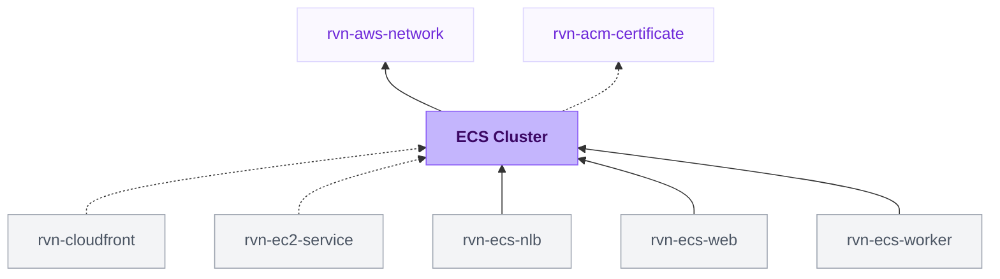

{/* Generated by scripts/sync-module-catalog.mjs from the Ravion module catalog. Do not edit by hand. */}

**Type:** `rvn-ecs-cluster` · **Latest version:** `1.0.1`

## Dependencies and consumers

_Every dependency input can be specified manually to reference existing external infrastructure rather than a Ravion module._

## Readme

Production-ready AWS ECS cluster with Fargate, Fargate Spot, optional EC2 capacity, and shared load balancers.

### Overview

Amazon ECS (Elastic Container Service) runs containerized workloads on AWS. This module creates an ECS cluster inside your selected VPC and configures the capacity providers and shared load balancers that services can use.

The ECS cluster module provides:

- **Fargate and Fargate Spot** capacity providers for serverless containers
- **Optional EC2 capacity** with an Auto Scaling Group and managed ECS capacity provider
- **Public and private Application Load Balancers** for HTTP and HTTPS services
- **Public and private Network Load Balancers** for TCP/UDP and static IP use cases
- **CloudWatch Container Insights** dashboard metrics for production visibility

Terraform source: [ravionhq/modules/compute/ecs_cluster](https://github.com/ravionhq/modules/tree/rvn-ecs-cluster@1.0.1/compute/ecs_cluster)

### Use cases

| Scenario                       | ECS cluster helps by...                                          |
| ------------------------------ | ---------------------------------------------------------------- |
| Running web apps and APIs      | Providing Fargate capacity and shared ALBs for HTTP traffic      |
| Reducing compute cost          | Allowing services to use Fargate Spot or EC2 Spot capacity       |
| Hosting private services       | Creating internal load balancers reachable only inside the VPC   |
| Running TCP/UDP workloads      | Creating Network Load Balancers for non-HTTP protocols           |
| Operating production workloads | Enabling Container Insights metrics for tasks, services, and EC2 |
| Supporting custom runtimes     | Adding EC2 capacity when workloads need host-level control       |

### Capacity providers

#### Fargate

Fargate runs containers without managing EC2 instances. It is the simplest option for most web apps, APIs, workers, and scheduled tasks.

#### Fargate Spot

Fargate Spot uses spare AWS capacity at a lower cost. It is best for interruptible workloads such as queues, batch jobs, background workers, and services that can tolerate replacement tasks.

#### EC2 capacity

EC2 capacity creates an Auto Scaling Group and ECS capacity provider for tasks that need host-level control, custom AMIs, SSH access, special networking, or lower long-running compute costs.

Select an **EC2 instance type** to enable EC2 capacity. Leave it blank for a Fargate-only cluster.

### Load balancers

#### Public application load balancer

Creates an internet-facing Application Load Balancer for services that should receive public HTTP or HTTPS traffic, such as websites, public APIs, and webhook endpoints.

Use the public ALB for:

- Websites and browser apps
- Public APIs
- Webhooks
- HTTP/HTTPS traffic with host or path routing

#### Private application load balancer

Creates an internal Application Load Balancer for services reachable only inside the VPC or private network, such as internal APIs, admin tools, and service-to-service traffic.

Use the private ALB for:

- Internal APIs
- Admin dashboards
- Backend services
- Private HTTP/HTTPS routing

For either ALB, the selected Certificate is the default HTTPS certificate. Use Additional certificate ARNs to attach more ACM certificates to the same listener through SNI.

#### Network load balancers

Use Network Load Balancers for TCP/UDP workloads, static IP requirements, very high-throughput connections, or protocols that do not need HTTP routing. For normal web apps and HTTP APIs, prefer an Application Load Balancer.

### Observability

Container Insights collects ECS cluster, service, and task CPU, memory, network, and storage metrics in CloudWatch. The module dashboard includes:

- CPU and memory used
- Running task and service counts
- Network received and sent
- Storage read and write
- EC2 container instance count
- EC2 instance CPU, memory, running task, and reserved capacity metrics

Metrics appear only after tasks are running in the cluster. EC2-specific charts appear only when EC2 capacity exists and the required Container Insights instance metrics are available.

### Configuration

| Field                 | Required | Default              | Description                                                   |
| --------------------- | -------- | -------------------- | ------------------------------------------------------------- |
| VPC network           | Yes      | —                    | Existing VPC, subnets, AWS account, and region                |
| Name slug             | Yes      | `{project}-{env}`    | Name prefix for ECS and load balancer resources               |
| Container insights    | No       | `enhanced`           | Collect enhanced task, service, cluster, and EC2 metrics in CloudWatch |
| Fargate               | No       | `true`               | Allow services to use Fargate capacity                        |
| Fargate Spot          | No       | `true`               | Allow services to use lower-cost interruptible Fargate Spot   |
| EC2 instance type     | No       | —                    | Enables EC2 capacity when selected                            |
| Public load balancer  | No       | `true`               | Create an internet-facing ALB                                 |
| Private load balancer | No       | `false`              | Create an internal ALB                                        |
| Public NLB            | No       | `false`              | Create an internet-facing Network Load Balancer               |
| Private NLB           | No       | `false`              | Create an internal Network Load Balancer                      |
| Tags                  | No       | Environment, Project | Custom tags applied to all resources                          |

### EC2 capacity settings

| Field                           | Description                                             |
| ------------------------------- | ------------------------------------------------------- |
| Minimum instances               | Keep enough EC2 capacity for all ECS services; start around 2x the total desired task instances |
| Maximum instances               | Must fit 2x the total max task instances across all ECS services, or deployments can fail       |
| Root volume size                | Root EBS volume size for ECS instances                  |
| Additional security groups      | Extra security groups attached to ECS instances         |
| Spot instances                  | Use Spot instances in the EC2 Auto Scaling Group        |
| Spot instance types             | Additional instance types for mixed Spot capacity       |
| Custom AMI ID                   | Custom ECS AMI; blank uses the latest ECS-optimized AMI |
| Key pair name                   | EC2 key pair for SSH access                             |
| Managed scaling                 | Let ECS scale the Auto Scaling Group to match task demand |
| Managed scaling target capacity | Spare capacity target for ECS managed scaling           |

### Design decisions

This ECS cluster follows AWS ECS production patterns:

- **Fargate-first defaults:** Fargate and Fargate Spot are enabled so services can start without managing instances
- **EC2 opt-in:** EC2 capacity is created only when an instance type is selected
- **Shared load balancers:** Cluster-level ALBs and NLBs can be reused by services in the environment
- **Private subnet placement:** ECS tasks and EC2 capacity use private subnets from the selected VPC
- **Public ingress by default:** Public ALBs use Terraform's default internet ingress unless overridden in Terraform
- **Private ingress by default:** Private ALBs use Terraform's default RFC1918 private CIDR ranges and no IPv6 ingress unless overridden
- **Enhanced Container Insights:** Enhanced production metrics are collected by default for operational visibility

### Learn more

**Amazon ECS**

- [Amazon ECS Developer Guide](https://docs.aws.amazon.com/AmazonECS/latest/developerguide/) — Official documentation
- [Fargate capacity providers](https://docs.aws.amazon.com/AmazonECS/latest/developerguide/fargate-capacity-providers.html) — Fargate and Fargate Spot behavior
- [Amazon ECS capacity providers](https://docs.aws.amazon.com/AmazonECS/latest/developerguide/cluster-capacity-providers.html) — Capacity provider strategy and EC2 integration

**Load balancing and observability**

- [Application Load Balancers](https://docs.aws.amazon.com/elasticloadbalancing/latest/application/introduction.html) — HTTP/HTTPS load balancing
- [Network Load Balancers](https://docs.aws.amazon.com/elasticloadbalancing/latest/network/introduction.html) — TCP/UDP and static IP load balancing
- [ECS Container Insights](https://docs.aws.amazon.com/AmazonECS/latest/developerguide/cloudwatch-container-insights.html) — CloudWatch metrics and dashboards

## Inputs reference

All inputs for `rvn-ecs-cluster` version `1.0.1`. Use the `name` shown for each field as the input key in module config.

<ResponseField name="network" type="$ref:rvn-aws-network" required>
  **VPC network.**

  - Immutable after creation
</ResponseField>

### ECS cluster config

<ResponseField name="name" type="string" required>
  **Name slug.** Name prefix for all resources. Terraform requires 1-28 characters so generated ALB names fit AWS limits.

  - Default: `<<project.given_id>>-<<environment.given_id>>`
  - Immutable after creation
  - Pattern: `^[a-z0-9]([a-z0-9-]{0,26}[a-z0-9])?$` — The name must be 1-28 characters, contain only lowercase letters, numbers, and hyphens, and start and end with a letter or number.
</ResponseField>

<ResponseField name="load_balancer_deletion_protection_enabled" type="boolean">
  **Load balancer deletion protection.** Prevent accidental deletion of load balancers created by this module.

  - Default: `true`
</ResponseField>

<ResponseField name="container_insights" type="string">
  **Container insights.** Configures CloudWatch Container Insights for the ECS cluster. Enhanced observability adds detailed task and container metrics and may increase CloudWatch costs.

  - Default: `enhanced`
  - Allowed values: `enhanced` (Enhanced observability), `enabled` (Standard), `disabled` (Disabled)
</ResponseField>

### Capacity providers

<ResponseField name="fargate_enabled" type="boolean">
  **Fargate.** Allows ECS services in this cluster to use Fargate for serverless task capacity.

  - Default: `true`
</ResponseField>

<ResponseField name="fargate_spot_enabled" type="boolean">
  **Fargate spot.** Allows ECS services in this cluster to use Fargate Spot for lower-cost, interruptible serverless task capacity.

  - Default: `true`
</ResponseField>

<ResponseField name="ec2_instance_type" type="string">
  **EC2 instance type.** Enables the EC2 capacity provider when set. Leave blank to use only Fargate/Fargate Spot.
</ResponseField>

### EC2 capacity

<ResponseField name="ec2_min_size" type="number">
  **Min instances.** Minimum EC2 instances in the Auto Scaling Group. To speed up deployments and autoscaling, set this high enough to keep spare capacity for all ECS services using this cluster. As a starting point, use about 2x the total desired task instances across those services.

  - Min: `0`
  - Shown when: `{"ec2_instance_type":{"not":""}}`
</ResponseField>

<ResponseField name="ec2_max_size" type="number">
  **Max instances.** Maximum EC2 instances in the Auto Scaling Group. Must be high enough to accommodate 2x the total max task instances across all ECS services using this cluster, otherwise deployments can fail.

  - Min: `1`
  - Shown when: `{"ec2_instance_type":{"not":""}}`
</ResponseField>

### EC2 volume

<ResponseField name="ec2_root_volume_size" type="number">
  **Root volume size (GB).** Root EBS volume size for EC2 capacity instances.

  - Min: `8`
  - Max: `16384`
  - Shown when: `{"ec2_instance_type":{"not":""}}`
</ResponseField>

<ResponseField name="ec2_security_group_ids" type="string_array">
  **Additional security groups.** Additional security groups attached to EC2 capacity instances.

  - Shown when: `{"ec2_instance_type":{"not":""}}`
</ResponseField>

<ResponseField name="ec2_spot_enabled" type="boolean">
  **Spot instances.** Use Spot instances in the EC2 Auto Scaling Group.

  - Default: `false`
  - Shown when: `{"ec2_instance_type":{"not":""}}`
</ResponseField>

<ResponseField name="ec2_spot_instance_types" type="string_array">
  **Spot instance types.** Additional instance types for Spot capacity.

  - Shown when: `{"ec2_instance_type":{"not":""},"ec2_spot_enabled":true}`
</ResponseField>

<ResponseField name="ec2_ami_id" type="string">
  **Custom AMI ID.** Custom AMI for EC2 capacity. Leave blank to use the latest ECS-optimized AMI.

  - Shown when: `{"ec2_instance_type":{"not":""}}`
</ResponseField>

<ResponseField name="ec2_key_name" type="string">
  **SSH key pair name.** Key pair for SSH access to EC2 capacity instances.

  - Shown when: `{"ec2_instance_type":{"not":""}}`
</ResponseField>

<ResponseField name="ec2_root_volume_type" type="string">
  **Root volume type.** Root EBS volume type.

  - Allowed values: `gp3`, `gp2`, `io1`, `io2`
  - Shown when: `{"ec2_instance_type":{"not":""}}`
</ResponseField>

<ResponseField name="ec2_user_data" type="text">
  **Additional user data.** Additional user data script appended after ECS config.

  - Shown when: `{"ec2_instance_type":{"not":""}}`
</ResponseField>

<ResponseField name="ec2_managed_termination_protection_enabled" type="boolean">
  **Managed termination protection.** Managed termination protection for EC2 capacity.

  - Default: `true`
  - Shown when: `{"ec2_instance_type":{"not":""}}`
</ResponseField>

<ResponseField name="ec2_managed_scaling_enabled" type="boolean">
  **Managed scaling.** Lets ECS automatically scale the EC2 Auto Scaling Group to match task demand. Disable to manage the instance count yourself.

  - Default: `true`
  - Shown when: `{"ec2_instance_type":{"not":""}}`
</ResponseField>

<ResponseField name="ec2_managed_scaling_target_capacity" type="number">
  **Managed scaling target capacity (%).** Defaults to 100% which means ECS autoscales EC2 instances to have zero extra capacity (cheapest). Reduce to something like 80-90% if you want to pay for spare capacity for faster autoscaling.

  - Min: `1`
  - Max: `100`
  - Shown when: `{"ec2_instance_type":{"not":""},"ec2_managed_scaling_enabled":true}`
</ResponseField>

### Public application load balancer

<ResponseField name="public_alb_enabled" type="boolean">
  **Public load balancer.**

  - Default: `true`
</ResponseField>

<ResponseField name="public_alb_https_enabled" type="boolean">
  **HTTPS.** Enable HTTPS listener on the public ALB.

  - Default: `true`
  - Shown when: `{"public_alb_enabled":true}`
</ResponseField>

<ResponseField name="public_alb_certificate" type="$ref:rvn-acm-certificate" required>
  **Certificate.** Primary ACM certificate module for public ALB HTTPS.

  - Shown when: `{"public_alb_enabled":true,"public_alb_https_enabled":true}`
</ResponseField>

<ResponseField name="public_alb_additional_certificate_arns" type="string_array">
  **Additional certificate ARNs.** Additional ACM certificate ARNs attached to the public ALB HTTPS listener for SNI.

  - Default: `[]`
  - Shown when: `{"public_alb_enabled":true,"public_alb_https_enabled":true}`
</ResponseField>

<ResponseField name="public_alb_ssl_policy" type="string">
  **SSL policy.** SSL policy for public ALB HTTPS.

  - Shown when: `{"public_alb_enabled":true,"public_alb_https_enabled":true}`
</ResponseField>

<ResponseField name="public_alb_idle_timeout" type="number">
  **Idle timeout (seconds).** Idle timeout for the public ALB.

  - Min: `1`
  - Max: `4000`
  - Shown when: `{"public_alb_enabled":true}`
</ResponseField>

<ResponseField name="public_alb_web_acl_arn" type="string">
  **WAF web ACL ARN.** WAFv2 Web ACL ARN for the public ALB.

  - Shown when: `{"public_alb_enabled":true}`
</ResponseField>

<ResponseField name="public_alb_access_logs_enabled" type="boolean">
  **Access logs.** Enable public ALB access logging.

  - Default: `false`
  - Shown when: `{"public_alb_enabled":true}`
</ResponseField>

<ResponseField name="public_alb_access_logs_bucket_arn" type="string">
  **Access logs bucket ARN.** Existing S3 bucket ARN for public ALB access logs.

  - Shown when: `{"public_alb_access_logs_enabled":true,"public_alb_enabled":true}`
</ResponseField>

### Private application load balancer

<ResponseField name="private_alb_enabled" type="boolean">
  **Private load balancer.**

  - Default: `false`
</ResponseField>

<ResponseField name="private_alb_https_enabled" type="boolean">
  **HTTPS.** Enable HTTPS listener on the private ALB.

  - Default: `false`
  - Shown when: `{"private_alb_enabled":true}`
</ResponseField>

<ResponseField name="private_alb_certificate" type="$ref:rvn-acm-certificate" required>
  **Certificate.** Primary ACM certificate module for private ALB HTTPS.

  - Shown when: `{"private_alb_enabled":true,"private_alb_https_enabled":true}`
</ResponseField>

<ResponseField name="private_alb_additional_certificate_arns" type="string_array">
  **Additional certificate ARNs.** Additional ACM certificate ARNs attached to the private ALB HTTPS listener for SNI.

  - Default: `[]`
  - Shown when: `{"private_alb_enabled":true,"private_alb_https_enabled":true}`
</ResponseField>

<ResponseField name="private_alb_ssl_policy" type="string">
  **SSL policy.** SSL policy for private ALB HTTPS.

  - Shown when: `{"private_alb_enabled":true,"private_alb_https_enabled":true}`
</ResponseField>

<ResponseField name="private_alb_ingress_cidr_blocks" type="string_array">
  **Ingress CIDRs.** Allowed IPv4 CIDRs for private ALB access. Terraform defaults to RFC1918 private ranges.

  - Shown when: `{"private_alb_enabled":true}`
</ResponseField>

<ResponseField name="private_alb_ingress_ipv6_cidr_blocks" type="string_array">
  **Ingress IPv6 CIDRs.** Allowed IPv6 CIDRs for private ALB access. Defaults to no IPv6 ingress.

  - Shown when: `{"private_alb_enabled":true}`
</ResponseField>

<ResponseField name="private_alb_ingress_security_group_ids" type="string_array">
  **Ingress security groups.** Security groups whose members can access the private ALB. Useful for sources without static CIDRs, such as CloudFront VPC origins.

  - Shown when: `{"private_alb_enabled":true}`
</ResponseField>

<ResponseField name="private_alb_idle_timeout" type="number">
  **Idle timeout (seconds).** Idle timeout for the private ALB.

  - Min: `1`
  - Max: `4000`
  - Shown when: `{"private_alb_enabled":true}`
</ResponseField>

<ResponseField name="private_alb_access_logs_enabled" type="boolean">
  **Access logs.** Enable private ALB access logging.

  - Default: `false`
  - Shown when: `{"private_alb_enabled":true}`
</ResponseField>

<ResponseField name="private_alb_access_logs_bucket_arn" type="string">
  **Access logs bucket ARN.** Existing S3 bucket ARN for private ALB access logs.

  - Shown when: `{"private_alb_access_logs_enabled":true,"private_alb_enabled":true}`
</ResponseField>

### Network load balancers

<ResponseField name="public_nlb_enabled" type="boolean">
  **Public NLB.** Create an internet-facing Network Load Balancer.

  - Default: `false`
</ResponseField>

<ResponseField name="public_nlb_security_group_ids" type="string_array">
  **Security groups.** Security groups for the public NLB.

  - Shown when: `{"public_nlb_enabled":true}`
</ResponseField>

<ResponseField name="public_nlb_cross_zone_load_balancing_enabled" type="boolean">
  **Cross-zone load balancing.** Enable cross-zone load balancing for the public NLB.

  - Default: `false`
  - Shown when: `{"public_nlb_enabled":true}`
</ResponseField>

<ResponseField name="public_nlb_elastic_ips_enabled" type="boolean">
  **Use elastic IPs.** Assign static Elastic IPs to the public NLB.

  - Default: `false`
  - Shown when: `{"public_nlb_enabled":true}`
</ResponseField>

<ResponseField name="public_nlb_elastic_ip_allocation_ids" type="string_array">
  **Elastic IP allocation IDs.** Elastic IP allocation IDs for the public NLB, one per subnet.

  - Shown when: `{"public_nlb_elastic_ips_enabled":true,"public_nlb_enabled":true}`
</ResponseField>

<ResponseField name="public_nlb_access_logs_enabled" type="boolean">
  **Access logs.** Enable public NLB access logging.

  - Default: `false`
  - Shown when: `{"public_nlb_enabled":true}`
</ResponseField>

<ResponseField name="public_nlb_access_logs_bucket_arn" type="string">
  **Access logs bucket ARN.** Existing S3 bucket ARN for public NLB access logs.

  - Shown when: `{"public_nlb_access_logs_enabled":true,"public_nlb_enabled":true}`
</ResponseField>

<ResponseField name="private_nlb_enabled" type="boolean">
  **Private NLB.** Create an internal Network Load Balancer.

  - Default: `false`
</ResponseField>

<ResponseField name="private_nlb_security_group_ids" type="string_array">
  **Security groups.** Security groups for the private NLB.

  - Shown when: `{"private_nlb_enabled":true}`
</ResponseField>

<ResponseField name="private_nlb_cross_zone_load_balancing_enabled" type="boolean">
  **Cross-zone load balancing.** Enable cross-zone load balancing for the private NLB.

  - Default: `false`
  - Shown when: `{"private_nlb_enabled":true}`
</ResponseField>

<ResponseField name="private_nlb_elastic_ips_enabled" type="boolean">
  **Use elastic IPs.** Assign static Elastic IPs to the private NLB.

  - Default: `false`
  - Shown when: `{"private_nlb_enabled":true}`
</ResponseField>

<ResponseField name="private_nlb_elastic_ip_allocation_ids" type="string_array">
  **Elastic IP allocation IDs.** Elastic IP allocation IDs for the private NLB, one per subnet.

  - Shown when: `{"private_nlb_elastic_ips_enabled":true,"private_nlb_enabled":true}`
</ResponseField>

<ResponseField name="private_nlb_access_logs_enabled" type="boolean">
  **Access logs.** Enable private NLB access logging.

  - Default: `false`
  - Shown when: `{"private_nlb_enabled":true}`
</ResponseField>

<ResponseField name="private_nlb_access_logs_bucket_arn" type="string">
  **Access logs bucket ARN.** Existing S3 bucket ARN for private NLB access logs.

  - Shown when: `{"private_nlb_access_logs_enabled":true,"private_nlb_enabled":true}`
</ResponseField>

### Misc

<ResponseField name="tags" type="keyvalue">
  **Tags.** A map of tags to assign to all resources. Default tags are `Owner`, `ProjectGivenId`, `EnvironmentGivenId`, `ModuleGivenId`, `ModuleId`
</ResponseField>

### Terraform settings

<ResponseField name="opentofu_version" type="string">
  **OpenTofu version override.** Override the environment's default version for this module
</ResponseField>

<ResponseField name="ravion_state_backend_workspace" type="string">
  **Ravion Terraform workspace name.** Override Terraform state backend workspace name. Defaults to project + environment + module given ids.

  - Immutable after creation
</ResponseField>

<ResponseField name="advanced_terraform_variables" type="object">
  **Advanced Terraform variables.** Optional raw Terraform variable overrides for advanced module inputs or one-off overrides. Values here override the generated variables above.

  - Default: `{}`
</ResponseField>
