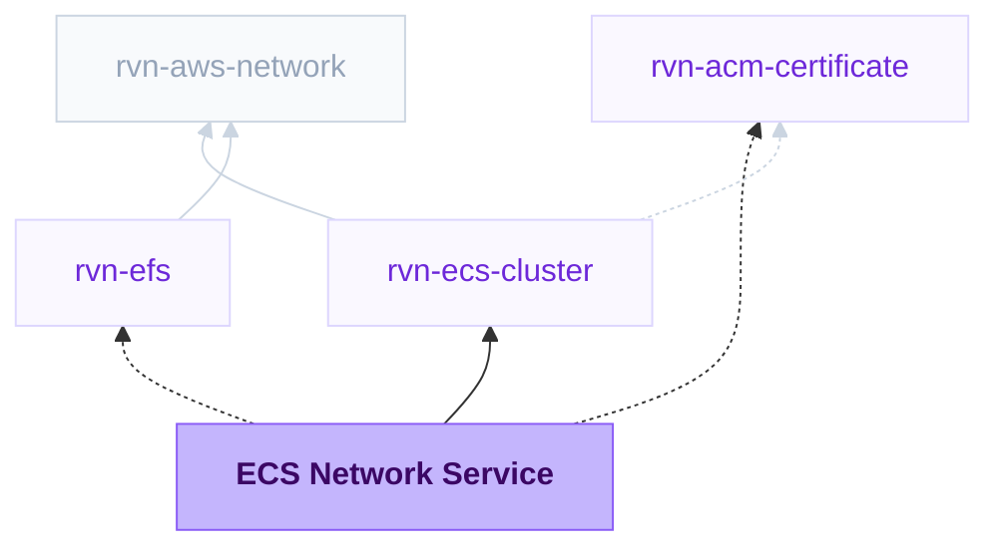

{/* Generated by scripts/sync-module-catalog.mjs from the Ravion module catalog. Do not edit by hand. */}

**Type:** `rvn-ecs-nlb` · **Latest version:** `1.0.1`

## Dependencies and consumers

_Every dependency input can be specified manually to reference existing external infrastructure rather than a Ravion module._

## Readme

Network Load Balanced ECS service for running TCP, UDP, or TLS workloads behind an ECS cluster Network Load Balancer.

### Overview

The ECS Network Service module creates an ECS service in an existing Ravion ECS cluster and attaches it to a public or private Network Load Balancer. Select an ECS cluster, choose how the container image is built or supplied, configure one or more NLB listeners and shared target group health checks, and Ravion provisions the service, target groups, listeners, IAM roles, security group, ECR repository when needed, and autoscaling settings.

The module is intentionally focused on Layer 4 services behind a Network Load Balancer. Use ECS Web Service for HTTP host and path routing through an Application Load Balancer.

Terraform source: [ravionhq/modules/compute/ecs_service](https://github.com/ravionhq/modules/tree/rvn-ecs-nlb@1.0.1/compute/ecs_service)

### Use cases

| Scenario                         | ECS Network Service helps by...                                  |
| -------------------------------- | --------------------------------------------------------------- |
| Exposing a public TCP service    | Creating a listener on the public cluster Network Load Balancer |
| Hosting an internal protocol     | Routing traffic through the private cluster Network Load Balancer |
| Serving UDP workloads            | Registering UDP container ports and target groups               |
| Terminating TLS at the NLB       | Creating a TLS listener with an ACM certificate                 |
| Passing TLS through to the task  | Using TLS target protocol for encrypted backend traffic         |
| Serving multiple network ports   | Attaching several listeners and container ports to one ECS service |
| Deploying existing containers    | Pulling an image from a public or private registry              |
| Tuning production capacity       | Combining Fargate, Fargate Spot, or EC2 with autoscaling        |
| Running release tasks            | Running pre-deploy or post-deploy ECS tasks with the app image  |

### Cluster and networking

An ECS cluster is required. The cluster reference supplies the cluster ARN, VPC ID, public and private subnet IDs, Network Load Balancer ARNs, NLB security groups, capacity provider names, AWS account, region, and execution environment.

Use Public network service when the service should be reachable through the public Network Load Balancer. Turn it off for internal services that should use the private Network Load Balancer.

Use Run in private subnets for most production services. Private subnets keep tasks off the public internet and route outbound traffic through NAT or equivalent egress. Turning it off runs tasks in public subnets and assigns public IPs.

NLB ingress CIDRs controls which IPv4 CIDR blocks can reach every public listener. It defaults to `0.0.0.0/0`. Private NLB ingress CIDRs applies when Public network service is off and defaults to the RFC 1918 private ranges: `10.0.0.0/8`, `172.16.0.0/12`, and `192.168.0.0/16`.

### Build and image options

| Build source                 | When to use it                                                   |
| ---------------------------- | ---------------------------------------------------------------- |
| Railpack                     | Let Ravion detect the app stack and build an image from source with Railpack |
| Dockerfile                   | Build from a Dockerfile in the selected repository               |
| Pull from image registry     | Deploy an existing image from Docker Hub, GHCR, ECR, or registry |

For Railpack and Dockerfile builds, provide Git repository, Git branch, and optionally Source base path. Ravion pushes built images to the service ECR repository and deploys by image digest.

Railpack settings let you optionally pin the Railpack version and override install, build, and start commands. Leave them blank to use Railpack defaults and autodetection.

For Pull from image registry, provide the image repository without the tag. At deploy time, provide the tag to use. Use Registry credentials secret ARN for private registries that require ECS repository credentials. Use Start command to override the image default CMD when the image needs a different service command.

### Listeners and target groups

The service requires at least one listener. Each listener creates an NLB listener, a target group, an ECS load balancer attachment, and the required security group ingress. Configure Listener port for the port clients connect to and Container port for the port the app listens on inside the ECS task.

Listener ports and container ports must be unique, and an ECS service supports at most five listeners. Ravion sets the `PORT` runtime environment variable from the first listener's Container port.

| Listener protocol | Use it for                                      | Target behavior                                      |
| ----------------- | ----------------------------------------------- | ---------------------------------------------------- |
| TCP               | Plain TCP protocols and TLS passthrough by app  | Sends TCP traffic to the container port              |
| UDP               | UDP protocols                                   | Sends UDP traffic to the container port              |
| TLS               | TLS termination or re-encryption at Layer 4     | Uses TLS certificate settings and TLS target protocol |

Each TLS listener requires its own ACM certificate module reference. TLS SSL policy defaults to `ELBSecurityPolicy-TLS13-1-2-2021-06`. TLS ALPN policy is optional; leave it as None unless clients need a specific ALPN behavior. TLS target protocol controls traffic from the NLB to the ECS task: use TCP when the NLB terminates TLS, or TLS when the task should receive encrypted backend traffic.

Source IP stickiness is off by default. Enable it when repeat traffic from the same source IP should stay on the same task when possible.

### Health checks

Health checks default to TCP, which is the safest default for generic Layer 4 workloads. Use HTTP or HTTPS only when the container exposes an HTTP-compatible health endpoint.

| Field                            | Default | Description                                                    |
| -------------------------------- | ------- | -------------------------------------------------------------- |
| Health check protocol            | TCP     | Protocol the target group uses for health checks               |
| Health check path                | /       | HTTP path checked when protocol is HTTP or HTTPS               |
| Success codes                    | 200-399 | HTTP status codes treated as healthy                           |
| Interval (secs)                  | 30      | Seconds between checks                                         |
| Timeout (secs)                   | 10      | Seconds to wait for a response                                 |
| Healthy threshold                | 3       | Successful checks needed to mark a target healthy              |
| Unhealthy threshold              | 3       | Failed checks needed to mark a target unhealthy                |
| Health check grace period (secs) | 0       | Startup window where ECS ignores load balancer health failures |
| Deregistration delay (secs)      | 300     | Seconds to drain in-flight traffic before deregistration       |

Increase the grace period for services with slow startup. Lower the deregistration delay only when fast replacement is more important than giving existing connections time to drain.

### Capacity and runtime

Choose one primary Capacity provider:

| Capacity provider | Best for                                                       |
| ----------------- | -------------------------------------------------------------- |
| Fargate           | Simple serverless containers and predictable network services  |
| Fargate spot      | Lower-cost services that can tolerate task interruption        |
| EC2               | Workloads that need cluster EC2 capacity or host-level control |

You can add secondary providers with Also use Fargate, Also use Fargate spot, and Also use EC2. Mixed strategies can reduce cost or increase placement flexibility, but each enabled provider must exist on the selected cluster.

For Fargate and Fargate Spot, App size defaults to 2 vCPU and 4 GB memory. App ephemeral storage uses the AWS default of 20 GiB unless you increase it to 21-200 GiB. For EC2 capacity, App vCPU defaults to 1.5 and App memory in GB defaults to 3.5; leave spare CPU and memory on each EC2 instance for the ECS agent and system processes.

CPU architecture defaults to x86_64 for broad compatibility. Choose ARM64 only when the image and native dependencies support it.

### Autoscaling

Autoscaling is enabled by default with one minimum task and three maximum tasks. For production, start with at least two minimum tasks when availability matters. When autoscaling is disabled, Desired tasks controls how many tasks the ECS service keeps running.

| Field                     | Default | Description                                   |
| ------------------------- | ------- | --------------------------------------------- |
| Autoscaling               | true    | Enables ECS service target tracking           |
| Minimum tasks             | 1       | Lower bound for running tasks                 |
| Maximum tasks             | 3       | Upper bound for running tasks                 |
| Desired tasks             | 1       | Running tasks when autoscaling is disabled    |
| CPU target (%)            | 70      | Average CPU utilization target                |
| Memory target (%)         | 80      | Average memory utilization target             |
| Scale-in cooldown (secs)  | 300     | Delay before another scale-in action          |
| Scale-out cooldown (secs) | 300     | Delay before another scale-out action         |
| Scale in                  | true    | Allows autoscaling to reduce task count       |

Scheduled scaling actions and custom metric scaling policies are available for advanced capacity patterns.

### Application configuration

Use Runtime environment variables for plain container environment values. Ravion also sets PORT from the first listener's Container port.

Use Runtime secrets for sensitive values. Secrets are injected into the ECS task from SSM Parameter Store or Secrets Manager using name and value_from objects.

Use Build environment variables for values needed during image builds. Values can be plain strings or references loaded from Parameter Store or Secrets Manager. For Dockerfile builds, enable Inject environment variables in Dockerfile to pass those values as Docker build arguments.

### Persistent storage

Enable the EFS file system setting, select a Ravion EFS module, and set the EFS mount path. Ravion adds the task volume, mounts it into the app container, attaches the file system's client security group to the service so NFS traffic is allowed, and mounts through the file system's access point when one is enabled. Sidecars mount the same file system through their Mount points setting with `efs` as the source volume.

EFS volumes work with Fargate and EC2 Linux tasks and keep data across task replacement. Transit encryption is enabled by default. Enable EFS IAM authorization to authorize file system access with the task role; the task role must allow elasticfilesystem:ClientMount, plus elasticfilesystem:ClientWrite or elasticfilesystem:ClientRootAccess as needed.

### Deployment

ECS Network Service uses rolling deployments. ECS replaces tasks in place while every listener continues routing through its target group. Blue/green, Linear, and Canary are not available because native ECS traffic shifting accepts one production listener and cannot shift several NLB listeners together.

Deployments update the ECS service task definition with the selected image, generated container definition, awslogs or FireLens configuration, runtime platform, environment variables, secrets, and capacity-provider-compatible task settings.

The deploy-time Image value depends on the build source:

| Build source                 | Deploy image value                                |
| ---------------------------- | ------------------------------------------------- |
| Railpack or Dockerfile       | Image digest such as sha256:...                   |
| Pull from image registry     | Tag for the configured repository, such as latest |

Run pre-deploy command and Run post-deploy command start optional one-off ECS tasks before or after each deployment. These commands use the deployed app image, the app container name, the configured task role and execution role, the selected capacity provider strategy, service subnets, service security groups, runtime environment variables, and runtime secrets. Leave either toggle disabled to skip that hook and hide its settings.

Use pre-deploy commands for work that must complete before the service updates, such as database migrations. Use post-deploy commands for work that should happen after a successful deployment, such as cache warming. Commands are ECS command argument arrays. For shell behavior, use `/bin/sh`, `-lc`, and your shell command as separate arguments.

### Logging and observability

CloudWatch logging is enabled by default and appears in the Logs tab. Enable FireLens log routing when app logs should also go to destinations such as Datadog, Splunk, Firehose, OpenSearch, or S3. Keep CloudWatch output enabled unless logs should go exclusively to an external destination.

The Metrics tab includes common ECS service metrics plus Network Load Balancer target group health metrics for the first listener. Additional listener target groups are available through the stack outputs for external dashboards and alarms.

### Configuration

| Field                            | Required | Default                  | Description                                      |
| -------------------------------- | -------- | ------------------------ | ------------------------------------------------ |
| ECS cluster                      | Yes      | -                        | Existing rvn-ecs-cluster module instance         |
| Service name                     | Yes      | \{project\}-\{env\}-\{module\} | Name for the ECS service and related resources   |
| Public network service           | No       | true                     | Use the public NLB; turn off for the private NLB |
| Run in private subnets           | No       | true                     | Run tasks in private subnets without public IPs  |
| Build source                     | Yes      | dockerfile               | Dockerfile, Railpack, or Pull from image registry |
| Git repository                   | Yes*     | -                        | Required for Railpack and Dockerfile builds      |
| Git branch                       | Yes*     | -                        | Required for Railpack and Dockerfile builds      |
| Source base path                 | No       | .                        | Path from repository root to source code         |
| Image repository                 | Yes*     | -                        | Required for image registry deployments          |
| Start command                    | No       | []                       | Command arguments overriding image CMD           |
| Listeners                        | Yes      | TCP 80 to 3000           | One or more NLB listener and container port mappings |
| Listener port                    | Yes      | 80                       | Unique NLB port for each listener                |
| Listener protocol                | Yes      | TCP                      | TCP, TLS, or UDP for each listener               |
| Container port                   | Yes      | 3000                     | Container port targeted by each listener         |
| TLS certificate                  | Yes*     | -                        | Required for each TLS listener                   |
| TLS SSL policy                   | No       | ELBSecurityPolicy-TLS13-1-2-2021-06 | SSL policy for each TLS listener        |
| TLS ALPN policy                  | No       | None                     | Optional ALPN behavior for each TLS listener     |
| TLS target protocol              | Yes*     | TCP                      | Backend protocol for each TLS listener           |
| NLB ingress CIDRs                | No       | 0.0.0.0/0                | CIDRs allowed to reach the public NLB listener   |
| Private NLB ingress CIDRs        | No       | RFC 1918 ranges          | CIDRs allowed to reach the private NLB listener  |
| Health check protocol            | Yes      | TCP                      | TCP, HTTP, or HTTPS target group health checks   |
| Health check path                | Yes*     | /                        | Required for HTTP and HTTPS health checks        |
| Source IP stickiness             | No       | false                    | Keep source IPs on the same task when possible   |
| Capacity provider                | Yes      | fargate                  | Primary service capacity provider                |
| App size                         | No       | 2 vCPU, 4 GB             | Fargate task CPU and memory                      |
| App ephemeral storage (GiB)      | No       | 20                       | Fargate task ephemeral storage                   |
| App vCPU                         | Yes*     | 1.5                      | Required for EC2 capacity                        |
| App memory in GB                 | Yes*     | 3.5                      | Required for EC2 capacity                        |
| CPU architecture                 | No       | X86_64                   | x86_64 compatibility or ARM64 cost optimization  |
| ECS exec                         | No       | false                    | Enable ECS Exec for debugging containers         |
| Autoscaling                      | No       | true                     | Enable CPU and optional memory target tracking   |
| Desired tasks                    | Yes*     | 1                        | Number of tasks when autoscaling is disabled     |
| FireLens log routing             | No       | false                    | Route app logs through a Fluent Bit sidecar      |
| Run pre-deploy command           | No       | false                    | Enable a task before each deployment             |
| Run post-deploy command          | No       | false                    | Enable a task after each successful deployment   |
| Additional security groups       | No       | []                       | Extra security groups attached to ECS tasks      |
| Allowed CIDR blocks              | No       | []                       | Direct service access in addition to load balancer traffic |
| Sidecars                         | No       | []                       | Additional containers in the ECS task            |
| EFS file system                  | No       | false                    | Mount an EFS file system into the app container |
| EFS mount path                   | Yes*     | /mnt/efs                 | App container path for the referenced file system |
| Tags                             | No       | Standard Ravion tags     | Additional tags applied to resources             |
| Advanced Terraform variables     | No       | \{\}                       | Raw lower-level overrides for exceptional cases  |
| OpenTofu version override        | No       | Ravion default           | Override the OpenTofu version for the stack      |
| Ravion Terraform workspace name  | No       | \{project\}-\{env\}-\{module\} | Override the state backend workspace name        |

*Conditionally required based on each listener protocol, health check protocol, build type, autoscaling mode, or capacity provider.

### Design decisions

- The module always models a Layer 4 service behind a Network Load Balancer. HTTP host and path routing are intentionally outside this module definition.
- Listeners are created by the service stack on one selected public or private cluster NLB, so each ECS Network Service owns all of its listener ports.
- Deployments are rolling-only because native ECS traffic shifting cannot shift multiple NLB listeners as one deployment.
- The first listener supplies the `PORT` environment variable and the target group shown in the built-in healthy and unhealthy host metrics.
- Tasks default to private subnets even for public network services. The NLB is public; the tasks remain private when the VPC has NAT or equivalent egress.
- Health checks default to TCP because the module supports non-HTTP protocols.
- Built images are pushed to an ECR repository created with the service stack. Pull from image registry lets teams bring their own image pipeline.
- Desired count uses the autoscaling minimum when autoscaling is enabled and the Desired tasks input when autoscaling is disabled.
- Advanced Terraform variables exist for exceptional lower-level overrides. Prefer the typed Ravion fields whenever possible.

### Learn more

- [Amazon ECS services](https://docs.aws.amazon.com/AmazonECS/latest/developerguide/ecs_services.html)
- [Network Load Balancers](https://docs.aws.amazon.com/elasticloadbalancing/latest/network/introduction.html)
- [Network Load Balancer listeners](https://docs.aws.amazon.com/elasticloadbalancing/latest/network/load-balancer-listeners.html)
- [Target group health checks](https://docs.aws.amazon.com/elasticloadbalancing/latest/network/target-group-health-checks.html)
- [Amazon ECS capacity providers](https://docs.aws.amazon.com/AmazonECS/latest/developerguide/cluster-capacity-providers.html)
- [Amazon ECS service auto scaling](https://docs.aws.amazon.com/AmazonECS/latest/developerguide/service-auto-scaling.html)
- [Railpack documentation](https://railpack.com/)

## Inputs reference

All inputs for `rvn-ecs-nlb` version `1.0.1`. Use the `name` shown for each field as the input key in module config.

### ECS cluster

<ResponseField name="cluster" type="$ref:rvn-ecs-cluster" required>
  **ECS cluster.**

  - Immutable after creation
</ResponseField>

### Network service

<ResponseField name="name" type="string" required>
  **Service name.** Name for the ECS service and related resources.

  - Default: `<<project.given_id>>-<<environment.given_id>>-<<module.given_id>>`
  - Immutable after creation
  - Pattern: `^[A-Za-z0-9][A-Za-z0-9_-]{0,254}$` — Use 1-255 letters, numbers, underscores, or hyphens, starting with a letter or number.
</ResponseField>

<ResponseField name="public_nlb_service_enabled" type="boolean">
  **Public network service.** Expose this service through the public NLB. Turn off to use the private NLB.

  - Default: `true`
</ResponseField>

<ResponseField name="private_subnet_placement_enabled" type="boolean">
  **Run in private subnets.** Recommended. Requires a NAT gateway or equivalent for internet access and keeps tasks off public subnets.

  - Default: `true`
</ResponseField>

### Build config

<ResponseField name="build_source" type="string" required>
  **Build source.**

  - Default: `dockerfile`
  - Allowed values: `dockerfile` (Dockerfile), `railpack` (Railpack), `image_registry` (Pull from image registry)
</ResponseField>

<ResponseField name="source_repo" type="gitrepo" required>
  **Git repository.** Repository containing the application source for Dockerfile or Railpack builds.

  - Shown when: `{"build_source":["dockerfile","railpack"]}`
</ResponseField>

<ResponseField name="source_base_path" type="string">
  **Source base path.** Repository-relative source and build root.

  - Default: `.`
  - Shown when: `{"build_source":["dockerfile","railpack"]}`
</ResponseField>

<ResponseField name="image_repository" type="string" required>
  **Image repository.** Image repository without a tag or digest, such as `nginx`, `ghcr.io/org/app`, or `123456789012.dkr.ecr.us-east-1.amazonaws.com/app`.

  - Shown when: `{"build_source":"image_registry"}`
</ResponseField>

<ResponseField name="image_registry_credentials_secret_arn" type="string">
  **Registry credentials secret ARN.** Secrets Manager secret ARN for private registries such as GHCR or Docker Hub. The secret must use the ECS repository credentials JSON format. Not needed for public images or normal same-account ECR.

  - Shown when: `{"build_source":"image_registry"}`
</ResponseField>

<ResponseField name="image_start_command" type="string_array">
  **Start command.** Optional command arguments that override the image default command. For shell behavior, use `/bin/sh`, `-lc`, and your command string as separate arguments.

  - Default: `[]`
  - Shown when: `{"build_source":"image_registry"}`
</ResponseField>

### Docker

<ResponseField name="dockerfile" type="string">
  **Dockerfile path.** Path to the Dockerfile to use for the build, relative to the repository root or configured source base path.

  - Shown when: `{"build_source":"dockerfile"}`
</ResponseField>

<ResponseField name="dockerfile_context" type="string">
  **Docker build context path.** Directory to use as the Docker build context, relative to the repository root or configured source base path.

  - Shown when: `{"build_source":"dockerfile"}`
</ResponseField>

### Railpack

<ResponseField name="railpack_version" type="string">
  **Railpack version.** Optional Railpack version to use for the build. Leave blank to use the Ravion default.

  - Pattern: `^(|latest|v?[0-9]+\.[0-9]+\.[0-9]+(?:[-+][0-9A-Za-z.-]+)?)$` — Leave blank, use latest, a semantic version like 0.29.0, or a v-prefixed version like v0.29.0.
  - Shown when: `{"build_source":"railpack"}`
</ResponseField>

<ResponseField name="railpack_install_cmd" type="string">
  **Install command.** Optional dependency installation command. Leave blank to use Railpack detection.

  - Shown when: `{"build_source":"railpack"}`
</ResponseField>

<ResponseField name="railpack_build_cmd" type="string">
  **Build command.** Optional application build command. Leave blank to use Railpack detection.

  - Shown when: `{"build_source":"railpack"}`
</ResponseField>

<ResponseField name="railpack_start_cmd" type="string">
  **Start command.**

  - Shown when: `{"build_source":"railpack"}`
</ResponseField>

### Network listeners

<ResponseField name="listeners" type="object_array" required>
  **Listeners.** One to five NLB listeners and the unique container port each listener targets.

  - Default: `[{"container_port":3000,"listener_port":80,"listener_protocol":"TCP"}]`
  - Immutable after creation

  <Expandable title="item fields">
    <ResponseField name="listener_port" type="number" required>
      **Listener port.** Port the NLB listens on. Each listener port must be unique.

      - Default: `80`
      - Min: `1`
      - Max: `65535`
    </ResponseField>
    <ResponseField name="listener_protocol" type="string" required>
      **Listener protocol.** Protocol accepted by this NLB listener.

      - Default: `TCP`
      - Allowed values: `TCP`, `TLS`, `UDP`
    </ResponseField>
    <ResponseField name="container_port" type="number" required>
      **Container port.** Port the container listens on. Each listener must use a unique container port.

      - Default: `3000`
      - Min: `1`
      - Max: `65535`
    </ResponseField>
    <ResponseField name="tls_certificate" type="$ref:rvn-acm-certificate" required>
      **TLS certificate.** ACM certificate module for this TLS listener.

      - Shown when: `{"listener_protocol":"TLS"}`
    </ResponseField>
    <ResponseField name="tls_ssl_policy" type="string">
      **TLS SSL policy.** SSL policy for this TLS listener.

      - Default: `ELBSecurityPolicy-TLS13-1-2-2021-06`
      - Shown when: `{"listener_protocol":"TLS"}`
    </ResponseField>
    <ResponseField name="tls_alpn_policy" type="string">
      **TLS ALPN policy.** Optional ALPN policy for this TLS listener.

      - Default: `None`
      - Allowed values: `HTTP1Only` (HTTP1 only), `HTTP2Only` (HTTP2 only), `HTTP2Optional` (HTTP2 optional), `HTTP2Preferred` (HTTP2 preferred), `None`
      - Shown when: `{"listener_protocol":"TLS"}`
    </ResponseField>
    <ResponseField name="tls_target_protocol" type="string" required>
      **TLS target protocol.** Protocol used between the NLB and the ECS task. Use TCP for TLS termination at the NLB or TLS for encrypted traffic to the task.

      - Default: `TCP`
      - Allowed values: `TCP`, `TLS`
      - Shown when: `{"listener_protocol":"TLS"}`
    </ResponseField>
  </Expandable>
</ResponseField>

<ResponseField name="load_balancer_ingress_cidr_blocks" type="string_array">
  **NLB ingress CIDRs.** IPv4 CIDR blocks allowed to reach the NLB listener.

  - Default: `["0.0.0.0/0"]`
  - Shown when: `{"public_nlb_service_enabled":true}`
</ResponseField>

<ResponseField name="private_load_balancer_ingress_cidr_blocks" type="string_array">
  **Private NLB ingress CIDRs.** IPv4 CIDR blocks allowed to reach the private NLB listener.

  - Default: `["10.0.0.0/8","172.16.0.0/12","192.168.0.0/16"]`
  - Shown when: `{"public_nlb_service_enabled":false}`
</ResponseField>

### Health check

<ResponseField name="health_check_protocol" type="string" required>
  **Health check protocol.** Protocol the target group uses for health checks.

  - Default: `TCP`
  - Allowed values: `TCP`, `HTTP`, `HTTPS`
</ResponseField>

<ResponseField name="health_check_path" type="string" required>
  **Health check path.** HTTP path the load balancer calls to verify the service is healthy.

  - Default: `/`
  - Shown when: `{"health_check_protocol":["HTTP","HTTPS"]}`
</ResponseField>

<ResponseField name="health_check_matcher" type="string" required>
  **Success codes.** HTTP status code matcher for successful health checks.

  - Default: `200-399`
  - Shown when: `{"health_check_protocol":["HTTP","HTTPS"]}`
</ResponseField>

<ResponseField name="health_check_interval" type="number">
  **Interval (secs).** Seconds between load balancer health checks.

  - Default: `30`
  - Min: `5`
  - Max: `300`
</ResponseField>

<ResponseField name="health_check_timeout" type="number">
  **Timeout (secs).** Seconds to wait for the health-check response before marking that check as failed.

  - Default: `10`
  - Min: `2`
  - Max: `120`
</ResponseField>

<ResponseField name="healthy_threshold" type="number">
  **Healthy threshold.** Number of consecutive successful checks required before an unhealthy target is considered healthy.

  - Default: `3`
  - Min: `2`
  - Max: `10`
</ResponseField>

<ResponseField name="unhealthy_threshold" type="number">
  **Unhealthy threshold.** Number of consecutive failed checks required before a target is considered unhealthy.

  - Default: `3`
  - Min: `2`
  - Max: `10`
</ResponseField>

<ResponseField name="health_check_grace_period_seconds" type="number">
  **Health check grace period (secs).** Seconds ECS ignores failing load balancer health checks after a task starts.

  - Default: `0`
  - Min: `0`
</ResponseField>

<ResponseField name="deregistration_delay" type="number">
  **Deregistration delay (secs).** Seconds the target group waits for in-flight requests to drain before deregistering a target.

  - Default: `300`
  - Min: `0`
  - Max: `3600`
</ResponseField>

<ResponseField name="source_ip_stickiness_enabled" type="boolean">
  **Source IP stickiness.** Keep repeat traffic from the same source IP on the same task when possible.

  - Default: `false`
</ResponseField>

### Container resources

<ResponseField name="capacity_provider" type="string" required>
  **Capacity provider.** Choose the primary capacity provider. Most services should use only one provider.

  - Default: `fargate`
  - Allowed values: `fargate` (Fargate), `fargate_spot` (Fargate spot), `ec2` (EC2)
</ResponseField>

<ResponseField name="additional_fargate_capacity_enabled" type="boolean">
  **Also use Fargate.** Add Fargate to the capacity provider strategy in addition to the primary provider.

  - Default: `false`
  - Shown when: `{"capacity_provider":{"not":"fargate"}}`
</ResponseField>

<ResponseField name="additional_fargate_spot_capacity_enabled" type="boolean">
  **Also use Fargate spot.** Add lower-cost interruptible Fargate spot capacity in addition to the primary provider.

  - Default: `false`
  - Shown when: `{"capacity_provider":{"not":"fargate_spot"}}`
</ResponseField>

<ResponseField name="additional_ec2_capacity_enabled" type="boolean">
  **Also use EC2.** Add EC2 capacity from the selected cluster in addition to the primary provider.

  - Default: `false`
  - Shown when: `{"capacity_provider":{"not":"ec2"}}`
</ResponseField>

<ResponseField name="fargate_size" type="compound" required>
  **App size.** CPU and memory for Fargate tasks. Prices are estimated from AWS Fargate pricing for the selected region, architecture, and capacity provider.

  - Default: `{"memory_gb":4,"vcpu":2}`
  - Shown when: `{"capacity_provider":["fargate","fargate_spot"]}`
</ResponseField>

<ResponseField name="task_ephemeral_storage_size_gib" type="number">
  **App ephemeral storage (GiB).** Optional ephemeral storage size for each Fargate app task, from 21 to 200 GiB. Leave blank to use the AWS default of 20 GiB.

  - Min: `21`
  - Max: `200`
  - Shown when: `{"capacity_provider":["fargate","fargate_spot"]}`
</ResponseField>

<ResponseField name="task_cpu" type="string" required>
  **App vCPU.** vCPU reserved for each app task on EC2 capacity. Leave at least 0.25 vCPU unreserved on each EC2 instance for the ECS agent and system processes.

  - Default: `1.5`
  - Pattern: `^(?:0|[1-9][0-9]*)(?:\.[0-9]+)?$` — Enter a vCPU value, such as 0.5, 1, or 2.
  - Shown when: `{"capacity_provider":"ec2"}`
</ResponseField>

<ResponseField name="task_memory" type="string" required>
  **App memory in GB.** Memory reserved for each app task on EC2 capacity. Leave at least 0.5 GB unreserved on each EC2 instance for the ECS agent and system processes.

  - Default: `3.5`
  - Pattern: `^(?:0|[1-9][0-9]*)(?:\.[0-9]+)?$` — Enter a memory value in GB, such as 0.5, 1, or 4.
  - Shown when: `{"capacity_provider":"ec2"}`
</ResponseField>

<ResponseField name="cpu_architecture" type="string">
  **CPU architecture.** Use x86_64 for broad compatibility; use ARM64 for lower cost when your image and dependencies support it.

  - Default: `X86_64`
  - Allowed values: `X86_64` (x86_64 - widest compatibility), `ARM64` (ARM64 - lower cost)
</ResponseField>

<ResponseField name="execute_command_enabled" type="boolean">
  **ECS exec.** Enable ECS Exec for interactive debugging in running containers. Leave off by default for tighter access control; turn on when operators need shell/debug access through AWS Systems Manager.

  - Default: `false`
</ResponseField>

### Autoscaling

<ResponseField name="auto_scaling_enabled" type="boolean">
  **Autoscaling.**

  - Default: `true`
</ResponseField>

<ResponseField name="min_capacity" type="number">
  **Minimum tasks.** Recommend at least 2 for production.

  - Default: `1`
  - Min: `0`
  - Shown when: `{"auto_scaling_enabled":true}`
</ResponseField>

<ResponseField name="max_capacity" type="number">
  **Maximum tasks.**

  - Default: `3`
  - Min: `1`
  - Shown when: `{"auto_scaling_enabled":true}`
</ResponseField>

<ResponseField name="desired_count" type="number">
  **Desired tasks.** Number of tasks to keep running when autoscaling is disabled.

  - Default: `1`
  - Min: `1`
  - Shown when: `{"auto_scaling_enabled":false}`
</ResponseField>

<ResponseField name="cpu_target_value" type="number">
  **CPU target (%).**

  - Default: `70`
  - Min: `1`
  - Max: `100`
  - Shown when: `{"auto_scaling_enabled":true}`
</ResponseField>

<ResponseField name="memory_target_value" type="number">
  **Memory target (%).** Target average memory utilization for memory-based autoscaling. Leave blank to disable memory autoscaling.

  - Default: `80`
  - Min: `1`
  - Max: `100`
  - Shown when: `{"auto_scaling_enabled":true}`
</ResponseField>

<ResponseField name="scale_in_cooldown" type="number">
  **Scale-in cooldown (secs).** Time after a scale-in activity before another scale-in can happen. AWS defaults ECS target tracking cooldowns to 300 secs; start here for production and tune if needed.

  - Default: `300`
  - Min: `0`
  - Shown when: `{"auto_scaling_enabled":true}`
</ResponseField>

<ResponseField name="scale_out_cooldown" type="number">
  **Scale-out cooldown (secs).** Time after a scale-out activity before another scale-out can happen. AWS defaults ECS target tracking cooldowns to 300 secs; start here for production and tune if needed.

  - Default: `300`
  - Min: `0`
  - Shown when: `{"auto_scaling_enabled":true}`
</ResponseField>

<ResponseField name="scale_in_enabled" type="boolean">
  **Scale in.** Allow autoscaling to reduce task count automatically.

  - Default: `true`
  - Shown when: `{"auto_scaling_enabled":true}`
</ResponseField>

<ResponseField name="scheduled_scaling" type="object_array">
  **Scheduled scaling actions.** Optional Application Auto Scaling scheduled actions for the ECS service desired count. Each action sets a recurring, one-time, or rate-based schedule and may update the minimum capacity, maximum capacity, or both.

  - Default: `[]`
  - Shown when: `{"auto_scaling_enabled":true}`

  <Expandable title="item fields">
    <ResponseField name="name" type="string" required>
      **Action name.** Unique scheduled action name for this ECS service scalable target. AWS allows 1-256 characters and rejects leading/trailing spaces, control characters, colon, slash, and pipe.

      - Pattern: `^(?! )(?!.* $)(?!.*[\x00-\x1F\x7F-\x9F:/|]).{1,256}$` — Use 1-256 characters with no leading/trailing spaces and no control characters, colon, slash, or pipe.
    </ResponseField>
    <ResponseField name="schedule" type="string" required>
      **Schedule expression.** Application Auto Scaling schedule expression: at(yyyy-mm-ddThh:mm:ss), rate(value unit), or cron(fields). Cron normally uses six fields: minutes, hours, day-of-month, month, day-of-week, year.

      - Pattern: `^(at\(.+\)|rate\([1-9][0-9]* (minute|minutes|hour|hours|day|days)\)|cron\(.+\))$` — Use at(...), rate(value minute|minutes|hour|hours|day|days), or cron(...).
    </ResponseField>
    <ResponseField name="min_capacity" type="number">
      **Minimum capacity.** Optional desired-count floor to apply when this action runs. Set minimum capacity, maximum capacity, or both.

      - Min: `0`
    </ResponseField>
    <ResponseField name="max_capacity" type="number">
      **Maximum capacity.** Optional desired-count ceiling to apply when this action runs. Set maximum capacity, minimum capacity, or both.

      - Min: `0`
    </ResponseField>
    <ResponseField name="timezone" type="string">
      **Time zone.** IANA/Joda-Time canonical time zone used for at() and cron() expressions. Defaults to UTC. Does not affect start_time or end_time.

      - Default: `UTC`
      - Pattern: `^[A-Za-z_+-]+(?:/[A-Za-z0-9_+.-]+)*$` — Use a canonical IANA/Joda-Time time zone such as UTC, America/New_York, Etc/GMT+9, or Pacific/Tahiti.
    </ResponseField>
    <ResponseField name="start_time" type="string">
      **Start time.** Optional UTC boundary for when a recurring scheduled action starts. Terraform expects RFC 3339 format and this value is not affected by timezone.

      - Pattern: `^\d{4}-\d{2}-\d{2}T\d{2}:\d{2}:\d{2}(?:\.\d+)?Z$` — Use UTC RFC 3339 format, for example 2026-01-02T15:04:05Z.
    </ResponseField>
    <ResponseField name="end_time" type="string">
      **End time.** Optional UTC boundary for when a recurring scheduled action stops. Terraform expects RFC 3339 format and this value is not affected by timezone.

      - Pattern: `^\d{4}-\d{2}-\d{2}T\d{2}:\d{2}:\d{2}(?:\.\d+)?Z$` — Use UTC RFC 3339 format, for example 2026-01-02T23:04:05Z.
    </ResponseField>
  </Expandable>
</ResponseField>

<ResponseField name="custom_metric_scaling_policies" type="object_array">
  **Custom metric scaling policies.** Additional target tracking scaling policies using custom CloudWatch metrics. Each policy must use a metric that changes proportionally with ECS service capacity.

  - Default: `[]`
  - Shown when: `{"auto_scaling_enabled":true}`

  <Expandable title="item fields">
    <ResponseField name="policy_name" type="string" required>
      **Policy name.** Application Auto Scaling policy name. Terraform/AWS require 1-255 characters and this name must be unique for the scalable target.

      - Pattern: `^.{1,255}$` — Use 1-255 characters.
    </ResponseField>
    <ResponseField name="target_value" type="number" required>
      **Target value.** Target value for the custom metric. Choose a value appropriate for the CloudWatch metric, such as desired average queue depth per task.
    </ResponseField>
    <ResponseField name="custom_metric" type="object" required>
      **Custom metric.** CloudWatch customized metric specification supported by this Terraform module: metric_name, namespace, statistic, and optional dimensions map. Statistic must be Average, Minimum, Maximum, SampleCount, or Sum.

      - Default: `{"dimensions":{}}`
    </ResponseField>
    <ResponseField name="scale_in_cooldown" type="number">
      **Scale-in cooldown seconds.** Seconds after a scale-in activity completes before another scale-in activity can start.

      - Default: `300`
      - Min: `0`
    </ResponseField>
    <ResponseField name="scale_out_cooldown" type="number">
      **Scale-out cooldown seconds.** Seconds to wait for a previous scale-out activity to take effect.

      - Default: `300`
      - Min: `0`
    </ResponseField>
    <ResponseField name="scale_in_enabled" type="boolean">
      **Scale in.** Allow this target tracking policy to remove running tasks automatically.

      - Default: `true`
    </ResponseField>
  </Expandable>
</ResponseField>

### Environment variables

<ResponseField name="build_environment_variables" type="object">
  **Build environment variables.** Environment variables available during builds. Values can be plain strings or references loaded from Parameter Store or Secrets Manager.
</ResponseField>

<ResponseField name="dockerfile_inject_env_variables" type="boolean">
  **Inject environment variables in Dockerfile.** Pass build environment variables into Dockerfile builds as build arguments.

  - Default: `false`
  - Shown when: `{"build_source":"dockerfile"}`
</ResponseField>

<ResponseField name="environment_variables" type="array">
  **Runtime environment variables.** Runtime environment variables passed to the app container. PORT is added automatically from the container port setting.
</ResponseField>

<ResponseField name="secrets" type="array">
  **Runtime secrets.** Secrets injected into the ECS task at runtime as an array of \{name, value_from\} objects. value_from can be an SSM parameter or Secrets Manager ARN.
</ResponseField>

### Pre and post deploy

<ResponseField name="pre_deploy_enabled" type="boolean">
  **Run pre-deploy command.** Run a one-off ECS task before updating the ECS service.

  - Default: `false`
</ResponseField>

<ResponseField name="pre_deploy_command" type="string_array" required>
  **Pre-deploy command.** Command arguments to run before updating the ECS service. For shell behavior, use `/bin/sh`, `-lc`, and your command string as separate arguments.

  - Default: `[]`
  - Shown when: `{"pre_deploy_enabled":true}`
</ResponseField>

<ResponseField name="pre_deploy_environment_variables" type="array">
  **Pre-deploy environment variables.** Additional environment variables for the pre-deploy task. Runtime environment variables and secrets are already inherited from the app container.

  - Default: `[]`
  - Shown when: `{"pre_deploy_enabled":true}`
</ResponseField>

<ResponseField name="pre_deploy_cpu" type="number">
  **Pre-deploy CPU units.** Optional CPU units for the pre-deploy task. Leave blank to use the app task CPU setting.

  - Min: `1`
  - Shown when: `{"pre_deploy_enabled":true}`
</ResponseField>

<ResponseField name="pre_deploy_memory" type="number">
  **Pre-deploy memory (MiB).** Optional memory in MiB for the pre-deploy task. Leave blank to use the app task memory setting.

  - Min: `1`
  - Shown when: `{"pre_deploy_enabled":true}`
</ResponseField>

<ResponseField name="pre_deploy_ephemeral_storage_size_gib" type="number">
  **Pre-deploy ephemeral storage (GiB).** Optional ephemeral storage size for the pre-deploy task. Leave blank to use the task definition default.

  - Min: `21`
  - Max: `200`
  - Shown when: `{"pre_deploy_enabled":true}`
</ResponseField>

<ResponseField name="pre_deploy_timeout" type="number">
  **Pre-deploy timeout (secs).** Maximum time to wait for the pre-deploy task to finish.

  - Default: `1800`
  - Min: `1`
  - Shown when: `{"pre_deploy_enabled":true}`
</ResponseField>

<ResponseField name="post_deploy_enabled" type="boolean">
  **Run post-deploy command.** Run a one-off ECS task after the ECS service deployment succeeds.

  - Default: `false`
</ResponseField>

<ResponseField name="post_deploy_command" type="string_array" required>
  **Post-deploy command.** Command arguments to run after the ECS service deployment succeeds. For shell behavior, use `/bin/sh`, `-lc`, and your command string as separate arguments.

  - Default: `[]`
  - Shown when: `{"post_deploy_enabled":true}`
</ResponseField>

<ResponseField name="post_deploy_environment_variables" type="array">
  **Post-deploy environment variables.** Additional environment variables for the post-deploy task. Runtime environment variables and secrets are already inherited from the app container.

  - Default: `[]`
  - Shown when: `{"post_deploy_enabled":true}`
</ResponseField>

<ResponseField name="post_deploy_cpu" type="number">
  **Post-deploy CPU units.** Optional CPU units for the post-deploy task. Leave blank to use the app task CPU setting.

  - Min: `1`
  - Shown when: `{"post_deploy_enabled":true}`
</ResponseField>

<ResponseField name="post_deploy_memory" type="number">
  **Post-deploy memory (MiB).** Optional memory in MiB for the post-deploy task. Leave blank to use the app task memory setting.

  - Min: `1`
  - Shown when: `{"post_deploy_enabled":true}`
</ResponseField>

<ResponseField name="post_deploy_ephemeral_storage_size_gib" type="number">
  **Post-deploy ephemeral storage (GiB).** Optional ephemeral storage size for the post-deploy task. Leave blank to use the task definition default.

  - Min: `21`
  - Max: `200`
  - Shown when: `{"post_deploy_enabled":true}`
</ResponseField>

<ResponseField name="post_deploy_timeout" type="number">
  **Post-deploy timeout (secs).** Maximum time to wait for the post-deploy task to finish.

  - Default: `1800`
  - Min: `1`
  - Shown when: `{"post_deploy_enabled":true}`
</ResponseField>

### Logging

<ResponseField name="firelens_enabled" type="boolean">
  **FireLens log routing.** Routes the app container logs through a Fluent Bit sidecar. CloudWatch output stays enabled by default so Ravion runtime logs continue to work.

  - Default: `false`
</ResponseField>

<ResponseField name="firelens_image" type="string" required>
  **FireLens image.** Container image for the Fluent Bit log router sidecar.

  - Default: `public.ecr.aws/aws-observability/aws-for-fluent-bit:stable`
  - Shown when: `{"firelens_enabled":true}`
</ResponseField>

<ResponseField name="firelens_config" type="text">
  **Additional Fluent Bit config.** Optional Fluent Bit config appended after the generated [SERVICE] block. Add [OUTPUT] blocks here for destinations such as Datadog, Splunk, Firehose, OpenSearch, or S3.

  - Shown when: `{"firelens_enabled":true}`
</ResponseField>

<ResponseField name="firelens_cloudwatch_output_enabled" type="boolean">
  **Keep CloudWatch output enabled.** Recommended. Sends FireLens-routed app logs to the service CloudWatch log group so Ravion runtime logs continue to work. Disable only if all app logs should go exclusively to external destinations.

  - Default: `true`
  - Shown when: `{"firelens_enabled":true}`
</ResponseField>

<ResponseField name="firelens_ecs_metadata_enabled" type="boolean">
  **Add ECS log metadata.** Adds ECS cluster, task, and container metadata to FireLens log records.

  - Default: `true`
  - Shown when: `{"firelens_enabled":true}`
</ResponseField>

<ResponseField name="firelens_environment_variables" type="array">
  **FireLens environment variables.** Environment variables passed to the log router sidecar. Use these for non-secret destination options.

  - Default: `[]`
  - Shown when: `{"firelens_enabled":true}`
</ResponseField>

<ResponseField name="firelens_secrets" type="array">
  **FireLens secrets.** Secrets injected into the log router sidecar as an array of \{name, value_from\} objects. Use these for API keys or tokens stored in SSM Parameter Store or Secrets Manager.

  - Default: `[]`
  - Shown when: `{"firelens_enabled":true}`
</ResponseField>

### IAM roles and policies

<ResponseField name="execution_role_arn" type="string">
  **Execution role ARN override.** Optional existing ECS task execution role ARN. Leave blank to let the module create and manage the execution role used for pulling images and writing logs.
</ResponseField>

<ResponseField name="task_role_arn" type="string">
  **Task role ARN override.** Optional existing ECS task role ARN for application AWS permissions. Leave blank to let the module create a task role and attach the policies configured below.
</ResponseField>

<ResponseField name="task_role_policies" type="string_array">
  **Task role policy ARNs.** Additional managed IAM policy ARNs to attach to the generated task role. Only used when task role ARN override is blank.

  - Default: `[]`
</ResponseField>

<ResponseField name="task_role_inline_policies" type="object">
  **Task role inline policies.** Inline IAM policy documents keyed by policy name.

  - Default: `{}`
</ResponseField>

<ResponseField name="execution_role_policies" type="string_array">
  **Execution role policy ARNs.** Additional managed IAM policy ARNs to attach to the generated execution role. Only used when execution role ARN override is blank.

  - Default: `[]`
</ResponseField>

### Networking and deployment

<ResponseField name="deployment_minimum_healthy_percent" type="number">
  **Minimum healthy percent.** Minimum percentage of desired tasks that must stay healthy during rolling deployments. Keep 100 for zero-downtime deploys. Lower it only when the cluster does not have enough spare capacity to start replacement tasks first, since lowering it can reduce availability during deploys.

  - Default: `100`
  - Min: `0`
  - Max: `200`
</ResponseField>

<ResponseField name="deployment_maximum_percent" type="number">
  **Maximum percent.** Maximum temporary task count during rolling deployments. Keep 200 for fast replacement capacity. Lower it when cluster capacity, IP availability, or burst cost should limit how many extra tasks ECS can start.

  - Default: `200`
  - Min: `100`
  - Max: `400`
</ResponseField>

<ResponseField name="security_group_ids" type="string_array">
  **Additional security groups.** Additional security group IDs to attach to ECS tasks.

  - Default: `[]`
</ResponseField>

<ResponseField name="allowed_cidr_blocks" type="string_array">
  **Allowed CIDR blocks.** CIDR blocks allowed direct access to the service in addition to load balancer traffic.

  - Default: `[]`
</ResponseField>

<ResponseField name="sidecars" type="object_array">
  **Sidecars.** Optional containers that run in the same ECS task as the app container. Use sidecars for agents, local proxies, lightweight workers, or helper processes that should share task networking and lifecycle with the app.

  - Default: `[]`

  <Expandable title="item fields">
    <ResponseField name="name" type="string" required>
      **Container name.** Unique name for this sidecar container within the task.

      - Pattern: `^[A-Za-z0-9_-]{1,255}$` — Use 1-255 characters: letters, numbers, hyphens, and underscores only.
    </ResponseField>
    <ResponseField name="image" type="string" required>
      **Container image.** Container image URI or registry reference for the sidecar.
    </ResponseField>
    <ResponseField name="essential" type="boolean">
      **Essential container.** When enabled, ECS stops the whole task if this sidecar exits. Leave disabled for optional agents or helpers that should not take down the app.

      - Default: `false`
    </ResponseField>
    <ResponseField name="cpu" type="number">
      **CPU units.** Optional CPU units reserved for this sidecar. Increase the task size if sidecars need dedicated CPU.

      - Min: `0`
    </ResponseField>
    <ResponseField name="memory" type="number">
      **Memory limit in MiB.** Optional hard memory limit for this sidecar. ECS stops the container if it exceeds this limit.

      - Min: `0`
    </ResponseField>
    <ResponseField name="memory_reservation" type="number">
      **Memory reservation in MiB.** Optional soft memory reservation for this sidecar. Useful for agents that can burst above their normal memory use.

      - Min: `0`
    </ResponseField>
    <ResponseField name="environment" type="object_array">
      **Environment variables.** Environment variables passed to this sidecar container.

      - Default: `[]`

      <Expandable title="item fields">
        <ResponseField name="name" type="string" required>
          **Name.** Environment variable name.

          - Pattern: `^[A-Za-z_][A-Za-z0-9_]*$` — Use a valid environment variable name.
        </ResponseField>
        <ResponseField name="value" type="string" required>
          **Value.** Environment variable value.
        </ResponseField>
      </Expandable>
    </ResponseField>
    <ResponseField name="secrets" type="object_array">
      **Secrets.** Secrets injected into this sidecar from SSM Parameter Store or Secrets Manager.

      - Default: `[]`

      <Expandable title="item fields">
        <ResponseField name="name" type="string" required>
          **Name.** Environment variable name exposed to the sidecar.

          - Pattern: `^[A-Za-z_][A-Za-z0-9_]*$` — Use a valid environment variable name.
        </ResponseField>
        <ResponseField name="value_from" type="string" required>
          **Value from.** SSM parameter or Secrets Manager ARN containing the secret value.
        </ResponseField>
      </Expandable>
    </ResponseField>
    <ResponseField name="port_mappings" type="object_array">
      **Port mappings.** Optional ports exposed by this sidecar inside the task. Most helper sidecars do not need port mappings.

      - Default: `[]`

      <Expandable title="item fields">
        <ResponseField name="container_port" type="number" required>
          **Container port.** Port exposed by the sidecar container.

          - Min: `1`
          - Max: `65535`
        </ResponseField>
        <ResponseField name="host_port" type="number">
          **Host port.** Optional host port for EC2 networking modes. Leave empty for awsvpc tasks unless you need a fixed host port.

          - Min: `1`
          - Max: `65535`
        </ResponseField>
        <ResponseField name="protocol" type="string">
          **Protocol.** Network protocol for this port mapping.

          - Default: `tcp`
          - Allowed values: `tcp` (TCP), `udp` (UDP)
        </ResponseField>
        <ResponseField name="app_protocol" type="string">
          **Application protocol.** Optional application protocol used by service connect integrations.

          - Allowed values: `http` (HTTP), `http2` (HTTP/2), `grpc` (gRPC)
        </ResponseField>
      </Expandable>
    </ResponseField>
    <ResponseField name="mount_points" type="object_array">
      **Mount points.** Optional task volume mounts for this sidecar. Use the volume name `efs` to mount the EFS file system when the EFS file system setting is enabled.

      - Default: `[]`

      <Expandable title="item fields">
        <ResponseField name="source_volume" type="string" required>
          **Source volume.** Task volume name to mount into the sidecar. Use `efs` for the EFS file system volume.
        </ResponseField>
        <ResponseField name="container_path" type="string" required>
          **Container path.** Path inside the sidecar container where the volume is mounted.

          - Pattern: `^/` — Use an absolute container path.
        </ResponseField>
        <ResponseField name="read_only" type="boolean">
          **Read only.** Mount the volume as read-only inside the sidecar.

          - Default: `false`
        </ResponseField>
      </Expandable>
    </ResponseField>
    <ResponseField name="depends_on" type="object_array">
      **Container dependencies.** Optional startup dependencies for this sidecar. Use this when the sidecar should wait for another container to start or become healthy.

      - Default: `[]`

      <Expandable title="item fields">
        <ResponseField name="container_name" type="string" required>
          **Container name.** Container this sidecar depends on.
        </ResponseField>
        <ResponseField name="condition" type="string" required>
          **Condition.** Startup condition to wait for before starting this sidecar.

          - Default: `START`
          - Allowed values: `START` (Start), `HEALTHY` (Healthy), `COMPLETE` (Complete), `SUCCESS` (Success)
        </ResponseField>
      </Expandable>
    </ResponseField>
    <ResponseField name="command" type="string_array">
      **Command.** Optional command arguments that override the image default command.

      - Default: `[]`
    </ResponseField>
    <ResponseField name="entry_point" type="string_array">
      **Entry point.** Optional entry point arguments that override the image default entry point.

      - Default: `[]`
    </ResponseField>
    <ResponseField name="working_directory" type="string">
      **Working directory.** Optional working directory inside the sidecar container.
    </ResponseField>
  </Expandable>
</ResponseField>

### Persistent storage

<ResponseField name="efs_enabled" type="boolean">
  **EFS file system.** Mount an EFS file system into the app container. The service attaches the file system's client security group and adds the volume and mount point automatically.

  - Default: `false`
</ResponseField>

<ResponseField name="efs" type="$ref:rvn-efs" required>
  **EFS file system.**

  - Shown when: `{"efs_enabled":true}`
</ResponseField>

<ResponseField name="efs_mount_path" type="string" required>
  **EFS mount path.** Path inside the app container where the file system is mounted.

  - Default: `/mnt/efs`
  - Pattern: `^/` — Use an absolute container path.
  - Shown when: `{"efs_enabled":true}`
</ResponseField>

<ResponseField name="efs_read_only" type="boolean">
  **EFS read only.** Mount the file system as read-only inside the app container.

  - Default: `false`
  - Shown when: `{"efs_enabled":true}`
</ResponseField>

<ResponseField name="efs_iam_authorization" type="boolean">
  **EFS IAM authorization.** Use the task role to authorize file system access. The task role must allow `elasticfilesystem:ClientMount`, plus `elasticfilesystem:ClientWrite` or `elasticfilesystem:ClientRootAccess` as needed.

  - Default: `false`
  - Shown when: `{"efs_enabled":true}`
</ResponseField>

### Builder config

<ResponseField name="build_infrastructure_type" type="string" required>
  **Builder instance type.** Use on-demand EC2 for predictable availability or EC2 Spot for lower cost with possible capacity delays or interruption.

  - Default: `ec2`
  - Allowed values: `ec2` (EC2), `ec2-spot` (EC2 spot)
  - Shown when: `{"build_source":["dockerfile","railpack","nixpacks"]}`
</ResponseField>

<ResponseField name="build_instance_size" type="string" required>
  **Builder instance size.** EC2 instance type for builds. Start with the default value, then increase or decrease it based on the resource usage report at the end of builds.

  - Default: `c7a.4xlarge`
  - Shown when: `{"build_source":["dockerfile","railpack","nixpacks"]}`
</ResponseField>

<ResponseField name="build_execution_environment_id" type="string">
  **Builder execution environment.** Optional execution environment ID or given ID for builds. Defaults to the module Terraform execution environment.

  - Shown when: `{"build_source":["dockerfile","railpack","nixpacks"]}`
</ResponseField>

<ResponseField name="build_ami" type="string">
  **Builder AMI.** Optional AMI ID for build runners. Leave empty to use the default runner image.

  - Shown when: `{"build_source":["dockerfile","railpack","nixpacks"]}`
</ResponseField>

### Image registry lifecycle

<ResponseField name="ecr_scan_on_push_enabled" type="boolean">
  **Scan images on push.** Ask ECR to run its basic vulnerability scan whenever a new image is pushed. Keep this on for early dependency and OS package findings; disable only if another scanner owns image scanning or duplicate findings are noisy.

  - Default: `true`
  - Shown when: `{"build_source":["dockerfile","railpack","nixpacks"]}`
</ResponseField>

<ResponseField name="ecr_force_deletion_enabled" type="boolean">
  **Force delete image repository.** Allow the ECR repository to be deleted even when it contains images. Use with care.

  - Default: `false`
  - Shown when: `{"build_source":["dockerfile","railpack","nixpacks"]}`
</ResponseField>

### Misc

<ResponseField name="new_deployment_forcing_enabled" type="boolean">
  **Force new deployment.** Force ECS to start a new deployment when applying service configuration, even if the task definition did not change.

  - Default: `true`
</ResponseField>

<ResponseField name="tags" type="keyvalue">
  **Tags.** A map of tags to assign to all resources. Default tags are `Owner`, `ProjectGivenId`, `EnvironmentGivenId`, `ModuleGivenId`, `ModuleId`
</ResponseField>

### Terraform settings

<ResponseField name="opentofu_version" type="string">
  **OpenTofu version override.** Override the environment's default version for this module
</ResponseField>

<ResponseField name="ravion_state_backend_workspace" type="string">
  **Ravion Terraform workspace name.** Override Terraform state backend workspace name. Defaults to project + environment + module given ids.

  - Immutable after creation
</ResponseField>

<ResponseField name="advanced_terraform_variables" type="object">
  **Advanced Terraform variables.** Optional raw Terraform variable overrides for advanced module inputs or one-off overrides. Values here override the generated variables above.

  - Default: `{}`
</ResponseField>
