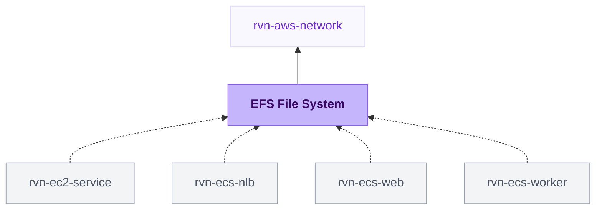

{/* Generated by scripts/sync-module-catalog.mjs from the Ravion module catalog. Do not edit by hand. */}

**Type:** `rvn-efs` · **Latest version:** `1.1.0`

## Dependencies and consumers

_Every dependency input can be specified manually to reference existing external infrastructure rather than a Ravion module. Set the dependency input to `null` and set its mapped inputs directly; see [Use existing infrastructure instead of a module reference](/config-as-code/project-config-file#use-existing-infrastructure-instead-of-a-module-reference)._

## Readme

Amazon EFS file system with mount targets, security groups, automatic backups, and an optional access point.

### Overview

Use this module to create an encrypted Amazon EFS file system inside a VPC. Select a VPC network and Ravion provisions the file system, one mount target per private subnet, a mount-target security group, a client security group for consumers, an automatic backup policy, and optionally an access point with fixed POSIX ownership.

ECS services can reference this module directly: the service mounts the file system into the app container and attaches the client security group automatically.

Terraform source: [ravionhq/modules/storage/efs](https://github.com/ravionhq/modules/tree/rvn-efs@1.1.0/storage/efs)

### Use cases

| Scenario | Benefit |
| --- | --- |
| Shared uploads for ECS services | Files survive task replacement and are shared across all tasks. |
| Persistent app data on Fargate | EFS is the AWS-supported persistent storage for Fargate tasks. |
| Multi-service shared storage | Several services mount the same file system through their own mount points. |
| Cost-optimized cold data | Lifecycle policies move idle files to Infrequent Access or Archive storage. |

### Security model

The module creates two security groups:

- A **mount-target security group** attached to every mount target. It allows NFS (TCP 2049) only from the client security group, plus any additional security groups or CIDR blocks you allow.
- A **client security group** with no ingress rules of its own. Workloads that mount the file system attach this group. ECS services that reference this file system attach it automatically.

This keeps NFS access closed by default and means no security group changes are needed when consumers are added or removed.

### File system settings

Encryption at rest is enabled by default and cannot be changed after creation. Leave KMS key ARN blank to use the AWS managed key.

| Field | Default | Description |
| --- | --- | --- |
| Performance mode | General purpose | Max I/O offers higher aggregate throughput at higher latency; immutable after creation. |
| Throughput mode | Bursting | Elastic scales with demand; Provisioned gives fixed throughput. |
| Provisioned throughput | 128 MiB/s | Applies only to the provisioned throughput mode. |

### Lifecycle and backups

Lifecycle policies reduce storage cost for files that are not accessed frequently. Transition to Infrequent Access moves idle files to cheaper storage; Transition to Archive requires an Infrequent Access period and suits rarely-read data; Transition back to Standard returns a file to primary storage on first access.

Automatic backups through AWS Backup are enabled by default.

### Access point

Enable the access point when clients should be scoped to one directory with fixed POSIX ownership instead of the file system root. EFS creates the root directory path with the configured user ID, group ID, and permissions on first use. All requests through the access point act as that POSIX user.

ECS services that reference this file system mount through the access point automatically when it is enabled.

### Configuration

| Field | Required | Default | Description |
| --- | --- | --- | --- |
| VPC network | Yes | - | Existing rvn-aws-network module instance |
| Name slug | Yes | \{project\}-\{env\}-\{module\} | Name prefix for all EFS resources |
| Encryption at rest | No | true | Immutable after creation |
| KMS key ARN | No | AWS managed key | Customer key for encryption at rest |
| Performance mode | No | generalPurpose | generalPurpose or maxIO; immutable |
| Throughput mode | No | bursting | bursting, elastic, or provisioned |
| Provisioned throughput (MiB/s) | Yes* | 128 | Required for provisioned throughput mode |
| Transition to Infrequent Access | No | - | Lifecycle policy for idle files |
| Transition to Archive | No | - | Requires an Infrequent Access transition |
| Transition back to Standard | No | - | Move files back to Standard on first access |
| Automatic backups | No | true | AWS Backup policy for the file system |
| Access point | No | false | Scope clients to a directory with fixed POSIX ownership |
| Root directory path | Yes* | /data | Directory exposed through the access point |
| POSIX user ID / group ID | Yes* | 1000 | Identity applied to access point requests |
| Directory permissions | Yes* | 755 | Octal permissions for the created directory |
| Additional allowed security groups | No | [] | Extra NFS sources beyond the client security group |
| Allowed IPv4/IPv6 CIDR blocks | No | [] | CIDR-based NFS sources |
| Tags | No | Standard Ravion tags | Additional tags applied to resources |
| Advanced Terraform variables | No | \{\} | Raw lower-level overrides for exceptional cases |
| OpenTofu version override | No | Ravion default | Override the OpenTofu version for the stack |
| Ravion Terraform workspace name | No | \{project\}-\{env\}-\{module\} | Override the state backend workspace name |

*Conditionally required based on the selected throughput mode or access point setting.

### Design decisions

- Mount targets are created in the private subnets of the selected VPC network. EFS is internal storage; it is never exposed publicly.
- The client security group pattern keeps the mount-target security group static. Consumers gain access by attaching the client group, not by editing ingress rules.
- Encryption at rest defaults to on because it cannot be enabled later without recreating the file system.
- A single optional access point covers the common case of scoping an application to one directory. Additional access points can be managed outside this module.

### Learn more

- [Amazon EFS documentation](https://docs.aws.amazon.com/efs/latest/ug/whatisefs.html)
- [EFS performance and throughput modes](https://docs.aws.amazon.com/efs/latest/ug/performance.html)
- [EFS lifecycle management](https://docs.aws.amazon.com/efs/latest/ug/lifecycle-management-efs.html)
- [EFS access points](https://docs.aws.amazon.com/efs/latest/ug/efs-access-points.html)
- [Using EFS with Amazon ECS](https://docs.aws.amazon.com/AmazonECS/latest/developerguide/efs-volumes.html)

## Inputs reference

All inputs for `rvn-efs` version `1.1.0`. Use the `name` shown for each field as the input key in module config.

<ResponseField name="network" type="$ref:rvn-aws-network" required>
  **VPC network.**

  - Immutable after creation
</ResponseField>

### File system

<ResponseField name="name" type="string" required>
  **Name slug.** Name prefix for all EFS resources.

  - Default: `<<project.given_id>>-<<environment.given_id>>-<<module.given_id>>`
  - Immutable after creation
  - Pattern: `^[a-zA-Z0-9]([a-zA-Z0-9_-]{0,62}[a-zA-Z0-9])?$` — Use 1-64 letters, numbers, hyphens, and underscores, starting and ending with a letter or number.
</ResponseField>

<ResponseField name="encrypted" type="boolean">
  **Encryption at rest.** Encrypt file system data at rest. Cannot be changed after creation.

  - Default: `true`
  - Immutable after creation
</ResponseField>

<ResponseField name="kms_key_id" type="string">
  **KMS key ARN.** KMS key for encryption at rest. Leave blank to use the AWS managed key for EFS.

  - Shown when: `{"encrypted":true}`
</ResponseField>

<ResponseField name="performance_mode" type="string">
  **Performance mode.** General purpose fits most workloads. Max I/O trades higher latency for higher aggregate throughput and cannot be changed after creation.

  - Default: `generalPurpose`
  - Allowed values: `generalPurpose` (General purpose), `maxIO` (Max I/O)
  - Immutable after creation
</ResponseField>

<ResponseField name="throughput_mode" type="string">
  **Throughput mode.** How the file system scales throughput.

  - Default: `bursting`
  - Allowed values: `bursting` (Bursting), `elastic` (Elastic), `provisioned` (Provisioned)
</ResponseField>

<ResponseField name="provisioned_throughput_in_mibps" type="number" required>
  **Provisioned throughput (MiB/s).** Throughput to provision for the file system.

  - Default: `128`
  - Min: `1`
  - Shown when: `{"throughput_mode":"provisioned"}`
</ResponseField>

### Lifecycle & backups

<ResponseField name="transition_to_ia" type="string">
  **Transition to Infrequent Access.** Move files not accessed for this period to the lower-cost Infrequent Access storage class. Leave blank to keep files in Standard storage.

  - Allowed values: `AFTER_1_DAY` (After 1 day), `AFTER_7_DAYS` (After 7 days), `AFTER_14_DAYS` (After 14 days), `AFTER_30_DAYS` (After 30 days), `AFTER_60_DAYS` (After 60 days), `AFTER_90_DAYS` (After 90 days), `AFTER_180_DAYS` (After 180 days), `AFTER_270_DAYS` (After 270 days), `AFTER_365_DAYS` (After 365 days)
</ResponseField>

<ResponseField name="transition_to_archive" type="string">
  **Transition to Archive.** Move files not accessed for this period to the Archive storage class. Requires a Transition to Infrequent Access period.

  - Allowed values: `AFTER_1_DAY` (After 1 day), `AFTER_7_DAYS` (After 7 days), `AFTER_14_DAYS` (After 14 days), `AFTER_30_DAYS` (After 30 days), `AFTER_60_DAYS` (After 60 days), `AFTER_90_DAYS` (After 90 days), `AFTER_180_DAYS` (After 180 days), `AFTER_270_DAYS` (After 270 days), `AFTER_365_DAYS` (After 365 days)
</ResponseField>

<ResponseField name="transition_to_primary_storage_class" type="string">
  **Transition back to Standard.** Move files back to Standard storage on first access, avoiding repeated Infrequent Access retrieval charges for files that become hot again.

  - Allowed values: `AFTER_1_ACCESS` (After 1 access)
</ResponseField>

<ResponseField name="backup_enabled" type="boolean">
  **Automatic backups.** Back up the file system automatically through AWS Backup.

  - Default: `true`
</ResponseField>

### Access point

<ResponseField name="access_point_enabled" type="boolean">
  **Access point.** Create an EFS access point that scopes clients to a directory with fixed POSIX ownership. Recommended when containers should not access the whole file system as root.

  - Default: `false`
</ResponseField>

<ResponseField name="access_point_root_directory_path" type="string" required>
  **Root directory path.** Directory exposed through the access point. EFS creates it with the ownership below on first use when the path is not /.

  - Default: `/data`
  - Pattern: `^/` — Use an absolute path.
  - Shown when: `{"access_point_enabled":true}`
</ResponseField>

<ResponseField name="access_point_posix_uid" type="number" required>
  **POSIX user ID.** User ID applied to all requests through the access point and owner of the created directory.

  - Default: `1000`
  - Min: `0`
  - Shown when: `{"access_point_enabled":true}`
</ResponseField>

<ResponseField name="access_point_posix_gid" type="number" required>
  **POSIX group ID.** Group ID applied to all requests through the access point and owner of the created directory.

  - Default: `1000`
  - Min: `0`
  - Shown when: `{"access_point_enabled":true}`
</ResponseField>

<ResponseField name="access_point_permissions" type="string" required>
  **Directory permissions.** Octal permissions for the created root directory.

  - Default: `755`
  - Pattern: `^[0-7]{3,4}$` — Use a 3- or 4-digit octal string such as 755.
  - Shown when: `{"access_point_enabled":true}`
</ResponseField>

### Security

<ResponseField name="allowed_security_group_ids" type="string_array">
  **Additional allowed security groups.** Extra security groups allowed to reach the mount targets over NFS, beyond the managed client security group.

  - Pattern: `^sg-.+` — Security group ID must start with sg-.
</ResponseField>

<ResponseField name="allowed_cidr_blocks" type="string_array">
  **Allowed IPv4 CIDR blocks.** IPv4 CIDR blocks allowed to reach the mount targets over NFS.
</ResponseField>

<ResponseField name="allowed_ipv6_cidr_blocks" type="string_array">
  **Allowed IPv6 CIDR blocks.** IPv6 CIDR blocks allowed to reach the mount targets over NFS.
</ResponseField>

### Misc

<ResponseField name="tags" type="keyvalue">
  **Tags.** A map of tags to assign to all resources. Default tags are `Owner`, `ProjectGivenId`, `EnvironmentGivenId`, `ModuleGivenId`, `ModuleId`
</ResponseField>

### Terraform settings

<ResponseField name="opentofu_version" type="string">
  **OpenTofu version override.** Override the environment's default version for this module
</ResponseField>

<ResponseField name="ravion_state_backend_workspace" type="string">
  **Ravion Terraform workspace name.** Override Terraform state backend workspace name. Defaults to project + environment + module given ids.

  - Immutable after creation
</ResponseField>

<ResponseField name="terraform_plan_default_policies_enabled" type="boolean">
  **Include default plan policies.** Turn off to plan with only the policies below instead of the default read-only policies. Requires at least one policy below.

  - Default: `true`
</ResponseField>

<ResponseField name="terraform_plan_iam_policy_arns" type="string_array">
  **Terraform plan IAM policies.** IAM managed policy ARNs for the Terraform plan runner role. Without default policies, allow s3:CreateBucket, s3:PutObject, s3:GetObject, and s3:ListBucket on the ravion-terraform-plans-\<AWS account number> bucket in this account.

  - Default: `[]`
</ResponseField>

<ResponseField name="terraform_apply_default_policies_enabled" type="boolean">
  **Include default apply policies.** Turn off to apply and destroy with only the policies below instead of AdministratorAccess. Requires at least one policy below.

  - Default: `true`
</ResponseField>

<ResponseField name="terraform_apply_iam_policy_arns" type="string_array">
  **Terraform apply IAM policies.** IAM managed policy ARNs for the Terraform apply runner role. Without default policies, allow s3:CreateBucket, s3:PutObject, s3:GetObject, and s3:ListBucket on the ravion-terraform-plans-\<AWS account number> bucket in this account.

  - Default: `[]`
</ResponseField>

<ResponseField name="advanced_terraform_variables" type="object">
  **Advanced Terraform variables.** Optional raw Terraform variable overrides for advanced module inputs or one-off overrides. Values here override the generated variables above.

  - Default: `{}`
</ResponseField>
