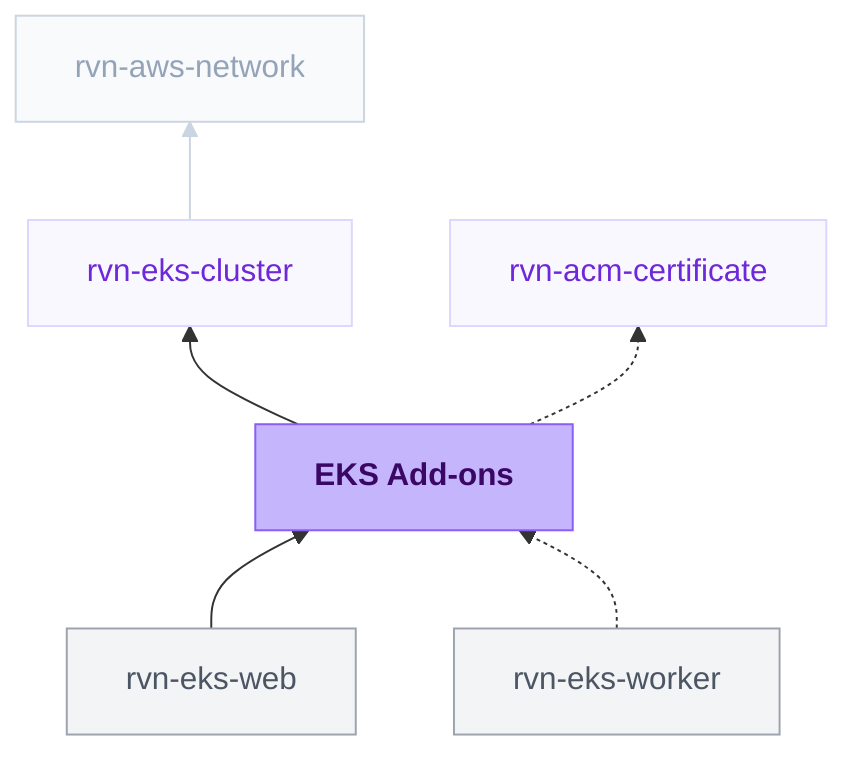

{/* Generated by scripts/sync-module-catalog.mjs from the Ravion module catalog. Do not edit by hand. */}

**Type:** `rvn-eks-addons` · **Latest version:** `0.9.2`

## Dependencies and consumers

_Every dependency input can be specified manually to reference existing external infrastructure rather than a Ravion module._

## Readme

Selectable add-ons for an existing EKS cluster. Each add-on is toggled independently and brings its own IAM wiring, so the cluster module stays lean and clusters only carry what they use.

### Add-ons

| Add-on | Default | What it provides |
| ------ | ------- | ---------------- |
| **Karpenter** | On | Just-in-time node autoscaling: controller and node IAM roles, Pod Identity association, instance profile, SQS interruption queue, EventBridge rules, the controller Helm charts, and an optional default NodePool |
| **Load balancer controller** | With load balancers | Installed automatically when any shared load balancer is enabled; registers workload pods into their target groups (TargetGroupBinding) via the AWS Load Balancer Controller Helm chart wired to the cluster module's Pod Identity role. Opt in without shared load balancers via advanced Terraform variables to provision ALBs/NLBs directly from Ingress and LoadBalancer resources |
| **External Secrets Operator** | On | Reference-only secrets: workloads name a Secrets Manager secret or SSM parameter by ARN, and the operator materializes it into a Kubernetes secret using its own scoped Pod Identity role |
| **EBS CSI driver** | Off | EBS-backed persistent volumes via the aws-ebs-csi-driver EKS add-on and its Pod Identity role |
| **Logs** | On (in-cluster store) | Container output collected on every node and delivered to the destinations you choose - an in-cluster store on S3 by default, plus CloudWatch Logs or a vendor on request |
| **Metrics** | On (Amazon Managed Prometheus) | Per-container CPU, memory, network, restart and scaling metrics, delivered to the destinations you choose - Amazon Managed Prometheus by default, plus CloudWatch Container Insights or a vendor on request |
| **Ravion EKS Management** | On | Registers the cluster with the Ravion control plane and installs Ravion Operator, which reports workload and node state outbound over a single WebSocket and can run Ravion's deploys from inside the cluster |
| **Shared load balancers** | Public ALB on | Terraform-managed public/private ALBs and NLBs that web workloads attach to via the load balancer controller's TargetGroupBinding — the same shared-LB pattern the ECS Cluster module uses |

**Zone-local DNS** is on by default and has no form field: the `kube-dns` Service is patched with `trafficDistribution: PreferClose`, so every DNS lookup goes to the CoreDNS pod in the caller's availability zone (the EKS Cluster module spreads those pods across zones). This removes cross-AZ data transfer charges from DNS, the one call every pod makes. It needs Kubernetes 1.31 or later and is switched off with `topology_aware_routing_enabled: false` under **Advanced Terraform variables**, which also clears the field again.

EBS CSI and the CloudWatch Observability add-on are native EKS add-ons installed purely through the AWS API. Karpenter, the load balancer controller, the External Secrets Operator, Ravion EKS Management, and both observability pipelines additionally install Helm charts into the cluster, which are the only parts that need Kubernetes API connectivity.

### Logs and metrics destinations

Each signal is one multi-select. **The in-cluster log store and Amazon Managed Prometheus are the defaults**, so a new cluster's Logs and Metrics tabs work with nothing filled in. Nothing CloudWatch is installed by default, or as a side effect of anything else.

| Logs destination | What runs | In Ravion |
| ---------------- | --------- | --------- |
| **In-cluster log store (Loki)** - default | Alloy on every node, Loki in the cluster, chunks in an S3 bucket in your account | Renders in the Logs tab |
| **Amazon CloudWatch Logs** | An OpenTelemetry collector on every node, writing to `/ravion/eks/<cluster>` | Renders, and is read when the in-cluster agent is offline |
| **Grafana Cloud Logs** | The same Alloy agent, writing to your Grafana Cloud endpoint as well | Ships, plus an "Open in Grafana Cloud" link |
| **Datadog / New Relic / custom OTLP** | The OpenTelemetry collector, one exporter each | Ships, plus an "Open in ..." link |

| Metrics destination | What runs | In Ravion |
| ------------------- | --------- | --------- |
| **Amazon Managed Prometheus** - default | One collector scraping a curated metric set, remote-writing over SigV4 | Renders in the Metrics tabs |
| **Amazon CloudWatch (Container Insights)** | The amazon-cloudwatch-observability add-on's metrics half | Renders, as the fallback behind Amazon Managed Prometheus |
| **Grafana Cloud / Datadog / New Relic / custom OTLP** | The same collector, one more exporter each | Ships, plus an "Open in ..." link |

**Several destinations that render are a fallback chain, not a merge.** Ravion reads the first one that can answer right now - the in-cluster store, then CloudWatch Logs; Amazon Managed Prometheus, then Container Insights - and says which store it is showing. It never merges two of them for the same service, which would show every line twice.

**What each costs.** The in-cluster store costs S3 storage and requests plus the collector pods, with no per-gigabyte ingestion charge. Amazon Managed Prometheus bills per metric sample - roughly $25-50 a month for a 20-service cluster. CloudWatch bills per gigabyte of logs ingested and per metric. Every vendor bills for what it receives, so choosing two of them ships - and pays for - the same lines twice. That is a choice the form makes visible rather than one it prevents.

**Vendor keys are references, never values.** Every API key, token and license key is a Secrets Manager ARN. The External Secrets Operator this module installs reads it in-cluster with its own IAM role and hands it to the collector; the value passes through neither Ravion nor Helm, and appears in no release history. Selecting a vendor with External secrets turned off fails the deployment rather than installing a collector that cannot authenticate.

**CloudWatch Container Insights** is one of these destinations now, not a section of its own. Choosing it installs the add-on with **Auto-Monitor off**: left at its default, that webhook injects the AWS OpenTelemetry agent into every workload in the cluster and restarts the pods to do it. Application Signals auto-instrumentation is a separate toggle, off unless asked for, with a namespace list.

**Upgrading from 0.7.x** changes nothing you did not ask for: a cluster with Logs on keeps the in-cluster store, a cluster with Logs off stays off, and a cluster that had Container Insights on keeps it as the fallback behind Amazon Managed Prometheus. The one behavioural change is that the CloudWatch add-on is re-applied with Auto-Monitor off, so agents it had injected leave workloads on their next rollout.

### Ravion EKS Management

Ravion Operator is Ravion's in-cluster agent. It dials the control plane outbound over a single WebSocket and reports workload, rollout, and node state back — the control plane can never dial in, which is what makes a cluster with a private API endpoint observable from Ravion at all. Outbound 443 to the agent endpoint is the only egress a cluster has to allow.

Enabling the toggle does three things in one deployment: Ravion issues the agent's credential — server-side, authorized by the pipeline's own credentials, so there is no API key to paste — writes it into the agent's Kubernetes secret and mirrors it into a Secrets Manager secret **in your own AWS account**, and installs the agent's Helm chart. The plaintext is issued exactly once; rotating or revoking it is a redeploy, not an API call.

**Ravion EKS Management** controls both Operator installation and in-cluster deployments. Deployments follow this toggle, including when upgrading an installation that previously disabled the separate deployments flag. By default, it enables durable executor Jobs, HA Operator and full-cluster management.

Durable executor Jobs are enabled automatically, isolating deployments in Jobs; self-update stays on, so Ravion keeps the agent current. The module pins chart `0.5.1` from `public.ecr.aws/a8z1i1r2/operator`, which bundles its matching verified multiarchitecture image digest as the floor a fresh install starts from. No image digest or chart version needs to be entered. Execution mode customization is available only through **Advanced Terraform variables**. Earlier form-level mode choices are replaced by the managed defaults; preserve custom settings through advanced overrides before upgrading, and drain deployments and remediation before changing modes.

**HA Operator** is enabled automatically with executor Jobs and requires a replica-aware gateway. It runs two coordinators placed the way Karpenter places itself: one per node, spread across zones, and never on a node Karpenter provisioned, so a coordinator can never keep an autoscaled node alive. They run on the system node group, which has two nodes by default. A replica with no eligible node stays Pending until one appears; nothing provisions nodes. A cluster with a single eligible node needs `ravion_operator_coordinator_replicas=1` through **Advanced Terraform variables**.

Each coordinator requests 500m CPU and 1Gi memory; each active executor requests 1 CPU, 2Gi memory and 1Gi ephemeral storage. Nodes still need free resources to schedule the pods. Replica count, placement and executor capacity can be overridden through **Advanced Terraform variables**.

**Full-cluster management** is enabled by default with Jobs and grants wildcard Kubernetes RBAC, including CRDs, RBAC, namespaces and custom resources. It uses a single retained mutation lane, so only one cluster mutation runs at a time. To restrict deployments, set `ravion_operator_full_management_enabled=false` and provide `ravion_operator_deploy_namespaces` through **Advanced Terraform variables**. Scoped Jobs default to four installation-wide slots for independent namespaces; Kubernetes schedules them against available resources. Drain existing ownership before changing scope or retained capacity. Existing form-level scope, image and HA choices are replaced by these managed defaults; preserve custom settings through advanced overrides before upgrading.

Web, worker and cron modules keep their existing Helm deployment definitions. Ravion selects Operator by the cluster ARN; the addons module passes its stable enrollment ID to the chart as the installation identity.

The project, environment, and AWS account this module belongs to are recorded on the agent automatically when its credential is issued; there is nothing to fill in.

Job mode keeps self-update on: the elected coordinator updates itself when Ravion assigns a version, and pins its executor Jobs to the image it is running. Self-update and deployment namespace settings are available through **Advanced Terraform variables**. Preserve the installation namespace, identity and retained execution Leases across upgrades. Other installation tuning is available through the same overrides:

| Terraform variable | Default | What it changes |
| ------------------ | ------- | --------------- |
| `ravion_operator_endpoint` | `wss://websockets.ravion.com/operator/v1/connect` | WebSocket endpoint; override for staging or a self-hosted control plane |
| `ravion_operator_namespace` | `ravion-operator` | Namespace the agent and its credential secret are installed into, created if missing; also the default for shared observability components |
| `ravion_operator_namespace_scope` | `[]` (cluster-wide read) | Namespaces the agent may observe. Naming namespaces renders no cluster-scoped read role at all, only one namespaced role per entry, so the restriction is enforced by Kubernetes rather than by the agent. A scoped agent cannot read nodes, so cluster node counts show as unknown |

In restricted mode, deployment namespaces fall back to `ravion_operator_namespace_scope` when empty.

Workload namespace creation is enabled by default. Apply creates missing configured deployment and observation namespaces before installing Operator permissions. Namespaces managed elsewhere are reused without changing ownership. Created namespaces are retained on removal or uninstall. Disable bootstrap with `ravion_operator_namespaces_creation_enabled=false` through **Advanced Terraform variables**. Operator itself can create namespaces only with full management enabled.

**Namespace migration:** the default shared namespace is `ravion-operator`. Moving existing releases replaces them and does not migrate PVCs or retained execution state. Keep an explicit existing namespace override when upgrading a running installation. Helm release names, resource selectors and credential Secret names retain their compatibility identities; the chart source and default connection path use Operator.

### External secrets

Kubernetes has no equivalent of the ECS task definition's `valueFrom` injection, so this add-on installs the External Secrets Operator as the bridge. A service references a secret **by ARN**; the operator reads it with its own IAM role and materializes it into a Kubernetes secret in the service's namespace. Values live only in AWS — they never pass through Ravion, Helm values, or Helm release history.

Two cluster-scoped stores are created for services to reference, one per AWS backend (the operator's AWS provider takes a single service per store):

| Backend | Store name | Kind |
| ------- | ---------- | ---- |
| AWS Secrets Manager | `ravion-aws` | `ClusterSecretStore` |
| AWS SSM Parameter Store | `ravion-aws-parameter-store` | `ClusterSecretStore` |

By default the operator may read every secret and parameter in the cluster's account and region. Add **readable secret ARNs** to scope it to specific secrets or prefixes, or to grant access in another region or account.

At rest, the Kubernetes secrets the operator writes are KMS envelope-encrypted in etcd — the EKS Cluster module enables that by default with a dedicated key per cluster.

### Shared load balancers

Instead of letting each Ingress provision its own ALB, this module can create up to four shared load balancers (public/private ALB, public/private NLB) with Terraform. Workload modules then create a target group and listener rule, and bind pods to the target group in-cluster with the load balancer controller's `TargetGroupBinding` CRD — so one load balancer is shared across many services, exactly like the ECS Cluster module's shared load balancers.

- Public load balancers require **public subnet IDs**, inherited from the cluster reference (set them on the EKS Cluster module, where they flow in from its network reference).
- Private load balancers are placed in the cluster's node subnets.
- Each load balancer's security group is automatically allowed to reach pods through the EKS cluster security group (all TCP ports).
- Because `TargetGroupBinding` depends on the controller, enabling any load balancer automatically installs the **load balancer controller** - there is nothing extra to configure.

Terraform source: [ravionhq/modules/compute/eks/addons](https://github.com/ravionhq/modules/tree/rvn-eks-addons@0.9.2/compute/eks/addons)

### Prerequisites

- An **EKS Cluster** module.
- When a Helm-installed add-on runs (**Karpenter**, the **External Secrets Operator**, **Ravion EKS Management**, or any **shared load balancer** - which installs the **load balancer controller**): a **Terraform execution environment** in the cluster VPC for private endpoints. The add-ons pipeline automatically attaches the cluster's **Ravion Runner security group** for each run. The other add-ons need no cluster connectivity.

The Helm installs authenticate by assuming the cluster's **Ravion Runner role** (inherited automatically from the cluster reference) — a stable IAM role the EKS Cluster module registers as an access entry with cluster-admin. Per-run pipeline roles never appear in the cluster's access configuration.

For the load balancer controller to place load balancers automatically, VPC subnets must carry the standard discovery tags: `kubernetes.io/role/elb = 1` on public subnets and `kubernetes.io/role/internal-elb = 1` on private subnets (alternatively, specify subnets per Ingress via annotation).

### Configuration

| Field                  | Required | Default              | Description                                            |
| ---------------------- | -------- | -------------------- | ------------------------------------------------------ |
| EKS cluster            | Yes      | -                    | Existing EKS Cluster module                            |
| Karpenter              | No       | `true`               | Autoscaling end to end (IAM, queue, controller, NodePool) |
| Chart version          | No       | `1.14.0`             | Karpenter and karpenter-crd Helm chart version         |
| Default NodePool       | No       | `true`               | General-purpose NodePool and EC2NodeClass              |
| Capacity types         | Yes*     | On-demand and Spot   | Capacity Karpenter may provision                       |
| EC2 instance categories | Yes*   | `c`, `m`, `r`        | Instance-family categories Karpenter may choose        |
| CPU architectures      | Yes*     | x86_64               | Architectures Karpenter may provision                  |
| CPU limit              | Yes*     | `100`                | Maximum vCPUs provisioned through the default NodePool |
| Node lifetime          | Yes*     | `720h`               | Maximum age before Karpenter replaces a node           |
| Load balancer controller chart version | No | `1.14.0`    | aws-load-balancer-controller Helm chart version (controller installed automatically with any load balancer) |
| External Secrets Operator | No    | `true`               | Reference-only secrets, ClusterSecretStores, and a scoped Pod Identity role |
| Readable secret ARNs   | No       | Account + region     | Scopes which Secrets Manager secrets and SSM parameters the operator may read |
| EBS CSI driver         | No       | `false`              | EBS persistent volumes add-on and Pod Identity role    |
| Logs                   | No       | `true`               | Collect container logs at all                          |
| Logs providers         | No       | In-cluster store     | Any combination of the log destinations above           |
| Metrics                | No       | `true`               | Collect workload metrics at all                        |
| Metrics providers      | No       | Amazon Managed Prometheus | Any combination of the metric destinations above   |
| Existing workspace ID  | No       | Creates one          | Write into an existing AMP workspace instead of creating `ravion-<cluster>` |
| Retention (days)       | No       | `30`                 | How long logs stay searchable before they are deleted from the bucket |
| Application Signals    | No       | `false`              | CloudWatch auto-instrumentation: injects the AWS agent into the named namespaces and restarts their pods |
| Existing log bucket    | No       | Creates one          | Store logs in an existing bucket instead of `ravion-loki-<cluster>-<account>` |
| In-cluster Grafana     | No       | `false`              | Grafana in the cluster, wired to both metrics and logs |
| Grafana read access    | No       | `false`              | Read-only IAM role for Amazon Managed Grafana over the AMP workspace |
| Ravion EKS Management  | No       | `true`               | Registers the cluster, installs Operator, and enables in-cluster deployments |
| Public ALB             | No       | `true`               | Shared internet-facing ALB (HTTPS with ACM certificate) |
| Private ALB            | No       | `false`              | Shared internal ALB                                    |
| Public / private NLB   | No       | `false`              | Shared Network Load Balancers for TCP/UDP workloads    |
| Load balancer deletion protection | No | `true`         | Prevent accidental deletion of the shared load balancers |
| Tags                   | No       | Ravion defaults      | Tags on created resources and Karpenter-launched instances |

### Default NodePool

The default NodePool provisions Linux nodes from the selected instance categories and CPU architectures. Capacity types default to both On-demand and Spot, allowing Karpenter to use lower-cost Spot capacity while retaining On-demand as an availability fallback. Restrict the list when workloads require one capacity type. The pool defaults to 100 vCPUs and a 30-day node lifetime. Disable it and bring your own NodePool manifests for full control.

*Default NodePool fields are required only when Karpenter and the default NodePool are enabled.

### Learn more

- [Karpenter](https://karpenter.sh/docs/) - Just-in-time node autoscaling
- [Karpenter NodePools](https://karpenter.sh/docs/concepts/nodepools/) - Customizing provisioning behavior
- [AWS Load Balancer Controller](https://kubernetes-sigs.github.io/aws-load-balancer-controller/) - Ingress and Service load balancing
- [External Secrets Operator](https://external-secrets.io/) - Referencing AWS secrets from Kubernetes workloads
- [Amazon EBS CSI driver](https://docs.aws.amazon.com/eks/latest/userguide/ebs-csi.html) - Persistent volumes on EKS
- [Container Insights](https://docs.aws.amazon.com/AmazonCloudWatch/latest/monitoring/ContainerInsights.html) - Cluster observability in CloudWatch
- [CloudWatch Application Signals](https://docs.aws.amazon.com/AmazonCloudWatch/latest/monitoring/CloudWatch-Application-Signals-Enable-EKS.html) - What auto-instrumentation does to a workload
- [OpenTelemetry Collector](https://opentelemetry.io/docs/collector/) - The collector carrying every non-Loki destination
- [External Secrets Operator](https://external-secrets.io/) - How vendor credentials reach the collectors
- [Amazon Managed Prometheus](https://docs.aws.amazon.com/prometheus/latest/userguide/what-is-Amazon-Managed-Service-Prometheus.html) - Managed Prometheus workspaces and pricing
- [Querying an AMP workspace from Grafana](https://docs.aws.amazon.com/grafana/latest/userguide/prometheus-data-source.html) - Configuring the data source
- [Grafana Loki](https://grafana.com/docs/loki/latest/) - The in-cluster log store
- [Grafana Alloy](https://grafana.com/docs/alloy/latest/) - The log collection agent

## Inputs reference

All inputs for `rvn-eks-addons` version `0.9.2`. Use the `name` shown for each field as the input key in module config.

<ResponseField name="cluster" type="$ref:rvn-eks-cluster" required>
  **EKS cluster.**

  - Immutable after creation
</ResponseField>

### Ravion EKS Management

<ResponseField name="ravion_operator_enabled" type="boolean">
  **Ravion EKS Management.** Register the cluster with Ravion and install Ravion Operator for cluster visibility and in-cluster deployments.

  - Default: `true`
</ResponseField>

### Application load balancers

<ResponseField name="load_balancer_name_prefix" type="string">
  **Load balancer name prefix.** Prefix for the shared load balancer names (\<prefix>-pub, \<prefix>-priv, \<prefix>-pub-nlb, \<prefix>-priv-nlb) and their security groups. Defaults to the cluster name. Set it when those names are taken, for example by an ECS cluster with the same name. Up to 23 letters, digits and hyphens.
</ResponseField>

<ResponseField name="public_alb_creation_enabled" type="boolean">
  **Public ALB.** Create an internet-facing Application Load Balancer for traffic from the public internet.

  - Default: `true`
</ResponseField>

<ResponseField name="public_alb_https_enabled" type="boolean">
  **HTTPS.** Add an HTTPS listener and redirect HTTP requests to it.

  - Default: `true`
  - Shown when: `{"public_alb_creation_enabled":true}`
</ResponseField>

<ResponseField name="public_alb_certificate" type="$ref:rvn-acm-certificate" required>
  **Certificate.** ACM certificate module that supplies the default certificate for the public HTTPS listener.

  - Shown when: `{"public_alb_creation_enabled":true,"public_alb_https_enabled":true}`
</ResponseField>

<ResponseField name="public_alb_additional_certificate_arns" type="string_array">
  **Additional certificate ARNs.** Additional ACM certificate ARNs attached to the public ALB HTTPS listener for SNI.

  - Default: `[]`
  - Shown when: `{"public_alb_creation_enabled":true,"public_alb_https_enabled":true}`
</ResponseField>

<ResponseField name="public_alb_ssl_policy" type="string">
  **SSL policy.** AWS ELB security policy name for the public HTTPS listener.

  - Shown when: `{"public_alb_creation_enabled":true,"public_alb_https_enabled":true}`
</ResponseField>

<ResponseField name="public_alb_idle_timeout" type="number">
  **Idle timeout (seconds).**

  - Min: `1`
  - Max: `4000`
  - Shown when: `{"public_alb_creation_enabled":true}`
</ResponseField>

<ResponseField name="public_alb_web_acl_arn" type="string">
  **WAF web ACL ARN.** WAFv2 Web ACL to associate with the public ALB.

  - Shown when: `{"public_alb_creation_enabled":true}`
</ResponseField>

<ResponseField name="public_alb_access_logs_enabled" type="boolean">
  **Access logs.** Write public ALB request logs to S3.

  - Default: `false`
  - Shown when: `{"public_alb_creation_enabled":true}`
</ResponseField>

<ResponseField name="public_alb_access_logs_bucket_arn" type="string">
  **Access logs bucket ARN.** Existing S3 bucket ARN for access logs. Leave blank to create a private bucket with 90-day retention.

  - Shown when: `{"public_alb_access_logs_enabled":true,"public_alb_creation_enabled":true}`
</ResponseField>

<ResponseField name="private_alb_creation_enabled" type="boolean">
  **Private ALB.** Create an internal Application Load Balancer reachable only inside the VPC, for internal APIs, admin tools, and service-to-service traffic.

  - Default: `false`
</ResponseField>

<ResponseField name="private_alb_https_enabled" type="boolean">
  **HTTPS.** Add an HTTPS listener and redirect HTTP requests to it.

  - Default: `false`
  - Shown when: `{"private_alb_creation_enabled":true}`
</ResponseField>

<ResponseField name="private_alb_certificate" type="$ref:rvn-acm-certificate" required>
  **Certificate.** ACM certificate module that supplies the default certificate for the private HTTPS listener.

  - Shown when: `{"private_alb_creation_enabled":true,"private_alb_https_enabled":true}`
</ResponseField>

<ResponseField name="private_alb_additional_certificate_arns" type="string_array">
  **Additional certificate ARNs.** Additional ACM certificate ARNs attached to the private ALB HTTPS listener for SNI.

  - Default: `[]`
  - Shown when: `{"private_alb_creation_enabled":true,"private_alb_https_enabled":true}`
</ResponseField>

<ResponseField name="private_alb_ssl_policy" type="string">
  **SSL policy.** AWS ELB security policy name for the private HTTPS listener.

  - Shown when: `{"private_alb_creation_enabled":true,"private_alb_https_enabled":true}`
</ResponseField>

<ResponseField name="private_alb_ingress_cidr_blocks" type="string_array">
  **Allowed IPv4 CIDRs.** IPv4 CIDR blocks allowed to reach the private ALB. Leave empty to use the RFC1918 private ranges.

  - Shown when: `{"private_alb_creation_enabled":true}`
</ResponseField>

<ResponseField name="private_alb_ingress_ipv6_cidr_blocks" type="string_array">
  **Allowed IPv6 CIDRs.** IPv6 CIDR blocks allowed to reach the private ALB. Leave empty to allow no IPv6 ingress.

  - Shown when: `{"private_alb_creation_enabled":true}`
</ResponseField>

<ResponseField name="private_alb_ingress_security_group_ids" type="string_array">
  **Allowed security group IDs.** Security groups whose members can access the private ALB. Useful for sources without static CIDRs, such as CloudFront VPC origins.

  - Shown when: `{"private_alb_creation_enabled":true}`
</ResponseField>

<ResponseField name="private_alb_idle_timeout" type="number">
  **Idle timeout (seconds).**

  - Min: `1`
  - Max: `4000`
  - Shown when: `{"private_alb_creation_enabled":true}`
</ResponseField>

<ResponseField name="private_alb_access_logs_enabled" type="boolean">
  **Access logs.** Write private ALB request logs to S3.

  - Default: `false`
  - Shown when: `{"private_alb_creation_enabled":true}`
</ResponseField>

<ResponseField name="private_alb_access_logs_bucket_arn" type="string">
  **Access logs bucket ARN.** Existing S3 bucket ARN for access logs. Leave blank to create a private bucket with 90-day retention.

  - Shown when: `{"private_alb_access_logs_enabled":true,"private_alb_creation_enabled":true}`
</ResponseField>

### Network load balancers

<ResponseField name="public_nlb_creation_enabled" type="boolean">
  **Public NLB.** Create an internet-facing Network Load Balancer.

  - Default: `false`
</ResponseField>

<ResponseField name="public_nlb_additional_security_group_ids" type="string_array">
  **Additional security group IDs.** Additional security groups for the public NLB.

  - Shown when: `{"public_nlb_creation_enabled":true}`
</ResponseField>

<ResponseField name="public_nlb_cross_zone_load_balancing_enabled" type="boolean">
  **Cross-zone load balancing.** Distribute traffic to healthy targets in every enabled Availability Zone.

  - Default: `false`
  - Shown when: `{"public_nlb_creation_enabled":true}`
</ResponseField>

<ResponseField name="public_nlb_elastic_ips_enabled" type="boolean">
  **Use Elastic IP addresses.** Assign one static Elastic IP address to each public subnet.

  - Default: `false`
  - Shown when: `{"public_nlb_creation_enabled":true}`
</ResponseField>

<ResponseField name="public_nlb_elastic_ip_allocation_ids" type="string_array">
  **Elastic IP allocation IDs.** One Elastic IP allocation ID for each public subnet, in matching order.

  - Shown when: `{"public_nlb_creation_enabled":true,"public_nlb_elastic_ips_enabled":true}`
</ResponseField>

<ResponseField name="public_nlb_access_logs_enabled" type="boolean">
  **Access logs.** Write public NLB TLS listener connection logs to S3. AWS does not log TCP or UDP listeners.

  - Default: `false`
  - Shown when: `{"public_nlb_creation_enabled":true}`
</ResponseField>

<ResponseField name="public_nlb_access_logs_bucket_arn" type="string">
  **Access logs bucket ARN.** Existing S3 bucket ARN for access logs. Leave blank to create a private bucket with 90-day retention.

  - Shown when: `{"public_nlb_access_logs_enabled":true,"public_nlb_creation_enabled":true}`
</ResponseField>

<ResponseField name="private_nlb_creation_enabled" type="boolean">
  **Private NLB.** Create an internal Network Load Balancer.

  - Default: `false`
</ResponseField>

<ResponseField name="private_nlb_additional_security_group_ids" type="string_array">
  **Additional security group IDs.** Additional security groups for the private NLB.

  - Shown when: `{"private_nlb_creation_enabled":true}`
</ResponseField>

<ResponseField name="private_nlb_cross_zone_load_balancing_enabled" type="boolean">
  **Cross-zone load balancing.** Distribute traffic to healthy targets in every enabled Availability Zone.

  - Default: `false`
  - Shown when: `{"private_nlb_creation_enabled":true}`
</ResponseField>

<ResponseField name="private_nlb_elastic_ips_enabled" type="boolean">
  **Use elastic IPs.** Assign static Elastic IPs to the private NLB.

  - Default: `false`
  - Shown when: `{"private_nlb_creation_enabled":true}`
</ResponseField>

<ResponseField name="private_nlb_elastic_ip_allocation_ids" type="string_array">
  **Elastic IP allocation IDs.** Elastic IP allocation IDs for the private NLB, one per subnet.

  - Shown when: `{"private_nlb_creation_enabled":true,"private_nlb_elastic_ips_enabled":true}`
</ResponseField>

<ResponseField name="private_nlb_access_logs_enabled" type="boolean">
  **Access logs.** Write private NLB TLS listener connection logs to S3. AWS does not log TCP or UDP listeners.

  - Default: `false`
  - Shown when: `{"private_nlb_creation_enabled":true}`
</ResponseField>

<ResponseField name="private_nlb_access_logs_bucket_arn" type="string">
  **Access logs bucket ARN.** Existing S3 bucket ARN for access logs. Leave blank to create a private bucket with 90-day retention.

  - Shown when: `{"private_nlb_access_logs_enabled":true,"private_nlb_creation_enabled":true}`
</ResponseField>

<ResponseField name="load_balancer_deletion_protection_enabled" type="boolean">
  **Load balancer deletion protection.** Prevent accidental deletion of load balancers created by this module.

  - Default: `true`
</ResponseField>

<ResponseField name="aws_load_balancer_controller_chart_version" type="string">
  **Load balancer controller chart version.** AWS Load Balancer Controller Helm chart version without a leading v, for example 1.14.0. The controller is installed when any shared load balancer is enabled.
</ResponseField>

### Karpenter

<ResponseField name="karpenter_enabled" type="boolean">
  **Karpenter.**

  - Default: `true`
</ResponseField>

<ResponseField name="karpenter_chart_version" type="string">
  **Chart version.** Karpenter and Karpenter CRD Helm chart version without a leading v, for example 1.14.0.

  - Shown when: `{"karpenter_enabled":true}`
</ResponseField>

<ResponseField name="karpenter_controller_namespace" type="string">
  **Controller namespace.** Kubernetes namespace for the Karpenter controller, for example kube-system.

  - Shown when: `{"karpenter_enabled":true}`
</ResponseField>

<ResponseField name="karpenter_controller_service_account" type="string">
  **Controller service account.** Kubernetes service account name for the Karpenter controller, for example karpenter.

  - Shown when: `{"karpenter_enabled":true}`
</ResponseField>

<ResponseField name="karpenter_default_node_pool_creation_enabled" type="boolean">
  **Default NodePool.** Create a general-purpose default NodePool and EC2NodeClass so Karpenter can provision nodes out of the box. Disable to manage NodePools yourself.

  - Default: `true`
  - Shown when: `{"karpenter_enabled":true}`
</ResponseField>

<ResponseField name="karpenter_default_node_pool_capacity_types" type="string_array" required>
  **Capacity types.** EC2 purchasing models Karpenter may use. Selecting only Spot can leave workloads pending when Spot capacity is unavailable.

  - Default: `["on-demand","spot"]`
  - Allowed values: `on-demand` (On-demand), `spot` (Spot)
  - Shown when: `{"karpenter_default_node_pool_creation_enabled":true,"karpenter_enabled":true}`
</ResponseField>

<ResponseField name="karpenter_default_node_pool_instance_categories" type="string_array" required>
  **EC2 instance categories.** Single-letter EC2 instance-family categories Karpenter may use, such as c, m, or r.

  - Default: `["c","m","r"]`
  - Shown when: `{"karpenter_default_node_pool_creation_enabled":true,"karpenter_enabled":true}`
</ResponseField>

<ResponseField name="karpenter_default_node_pool_architectures" type="string_array" required>
  **CPU architectures.** CPU architectures Karpenter may provision. Workload images must support every selected architecture.

  - Default: `["amd64"]`
  - Allowed values: `amd64` (x86_64), `arm64` (ARM64)
  - Shown when: `{"karpenter_default_node_pool_creation_enabled":true,"karpenter_enabled":true}`
</ResponseField>

<ResponseField name="karpenter_default_node_pool_cpu_limit" type="number" required>
  **CPU limit (vCPUs).** Maximum total vCPUs Karpenter may provision through the default NodePool.

  - Default: `100`
  - Min: `1`
  - Shown when: `{"karpenter_default_node_pool_creation_enabled":true,"karpenter_enabled":true}`
</ResponseField>

<ResponseField name="karpenter_default_node_pool_expire_after" type="string" required>
  **Node lifetime.** Maximum node age before Karpenter drains and replaces it. Use integer segments with s, m, or h, such as 1h30m or 720h; use Never to disable expiration.

  - Default: `720h`
  - Pattern: `^(([0-9]+(s|m|h))+|Never)$` — Use integer segments with s, m, or h, such as 1h30m or 720h, or Never.
  - Shown when: `{"karpenter_default_node_pool_creation_enabled":true,"karpenter_enabled":true}`
</ResponseField>

### EBS CSI driver

<ResponseField name="ebs_csi_driver_enabled" type="boolean">
  **EBS CSI driver.** Enable EBS-backed Kubernetes persistent volumes.

  - Default: `false`
</ResponseField>

<ResponseField name="ebs_csi_addon_version" type="string">
  **Add-on version.** AWS EBS CSI add-on version, for example v1.49.0-eksbuild.1. Leave blank to use the latest compatible version.

  - Shown when: `{"ebs_csi_driver_enabled":true}`
</ResponseField>

### Logs

<ResponseField name="logs_enabled" type="boolean">
  **Logs.** Collect container logs and send them to the selected destinations. Disabling logs removes the managed collectors and in-cluster log store.

  - Default: `true`
</ResponseField>

<ResponseField name="logs_providers" type="string_array">
  **Log destinations.** Send logs to one or more destinations. Ravion queries the in-cluster store first, then CloudWatch. External destinations each receive a copy.

  - Default: `["loki"]`
  - Allowed values: `loki` (In-cluster log store (Loki, S3-backed)), `cloudwatch` (Amazon CloudWatch Logs), `grafana_cloud` (Grafana Cloud Logs), `datadog` (Datadog), `new_relic` (New Relic), `opensearch` (Amazon OpenSearch Service), `splunk` (Splunk (HEC)), `otlp` (Custom OTLP endpoint)
  - Shown when: `{"logs_enabled":true}`
</ResponseField>

<ResponseField name="loki_retention_days" type="number">
  **Retention (days).** Number of days logs remain searchable before deletion. Enter 1-3650.

  - Default: `30`
  - Min: `1`
  - Max: `3650`
  - Shown when: `{"logs_enabled":true,"logs_providers":"loki"}`
</ResponseField>

<ResponseField name="loki_s3_bucket_name" type="string">
  **Existing S3 log bucket.** S3 bucket name for log storage. Leave blank to create a bucket. Lifecycle and encryption remain your responsibility for an existing bucket.

  - Shown when: `{"logs_enabled":true,"logs_providers":"loki"}`
</ResponseField>

<ResponseField name="cloudwatch_logs_retention_days" type="number">
  **CloudWatch retention (days).** Retention for the module-managed CloudWatch log groups, in days.

  - Default: `30`
  - Shown when: `{"logs_enabled":true,"logs_providers":"cloudwatch"}`
</ResponseField>

<ResponseField name="grafana_cloud_logs_url" type="string">
  **Grafana Cloud Loki push URL.** Loki push URL from your Grafana Cloud Logs connection details.

  - Shown when: `{"logs_enabled":true,"logs_providers":"grafana_cloud"}`
</ResponseField>

<ResponseField name="grafana_cloud_logs_user" type="string">
  **Grafana Cloud Logs user ID.** Numeric user or tenant ID from your Grafana Cloud Logs connection details.

  - Shown when: `{"logs_enabled":true,"logs_providers":"grafana_cloud"}`
</ResponseField>

<ResponseField name="grafana_cloud_token_secret_arn" type="string">
  **Grafana Cloud token secret ARN.** Secrets Manager ARN containing a Grafana Cloud token with logs:write; also grant metrics:write when used for metrics.

  - Shown when: `{"logs_enabled":true,"logs_providers":"grafana_cloud"}`
</ResponseField>

<ResponseField name="grafana_cloud_stack_url" type="string">
  **Grafana Cloud stack URL.** Grafana Cloud stack URL used for links from Ravion. Leave blank to omit the link.

  - Shown when: `{"logs_enabled":true,"logs_providers":"grafana_cloud"}`
</ResponseField>

<ResponseField name="datadog_site" type="string">
  **Datadog site.** Datadog site that receives this cluster's telemetry.

  - Default: `datadoghq.com`
  - Allowed values: `datadoghq.com` (US1 (datadoghq.com)), `us3.datadoghq.com` (US3 (us3.datadoghq.com)), `us5.datadoghq.com` (US5 (us5.datadoghq.com)), `datadoghq.eu` (EU1 (datadoghq.eu)), `ap1.datadoghq.com` (AP1 (ap1.datadoghq.com)), `ddog-gov.com` (US1-FED (ddog-gov.com))
  - Shown when: `{"logs_enabled":true,"logs_providers":"datadog"}`
</ResponseField>

<ResponseField name="datadog_api_key_secret_arn" type="string">
  **Datadog API key secret ARN.** Secrets Manager ARN containing the Datadog API key.

  - Shown when: `{"logs_enabled":true,"logs_providers":"datadog"}`
</ResponseField>

<ResponseField name="new_relic_region" type="string">
  **New Relic region.** New Relic data region used to select the ingestion endpoint.

  - Default: `us`
  - Allowed values: `us` (United States), `eu` (Europe)
  - Shown when: `{"logs_enabled":true,"logs_providers":"new_relic"}`
</ResponseField>

<ResponseField name="new_relic_license_key_secret_arn" type="string">
  **New Relic license key secret ARN.** Secrets Manager ARN containing the New Relic license key.

  - Shown when: `{"logs_enabled":true,"logs_providers":"new_relic"}`
</ResponseField>

<ResponseField name="opensearch_endpoint" type="string">
  **OpenSearch domain endpoint.** HTTPS endpoint for a managed OpenSearch domain in the cluster account and region. After deployment, grant the logs_opensearch_role_arn output access in the domain policy or fine-grained role mapping.

  - Shown when: `{"logs_enabled":true,"logs_providers":"opensearch"}`
</ResponseField>

<ResponseField name="opensearch_index_prefix" type="string">
  **OpenSearch index prefix.** Prefix used for OpenSearch log indexes.

  - Default: `ravion-logs`
  - Shown when: `{"logs_enabled":true,"logs_providers":"opensearch"}`
</ResponseField>

<ResponseField name="splunk_hec_url" type="string">
  **Splunk HEC URL.** Splunk HTTP Event Collector URL, including the /services/collector path.

  - Shown when: `{"logs_enabled":true,"logs_providers":"splunk"}`
</ResponseField>

<ResponseField name="splunk_hec_token_secret_arn" type="string">
  **Splunk HEC token secret ARN.** Secrets Manager ARN containing the Splunk HEC token.

  - Shown when: `{"logs_enabled":true,"logs_providers":"splunk"}`
</ResponseField>

<ResponseField name="splunk_index" type="string">
  **Splunk index.** Splunk index the events are written to. Leave blank to use the token's default index.

  - Shown when: `{"logs_enabled":true,"logs_providers":"splunk"}`
</ResponseField>

<ResponseField name="otlp_logs_endpoint" type="string">
  **OTLP logs endpoint.** HTTPS OTLP/HTTP endpoint that receives logs.

  - Shown when: `{"logs_enabled":true,"logs_providers":"otlp"}`
</ResponseField>

<ResponseField name="otlp_headers_secret_arn" type="string">
  **OTLP authorization secret ARN.** Secrets Manager ARN containing the complete Authorization header value. Leave blank when authentication is not required.

  - Shown when: `{"logs_enabled":true,"logs_providers":"otlp"}`
</ResponseField>

<ResponseField name="logs_excluded_namespaces" type="string_array">
  **Excluded namespaces.** Kubernetes namespaces whose container logs are excluded from every destination.

  - Default: `["kube-system","kube-node-lease","amazon-cloudwatch","ravion-operator","ravion-beacon"]`
  - Shown when: `{"logs_enabled":true}`
</ResponseField>

### Grafana

<ResponseField name="grafana_enabled" type="boolean">
  **In-cluster Grafana.** Install private Grafana with data sources for selected Loki, Amazon Managed Prometheus, and in-cluster Prometheus destinations. No ingress is created; connect with a port-forward or advanced Helm values.

  - Default: `false`
</ResponseField>

<ResponseField name="grafana_role_creation_enabled" type="boolean">
  **Amazon Managed Grafana access.** Create an assumable role for querying the selected Amazon Managed Prometheus workspace plus Container Insights and EKS control-plane log groups. No Grafana workspace is created.

  - Default: `false`
  - Shown when: `{"metrics_enabled":true}`
</ResponseField>

### Metrics

<ResponseField name="metrics_enabled" type="boolean">
  **Metrics.** Collect workload and Kubernetes metrics and send them to the selected destinations. Disabling metrics removes the managed metrics collectors.

  - Default: `true`
</ResponseField>

<ResponseField name="metrics_providers" type="string_array">
  **Metrics destinations.** Send metrics to one or more destinations. Ravion queries Amazon Managed Prometheus first, then in-cluster Prometheus and CloudWatch. External destinations each receive a copy.

  - Default: `["amp"]`
  - Allowed values: `amp` (Amazon Managed Prometheus), `prometheus` (Prometheus in your cluster), `cloudwatch` (Amazon CloudWatch (Container Insights)), `grafana_cloud` (Grafana Cloud Metrics), `datadog` (Datadog), `new_relic` (New Relic), `otlp` (Custom OTLP endpoint)
  - Shown when: `{"metrics_enabled":true}`
</ResponseField>

<ResponseField name="amp_workspace_id" type="string">
  **Existing workspace ID.** Write into an existing Amazon Managed Prometheus workspace instead of creating one. Leave blank to create a workspace for this cluster.

  - Shown when: `{"metrics_enabled":true,"metrics_providers":"amp"}`
</ResponseField>

<ResponseField name="amp_workspace_region" type="string">
  **Workspace region.** AWS Region containing the workspace. Leave blank to use the cluster Region. A different Region sends metrics across Regions.

  - Shown when: `{"metrics_enabled":true,"metrics_providers":"amp"}`
</ResponseField>

<ResponseField name="prometheus_retention_days" type="number">
  **Prometheus retention (days).** Number of days the in-cluster Prometheus retains metrics.

  - Default: `15`
  - Min: `1`
  - Shown when: `{"metrics_enabled":true,"metrics_providers":"prometheus"}`
</ResponseField>

<ResponseField name="prometheus_storage_size" type="string">
  **Prometheus volume size.** Persistent volume size as a Kubernetes quantity, for example 50Gi. Requires a working storage class; Ravion clusters normally use the EBS CSI driver.

  - Default: `50Gi`
  - Shown when: `{"metrics_enabled":true,"metrics_providers":"prometheus"}`
</ResponseField>

<ResponseField name="prometheus_endpoint" type="string">
  **Existing Prometheus URL.** In-cluster base URL of an existing Prometheus remote-write receiver. The module appends /api/v1/write and does not install Prometheus.

  - Shown when: `{"metrics_enabled":true,"metrics_providers":"prometheus"}`
</ResponseField>

<ResponseField name="cloudwatch_enhanced_observability_enabled" type="boolean">
  **Enhanced observability.** Collect enhanced Container Insights metrics for pods and containers.

  - Default: `true`
  - Shown when: `{"metrics_enabled":true,"metrics_providers":"cloudwatch"}`
</ResponseField>

<ResponseField name="cloudwatch_application_signals_enabled" type="boolean">
  **Application Signals auto-instrumentation.** Enable AWS Application Signals auto-instrumentation. Existing pods receive the OpenTelemetry agent when they are recreated.

  - Default: `false`
  - Shown when: `{"metrics_enabled":true,"metrics_providers":"cloudwatch"}`
</ResponseField>

<ResponseField name="cloudwatch_application_signals_namespaces" type="string_array">
  **Namespaces to instrument.** Namespaces intended for Application Signals. This module publishes the list but does not add injection annotations. Leave empty to enable cluster-wide auto-monitoring.

  - Shown when: `{"cloudwatch_application_signals_enabled":true,"metrics_enabled":true,"metrics_providers":"cloudwatch"}`
</ResponseField>

<ResponseField name="cloudwatch_observability_addon_version" type="string">
  **CloudWatch add-on version.** Amazon CloudWatch Observability add-on version, for example v4.7.0-eksbuild.1. Leave blank to use the latest compatible version. Also applies to CloudWatch Logs.

  - Shown when: `{"metrics_enabled":true,"metrics_providers":"cloudwatch"}`
</ResponseField>

<ResponseField name="grafana_cloud_metrics_url" type="string">
  **Grafana Cloud remote-write URL.** Prometheus remote-write URL from your Grafana Cloud Metrics connection details.

  - Shown when: `{"metrics_enabled":true,"metrics_providers":"grafana_cloud"}`
</ResponseField>

<ResponseField name="grafana_cloud_metrics_user" type="string">
  **Grafana Cloud instance ID.** Numeric instance ID from your Grafana Cloud Metrics connection details.

  - Shown when: `{"metrics_enabled":true,"metrics_providers":"grafana_cloud"}`
</ResponseField>

<ResponseField name="grafana_cloud_metrics_token_secret_arn" type="string">
  **Grafana Cloud token secret ARN.** Secrets Manager ARN containing a Grafana Cloud token with metrics:write. The logs credential is reused when Grafana Cloud Logs is also selected.

  - Shown when: `{"logs_providers":{"not":"grafana_cloud"},"metrics_enabled":true,"metrics_providers":"grafana_cloud"}`
</ResponseField>

<ResponseField name="datadog_metrics_site" type="string">
  **Datadog site.** Datadog site that receives metrics. The logs selection is reused when Datadog Logs is also enabled.

  - Default: `datadoghq.com`
  - Allowed values: `datadoghq.com` (US1 (datadoghq.com)), `us3.datadoghq.com` (US3 (us3.datadoghq.com)), `us5.datadoghq.com` (US5 (us5.datadoghq.com)), `datadoghq.eu` (EU1 (datadoghq.eu)), `ap1.datadoghq.com` (AP1 (ap1.datadoghq.com)), `ddog-gov.com` (US1-FED (ddog-gov.com))
  - Shown when: `{"logs_providers":{"not":"datadog"},"metrics_enabled":true,"metrics_providers":"datadog"}`
</ResponseField>

<ResponseField name="datadog_metrics_api_key_secret_arn" type="string">
  **Datadog API key secret ARN.** Secrets Manager ARN containing the Datadog API key. The logs credential is reused when Datadog Logs is also enabled.

  - Shown when: `{"logs_providers":{"not":"datadog"},"metrics_enabled":true,"metrics_providers":"datadog"}`
</ResponseField>

<ResponseField name="new_relic_metrics_region" type="string">
  **New Relic region.** New Relic data region used to select the ingestion endpoint. The logs selection is reused when New Relic Logs is also enabled.

  - Default: `us`
  - Allowed values: `us` (United States), `eu` (Europe)
  - Shown when: `{"logs_providers":{"not":"new_relic"},"metrics_enabled":true,"metrics_providers":"new_relic"}`
</ResponseField>

<ResponseField name="new_relic_metrics_license_key_secret_arn" type="string">
  **New Relic license key secret ARN.** Secrets Manager ARN containing the New Relic license key. The logs credential is reused when New Relic Logs is also enabled.

  - Shown when: `{"logs_providers":{"not":"new_relic"},"metrics_enabled":true,"metrics_providers":"new_relic"}`
</ResponseField>

<ResponseField name="otlp_metrics_endpoint" type="string">
  **OTLP metrics endpoint.** HTTPS OTLP/HTTP endpoint that receives metrics.

  - Shown when: `{"metrics_enabled":true,"metrics_providers":"otlp"}`
</ResponseField>

<ResponseField name="otlp_metrics_headers_secret_arn" type="string">
  **OTLP authorization secret ARN.** Secrets Manager ARN containing the complete Authorization header value. The logs credential is reused when the same OTLP destination is selected for logs.

  - Shown when: `{"logs_providers":{"not":"otlp"},"metrics_enabled":true,"metrics_providers":"otlp"}`
</ResponseField>

### External secrets

<ResponseField name="eso_enabled" type="boolean">
  **External Secrets Operator.**

  - Default: `true`
</ResponseField>

<ResponseField name="eso_secret_and_parameter_arns" type="string_array">
  **Readable secret ARNs.** Secrets Manager secret and SSM parameter ARNs (wildcards allowed) the operator may read. Leave empty to allow reading every secret and parameter in this account and region. Add entries to scope the operator down, or to reach other regions and accounts.

  - Shown when: `{"eso_enabled":true}`
</ResponseField>

<ResponseField name="eso_allowed_namespaces" type="string_array">
  **Allowed namespaces.** Kubernetes namespaces whose ExternalSecrets may use the shared secret stores. Leave empty to allow the namespaces Ravion Operator manages, or the default service namespace (project and environment given IDs joined with a hyphen) when the Operator manages the whole cluster. Add every namespace an EKS service with a custom namespace uses, and any workloads deployed by other means.

  - Shown when: `{"eso_enabled":true}`
</ResponseField>

<ResponseField name="eso_chart_version" type="string">
  **Chart version.** External Secrets Helm chart version without a leading v, for example 2.8.0.

  - Shown when: `{"eso_enabled":true}`
</ResponseField>

<ResponseField name="eso_namespace" type="string">
  **Operator namespace.** Kubernetes namespace for External Secrets. It is created if necessary.

  - Shown when: `{"eso_enabled":true}`
</ResponseField>

### Misc

<ResponseField name="tags" type="keyvalue">
  **Tags.** A map of tags to assign to all resources. Default tags are `Owner`, `ProjectGivenId`, `EnvironmentGivenId`, `ModuleGivenId`, `ModuleId`
</ResponseField>

### Terraform settings

<ResponseField name="opentofu_version" type="string">
  **OpenTofu version override.** Override the environment's default version for this module
</ResponseField>

<ResponseField name="ravion_state_backend_workspace" type="string">
  **Ravion Terraform workspace name.** Override Terraform state backend workspace name. Defaults to project + environment + module given ids.

  - Immutable after creation
</ResponseField>

<ResponseField name="advanced_terraform_variables" type="object">
  **Advanced Terraform variables.** Optional raw Terraform variable overrides for advanced module inputs or one-off overrides. Values here override the generated variables above.

  - Default: `{}`
</ResponseField>
