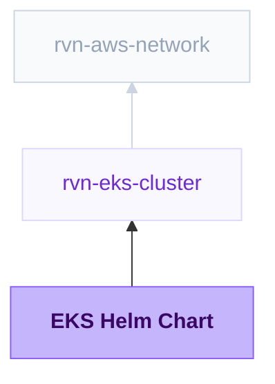

{/* Generated by scripts/sync-module-catalog.mjs from the Ravion module catalog. Do not edit by hand. */}

**Type:** `rvn-eks-chart` · **Latest version:** `0.1.2`

## Dependencies and consumers



_Every dependency input can be specified manually to reference existing external infrastructure rather than a Ravion module. Set the dependency input to `null` and set its mapped inputs directly; see [Use existing infrastructure instead of a module reference](/config-as-code/project-config-file#use-existing-infrastructure-instead-of-a-module-reference)._

## Readme

Install any third-party Helm chart onto an EKS cluster: NATS, Redis, Grafana, cert-manager, or anything else published to a Helm repository or an OCI registry.

### Overview

EKS Helm Chart deploys a chart you don't maintain onto an existing Ravion EKS cluster. Point it at a chart and a version, write the values you want in JSON, and Ravion installs the release. Each deploy runs `helm upgrade --install --atomic`, so a failed deploy rolls back to the previous revision automatically.

Unlike EKS Web Service and EKS Worker, this module has no build and no image. The chart decides which Kubernetes resources to create, and your values configure them.

Terraform source: [ravionhq/modules/compute/eks_service](https://github.com/ravionhq/modules/tree/rvn-eks-chart@0.1.2/compute/eks_service)

### Use cases

| Scenario | EKS Helm Chart helps by... |
| -------- | -------------------------- |
| Messaging and streaming | Running NATS, RabbitMQ or Kafka inside the cluster |
| Caches and datastores | Installing Redis, Valkey or other stateful charts |
| Cluster tooling | Adding operators and controllers that are not EKS add-ons |
| Vendor agents | Installing an agent chart that a vendor publishes |

### Prerequisites

- An **EKS Cluster** module.
- For charts with persistent volumes, a storage driver such as the **EBS CSI** add-on on the EKS Add-ons module.
- For **Create IAM role**, the `eks-pod-identity-agent` add-on on the cluster.

### Chart source

| Chart source | Fields | Example |
| ------------ | ------ | ------- |
| Helm repository | **Repository URL** and **Chart name** | `https://nats-io.github.io/k8s/helm/charts/` and `nats` |
| OCI registry | **Chart URL** | `oci://registry-1.docker.io/bitnamicharts/redis` |

**Chart version** is the chart's own version from its `Chart.yaml`. It is not the version of the app the chart installs (`appVersion`), though some charts, such as NATS, keep the two in step. To find the available versions:

| Chart source | How to list versions |
| ------------ | -------------------- |
| Helm repository | `helm repo add <repo> <repository URL>`, then `helm search repo <repo>/<chart> --versions`. The repository's `index.yaml` lists the same versions. |
| OCI registry | `helm show chart <chart URL>` for the latest version, or the registry's tag list for every version |
| Either | Search for the chart on [Artifact Hub](https://artifacthub.io), which shows its versions, release notes and default values |

Chart version pins the release to one chart version. If you leave it blank, each deploy installs whatever the repository marks as latest, so a redeploy can upgrade the chart without warning. Pin a version for anything you run in production. You can also override the version for a single deploy.

For a private HTTPS repository or OCI registry, set **Registry credentials** to a username and password pair. Each one is a reference to Parameter Store (`from_parameter_store`) or Secrets Manager (`from_secrets_manager`), never the value itself. Ravion resolves them on the deploy runner.

### Chart values

**Values** is the JSON form of a Helm values file. Ravion passes it to Helm as `--values`, and Helm merges it over the chart's defaults. Any value the chart supports can be set this way, including nested objects and lists. To find the available values, see the chart's `values.yaml` or run `helm show values <chart>`.

For example, a three-node NATS cluster with JetStream enabled:

```json
{
  "config": {
    "cluster": { "enabled": true, "replicas": 3 },
    "jetstream": {
      "enabled": true,
      "fileStore": { "pvc": { "size": "20Gi", "storageClassName": "gp3" } }
    }
  },
  "podDisruptionBudget": { "enabled": true }
}
```

The top-level key `ravion` is reserved, and a deploy whose values set it fails. Values are stored in the Helm release, so don't put secrets in them. Reference a Kubernetes Secret that the chart can read instead, for example one created by the External Secrets Operator.

### AWS permissions

**Create IAM role** creates an IAM role and binds it through EKS Pod Identity to a ServiceAccount in the release namespace. Set **ServiceAccount name** to the ServiceAccount the chart creates. This is usually the release name, but check the chart's `serviceAccount.name` value. The role's trust policy only accepts pods in this cluster and account.

### Deployment

Every deploy runs `helm upgrade --install --atomic`, so a release either lands completely or the cluster stays on the previous revision. Deploys collapse: if several are queued, only the newest runs.

Destroying the module's stack runs `helm uninstall` on the release. The namespace is never deleted, because other releases may share it. Some charts leave PersistentVolumeClaims behind on uninstall. Delete them yourself if you no longer need the data.

### Configuration

| Field | Required | Default | Description |
| ----- | -------- | ------- | ----------- |
| Cluster | Yes | - | Existing rvn-eks-cluster module instance |
| Service name | Yes | \{project\}-\{env\}-\{module\} | Helm release name |
| Namespace | Yes | \{project\}-\{env\} | Kubernetes namespace the release installs into |
| Create namespace | No | true | Create the namespace if it does not exist |
| Chart source | Yes | Helm repository | Helm repository or OCI registry |
| Repository URL | Yes* | - | HTTPS Helm repository URL, for Helm repository sources |
| Chart name | Yes* | - | Chart name within the repository, for Helm repository sources |
| Chart URL | Yes* | - | `oci://` chart reference, for OCI registry sources |
| Chart version | No | Latest | Chart version to install |
| Registry credentials | No | - | Username and password references for a private source |
| Values | No | \{\} | Helm values as JSON, merged over the chart's defaults |
| Create IAM role | No | false | Create an IAM role bound to the chart's ServiceAccount through EKS Pod Identity |
| ServiceAccount name | No | Release name | ServiceAccount the role is bound to |
| IAM role name | No | \{release\}-task | Explicit role name |
| IAM policy ARNs | No | [] | Managed policy ARNs attached to the role |
| IAM inline policies | No | - | Inline policy documents keyed by name |
| Tags | No | Standard Ravion tags | Additional tags applied to AWS resources |
| Advanced Terraform variables | No | \{\} | Raw lower-level overrides for exceptional cases |
| OpenTofu version override | No | Ravion default | Override the OpenTofu version for the stack |
| Ravion Terraform workspace name | No | \{project\}-\{env\}-\{module\} | Override the state backend workspace name |

### Design decisions

- **Values are a single JSON document.** A chart's values can be any shape. A single document covers all of them, and it maps directly onto the values file that the chart's own documentation describes.
- **No Git chart source.** EKS Web Service, EKS Worker and EKS Cron already cover charts you build yourself. This module is for charts someone else publishes.
- **No Ravion secret injection.** EKS Web Service and EKS Worker render an ExternalSecret from secret references. A third-party chart does not know about that mechanism, so this module does not offer it.
- **Name and namespace are fixed after creation.** Together they identify the Helm release that rollback, history and uninstall target.

### Learn more

- [Helm values files](https://helm.sh/docs/chart_template_guide/values_files/)
- [Helm OCI registries](https://helm.sh/docs/topics/registries/)
- [EKS Pod Identity](https://docs.aws.amazon.com/eks/latest/userguide/pod-identities.html)

## Inputs reference

All inputs for `rvn-eks-chart` version `0.1.2`. Use the `name` shown for each field as the input key in module config.

### EKS cluster

<ResponseField name="cluster" type="$ref:rvn-eks-cluster" required>
  **Cluster.**

  - Immutable after creation
</ResponseField>

### Helm release

<ResponseField name="name" type="string" required>
  **Service name.** Charts usually prefix the Kubernetes objects they create with this name.

  - Default: `<<project.given_id>>-<<environment.given_id>>-<<module.given_id>>`
  - Immutable after creation
  - Pattern: `^[a-z0-9]([a-z0-9-]{0,51}[a-z0-9])?$` — 1-53 lowercase letters, numbers, and hyphens. Start and end with a letter or number.
</ResponseField>

<ResponseField name="namespace" type="string" required>
  **Namespace.** Kubernetes namespace the release installs into.

  - Default: `<<project.given_id>>-<<environment.given_id>>`
  - Immutable after creation
  - Pattern: `^[a-z0-9]([a-z0-9-]{0,61}[a-z0-9])?$` — 1-63 lowercase letters, numbers, and hyphens. Start and end with a letter or number.
</ResponseField>

<ResponseField name="namespace_creation_enabled" type="boolean">
  **Create namespace.** Create the namespace if it does not already exist. Turn off when the namespace is managed elsewhere.

  - Default: `true`
</ResponseField>

### Chart

<ResponseField name="chart_source_type" type="string" required>
  **Chart source.**

  - Default: `http`
  - Allowed values: `http` (Helm repository), `oci` (OCI registry)
</ResponseField>

<ResponseField name="chart_repository_url" type="string" required>
  **Repository URL.** HTTPS protects private repository credentials in transit.

  - Pattern: `^https://\S+$` — An https:// URL.
  - Shown when: `{"chart_source_type":"http"}`
</ResponseField>

<ResponseField name="chart_name" type="string" required>
  **Chart name.** Omit the repository prefix (nats, not nats/nats).

  - Pattern: `^[A-Za-z0-9][A-Za-z0-9._-]*$` — A chart name without the repository prefix, such as nats rather than nats/nats.
  - Shown when: `{"chart_source_type":"http"}`
</ResponseField>

<ResponseField name="chart_url" type="string" required>
  **Chart URL.** Include the oci:// prefix; omit the version tag.

  - Pattern: `^oci://[^\s:]+(:[0-9]+)?/[^\s:@]+$` — An oci:// reference without a tag, such as oci://registry-1.docker.io/bitnamicharts/redis.
  - Shown when: `{"chart_source_type":"oci"}`
</ResponseField>

<ResponseField name="chart_version" type="string">
  **Chart version.** Pin the chart version (not appVersion) for repeatable deploys. Blank uses the latest version on each deploy.
</ResponseField>

<ResponseField name="chart_registry_credentials" type="object">
  **Registry credentials.** Username and password references in Parameter Store or Secrets Manager, resolved on the deploy runner. Leave blank for public sources.
</ResponseField>

### Chart values

<ResponseField name="values" type="object">
  **Values.** JSON merged over the chart's defaults. The top-level ravion key is reserved; do not include secrets because Helm stores values in the release.

  - Default: `{}`
</ResponseField>

### AWS permissions

<ResponseField name="pod_identity_role_creation_enabled" type="boolean">
  **Create IAM role.** Gives chart pods short-lived AWS credentials through EKS Pod Identity. Requires the pod-identity-agent add-on; leave off if the chart does not call AWS APIs.

  - Default: `false`
</ResponseField>

<ResponseField name="pod_identity_service_account_name" type="string">
  **ServiceAccount name.** Must match the chart's ServiceAccount (often serviceAccount.name). Blank uses the release name.

  - Pattern: `^[a-z0-9]([a-z0-9.-]{0,251}[a-z0-9])?$` — 1-253 lowercase letters, numbers, dots and hyphens. Start and end with a letter or number.
  - Shown when: `{"pod_identity_role_creation_enabled":true}`
</ResponseField>

<ResponseField name="pod_identity_role_name" type="string">
  **IAM role name.** Blank uses \<release name>-task. Must be unique within the AWS account.

  - Pattern: `^[\w+=,.@-]{1,64}$` — 1-64 characters of letters, digits and + = , . @ _ -
  - Shown when: `{"pod_identity_role_creation_enabled":true}`
</ResponseField>

<ResponseField name="pod_identity_managed_policy_arns" type="string_array">
  **IAM policy ARNs.** Attached to the generated Pod Identity role.

  - Default: `[]`
  - Shown when: `{"pod_identity_role_creation_enabled":true}`
</ResponseField>

<ResponseField name="pod_identity_inline_policies" type="object">
  **IAM inline policies.** Keyed by policy name and attached to the generated role.

  - Shown when: `{"pod_identity_role_creation_enabled":true}`
</ResponseField>

### Misc

<ResponseField name="tags" type="keyvalue">
  **Tags.** A map of tags to assign to all resources. Default tags are `Owner`, `ProjectGivenId`, `EnvironmentGivenId`, `ModuleGivenId`, `ModuleId`
</ResponseField>

### Terraform settings

<ResponseField name="opentofu_version" type="string">
  **OpenTofu version override.** Override the environment's default version for this module
</ResponseField>

<ResponseField name="ravion_state_backend_workspace" type="string">
  **Ravion Terraform workspace name.** Override Terraform state backend workspace name. Defaults to project + environment + module given ids.

  - Immutable after creation
</ResponseField>

<ResponseField name="advanced_terraform_variables" type="object">
  **Advanced Terraform variables.** Optional raw Terraform variable overrides for advanced module inputs or one-off overrides. Values here override the generated variables above.

  - Default: `{}`
</ResponseField>
