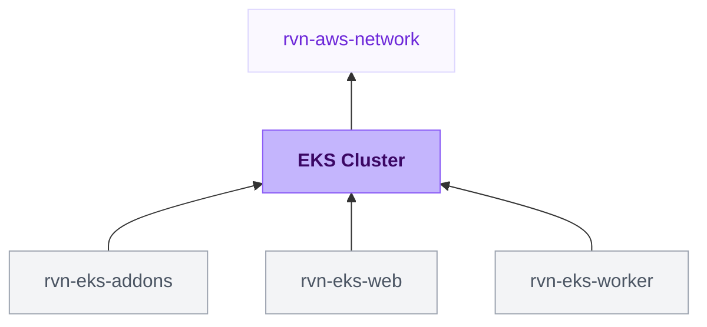

{/* Generated by scripts/sync-module-catalog.mjs from the Ravion module catalog. Do not edit by hand. */}

**Type:** `rvn-eks-cluster` · **Latest version:** `0.2.0`

## Dependencies and consumers

_Every dependency input can be specified manually to reference existing external infrastructure rather than a Ravion module._

## Readme

Production-ready Amazon EKS cluster with default managed capacity, core add-ons, and optional Fargate compute. Extend with the **EKS Add-ons** module (Karpenter, load balancer controller, EBS CSI, Container Insights).

### Overview

Amazon EKS (Elastic Kubernetes Service) runs managed Kubernetes control planes on AWS. This module creates an EKS cluster inside your selected VPC and provisions everything a working cluster needs, in the correct order:

1. **Cluster** - control plane, secrets encryption, VPC CNI, kube-proxy, Pod Identity Agent, and the AWS Load Balancer Controller IAM role; optional OIDC provider for IRSA workloads
2. **Default capacity** - a managed node group for cluster components, add-ons, and workloads without stricter placement
3. **CoreDNS** - installed only after compute exists so it starts healthy
4. **Optional compute** - additional managed node groups and Fargate profiles

This module talks only to the AWS API, so it provisions in a single apply. Optional extensions - Karpenter autoscaling, the AWS Load Balancer Controller, the EBS CSI driver, and Container Insights - are added by the separate **EKS Add-ons** module, so clusters only carry what they use.

Terraform source: [ravionhq/modules/compute/eks](https://github.com/ravionhq/modules/tree/rvn-eks-cluster@0.2.0/compute/eks)

### Use cases

| Scenario                          | EKS cluster helps by...                                          |
| --------------------------------- | ---------------------------------------------------------------- |
| Running Kubernetes workloads      | Providing a managed control plane and ready-to-use node group    |
| Autoscaling, ingress, storage, observability | Pairing with the EKS Add-ons module (Karpenter, load balancer controller, EBS CSI, Container Insights) |
| Running serverless pods           | Creating Fargate profiles for selected namespaces                |
| Exposing services                 | Creating the AWS Load Balancer Controller IAM role automatically |
| Meeting security requirements     | Encrypting secrets with KMS and keeping the API endpoint private |

### Compute

#### Default capacity

Every cluster gets a required managed node group that provides default compute for cluster components such as CoreDNS, add-ons, and workloads without stricter placement. It defaults to 2-4 On-demand `t3.medium` nodes. Its settings are collapsed by default so teams using Karpenter can keep the recommended baseline without extra configuration. The minimum node count is also used as the initial size; after creation, the running node count is managed by Kubernetes autoscalers, and Terraform only enforces the min/max bounds. Each workload module can use automatic placement or target EC2 On-demand, EC2 Spot, or a dedicated Fargate profile.

#### Additional node groups

Add managed node groups for application workloads through the **Additional node groups** form. Each group independently chooses On-demand or Spot capacity, instance types, size bounds, labels, and taints. The minimum node count is also the initial node count. Add one On-demand group and one Spot group when workloads should be able to use both. Multiple instance types are especially useful for Spot because AWS can choose from more available pools.

#### Karpenter

This module does not create any Karpenter resources. To add Karpenter autoscaling, deploy the **EKS Add-ons** module referencing this cluster - it provisions everything Karpenter needs (IAM roles, Pod Identity association, instance profile, interruption queue, EventBridge rules) and installs the controller and a default NodePool.

#### Fargate

Fargate profiles run pods from selected namespaces on serverless compute instead of EC2 nodes. Each profile matches one or more namespace selectors, optionally narrowed by pod labels. Profiles use the cluster's private subnets and a generated pod execution role unless you override them.

### Cluster access

By default the Kubernetes API server is reachable only from inside the VPC. Enable **Public endpoint access** to reach it from the internet, and restrict the allowed source ranges with **Public access CIDRs**.

A **Ravion Runner security group** is created automatically and allowed to reach the API endpoint on port 443. Modules that talk to the Kubernetes API (such as **EKS Add-ons** with Karpenter enabled) pick it up from this cluster so their pipeline runs can reach a private endpoint, so there is nothing to configure. Its ID is available as the `ravion_runner_security_group_id` stack output.

A **Ravion Runner role** is also created by default: a stable IAM role registered as an EKS access entry with cluster-admin, which Ravion Runner step executions assume when they need the Kubernetes API. This keeps per-run pipeline roles out of the cluster's access configuration — the EKS Add-ons module assumes it automatically via `aws eks get-token`. Its ARN is available as the `ravion_runner_role_arn` stack output. The trust policy admits only this AWS account; tighten it further with the `ravion_runner_role_trusted_principal_arns` Terraform variable.

EKS access entries control which IAM principals can access the cluster. The IAM principal that creates the cluster is granted admin access automatically. Grant additional principals access through the **Access entries** form: give each entry an IAM principal ARN, then attach EKS access policies scoped to the whole cluster or to selected namespaces, and optionally map the principal to Kubernetes RBAC groups. Automatic access for Ravion deploys will be wired here in a future release.

#### IAM compatibility when upgrading

Add-ons use EKS Pod Identity, so the IAM OIDC provider and its certificate lookup are now off by default. Existing workloads that use IRSA need `oidc_provider_creation_enabled: true` under **Advanced Terraform variables** before upgrading to retain their provider. The cluster's issuer URL remains available even without an IAM provider.

The cluster role no longer includes `AmazonEKSVPCResourceController` by default. Existing Windows networking or security groups for pods need `vpc_resource_controller_policy_enabled: true` under **Advanced Terraform variables** to retain it. Ordinary Linux pod networking and multi-AZ placement do not need it.

Managed node roles replace ECR `ReadOnly` with `PullOnly`, matching Karpenter nodes. This updates IAM attachments without replacing nodes. Worker-node and CNI permissions remain in place.

### Networking

#### Zone-local routing

A multi-AZ cluster spreads pods across availability zones for resilience, but by default Kubernetes also spreads every in-cluster request across those zones, and AWS bills cross-AZ data transfer in both directions. This module keeps that traffic local by default:

- **CoreDNS** is spread across zones with a `topology.kubernetes.io/zone` topology spread constraint, so every zone has a resolver.
- The **EKS Add-ons** module patches the `kube-dns` Service with `trafficDistribution: PreferClose`, so DNS lookups go to the resolver in the caller's zone.
- The **EKS Web Service** chart sets the same `trafficDistribution` on each workload Service, and both the Web Service and Worker charts spread their pods across zones, so service-to-service calls stay in-zone whenever the destination has a pod there.

When a zone has no pod for the destination, traffic falls back to every zone; nothing is ever dropped. The spread is a soft preference (`ScheduleAnyway`), so a two-node cluster or a Spot interruption never leaves pods pending. Zone-local routing needs Kubernetes 1.31 or later; on older versions the Service field is ignored and routing behaves as before.

Turn it off for the cluster by setting `topology_aware_routing_enabled: false` under **Advanced Terraform variables**; the EKS Add-ons module reads the same flag from this cluster's outputs. Individual workloads keep the chart defaults regardless of the cluster flag.

### Observability

Control plane logs (API server, audit, and authenticator by default) are shipped to CloudWatch Logs and shown on the module's Logs tab. Adjust the log types and retention in the Observability section.

Container Insights (node, pod, and container metrics plus application/data plane logs) is installed through the **EKS Add-ons** module; once enabled there, its data populates this module's Metrics and Logs tabs. Control plane health metrics (API server requests and errors, pending pods, etcd database size) are published by EKS automatically at no cost and appear on the Metrics tab regardless.

### Configuration

| Field                  | Required | Default              | Description                                            |
| ---------------------- | -------- | -------------------- | ------------------------------------------------------ |
| VPC network            | Yes      | -                    | Existing VPC, subnets, AWS account, and region         |
| EKS cluster name       | Yes      | `{project}-{env}`    | Name of the EKS cluster                                |
| Kubernetes version     | No       | Latest               | Cluster version in MAJOR.MINOR form                    |
| Deletion protection    | No       | `true`               | Blocks cluster deletion until turned off               |
| Secrets encryption     | No       | `true`               | Envelope-encrypt Kubernetes secrets with KMS           |
| Private endpoint access| No       | `true`               | Reach the API server from inside the VPC               |
| Public endpoint access | No       | `false`              | Expose the API server to the internet                  |
| Ravion Runner role     | No       | `true`               | Assumable IAM role with cluster-admin access entry     |
| Default capacity       | No       | 2-4 `t3.medium`      | Capacity type, instance types, size bounds, and disk size   |
| Additional node groups | No       | -                    | Structured On-demand or Spot managed node groups       |
| Fargate profiles       | No       | -                    | Serverless compute for selected namespaces             |
| Access entries         | No       | -                    | Extra IAM principals with cluster access and policies  |
| Control plane logs     | No       | api, audit, authenticator | Log types shipped to CloudWatch                   |
| Zone-local routing     | No       | `true`               | Spread CoreDNS across zones; advanced Terraform variable `topology_aware_routing_enabled` |
| Tags                   | No       | Ravion defaults      | Custom tags applied to all resources                   |

### Design decisions

This module follows AWS EKS production patterns:

- **Ordered provisioning:** CoreDNS is installed only after the default capacity node group exists, avoiding the add-on deadlock that occurs on clusters without compute
- **Private by default:** the API endpoint is private unless public access is explicitly enabled
- **Encrypted secrets:** Kubernetes secrets are envelope-encrypted with KMS by default
- **Deletion protection on:** the cluster cannot be deleted until protection is turned off, preventing accidental destroys
- **Autoscaler-friendly sizing:** Terraform sets the initial node count but never fights an autoscaler over the running count
- **Pod Identity over IRSA:** add-on IAM roles use EKS Pod Identity associations; creating an IAM OIDC provider for IRSA workloads is opt-in
- **Zone-local by default:** CoreDNS is spread across availability zones and, together with the EKS Add-ons and workload modules, Service traffic prefers same-zone endpoints, so multi-AZ resilience does not come with cross-AZ data transfer charges on every request

### Learn more

**Amazon EKS**

- [Amazon EKS User Guide](https://docs.aws.amazon.com/eks/latest/userguide/) - Official documentation
- [EKS access entries](https://docs.aws.amazon.com/eks/latest/userguide/access-entries.html) - IAM principal access management
- [EKS Pod Identity](https://docs.aws.amazon.com/eks/latest/userguide/pod-identities.html) - IAM roles for workloads

**Compute**

- [Managed node groups](https://docs.aws.amazon.com/eks/latest/userguide/managed-node-groups.html) - EC2 node lifecycle management
- [Karpenter](https://karpenter.sh/docs/) - Just-in-time node autoscaling
- [Fargate for EKS](https://docs.aws.amazon.com/eks/latest/userguide/fargate.html) - Serverless pods

## Inputs reference

All inputs for `rvn-eks-cluster` version `0.2.0`. Use the `name` shown for each field as the input key in module config.

<ResponseField name="network" type="$ref:rvn-aws-network" required>
  **VPC network.**

  - Immutable after creation
</ResponseField>

### EKS cluster config

<ResponseField name="name" type="string" required>
  **EKS cluster name.** Name and prefix for related resources.

  - Default: `<<project.given_id>>-<<environment.given_id>>`
  - Immutable after creation
  - Pattern: `^[0-9A-Za-z][A-Za-z0-9-_]{0,99}$` — 1-100 letters, numbers, hyphens, and underscores. Start with a letter or number.
</ResponseField>

<ResponseField name="kubernetes_version" type="string" required>
  **Kubernetes version.** Kubernetes version for the EKS cluster.

  - Default: `$values:first`
</ResponseField>

<ResponseField name="deletion_protection_enabled" type="boolean">
  **Deletion protection.** Prevent the cluster from being deleted via the AWS API. Must be turned off before this module can be destroyed.

  - Default: `true`
</ResponseField>

<ResponseField name="secrets_encryption_enabled" type="boolean">
  **Secrets encryption.** Envelope-encrypt Kubernetes secrets with a KMS key. A key is created automatically unless an existing key ARN is provided below.

  - Default: `true`
</ResponseField>

<ResponseField name="secrets_kms_key_arn" type="string">
  **Secrets KMS key ARN.** Existing KMS key for Kubernetes secrets encryption. Leave blank to create a dedicated key.

  - Shown when: `{"secrets_encryption_enabled":true}`
</ResponseField>

### Default capacity

<ResponseField name="system_node_capacity_type" type="string">
  **Capacity type.** On-demand is stable default capacity; Spot is lower cost but nodes can be interrupted.

  - Default: `ON_DEMAND`
  - Allowed values: `ON_DEMAND` (On-demand), `SPOT` (Spot)
</ResponseField>

<ResponseField name="system_node_instance_types" type="string_array" required>
  **Instance types.** EC2 instance types AWS may use for this node group. Multiple types improve Spot availability.

  - Default: `["t3.medium"]`
</ResponseField>

<ResponseField name="system_node_min_size" type="number">
  **Minimum nodes.** Minimum nodes in the default managed node group. Set it high enough to run cluster components and leave spare capacity for workloads and rolling node updates.

  - Default: `2`
  - Min: `1`
</ResponseField>

<ResponseField name="system_node_max_size" type="number">
  **Maximum nodes.** Maximum nodes in the default managed node group. Set it high enough for peak workloads and replacement capacity during rolling node updates, otherwise pods can remain pending.

  - Default: `4`
  - Min: `1`
</ResponseField>

<ResponseField name="system_node_disk_size" type="number">
  **Disk size (GB).** Root EBS volume size for default capacity nodes. Leave blank for the AMI default.

  - Min: `20`
</ResponseField>

<ResponseField name="node_groups" type="object_map">
  **Additional node groups.** Add independently sized On-demand or Spot managed node groups when workloads need more or separate capacity. Create one of each to make both capacity types available.

  - Default: `{}`

  <Expandable title="item fields">
    <ResponseField name="capacity_type" type="string" required>
      **Capacity type.** On-demand is stable capacity; Spot is lower cost but can be interrupted by AWS.

      - Default: `ON_DEMAND`
      - Allowed values: `ON_DEMAND` (On-demand), `SPOT` (Spot)
    </ResponseField>
    <ResponseField name="instance_types" type="string_array" required>
      **Instance types.** EC2 instance types AWS may use for this node group. Multiple types improve Spot availability.

      - Default: `["t3.medium"]`
    </ResponseField>
    <ResponseField name="min_size" type="number" required>
      **Minimum nodes.** Minimum nodes in this managed node group. Set it high enough to leave spare capacity for workloads and rolling node updates.

      - Default: `1`
      - Min: `0`
    </ResponseField>
    <ResponseField name="max_size" type="number" required>
      **Maximum nodes.** Maximum nodes in this managed node group. Set it high enough for peak workloads and replacement capacity during rolling node updates, otherwise pods can remain pending.

      - Default: `3`
      - Min: `1`
    </ResponseField>
    <ResponseField name="disk_size" type="number">
      **Root volume size (GB).** Root EBS volume size for nodes. Leave blank for the AMI default.

      - Min: `20`
    </ResponseField>
    <ResponseField name="labels" type="keyvalue">
      **Node labels.** Kubernetes labels applied to nodes in this group.

      - Default: `{}`
    </ResponseField>
    <ResponseField name="taints" type="object_array">
      **Taints.** Kubernetes taints that restrict which pods can use this group.

      - Default: `[]`

      <Expandable title="item fields">
        <ResponseField name="key" type="string" required>
          **Key.**
        </ResponseField>
        <ResponseField name="value" type="string">
          **Value.**
        </ResponseField>
        <ResponseField name="effect" type="string" required>
          **Effect.**

          - Allowed values: `NO_SCHEDULE` (No schedule), `PREFER_NO_SCHEDULE` (Prefer no schedule), `NO_EXECUTE` (No execute)
        </ResponseField>
      </Expandable>
    </ResponseField>
  </Expandable>
</ResponseField>

### Fargate

<ResponseField name="fargate_profiles" type="object_map">
  **Fargate profiles.** Run pods from selected namespaces on AWS Fargate instead of EC2 nodes.

  - Default: `{}`

  <Expandable title="item fields">
    <ResponseField name="selectors" type="object_array" required>
      **Selectors.** Namespaces whose pods run on this profile. At least one selector is required.

      <Expandable title="item fields">
        <ResponseField name="namespace" type="string" required>
          **Namespace.** Kubernetes namespace matched by this selector.
        </ResponseField>
        <ResponseField name="labels" type="keyvalue">
          **Pod labels.** Optional pod labels that narrow the match to specific pods in the namespace. Leave empty to match every pod.

          - Default: `{}`
        </ResponseField>
      </Expandable>
    </ResponseField>
    <ResponseField name="subnet_ids" type="string_array">
      **Subnet IDs.** Private subnets for Fargate pods in this profile. Leave empty to use the cluster's private subnets. Public subnets are not supported by Fargate.
    </ResponseField>
    <ResponseField name="pod_execution_role_arn" type="string">
      **Pod execution role ARN.** Existing pod execution role for this profile. Leave blank to create one automatically.
    </ResponseField>
  </Expandable>
</ResponseField>

### Cluster access

<ResponseField name="endpoint_private_access_enabled" type="boolean">
  **Private endpoint access.** Allow access to the Kubernetes API server from inside the VPC.

  - Default: `true`
</ResponseField>

<ResponseField name="endpoint_public_access_enabled" type="boolean">
  **Public endpoint access.** Allow access to the Kubernetes API server from the public internet.

  - Default: `false`
</ResponseField>

<ResponseField name="endpoint_public_access_cidrs" type="string_array">
  **Public access CIDRs.** IPv4 CIDR blocks allowed to reach the public API server endpoint. Terraform defaults to 0.0.0.0/0.

  - Shown when: `{"endpoint_public_access_enabled":true}`
</ResponseField>

<ResponseField name="ravion_runner_role_creation_enabled" type="boolean">
  **Ravion Runner role.** Create an IAM role that Ravion Runner step executions assume for Kubernetes API access, registered as an EKS access entry with cluster-admin. Used by the EKS Add-ons module to install Helm charts.

  - Default: `true`
</ResponseField>

<ResponseField name="access_entries" type="object_map">
  **Access entries.** Additional IAM principals that need cluster access. The principal that creates the cluster receives admin access automatically.

  - Default: `{}`

  <Expandable title="item fields">
    <ResponseField name="principal_arn" type="string" required>
      **IAM principal ARN.** IAM role or user granted access to the cluster.
    </ResponseField>
    <ResponseField name="type" type="string" required>
      **Entry type.** Standard covers people and automation. The node types register node roles and are normally managed by the module that creates the nodes.

      - Default: `STANDARD`
      - Allowed values: `STANDARD` (Standard), `EC2_LINUX` (EC2 Linux node), `EC2_WINDOWS` (EC2 Windows node), `FARGATE_LINUX` (Fargate Linux node)
    </ResponseField>
    <ResponseField name="kubernetes_groups" type="string_array">
      **Kubernetes groups.** Kubernetes RBAC groups this principal is mapped to, in addition to any access policies below. Group names cannot start with "system:".

      - Default: `[]`
      - Shown when: `{"type":"STANDARD"}`
    </ResponseField>
    <ResponseField name="user_name" type="string">
      **Kubernetes user name.** Kubernetes user name this principal is mapped to. Leave blank to let EKS derive one.

      - Shown when: `{"type":"STANDARD"}`
    </ResponseField>
    <ResponseField name="policy_associations" type="object_map">
      **Access policies.** EKS access policies granted to this principal, such as cluster admin or namespace-scoped admin.

      - Default: `{}`
      - Shown when: `{"type":"STANDARD"}`

      <Expandable title="item fields">
        <ResponseField name="policy_arn" type="string" required>
          **Policy ARN.** ARN of the EKS access policy to grant.
        </ResponseField>
        <ResponseField name="access_scope_type" type="string" required>
          **Access scope.** Grant the policy across the whole cluster or only in selected namespaces.

          - Default: `cluster`
          - Allowed values: `cluster` (Whole cluster), `namespace` (Selected namespaces)
        </ResponseField>
        <ResponseField name="access_scope_namespaces" type="string_array" required>
          **Namespaces.** Namespaces the policy applies to.

          - Shown when: `{"access_scope_type":"namespace"}`
        </ResponseField>
      </Expandable>
    </ResponseField>
  </Expandable>
</ResponseField>

### Observability

<ResponseField name="control_plane_log_types" type="string_array">
  **Control plane log types.** Control plane log types shipped to CloudWatch Logs. Remove all entries to disable control plane logging.

  - Default: `["api","audit","authenticator"]`
  - Allowed values: `api` (API server), `audit` (Audit), `authenticator` (Authenticator), `controllerManager` (Controller manager), `scheduler` (Scheduler)
</ResponseField>

<ResponseField name="control_plane_log_retention_days" type="number">
  **Log retention (days).** Retention in days for the control plane CloudWatch log group.

  - Default: `30`
  - Min: `1`
</ResponseField>

### Misc

<ResponseField name="tags" type="keyvalue">
  **Tags.** A map of tags to assign to all resources. Default tags are `Owner`, `ProjectGivenId`, `EnvironmentGivenId`, `ModuleGivenId`, `ModuleId`
</ResponseField>

### Terraform settings

<ResponseField name="opentofu_version" type="string">
  **OpenTofu version override.** Override the environment's default version for this module
</ResponseField>

<ResponseField name="ravion_state_backend_workspace" type="string">
  **Ravion Terraform workspace name.** Override Terraform state backend workspace name. Defaults to project + environment + module given ids.

  - Immutable after creation
</ResponseField>

<ResponseField name="advanced_terraform_variables" type="object">
  **Advanced Terraform variables.** Optional raw Terraform variable overrides for advanced module inputs or one-off overrides. Values here override the generated variables above.

  - Default: `{}`
</ResponseField>
