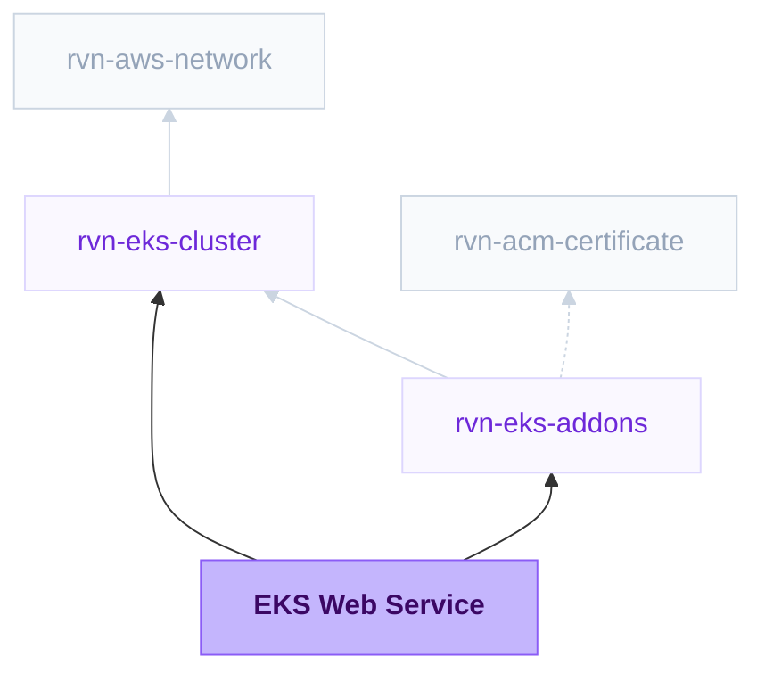

{/* Generated by scripts/sync-module-catalog.mjs from the Ravion module catalog. Do not edit by hand. */}

**Type:** `rvn-eks-web` · **Latest version:** `1.1.2`

## Dependencies and consumers

_Every dependency input can be specified manually to reference existing external infrastructure rather than a Ravion module._

## Readme

Web server on EKS for running any HTTP application on your Kubernetes cluster behind a shared load balancer, with no Kubernetes manifests or Helm charts to write.

### Overview

EKS Web Service deploys a web app - any HTTP application in a container - to an existing Ravion EKS cluster. Point it at a Git repository or an image you already have, set the port, routing rules, health checks, and scaling in a form, and Ravion builds the image, deploys it, and routes traffic to it through the cluster's shared load balancer. There are no Kubernetes manifests to write and no Helm charts to maintain.

Under the hood, each deploy installs a Helm chart that Ravion maintains - a packaged template of the Kubernetes resources a web service needs. The `rvn-eks-web` chart renders the Deployment that runs your pods, the Service in front of them, a ServiceAccount, an optional HorizontalPodAutoscaler, and the `TargetGroupBinding` that puts your pods behind the load balancer. Each release runs `helm upgrade --install --atomic`, so a failed deploy rolls back to the previous revision on its own.

The module has three parts that update independently:

| Part | Owns | Changes when |
| ---- | ---- | ------------ |
| Terraform stack | Load balancer target group, listener rule, optional ECR repository, optional EKS Fargate profile, and the service address outputs | You change routing, health checks, the container port, build source, or compute target |
| Build | The container image, from a Dockerfile or Railpack | Every build, unless the build source is an existing registry image |
| Helm deploy | Deployment, Service, HPA, secrets wiring | Every release, and whenever runtime settings change |

Terraform owns the `aws_lb_target_group` and `aws_lb_listener_rule` against a shared load balancer, and the AWS Load Balancer Controller registers pod IPs into that target group. The chart does not create an Ingress, so no per-service load balancer is provisioned. This is the same routing shape as ECS Web Server, so a service moving from ECS keeps its routing model.

Chart source: [ravionhq/modules/charts/rvn-eks-web](https://github.com/ravionhq/modules/tree/rvn-eks-web@1.1.2/charts/rvn-eks-web)

Terraform source: [ravionhq/modules/compute/eks_service](https://github.com/ravionhq/modules/tree/rvn-eks-web@1.1.2/compute/eks_service)

### Use cases

| Scenario | EKS Web Service helps by... |
| -------- | --------------------------- |
| Running a public web app on Kubernetes | Routing host or path traffic through the shared public ALB |
| Hosting an internal HTTP API | Routing private traffic through the shared private ALB |
| Building from source | Creating images with a Dockerfile or Railpack and pushing to ECR |
| Moving a service from ECS to EKS | Keeping the same routing, health check, and `{name, value_from}` secret shape |
| Adopting Kubernetes without writing charts | Deploying a maintained chart you configure through a form |
| Handling variable traffic | Scaling pods with a HorizontalPodAutoscaler on CPU and optionally memory |

### Prerequisites

- An **EKS Cluster** module.
- An **EKS add-ons** module attached to that same cluster, with the public or private ALB enabled. Enabling a shared load balancer automatically installs the AWS Load Balancer Controller, which is what makes the `TargetGroupBinding` work.
- The **External Secrets Operator** add-on, if the service uses Runtime secrets.

Both references must point at the same cluster. Ravion does not cross-check them, and a listener from a different cluster's VPC produces a target group that never reports a healthy pod.

### Cluster and load balancer

The EKS cluster reference supplies the AWS account, region, VPC, cluster ARN, cluster endpoint, certificate authority data, and the Ravion Runner role the deploy assumes to reach the Kubernetes API. The EKS add-ons reference supplies the shared ALB listeners.

Use **Public web service** when the service should be reachable from the internet through the shared public ALB. Turn it off for internal services on the shared private ALB. Either way, Ravion prefers the HTTPS listener when the selected ALB has one and falls back to HTTP.

### Routing, readiness, and recovery

Route traffic with **Domain host rules**, **Path rules**, or both. If both are empty, Ravion creates a default `/*` path rule so the listener rule has a valid condition. Use **Listener rule priority** only when you need a specific rule order; otherwise AWS assigns the next available priority.

**Traffic health path** is the main application-health setting. It should be a lightweight, unauthenticated endpoint that succeeds only when the app can receive requests. Ravion uses it for both Kubernetes traffic readiness and the load balancer health check, so users configure that decision once even though both systems enforce it.

| Application endpoint | Default | Description |
| -------------------- | ------- | ----------- |
| Container port | 8080 | Port the application listens on; used by the Service and the target group |
| Traffic health path | / | Endpoint shared by Kubernetes readiness and the load balancer |
| Success codes | 200-399 | Status codes treated as healthy |
| Interval (secs) | 5 | Seconds between load balancer checks |
| Timeout (secs) | 4 | Seconds to wait for a response; must be lower than the interval |
| Healthy threshold | 2 | Successful checks before a target is healthy |
| Unhealthy threshold | 2 | Failed checks before a target is unhealthy |

**Startup and recovery** are optional and independent. Enable **Enforce startup timeout** to restart a container that never finishes starting; its **Maximum startup time** defaults to 150 seconds. A bad startup path or a timeout shorter than the app's real boot time causes a restart loop. Enable **Restart unresponsive containers** to restart a process that remains running but stops answering. Processes that exit are restarted automatically even when this setting is off.

The startup check can use its own **Startup health path**. When blank, it uses the liveness path if one is configured, otherwise the traffic health path. The optional **Liveness health path** should only confirm that the process itself is responsive; do not include database or external-service checks, because an outage in a dependency should not restart every pod.

| Traffic behavior | Default | Description |
| ---------------- | ------- | ----------- |
| Deregistration delay (secs) | 300 | Drain window for a pod that is shutting down |
| Slow start duration (secs) | 0 | Ramp window for newly registered pods; 0 disables, otherwise 30-900 |
| Sticky sessions | false | Load balancer cookie stickiness to the same pod |

### Build and image options

| Build source | When to use it |
| ------------ | -------------- |
| Dockerfile | Build from a Dockerfile in the selected repository |
| Railpack | Let Ravion detect the app stack and build an image from source with Railpack |
| Pull from image registry | Deploy an existing image from Docker Hub, GHCR, ECR, or another registry |

For Dockerfile and Railpack builds, provide **Git repository** and optionally **Source base path**. The stack creates an ECR repository named after the service, Ravion pushes each build to it, and the chart deploys the resulting digest. Nothing else needs configuring: the repository URL reaches the chart from the stack output, and nodes pull from same-account ECR with their own credentials, so no pull secret is involved.

**Railpack** settings optionally pin the Railpack version and override the install, build, and start commands. Leave them blank for Railpack's own detection.

Use **Build environment variables** for values the build itself needs - a private registry token, a source map upload key, a `NODE_ENV` that changes what gets compiled. Values can be plain strings or references loaded from Parameter Store or Secrets Manager. For Dockerfile builds, turn on **Inject environment variables in Dockerfile** to pass them to the build as Docker build arguments; without it they are visible to the builder but not to `docker build`.

These are separate from **Runtime environment variables** further down, and deliberately so: a credential needed to install dependencies has no business being in the running pod's environment, and a value the build bakes in does not need re-supplying at runtime. Anything both halves need has to be set in both places.

For **Pull from image registry**, provide the **Image repository** without a tag, such as `123456789012.dkr.ecr.us-east-1.amazonaws.com/api`, and use **Image pull secret names** for a private registry - each entry names a Kubernetes Secret of type `kubernetes.io/dockerconfigjson` that already exists in the release namespace.

Whichever source you choose, the deploy takes an **Image tag or digest**. A value beginning with `sha256:` is used as a digest and everything else as a tag. Pinning by digest is what makes a redeploy reproducible, and it is what a Dockerfile or Railpack build passes automatically.

Use **Start command** to override the image entrypoint and **Start command arguments** to override its default arguments. Both apply to built and pulled images alike.

### Builder settings

Builder settings apply to Dockerfile and Railpack builds only.

| Field | Default | Description |
| ----- | ------- | ----------- |
| Builder instance type | ec2 | Use EC2 for predictable availability or EC2 spot for lower cost |
| Builder instance size | c7a.4xlarge | EC2 instance size used for builds |
| Builder execution environment | Cluster value | Optional override for where image builds run |
| Builder AMI | Default image | Optional AMI override for build runners |

Start with the default builder size, then adjust based on build duration and the resource usage report at the end of a build.

**Scan images on push** asks ECR to run its basic vulnerability scan on every pushed image. **Force delete image repository** lets the repository be destroyed while it still holds images; without it, destroying the module fails until the repository is emptied.

### Resources and scaling

Kubernetes schedules on requests and enforces on limits. CPU is measured in cores or millicores: 1 is one vCPU and 100m is a tenth of one. Memory uses binary units: 256Mi, 1Gi (1024Mi).

| Field | Default | Description |
| ----- | ------- | ----------- |
| CPU request | 100m | CPU reserved for the pod; the autoscaler's CPU target is a percentage of this |
| Compute target | Automatic | Let Kubernetes choose, require EC2 on-demand or EC2 Spot, or create a dedicated EKS Fargate profile |
| CPU limit | - | Optional CPU ceiling. Leaving it blank lets a pod burst into spare node CPU |
| Memory request | 256Mi | Memory reserved for the pod |
| Memory limit | 512Mi | Memory ceiling; exceeding it terminates the container with OOMKilled |

**Fargate** creates a dedicated profile matching this service's namespace and standard app instance label. Fargate pods launch only in the selected cluster's private subnets and use on-demand capacity; EKS Fargate does not offer Spot pricing. Choose an EC2 target when you need Spot savings or node-level capabilities unavailable on Fargate.

Set the memory request close to steady-state usage and the limit above the worst legitimate spike. Because the CPU target is a percentage of the CPU request, a request set far above real usage keeps the autoscaler from ever scaling out.

Autoscaling is on by default with 1 minimum and 3 maximum pods, tracking 70% CPU. Add a **Memory target (%)** to scale on memory as well; the autoscaler then takes whichever metric asks for more pods. When autoscaling is off, **Pods** sets a fixed pod count.

#### Zone-local routing

Pods are spread across the cluster's availability zones (a soft `topology.kubernetes.io/zone` spread constraint, so a small cluster never leaves pods pending), and the service's Kubernetes Service is created with `trafficDistribution: PreferClose`. Other workloads in the cluster that call this service by its Service name reach a pod in their own zone whenever one exists, and fall back to every zone otherwise, which keeps AWS cross-AZ data transfer charges off service-to-service traffic. Load balancer traffic is unaffected: the ALB registers pod IPs directly. To fully benefit, run at least as many pods as the cluster has zones. Needs Kubernetes 1.31 or later; older API servers ignore the field.

#### Service addresses

The stack publishes where this service can be reached, so other workloads can be pointed at it without assembling hostnames by hand.

| Output | Value | Notes |
| ------ | ----- | ----- |
| `service_host` | `{name}.{namespace}.svc.cluster.local` | In-cluster DNS name of the Kubernetes Service |
| `service_port` | Container port | Port the Service listens on |
| `service_url` | `http://{service_host}:{port}` | In-cluster URL; prefer it for service-to-service calls |
| `load_balancer_url` | `https://{host}` | URL through the shared load balancer |

Prefer `service_url` when the caller runs in the same cluster: traffic never leaves the VPC, skips the load balancer hop, and reaches same-zone pods first (see Zone-local routing above). The in-cluster values are derived from the service name, namespace, and port and do not depend on the load balancer, so they are known on the first apply, but the name resolves only after the first successful deploy creates the Service.

`load_balancer_url` is for callers outside the cluster. Its scheme and port follow the listener the service is attached to, HTTPS when the selected ALB has an HTTPS listener. Its host is the first **Domain host rule** without a wildcard when one is set, because a request to the bare load balancer hostname would not match a host-scoped rule; otherwise it is the load balancer's DNS name. For a public web service that is the public ALB, and for a private one the private ALB, which is reachable only from inside the VPC.

### Application configuration

Use **Runtime environment variables** for plain values, as an array of `{name, value}` objects.

Use **Runtime secrets** for sensitive values, as an array of `{name, value_from}` objects - the same shape as ECS, so a service migrating from ECS Web Server carries its secret configuration unchanged. `value_from` must be a full Secrets Manager or SSM Parameter Store ARN, including the JSON-key extraction suffix when you want a single key out of a JSON secret.

Ravion never reads these values. The ARNs travel to the chart as references, the chart renders an `ExternalSecret`, and the External Secrets Operator materializes the Kubernetes Secret in the cluster. No secret value reaches Ravion, the Helm values document, or the Helm release history.

### Deployment

Every deploy runs `helm upgrade --install --atomic`, so a release either lands completely or leaves the cluster on the previous revision. Pods roll with the chart's RollingUpdate strategy, which surges 25% and keeps zero pods unavailable.

Deployments collapse: if several are queued, only the newest runs.

### Metrics and logs

The Metrics and Logs tabs follow the providers selected on the EKS add-ons module. You configure observability once, on that module, and every workload attached to it follows; there is nothing to set here.

Where several providers can serve the same signal they form a **fallback chain**, not a merge. The tab reads the first store that can answer right now and moves to the next when it cannot, saying which store it ended up using. Reading two stores at once would draw every line twice.

| Signal | Chain order |
| ------ | ----------- |
| Logs | In-cluster store (Loki) -> Amazon CloudWatch Logs |
| Metrics | Amazon Managed Prometheus -> Prometheus in your cluster -> CloudWatch Container Insights |

The practical effect is that the in-cluster store's one weakness stops being fatal. Loki is reached through the Ravion Operator, so with the agent offline those logs are unavailable - but if CloudWatch Logs is also selected, the tab shows CloudWatch and says so, then switches back when the agent returns.

Charts are the same five golden signals whichever store answers: CPU, memory working set, container restarts, network in, and network out, plus replicas available and desired. Two things differ on the CloudWatch link of the chain, and are worth knowing before you read a number off it:

- **Container Insights reports per pod, Prometheus reports across pods.** A CloudWatch chart is an average over the workload's pods; the Prometheus charts sum them. Same shape, different magnitude.
- **It needs enhanced observability**, which the add-ons module turns on with CloudWatch by default. Without it, CPU and memory come back empty.

Replicas available falls back to Container Insights' running-pod count for this module's Kubernetes Service. Replicas desired has no CloudWatch equivalent, so with CloudWatch as the only metrics provider that one chart is empty.

The load balancer charts below the pod charts - request count, 4xx, 5xx, response time, healthy and unhealthy pods - come from the ALB this module's Terraform stack owns, not from the cluster's observability stack, so they are always present regardless of which providers are selected.

A provider that ships to a vendor rather than rendering in Ravion - Datadog, Grafana Cloud, New Relic, OpenSearch, Splunk, or a custom OTLP endpoint - adds an **Open in ...** action to the tab, pointing at this workload rather than at the vendor's front page.

Turning a signal off on the add-ons module empties the matching tab here.

### Configuration

| Field | Required | Default | Description |
| ----- | -------- | ------- | ----------- |
| Cluster | Yes | - | Existing rvn-eks-cluster module instance |
| EKS add-ons | Yes | - | Existing rvn-eks-addons module instance on the same cluster |
| Service name | Yes | \{project\}-\{env\}-\{module\} | Helm release name and name of the Kubernetes and load balancer objects |
| Namespace | Yes | \{project\}-\{env\} | Kubernetes namespace the release installs into |
| Create namespace | No | true | Create the namespace if it does not exist |
| Public web service | No | true | Use the shared public ALB; turn off for the private ALB |
| Build source | Yes | dockerfile | Dockerfile, Railpack, or Pull from image registry |
| Git repository | Yes* | - | Required for Dockerfile and Railpack builds |
| Source base path | No | . | Repository-relative source and build root |
| Dockerfile path | No | Dockerfile | Path to the Dockerfile, for Dockerfile builds |
| Docker build context path | No | . | Docker build context, for Dockerfile builds |
| Build environment variables | No | - | Values available during Dockerfile and Railpack builds |
| Inject environment variables in Dockerfile | No | false | Pass build environment variables to `docker build` as build arguments |
| Railpack version | No | Ravion default | Optional pin for Railpack builds |
| Install command | No | Railpack default | Optional Railpack dependency install command |
| Build command | No | Railpack default | Optional Railpack build command |
| Start command (Railpack) | No | Railpack default | Optional Railpack start command |
| Image repository | Yes* | - | Image repository without a tag; required for Pull from image registry |
| Image pull secret names | No | [] | Existing dockerconfigjson Secrets in the namespace, for Pull from image registry |
| Start command | No | [] | Overrides the image entrypoint |
| Start command arguments | No | [] | Overrides the image default arguments |
| Container port | Yes | 8080 | Port the application listens on |
| Traffic health path | Yes | / | Endpoint shared by Kubernetes readiness and the load balancer |
| Success codes | Yes | 200-399 | Health check status code matcher |
| Sticky sessions | No | false | Keep repeat requests on the same pod |
| Enforce startup timeout | No | false | Restart an app that does not finish starting in time |
| Maximum startup time (secs) | No | 150 | Startup time allowed before restarting the container |
| Startup health path | No | Traffic or liveness path | Optional endpoint used while the app starts |
| Restart unresponsive containers | No | false | Restart a process that remains running but stops answering |
| Liveness health path | No | Traffic health path | Optional process-only health endpoint |
| Domain host rules | No | - | Hostnames such as app.example.com or *.example.com |
| Path rules | No | - | Path patterns such as /*, /api/*, or /app/* |
| Listener rule priority | No | Auto | Explicit ALB rule order |
| CPU request | Yes | 100m | CPU reserved per pod, in cores or millicores |
| Compute target | Yes | Automatic | Automatic, EC2 on-demand, EC2 Spot, or on-demand EKS Fargate placement |
| CPU limit | No | - | Optional CPU ceiling |
| Memory request | Yes | 256Mi | Memory reserved per pod |
| Memory limit | Yes | 512Mi | Memory ceiling per pod |
| Autoscaling | No | true | Scale pods with a HorizontalPodAutoscaler |
| Minimum pods | No | 1 | Lower bound when autoscaling |
| Maximum pods | No | 3 | Upper bound when autoscaling |
| CPU target (%) | No | 70 | Average CPU utilization target |
| Memory target (%) | No | - | Optional average memory utilization target |
| Pods | No | 1 | Fixed pod count when autoscaling is disabled |
| Runtime environment variables | No | - | Array of \{name, value\} objects |
| Runtime secrets | No | - | Array of \{name, value_from\} ARN references |
| Create IAM role | No | false | Create an IAM role for the workload and bind it to its pods through EKS Pod Identity |
| IAM role name | No | \{service\}-task | Explicit role name, for a service whose ECS task role already holds the default |
| IAM policy ARNs | No | [] | Managed policy ARNs attached to the workload role |
| IAM inline policies | No | - | Inline policy documents keyed by name, the ECS task role shape |
| Builder instance type | No | ec2 | EC2 or EC2 spot capacity for builds |
| Builder instance size | No | c7a.4xlarge | EC2 instance size used for builds |
| Builder execution environment | No | Cluster value | Optional override for where builds run |
| Builder AMI | No | Default image | Optional AMI override for build runners |
| Scan images on push | No | true | ECR basic vulnerability scan on every push |
| Force delete image repository | No | false | Allow destroying the repository while it holds images |
| Tags | No | Standard Ravion tags | Additional tags applied to the load balancer and ECR resources |
| Advanced Terraform variables | No | \{\} | Raw lower-level overrides for exceptional cases |
| OpenTofu version override | No | Ravion default | Override the OpenTofu version for the stack |
| Ravion Terraform workspace name | No | \{project\}-\{env\}-\{module\} | Override the state backend workspace name |

### Design decisions

- **The chart emits no Ingress.** Terraform owns the target group and listener rule so one shared load balancer serves many services, matching ECS Web Server. An Ingress-driven ALB per service would be simpler to configure and considerably more expensive.
- **One target group, no blue/green.** ECS Web Server keeps a production and an alternate target group so the ECS controller can shift traffic between them. EKS releases roll through the Kubernetes Deployment controller instead, so there is no alternate target group and no traffic-shift strategy to choose.
- **`helm upgrade --atomic`.** A failed release reverts rather than leaving the cluster half-updated. The tradeoff is that a failing deploy takes the full rollout timeout before it reports failure.
- **One ECR repository per module, created only when Ravion builds.** A build needs somewhere to push, and a per-module repository keeps image lifecycle and access scoped to the service. On the Pull from image registry path nothing is built, so no repository is created.
- **One Fargate profile per Fargate workload.** The profile selects only this release's namespace and app instance label, while an explicit pod label chooses it when profiles overlap. Automatic and EC2 targets create no profile.
- **No Nixpacks.** ECS still carries a Nixpacks build source for services created before Railpack existed. EKS has no such history, so Dockerfile and Railpack are the only builders.
- **Service name and container port are fixed after creation.** Both feed target group identity; changing them would orphan the existing target group and its registrations.
- **Pod Identity, not IRSA.** The chart emits a stable ServiceAccount name and no role annotation. With **Create IAM role** on, the stack creates the role and an `aws_eks_pod_identity_association` binding it to that ServiceAccount by namespace and name; the trust policy is pinned to this cluster and account. No IAM OIDC provider is involved.

### Learn more

- [Amazon EKS](https://docs.aws.amazon.com/eks/latest/userguide/what-is-eks.html)
- [AWS Fargate profile](https://docs.aws.amazon.com/eks/latest/userguide/fargate-profile.html)
- [Kubernetes Deployments](https://kubernetes.io/docs/concepts/workloads/controllers/deployment/)
- [Configure liveness, readiness and startup probes](https://kubernetes.io/docs/tasks/configure-pod-container/configure-liveness-readiness-startup-probes/)
- [HorizontalPodAutoscaler](https://kubernetes.io/docs/tasks/run-application/horizontal-pod-autoscale/)
- [AWS Load Balancer Controller TargetGroupBinding](https://kubernetes-sigs.github.io/aws-load-balancer-controller/latest/guide/targetgroupbinding/targetgroupbinding/)
- [External Secrets Operator](https://external-secrets.io/)

## Inputs reference

All inputs for `rvn-eks-web` version `1.1.2`. Use the `name` shown for each field as the input key in module config.

### EKS cluster

<ResponseField name="cluster" type="$ref:rvn-eks-cluster" required>
  **Cluster.**

  - Immutable after creation
</ResponseField>

<ResponseField name="addons" type="$ref:rvn-eks-addons" required>
  **EKS add-ons.** Select the EKS Add-ons module attached to the cluster above; it owns the shared load balancers.

  - Immutable after creation
</ResponseField>

### Web service

<ResponseField name="name" type="string" required>
  **Service name.** Name for the Helm release, Kubernetes objects, target group, and listener rule.

  - Default: `<<project.given_id>>-<<environment.given_id>>-<<module.given_id>>`
  - Immutable after creation
  - Pattern: `^[a-z0-9]([a-z0-9-]{0,51}[a-z0-9])?$` — 1-53 lowercase letters, numbers, and hyphens. Start and end with a letter or number.
</ResponseField>

<ResponseField name="namespace" type="string" required>
  **Namespace.** Kubernetes namespace the release installs into.

  - Default: `<<project.given_id>>-<<environment.given_id>>`
  - Immutable after creation
  - Pattern: `^[a-z0-9]([a-z0-9-]{0,61}[a-z0-9])?$` — 1-63 lowercase letters, numbers, and hyphens. Start and end with a letter or number.
</ResponseField>

<ResponseField name="namespace_creation_enabled" type="boolean">
  **Create namespace.** Create the namespace if it does not already exist. Turn off when the namespace is managed elsewhere.

  - Default: `true`
</ResponseField>

<ResponseField name="public_alb_routing_enabled" type="boolean">
  **Public web service.** Route this service through the shared public ALB. Turn off to use the shared private ALB.

  - Default: `true`
</ResponseField>

### Build config

<ResponseField name="build_source" type="string" required>
  **Build source.**

  - Default: `dockerfile`
  - Allowed values: `dockerfile` (Dockerfile), `railpack` (Railpack), `image_registry` (Pull from image registry)
</ResponseField>

<ResponseField name="source_repo" type="gitrepo" required>
  **Git repository.** Repository containing the application source for Dockerfile or Railpack builds.

  - Shown when: `{"build_source":["dockerfile","railpack"]}`
</ResponseField>

<ResponseField name="source_base_path" type="string">
  **Source base path.** Repository-relative source and build root.

  - Default: `.`
  - Shown when: `{"build_source":["dockerfile","railpack"]}`
</ResponseField>

<ResponseField name="build_environment_variables" type="object">
  **Build environment variables.** Environment variables available during builds. Values can be plain strings or references loaded from Parameter Store or Secrets Manager.

  - Shown when: `{"build_source":["dockerfile","railpack"]}`
</ResponseField>

### Docker

<ResponseField name="dockerfile" type="string">
  **Dockerfile path.** Path to the Dockerfile to use for the build, relative to the repository root or configured source base path.

  - Shown when: `{"build_source":"dockerfile"}`
</ResponseField>

<ResponseField name="dockerfile_context" type="string">
  **Docker build context path.** Directory to use as the Docker build context, relative to the repository root or configured source base path.

  - Shown when: `{"build_source":"dockerfile"}`
</ResponseField>

<ResponseField name="dockerfile_environment_variable_injection_enabled" type="boolean">
  **Inject environment variables in Dockerfile.** Pass build environment variables into Dockerfile builds as build arguments.

  - Default: `false`
  - Shown when: `{"build_source":"dockerfile"}`
</ResponseField>

### Railpack

<ResponseField name="railpack_version" type="string">
  **Railpack version.** Optional Railpack version to use for the build. Leave blank to use the Ravion default.

  - Pattern: `^(|latest|v?[0-9]+\.[0-9]+\.[0-9]+(?:[-+][0-9A-Za-z.-]+)?)$` — Leave blank, use latest, a semantic version like 0.29.0, or a v-prefixed version like v0.29.0.
  - Shown when: `{"build_source":"railpack"}`
</ResponseField>

<ResponseField name="railpack_install_cmd" type="string">
  **Install command.** Optional dependency installation command. Leave blank to use Railpack detection.

  - Shown when: `{"build_source":"railpack"}`
</ResponseField>

<ResponseField name="railpack_build_cmd" type="string">
  **Build command.** Optional application build command. Leave blank to use Railpack detection.

  - Shown when: `{"build_source":"railpack"}`
</ResponseField>

<ResponseField name="railpack_start_cmd" type="string">
  **Start command.**

  - Shown when: `{"build_source":"railpack"}`
</ResponseField>

### Image

<ResponseField name="image_repository" type="string" required>
  **Image repository.** Image repository without a tag, such as 123456789012.dkr.ecr.us-east-1.amazonaws.com/api. The tag or digest is supplied at deploy time.

  - Shown when: `{"build_source":"image_registry"}`
</ResponseField>

<ResponseField name="image_pull_secret_names" type="string_array">
  **Image pull secret names.** Names of existing kubernetes.io/dockerconfigjson Secrets in the release namespace, for private registries.

  - Shown when: `{"build_source":"image_registry"}`
</ResponseField>

<ResponseField name="start_command" type="string_array">
  **Start command.** Overrides the image entrypoint. Leave empty to use the image default.
</ResponseField>

<ResponseField name="start_command_args" type="string_array">
  **Start command arguments.** Overrides the image default arguments. Leave empty to use the image default.
</ResponseField>

### Application endpoint

<ResponseField name="container_port" type="number" required>
  **Container port.** Port the application listens on. The Kubernetes Service and the load balancer target group both use it.

  - Default: `8080`
  - Min: `1`
  - Max: `65535`
  - Immutable after creation
</ResponseField>

<ResponseField name="health_check_path" type="string" required>
  **Traffic health path.** Unauthenticated endpoint that succeeds when the app can receive requests. Kubernetes readiness and the load balancer both use this path.

  - Default: `/`
</ResponseField>

<ResponseField name="health_check_matcher" type="string" required>
  **Success codes.** HTTP status code matcher for successful health checks. Defaults to 200-399 so redirects and common successful responses are accepted.

  - Default: `200-399`
</ResponseField>

<ResponseField name="health_check_interval" type="number">
  **Interval (secs).** Seconds between load balancer health checks. Lower values detect failures faster but send more health-check traffic.

  - Default: `5`
  - Min: `5`
  - Max: `300`
</ResponseField>

<ResponseField name="health_check_timeout" type="number">
  **Timeout (secs).** Seconds to wait for the health-check response before marking that check as failed. Must be lower than the interval.

  - Default: `4`
  - Min: `2`
  - Max: `120`
</ResponseField>

<ResponseField name="probe_initial_delay_seconds" type="number">
  **Health check initial delay (secs).** Seconds Kubernetes waits after the container starts or the startup check succeeds before checking traffic readiness or liveness.

  - Default: `5`
  - Min: `0`
  - Max: `600`
</ResponseField>

<ResponseField name="health_check_healthy_threshold" type="number">
  **Healthy threshold.** Number of consecutive successful checks required before an unhealthy target is considered healthy.

  - Default: `2`
  - Min: `2`
  - Max: `10`
</ResponseField>

<ResponseField name="health_check_unhealthy_threshold" type="number">
  **Unhealthy threshold.** Number of consecutive failed checks required before a target is considered unhealthy.

  - Default: `2`
  - Min: `2`
  - Max: `10`
</ResponseField>

<ResponseField name="startup_probe_enabled" type="boolean">
  **Enforce startup timeout.** Restart the container if the app does not become responsive in time. A bad path or short timeout can cause a restart loop.

  - Default: `false`
</ResponseField>

<ResponseField name="startup_timeout_seconds" type="number">
  **Maximum startup time (secs).** Maximum time the app may take to start before Kubernetes restarts it. Rounded up to the next five-second check.

  - Default: `150`
  - Min: `5`
  - Max: `1500`
  - Shown when: `{"startup_probe_enabled":true}`
</ResponseField>

<ResponseField name="startup_probe_path" type="string">
  **Startup health path.** Endpoint used while the app starts. Leave blank to use the liveness path when set, otherwise the traffic health path.

  - Shown when: `{"startup_probe_enabled":true}`
</ResponseField>

<ResponseField name="liveness_probe_enabled" type="boolean">
  **Restart unresponsive containers.** Restart a running process that stops responding. A dependency-aware path can restart every pod during an outage.

  - Default: `false`
</ResponseField>

<ResponseField name="liveness_probe_path" type="string">
  **Liveness health path.** Lightweight endpoint that confirms the app process is responsive. Avoid database or external-service checks. Leave blank to use the traffic health path.

  - Shown when: `{"liveness_probe_enabled":true}`
</ResponseField>

### Traffic behavior

<ResponseField name="target_group_deregistration_delay" type="number">
  **Deregistration delay (secs).** Seconds the load balancer keeps sending in-flight responses to a pod that is shutting down.

  - Default: `300`
  - Min: `0`
  - Max: `3600`
</ResponseField>

<ResponseField name="target_group_slow_start" type="number">
  **Slow start duration (secs).** Gradually ramps traffic to newly registered pods. Use 0 to disable, otherwise 30-900.

  - Default: `0`
  - Min: `0`
  - Max: `900`
</ResponseField>

<ResponseField name="target_group_stickiness_enabled" type="boolean">
  **Sticky sessions.** Enable load balancer cookie stickiness so repeat requests are routed to the same pod when possible.

  - Default: `false`
</ResponseField>

<ResponseField name="target_group_stickiness_type" type="string">
  **Stickiness type.**

  - Default: `lb_cookie`
  - Allowed values: `lb_cookie` (Load balancer cookie), `app_cookie` (Application cookie)
  - Shown when: `{"target_group_stickiness_enabled":true}`
</ResponseField>

<ResponseField name="target_group_stickiness_cookie_duration" type="number">
  **Stickiness cookie duration (secs).**

  - Default: `86400`
  - Min: `1`
  - Max: `604800`
  - Shown when: `{"target_group_stickiness_enabled":true}`
</ResponseField>

<ResponseField name="target_group_stickiness_cookie_name" type="string">
  **Application cookie name.**

  - Shown when: `{"target_group_stickiness_type":"app_cookie"}`
</ResponseField>

### HTTP listener rules

<ResponseField name="host_header_values" type="string_array">
  **Domain host rules.** Hostnames that should route to this service, such as app.example.com or *.example.com. Leave empty to use path-based routing.
</ResponseField>

<ResponseField name="path_pattern_values" type="string_array">
  **Path rules.** Path patterns that should route to this service, such as /*, /api/*, or /app/*. If both domain host rules and path rules are empty, the service routes all paths with /*.
</ResponseField>

<ResponseField name="listener_rule_priority" type="number">
  **Listener rule priority.** Optional ALB listener rule priority. Leave blank to let AWS assign the next available priority.

  - Min: `1`
  - Max: `50000`
</ResponseField>

<ResponseField name="ingress_allowed_workloads" type="string_array">
  **Ingress allow-list.** Names of other EKS services in this namespace that may call this service. When set, a NetworkPolicy denies every other pod in the cluster; traffic from the shared load balancer is always allowed. Leave empty to accept traffic from any pod. Callers are matched by pod label, so this separates services that share a namespace and trust its deployers; keep separately trusted teams in separate namespaces.
</ResponseField>

### Resources

<ResponseField name="compute_target" type="string" required>
  **Compute target.** Choose whether Kubernetes schedules this workload automatically, on a specific EC2 capacity type, or on a dedicated EKS Fargate profile. EKS Fargate capacity is on-demand only.

  - Default: `any`
  - Allowed values: `any` (Automatic), `on_demand` (EC2 on-demand), `spot` (EC2 Spot), `fargate` (Fargate)
</ResponseField>

<ResponseField name="cpu_request" type="string" required>
  **CPU request.** CPU reserved for the pod and its guaranteed share under load. 1 is one vCPU; m is thousandths of a core, so 100m is a tenth. Autoscaling CPU targets are a percentage of this value.

  - Default: `100m`
  - Pattern: `^[0-9]+(\.[0-9]+)?m?$` — A CPU quantity such as 100m, 0.5, or 2.
</ResponseField>

<ResponseField name="cpu_limit" type="string">
  **CPU limit.** Optional CPU ceiling, in the same units. Leave blank to let a pod burst into spare node CPU.

  - Pattern: `^[0-9]+(\.[0-9]+)?m?$` — A CPU quantity such as 100m, 0.5, or 2.
</ResponseField>

<ResponseField name="memory_request" type="string" required>
  **Memory request.** Memory reserved for the pod, in binary units such as 256Mi or 1Gi (1024Mi). Set this close to steady-state usage.

  - Default: `256Mi`
  - Pattern: `^[0-9]+(\.[0-9]+)?(Ki|Mi|Gi|Ti|k|M|G|T)?$` — A memory quantity such as 256Mi, 1Gi, or 512M.
</ResponseField>

<ResponseField name="memory_limit" type="string" required>
  **Memory limit.** Memory ceiling, in the same units. Exceeding it terminates the container with OOMKilled, so set it above the worst legitimate spike.

  - Default: `512Mi`
  - Pattern: `^[0-9]+(\.[0-9]+)?(Ki|Mi|Gi|Ti|k|M|G|T)?$` — A memory quantity such as 256Mi, 1Gi, or 512M.
</ResponseField>

### Scaling

<ResponseField name="autoscaling_enabled" type="boolean">
  **Autoscaling.** Scale pods with a HorizontalPodAutoscaler. Requires the metrics server or an equivalent metrics API in the cluster.

  - Default: `true`
</ResponseField>

<ResponseField name="autoscaling_min_replicas" type="number">
  **Minimum pods.**

  - Default: `1`
  - Min: `1`
  - Max: `1000`
  - Shown when: `{"autoscaling_enabled":true}`
</ResponseField>

<ResponseField name="autoscaling_max_replicas" type="number">
  **Maximum pods.**

  - Default: `3`
  - Min: `1`
  - Max: `1000`
  - Shown when: `{"autoscaling_enabled":true}`
</ResponseField>

<ResponseField name="autoscaling_cpu_target" type="number">
  **CPU target (%).** Average CPU utilization, as a percentage of the CPU request, the autoscaler aims to hold.

  - Default: `70`
  - Min: `1`
  - Max: `100`
  - Shown when: `{"autoscaling_enabled":true}`
</ResponseField>

<ResponseField name="autoscaling_memory_target" type="number">
  **Memory target (%).** Optional average memory utilization target, as a percentage of the memory request. Leave blank to scale on CPU alone.

  - Min: `1`
  - Max: `100`
  - Shown when: `{"autoscaling_enabled":true}`
</ResponseField>

<ResponseField name="replica_count" type="number">
  **Pods.** Number of pods to run when autoscaling is disabled.

  - Default: `1`
  - Min: `0`
  - Max: `1000`
  - Shown when: `{"autoscaling_enabled":false}`
</ResponseField>

### Environment variables

<ResponseField name="environment_variables" type="array">
  **Runtime environment variables.** Plain environment variables passed to the container, as an array of \{name, value\} objects.
</ResponseField>

<ResponseField name="secrets" type="array">
  **Runtime secrets.** Secret references injected at runtime, as an array of \{name, value_from\} objects. value_from must be a full Secrets Manager or SSM Parameter Store ARN. Ravion never reads these values; the External Secrets Operator resolves them inside the cluster.
</ResponseField>

### AWS permissions

<ResponseField name="pod_identity_role_creation_enabled" type="boolean">
  **Create IAM role.** Create an IAM role for this workload and bind it to its pods through EKS Pod Identity, so the AWS SDK obtains short-lived credentials for it without any keys. Leave off for a workload that calls no AWS API as itself. The role ARN is a stack output other modules can pin.

  - Default: `false`
</ResponseField>

<ResponseField name="pod_identity_role_name" type="string">
  **IAM role name.** Name of the workload's IAM role. Leave blank for \<service>-task, the ECS task role shape. IAM role names are unique per account, so a service that also runs on ECS, or on another cluster, needs its own name, for example \<service>-eks-\<environment>.

  - Pattern: `^[\w+=,.@-]{1,64}$` — 1-64 characters of letters, digits and + = , . @ _ -
  - Shown when: `{"pod_identity_role_creation_enabled":true}`
</ResponseField>

<ResponseField name="pod_identity_managed_policy_arns" type="string_array">
  **IAM policy ARNs.** Managed IAM policy ARNs attached to the workload's role.

  - Default: `[]`
  - Shown when: `{"pod_identity_role_creation_enabled":true}`
</ResponseField>

<ResponseField name="pod_identity_inline_policies" type="object">
  **IAM inline policies.** Inline IAM policy documents attached to the workload's role, keyed by policy name. The same shape as the ECS task role inline policies, so a service moving from ECS can carry its policies over unchanged.

  - Shown when: `{"pod_identity_role_creation_enabled":true}`
</ResponseField>

### Builder config

<ResponseField name="build_capacity_type" type="string" required>
  **Builder capacity type.** Use on-demand EC2 for predictable availability or EC2 Spot for lower cost with possible capacity delays or interruption.

  - Default: `ec2`
  - Allowed values: `ec2` (EC2), `ec2-spot` (EC2 spot)
  - Shown when: `{"build_source":["dockerfile","railpack"]}`
</ResponseField>

<ResponseField name="build_instance_type" type="string" required>
  **Builder instance type.** EC2 instance type for builds. Start with the default value, then increase or decrease it based on the resource usage report at the end of builds.

  - Default: `c7a.4xlarge`
  - Shown when: `{"build_source":["dockerfile","railpack"]}`
</ResponseField>

<ResponseField name="build_execution_environment_id" type="string">
  **Builder execution environment.** Optional execution environment ID or given ID for builds. Defaults to the module Terraform execution environment.

  - Shown when: `{"build_source":["dockerfile","railpack"]}`
</ResponseField>

<ResponseField name="build_ami_id" type="string">
  **Builder AMI.** Optional AMI ID for build runners. Leave empty to use the default runner image.

  - Shown when: `{"build_source":["dockerfile","railpack"]}`
</ResponseField>

<ResponseField name="build_default_policies_enabled" type="boolean">
  **Include default build policies.** The step's built-in policies (ECR/S3 access, CloudWatch agent) stay attached alongside your Builder IAM policies. Turn off to run the build with only the policies listed below.

  - Default: `true`
  - Shown when: `{"build_source":["dockerfile","railpack"]}`
</ResponseField>

<ResponseField name="build_iam_policy_arns" type="string_array">
  **Builder IAM policies.** IAM managed policy ARNs for the EC2 build runner role, applied for the duration of each build.

  - Default: `[]`
  - Shown when: `{"build_source":["dockerfile","railpack"]}`
</ResponseField>

### Image registry lifecycle

<ResponseField name="ecr_image_scan_on_push_enabled" type="boolean">
  **Scan images on push.** Ask ECR to run its basic vulnerability scan whenever a new image is pushed. Keep this on for early dependency and OS package findings; disable only if another scanner owns image scanning or duplicate findings are noisy.

  - Default: `true`
  - Shown when: `{"build_source":["dockerfile","railpack"]}`
</ResponseField>

<ResponseField name="ecr_force_delete_enabled" type="boolean">
  **Force delete image repository.** Allow the ECR repository to be deleted even when it contains images. Use with care.

  - Default: `false`
  - Shown when: `{"build_source":["dockerfile","railpack"]}`
</ResponseField>

### Misc

<ResponseField name="tags" type="keyvalue">
  **Tags.** A map of tags to assign to all resources. Default tags are `Owner`, `ProjectGivenId`, `EnvironmentGivenId`, `ModuleGivenId`, `ModuleId`
</ResponseField>

### Terraform settings

<ResponseField name="opentofu_version" type="string">
  **OpenTofu version override.** Override the environment's default version for this module
</ResponseField>

<ResponseField name="ravion_state_backend_workspace" type="string">
  **Ravion Terraform workspace name.** Override Terraform state backend workspace name. Defaults to project + environment + module given ids.

  - Immutable after creation
</ResponseField>

<ResponseField name="advanced_terraform_variables" type="object">
  **Advanced Terraform variables.** Optional raw Terraform variable overrides for advanced module inputs or one-off overrides. Values here override the generated variables above.

  - Default: `{}`
</ResponseField>
