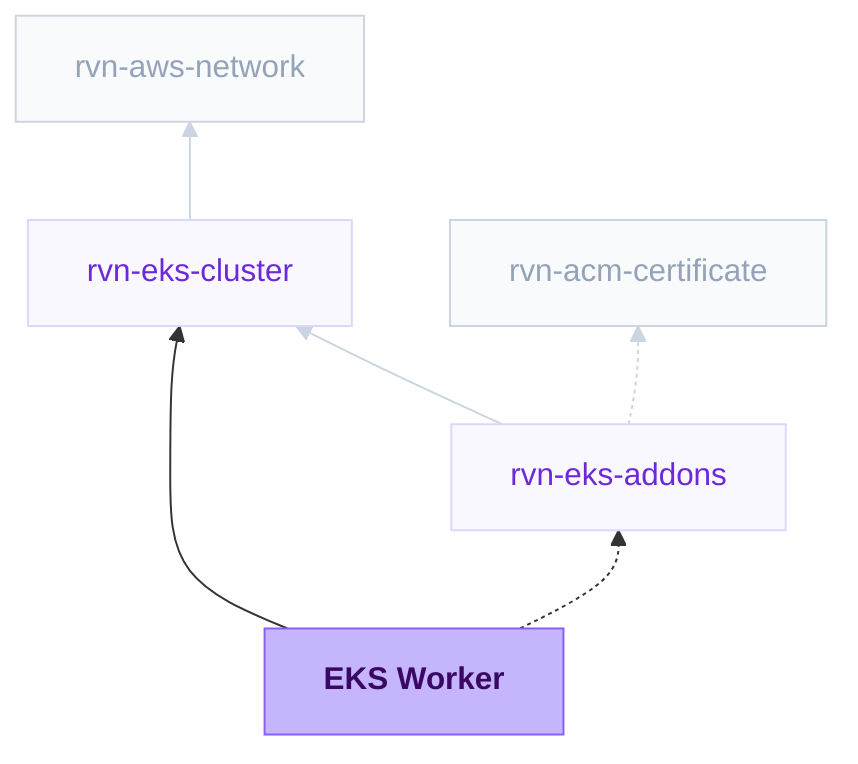

{/* Generated by scripts/sync-module-catalog.mjs from the Ravion module catalog. Do not edit by hand. */}

**Type:** `rvn-eks-worker` · **Latest version:** `0.6.0`

## Dependencies and consumers

_Every dependency input can be specified manually to reference existing external infrastructure rather than a Ravion module._

## Readme

Background worker on EKS for running a long-lived private process with no exposed port, and no Kubernetes manifests or Helm charts to write.

### Overview

EKS Worker runs queue consumers, event processors, and other long-lived background processes on an existing Ravion EKS cluster. Point it at a Git repository or an image you already have, set the start command, resources, and pod count in a form, and Ravion builds the image and keeps the process running on your cluster. There are no Kubernetes manifests to write and no Helm charts to maintain.

Under the hood, each deploy installs a Helm chart that Ravion maintains - a packaged template of the Kubernetes resources a worker needs. The `rvn-eks-worker` chart renders the Deployment that runs your pods, a ServiceAccount, an optional HorizontalPodAutoscaler, and, when the module declares runtime secrets, an `ExternalSecret`. Each release runs `helm upgrade --install --atomic`, so a failed deploy rolls back to the previous revision on its own.

The chart deliberately includes no Service, no container port, and no probes. A worker is reached by nothing; it reaches out.

The Terraform stack creates the ECR repository that Dockerfile and Railpack builds push to and, when Fargate is selected, a workload-specific EKS Fargate profile and pod execution role. On the Pull from image registry path with automatic or EC2 compute, the stack creates no AWS resources. Everything else the module needs - cluster endpoint, certificate authority data, private subnet IDs, and the Ravion Runner role - comes from the selected EKS Cluster module.

Chart source: [ravionhq/modules/charts/rvn-eks-worker](https://github.com/ravionhq/modules/tree/rvn-eks-worker@0.6.0/charts/rvn-eks-worker)

Terraform source: [ravionhq/modules/compute/eks_service](https://github.com/ravionhq/modules/tree/rvn-eks-worker@0.6.0/compute/eks_service)

### Use cases

| Scenario | EKS Worker helps by... |
| -------- | ---------------------- |
| Queue consumers | Running scalable workers for SQS, Kafka, Redis, or custom queues |
| Background jobs | Processing async work without any HTTP routing |
| Event processors | Running long-lived containers that consume streams or events |
| Moving a worker from ECS to EKS | Keeping the same image and `{name, value_from}` secret shape |

### Prerequisites

- An **EKS Cluster** module.
- The **External Secrets Operator** add-on on that cluster, if the worker uses Runtime secrets.

### Build and image options

| Build source | When to use it |
| ------------ | -------------- |
| Dockerfile | Build from a Dockerfile in the selected repository |
| Railpack | Let Ravion detect the app stack and build an image from source with Railpack |
| Pull from image registry | Deploy an existing image from Docker Hub, GHCR, ECR, or another registry |

For Dockerfile and Railpack builds, provide **Git repository** and optionally **Source base path**. The stack creates an ECR repository named after the worker, Ravion pushes each build to it, and the chart deploys the resulting digest. Nodes pull from same-account ECR with their own credentials, so no pull secret is involved.

A worker built with **Railpack** often shares a repository with the web service in front of it. Railpack's detected start command is rarely the worker's command, so set the worker's entrypoint below rather than relying on the image default.

Use **Build environment variables** for values the build itself needs - a private registry token, a `NODE_ENV` that changes what gets compiled. Values can be plain strings or references loaded from Parameter Store or Secrets Manager. For Dockerfile builds, turn on **Inject environment variables in Dockerfile** to pass them to the build as Docker build arguments; without it they are visible to the builder but not to `docker build`.

These are separate from **Runtime environment variables** further down, and deliberately so: a credential needed to install dependencies has no business being in the running pod's environment. Anything both halves need has to be set in both places.

For **Pull from image registry**, provide the **Image repository** without a tag, and use **Image pull secret names** for a private registry - each entry names a Kubernetes Secret of type `kubernetes.io/dockerconfigjson` that already exists in the release namespace.

Whichever source you choose, the deploy takes an **Image tag or digest**. A value beginning with `sha256:` is used as a digest and everything else as a tag.

Workers usually need a command: use **Start command** to override the image entrypoint and **Start command arguments** to override its default arguments. For example, entrypoint `bundle` with arguments `exec sidekiq`.

### Builder settings

Builder settings apply to Dockerfile and Railpack builds only.

| Field | Default | Description |
| ----- | ------- | ----------- |
| Builder instance type | ec2 | Use EC2 for predictable availability or EC2 spot for lower cost |
| Builder instance size | c7a.4xlarge | EC2 instance size used for builds |
| Builder execution environment | Cluster value | Optional override for where image builds run |
| Builder AMI | Default image | Optional AMI override for build runners |

**Scan images on push** asks ECR to run its basic vulnerability scan on every pushed image. **Force delete image repository** lets the repository be destroyed while it still holds images; without it, destroying the module fails until the repository is emptied.

### Resources and scaling

Kubernetes schedules on requests and enforces on limits. CPU is measured in cores or millicores: 1 is one vCPU and 100m is a tenth of one. Memory uses binary units: 256Mi, 1Gi (1024Mi).

| Field | Default | Description |
| ----- | ------- | ----------- |
| CPU request | 100m | CPU reserved for the pod; the autoscaler's CPU target is a percentage of this |
| Compute target | Automatic | Let Kubernetes choose, require EC2 on-demand or EC2 Spot, or create a dedicated EKS Fargate profile |
| CPU limit | - | Optional CPU ceiling. Leaving it blank lets a pod burst into spare node CPU |
| Memory request | 256Mi | Memory reserved for the pod |
| Memory limit | 512Mi | Memory ceiling; exceeding it terminates the container with OOMKilled |

**Fargate** creates a dedicated profile matching this worker's namespace and standard app instance label. Fargate pods launch only in the selected cluster's private subnets and use on-demand capacity; EKS Fargate does not offer Spot pricing. Choose EC2 Spot instead when interruption tolerance and lower compute cost matter more than serverless pod placement.

Autoscaling is **off** by default, unlike the web module. CPU utilization is a poor proxy for worker demand: a worker blocked on a queue poll uses almost no CPU no matter how deep the backlog. Enable it when the work is genuinely CPU-bound, and prefer a fixed pod count otherwise.

**Shutdown grace period (secs)** is the window a pod gets after SIGTERM to finish in-flight work before it is killed. The default of 30 seconds suits short tasks. Raise it to at least the length of your longest job, or a rollout will kill work mid-flight.

#### Zone placement

Worker pods are spread across the cluster's availability zones with a soft `topology.kubernetes.io/zone` spread constraint, so a small cluster never leaves pods pending. Combined with the zone-local routing the EKS Web Service and EKS Cluster modules apply, a worker's calls to other services and to DNS stay inside its own zone whenever a destination pod exists there, which keeps AWS cross-AZ data transfer charges off that traffic.

### Application configuration

Use **Runtime environment variables** for plain values, as an array of `{name, value}` objects.

Use **Runtime secrets** for sensitive values, as an array of `{name, value_from}` objects - the same shape as ECS. `value_from` must be a full Secrets Manager or SSM Parameter Store ARN, including the JSON-key extraction suffix when you want a single key out of a JSON secret.

Ravion never reads these values. The ARNs travel to the chart as references, the chart renders an `ExternalSecret`, and the External Secrets Operator materializes the Kubernetes Secret in the cluster. No secret value reaches Ravion, the Helm values document, or the Helm release history.

### Deployment

Every deploy runs `helm upgrade --install --atomic`, so a release either lands completely or leaves the cluster on the previous revision. Pods roll with zero unavailable. **Maximum rollout surge (%)** defaults to 100%, allowing a full replacement set to start together when enough matching capacity is already available. Lower this advanced setting to limit temporary capacity. The disruption budget controls voluntary evictions such as node drains, not Deployment rolling updates; shutdown grace still allows old workers to finish in-flight work.

Deployments collapse: if several are queued, only the newest runs.

### Metrics and logs

The Metrics and Logs tabs follow the providers selected on the EKS add-ons module referenced above. You configure observability once, on that module, and every workload attached to it follows; there is nothing to set here. Without an add-ons reference both tabs stay empty.

Where several providers can serve the same signal they form a **fallback chain**, not a merge. The tab reads the first store that can answer right now and moves to the next when it cannot, saying which store it ended up using. Reading two stores at once would draw every line twice.

| Signal | Chain order |
| ------ | ----------- |
| Logs | In-cluster store (Loki) -> Amazon CloudWatch Logs |
| Metrics | Amazon Managed Prometheus -> Prometheus in your cluster -> CloudWatch Container Insights |

The practical effect is that the in-cluster store's one weakness stops being fatal. Loki is reached through the Ravion Operator, so with the agent offline those logs are unavailable - but if CloudWatch Logs is also selected, the tab shows CloudWatch and says so, then switches back when the agent returns.

Charts are the same five golden signals whichever store answers: CPU, memory working set, container restarts, network in, and network out. Two things differ on the CloudWatch link of the chain, and are worth knowing before you read a number off it:

- **Container Insights reports per pod, Prometheus reports across pods.** A CloudWatch chart is an average over the worker's pods; the Prometheus charts sum them. Same shape, different magnitude.
- **It needs enhanced observability**, which the add-ons module turns on with CloudWatch by default. Without it, CPU and memory come back empty.

Replicas available and desired have no CloudWatch equivalent. Container Insights' nearest metric counts pods behind a Kubernetes Service, and a worker renders no Service, so with CloudWatch as the only metrics provider those two charts are empty while the pod charts still work.

A provider that ships to a vendor rather than rendering in Ravion - Datadog, Grafana Cloud, New Relic, OpenSearch, Splunk, or a custom OTLP endpoint - adds an **Open in ...** action to the tab, pointing at this worker rather than at the vendor's front page.

Turning a signal off on the add-ons module empties the matching tab here.

### Configuration

| Field | Required | Default | Description |
| ----- | -------- | ------- | ----------- |
| Cluster | Yes | - | Existing rvn-eks-cluster module instance |
| Service name | Yes | \{project\}-\{env\}-\{module\} | Helm release name and name of the Kubernetes objects |
| Namespace | Yes | \{project\}-\{env\} | Kubernetes namespace the release installs into |
| Create namespace | No | true | Create the namespace if it does not exist |
| Build source | Yes | dockerfile | Dockerfile, Railpack, or Pull from image registry |
| Git repository | Yes* | - | Required for Dockerfile and Railpack builds |
| Source base path | No | . | Repository-relative source and build root |
| Dockerfile path | No | Dockerfile | Path to the Dockerfile, for Dockerfile builds |
| Docker build context path | No | . | Docker build context, for Dockerfile builds |
| Build environment variables | No | - | Values available during Dockerfile and Railpack builds |
| Inject environment variables in Dockerfile | No | false | Pass build environment variables to `docker build` as build arguments |
| Railpack version | No | Ravion default | Optional pin for Railpack builds |
| Install command | No | Railpack default | Optional Railpack dependency install command |
| Build command | No | Railpack default | Optional Railpack build command |
| Start command (Railpack) | No | Railpack default | Optional Railpack start command |
| Image repository | Yes* | - | Image repository without a tag; required for Pull from image registry |
| Image pull secret names | No | [] | Existing dockerconfigjson Secrets in the namespace, for Pull from image registry |
| Start command | No | [] | Overrides the image entrypoint |
| Start command arguments | No | [] | Overrides the image default arguments |
| CPU request | Yes | 100m | CPU reserved per pod, in cores or millicores |
| Compute target | Yes | Automatic | Automatic, EC2 on-demand, EC2 Spot, or on-demand EKS Fargate placement |
| CPU limit | No | - | Optional CPU ceiling |
| Memory request | Yes | 256Mi | Memory reserved per pod |
| Memory limit | Yes | 512Mi | Memory ceiling per pod |
| Autoscaling | No | false | Scale pods with a HorizontalPodAutoscaler |
| Minimum pods | No | 1 | Lower bound when autoscaling |
| Maximum pods | No | 3 | Upper bound when autoscaling |
| CPU target (%) | No | 70 | Average CPU utilization target |
| Memory target (%) | No | - | Optional average memory utilization target |
| Pods | No | 1 | Fixed pod count when autoscaling is disabled |
| Maximum rollout surge (%) | No | 100 | Extra pods during rolling updates; lower to limit temporary capacity |
| Shutdown grace period (secs) | No | 30 | Drain window after SIGTERM |
| Runtime environment variables | No | - | Array of \{name, value\} objects |
| Runtime secrets | No | - | Array of \{name, value_from\} ARN references |
| Create IAM role | No | false | Create an IAM role for the workload and bind it to its pods through EKS Pod Identity |
| IAM role name | No | \{service\}-task | Explicit role name, for a service whose ECS task role already holds the default |
| IAM policy ARNs | No | [] | Managed policy ARNs attached to the workload role |
| IAM inline policies | No | - | Inline policy documents keyed by name, the ECS task role shape |
| Builder instance type | No | ec2 | EC2 or EC2 spot capacity for builds |
| Builder instance size | No | c7a.4xlarge | EC2 instance size used for builds |
| Builder execution environment | No | Cluster value | Optional override for where builds run |
| Builder AMI | No | Default image | Optional AMI override for build runners |
| Scan images on push | No | true | ECR basic vulnerability scan on every push |
| Force delete image repository | No | false | Allow destroying the repository while it holds images |
| Tags | No | Standard Ravion tags | Additional tags applied to the ECR repository |
| Advanced Terraform variables | No | \{\} | Raw lower-level overrides for exceptional cases |
| OpenTofu version override | No | Ravion default | Override the OpenTofu version for the stack |
| Ravion Terraform workspace name | No | \{project\}-\{env\}-\{module\} | Override the state backend workspace name |

### Design decisions

- **Terraform owns AWS-side workload infrastructure.** The worker itself is Helm-owned; the stack creates an ECR repository when Ravion builds the image and a dedicated EKS Fargate profile when Fargate is selected. With a pulled image and automatic or EC2 compute, it creates nothing.
- **No Nixpacks.** ECS still carries a Nixpacks build source for services created before Railpack existed. EKS has no such history, so Dockerfile and Railpack are the only builders.
- **No Service and no probes.** A worker exposes no port, so there is nothing to route to and no HTTP endpoint to check. Liveness for a worker is better expressed by letting the process exit on a fatal error and letting Kubernetes restart it.
- **Autoscaling defaults off.** CPU utilization rarely tracks worker demand. Turning it on by default would produce autoscaling that looks configured but never fires.
- **Name and namespace are fixed after creation.** Together they identify the Helm release that rollback and history target.
- **Pod Identity, not IRSA.** The chart emits a stable ServiceAccount name and no role annotation. With **Create IAM role** on, the stack creates the role and an `aws_eks_pod_identity_association` binding it to that ServiceAccount by namespace and name; the trust policy is pinned to this cluster and account. No IAM OIDC provider is involved.

### Learn more

- [AWS Fargate profile](https://docs.aws.amazon.com/eks/latest/userguide/fargate-profile.html)
- [Kubernetes Deployments](https://kubernetes.io/docs/concepts/workloads/controllers/deployment/)
- [Pod termination and graceful shutdown](https://kubernetes.io/docs/concepts/workloads/pods/pod-lifecycle/#pod-termination)
- [HorizontalPodAutoscaler](https://kubernetes.io/docs/tasks/run-application/horizontal-pod-autoscale/)
- [External Secrets Operator](https://external-secrets.io/)

## Inputs reference

All inputs for `rvn-eks-worker` version `0.6.0`. Use the `name` shown for each field as the input key in module config.

### EKS cluster

<ResponseField name="cluster" type="$ref:rvn-eks-cluster" required>
  **Cluster.**

  - Immutable after creation
</ResponseField>

<ResponseField name="addons" type="$ref:rvn-eks-addons">
  **EKS add-ons.** Select the EKS Add-ons module attached to the cluster above to use its observability providers in the Metrics and Logs tabs.
</ResponseField>

### Worker service

<ResponseField name="name" type="string" required>
  **Service name.** Name for the Helm release and the Kubernetes objects it creates.

  - Default: `<<project.given_id>>-<<environment.given_id>>-<<module.given_id>>`
  - Immutable after creation
  - Pattern: `^[a-z0-9]([a-z0-9-]{0,51}[a-z0-9])?$` — 1-53 lowercase letters, numbers, and hyphens. Start and end with a letter or number.
</ResponseField>

<ResponseField name="namespace" type="string" required>
  **Namespace.** Kubernetes namespace the release installs into.

  - Default: `<<project.given_id>>-<<environment.given_id>>`
  - Immutable after creation
  - Pattern: `^[a-z0-9]([a-z0-9-]{0,61}[a-z0-9])?$` — 1-63 lowercase letters, numbers, and hyphens. Start and end with a letter or number.
</ResponseField>

<ResponseField name="namespace_creation_enabled" type="boolean">
  **Create namespace.** Create the namespace if it does not already exist. Turn off when the namespace is managed elsewhere.

  - Default: `true`
</ResponseField>

### Build config

<ResponseField name="build_source" type="string" required>
  **Build source.**

  - Default: `dockerfile`
  - Allowed values: `dockerfile` (Dockerfile), `railpack` (Railpack), `image_registry` (Pull from image registry)
</ResponseField>

<ResponseField name="source_repo" type="gitrepo" required>
  **Git repository.** Repository containing the application source for Dockerfile or Railpack builds.

  - Shown when: `{"build_source":["dockerfile","railpack"]}`
</ResponseField>

<ResponseField name="source_base_path" type="string">
  **Source base path.** Repository-relative source and build root.

  - Default: `.`
  - Shown when: `{"build_source":["dockerfile","railpack"]}`
</ResponseField>

<ResponseField name="build_environment_variables" type="object">
  **Build environment variables.** Environment variables available during builds. Values can be plain strings or references loaded from Parameter Store or Secrets Manager.

  - Shown when: `{"build_source":["dockerfile","railpack"]}`
</ResponseField>

### Docker

<ResponseField name="dockerfile" type="string">
  **Dockerfile path.** Path to the Dockerfile to use for the build, relative to the repository root or configured source base path.

  - Shown when: `{"build_source":"dockerfile"}`
</ResponseField>

<ResponseField name="dockerfile_context" type="string">
  **Docker build context path.** Directory to use as the Docker build context, relative to the repository root or configured source base path.

  - Shown when: `{"build_source":"dockerfile"}`
</ResponseField>

<ResponseField name="dockerfile_environment_variable_injection_enabled" type="boolean">
  **Inject environment variables in Dockerfile.** Pass build environment variables into Dockerfile builds as build arguments.

  - Default: `false`
  - Shown when: `{"build_source":"dockerfile"}`
</ResponseField>

### Railpack

<ResponseField name="railpack_version" type="string">
  **Railpack version.** Optional Railpack version to use for the build. Leave blank to use the Ravion default.

  - Pattern: `^(|latest|v?[0-9]+\.[0-9]+\.[0-9]+(?:[-+][0-9A-Za-z.-]+)?)$` — Leave blank, use latest, a semantic version like 0.29.0, or a v-prefixed version like v0.29.0.
  - Shown when: `{"build_source":"railpack"}`
</ResponseField>

<ResponseField name="railpack_install_cmd" type="string">
  **Install command.** Optional dependency installation command. Leave blank to use Railpack detection.

  - Shown when: `{"build_source":"railpack"}`
</ResponseField>

<ResponseField name="railpack_build_cmd" type="string">
  **Build command.** Optional application build command. Leave blank to use Railpack detection.

  - Shown when: `{"build_source":"railpack"}`
</ResponseField>

<ResponseField name="railpack_start_cmd" type="string">
  **Start command.**

  - Shown when: `{"build_source":"railpack"}`
</ResponseField>

### Image

<ResponseField name="image_repository" type="string" required>
  **Image repository.** Image repository without a tag, such as 123456789012.dkr.ecr.us-east-1.amazonaws.com/api. The tag or digest is supplied at deploy time.

  - Shown when: `{"build_source":"image_registry"}`
</ResponseField>

<ResponseField name="image_pull_secret_names" type="string_array">
  **Image pull secret names.** Names of existing kubernetes.io/dockerconfigjson Secrets in the release namespace, for private registries.

  - Shown when: `{"build_source":"image_registry"}`
</ResponseField>

<ResponseField name="start_command" type="string_array">
  **Start command.** Overrides the image entrypoint. Leave empty to use the image default.
</ResponseField>

<ResponseField name="start_command_args" type="string_array">
  **Start command arguments.** Overrides the image default arguments. Leave empty to use the image default.
</ResponseField>

### Resources

<ResponseField name="compute_target" type="string" required>
  **Compute target.** Choose whether Kubernetes schedules this workload automatically, on a specific EC2 capacity type, or on a dedicated EKS Fargate profile. EKS Fargate capacity is on-demand only.

  - Default: `any`
  - Allowed values: `any` (Automatic), `on_demand` (EC2 on-demand), `spot` (EC2 Spot), `fargate` (Fargate)
</ResponseField>

<ResponseField name="cpu_request" type="string" required>
  **CPU request.** CPU reserved for the pod and its guaranteed share under load. 1 is one vCPU; m is thousandths of a core, so 100m is a tenth. Autoscaling CPU targets are a percentage of this value.

  - Default: `100m`
  - Pattern: `^[0-9]+(\.[0-9]+)?m?$` — A CPU quantity such as 100m, 0.5, or 2.
</ResponseField>

<ResponseField name="cpu_limit" type="string">
  **CPU limit.** Optional CPU ceiling, in the same units. Leave blank to let a pod burst into spare node CPU.

  - Pattern: `^[0-9]+(\.[0-9]+)?m?$` — A CPU quantity such as 100m, 0.5, or 2.
</ResponseField>

<ResponseField name="memory_request" type="string" required>
  **Memory request.** Memory reserved for the pod, in binary units such as 256Mi or 1Gi (1024Mi). Set this close to steady-state usage.

  - Default: `256Mi`
  - Pattern: `^[0-9]+(\.[0-9]+)?(Ki|Mi|Gi|Ti|k|M|G|T)?$` — A memory quantity such as 256Mi, 1Gi, or 512M.
</ResponseField>

<ResponseField name="memory_limit" type="string" required>
  **Memory limit.** Memory ceiling, in the same units. Exceeding it terminates the container with OOMKilled, so set it above the worst legitimate spike.

  - Default: `512Mi`
  - Pattern: `^[0-9]+(\.[0-9]+)?(Ki|Mi|Gi|Ti|k|M|G|T)?$` — A memory quantity such as 256Mi, 1Gi, or 512M.
</ResponseField>

### Scaling

<ResponseField name="autoscaling_enabled" type="boolean">
  **Autoscaling.** Scale pods with a HorizontalPodAutoscaler. Requires the metrics server or an equivalent metrics API in the cluster.

  - Default: `false`
</ResponseField>

<ResponseField name="autoscaling_min_replicas" type="number">
  **Minimum pods.**

  - Default: `1`
  - Min: `1`
  - Max: `1000`
  - Shown when: `{"autoscaling_enabled":true}`
</ResponseField>

<ResponseField name="autoscaling_max_replicas" type="number">
  **Maximum pods.**

  - Default: `3`
  - Min: `1`
  - Max: `1000`
  - Shown when: `{"autoscaling_enabled":true}`
</ResponseField>

<ResponseField name="autoscaling_cpu_target" type="number">
  **CPU target (%).** Average CPU utilization, as a percentage of the CPU request, the autoscaler aims to hold.

  - Default: `70`
  - Min: `1`
  - Max: `100`
  - Shown when: `{"autoscaling_enabled":true}`
</ResponseField>

<ResponseField name="autoscaling_memory_target" type="number">
  **Memory target (%).** Optional average memory utilization target, as a percentage of the memory request. Leave blank to scale on CPU alone.

  - Min: `1`
  - Max: `100`
  - Shown when: `{"autoscaling_enabled":true}`
</ResponseField>

<ResponseField name="replica_count" type="number">
  **Pods.** Number of worker pods to run when autoscaling is disabled.

  - Default: `1`
  - Min: `0`
  - Max: `1000`
  - Shown when: `{"autoscaling_enabled":false}`
</ResponseField>

<ResponseField name="rollout_max_surge_percent" type="number">
  **Maximum rollout surge (%).** Extra pods Kubernetes may create during a rolling update, as a percentage of the desired count. Use 100 to create a full replacement set at once when the cluster has enough spare capacity. Zero-unavailable rollout protection remains enabled.

  - Default: `100`
  - Min: `1`
  - Max: `100`
</ResponseField>

<ResponseField name="termination_grace_period_seconds" type="number">
  **Shutdown grace period (secs).** Seconds a pod has to finish in-flight work after SIGTERM before it is killed. Raise this for workers with long-running jobs.

  - Default: `30`
  - Min: `0`
  - Max: `3600`
</ResponseField>

<ResponseField name="pod_disruption_budget_enabled" type="boolean">
  **Disruption budget.** Limit how many pods node drains, consolidation and cluster upgrades may evict at once. A worker loses its in-flight work when it is evicted, so draining a fleet all at once loses all of it. Takes effect only while the minimum pod count is above Minimum available pods, since a budget that allows no evictions would block every drain.

  - Default: `true`
</ResponseField>

<ResponseField name="pod_disruption_budget_min_available" type="number">
  **Minimum available pods.** Pods that must stay running during a node drain or other voluntary disruption.

  - Default: `1`
  - Min: `1`
  - Max: `1000`
  - Shown when: `{"pod_disruption_budget_enabled":true}`
</ResponseField>

### Environment variables

<ResponseField name="environment_variables" type="array">
  **Runtime environment variables.** Plain environment variables passed to the container, as an array of \{name, value\} objects.
</ResponseField>

<ResponseField name="secrets" type="array">
  **Runtime secrets.** Secret references injected at runtime, as an array of \{name, value_from\} objects. value_from must be a full Secrets Manager or SSM Parameter Store ARN. Ravion never reads these values; the External Secrets Operator resolves them inside the cluster.
</ResponseField>

### AWS permissions

<ResponseField name="pod_identity_role_creation_enabled" type="boolean">
  **Create IAM role.** Create an IAM role for this workload and bind it to its pods through EKS Pod Identity, so the AWS SDK obtains short-lived credentials for it without any keys. Leave off for a workload that calls no AWS API as itself. The role ARN is a stack output other modules can pin.

  - Default: `false`
</ResponseField>

<ResponseField name="pod_identity_role_name" type="string">
  **IAM role name.** Name of the workload's IAM role. Leave blank for \<service>-task, the ECS task role shape. IAM role names are unique per account, so a service that also runs on ECS, or on another cluster, needs its own name, for example \<service>-eks-\<environment>.

  - Pattern: `^[\w+=,.@-]{1,64}$` — 1-64 characters of letters, digits and + = , . @ _ -
  - Shown when: `{"pod_identity_role_creation_enabled":true}`
</ResponseField>

<ResponseField name="pod_identity_managed_policy_arns" type="string_array">
  **IAM policy ARNs.** Managed IAM policy ARNs attached to the workload's role.

  - Default: `[]`
  - Shown when: `{"pod_identity_role_creation_enabled":true}`
</ResponseField>

<ResponseField name="pod_identity_inline_policies" type="object">
  **IAM inline policies.** Inline IAM policy documents attached to the workload's role, keyed by policy name. The same shape as the ECS task role inline policies, so a service moving from ECS can carry its policies over unchanged.

  - Shown when: `{"pod_identity_role_creation_enabled":true}`
</ResponseField>

### Builder config

<ResponseField name="build_capacity_type" type="string" required>
  **Builder capacity type.** Use on-demand EC2 for predictable availability or EC2 Spot for lower cost with possible capacity delays or interruption.

  - Default: `ec2`
  - Allowed values: `ec2` (EC2), `ec2-spot` (EC2 spot)
  - Shown when: `{"build_source":["dockerfile","railpack"]}`
</ResponseField>

<ResponseField name="build_instance_type" type="string" required>
  **Builder instance type.** EC2 instance type for builds. Start with the default value, then increase or decrease it based on the resource usage report at the end of builds.

  - Default: `c7a.4xlarge`
  - Shown when: `{"build_source":["dockerfile","railpack"]}`
</ResponseField>

<ResponseField name="build_execution_environment_id" type="string">
  **Builder execution environment.** Optional execution environment ID or given ID for builds. Defaults to the module Terraform execution environment.

  - Shown when: `{"build_source":["dockerfile","railpack"]}`
</ResponseField>

<ResponseField name="build_ami_id" type="string">
  **Builder AMI.** Optional AMI ID for build runners. Leave empty to use the default runner image.

  - Shown when: `{"build_source":["dockerfile","railpack"]}`
</ResponseField>

<ResponseField name="build_default_policies_enabled" type="boolean">
  **Include default build policies.** The step's built-in policies (ECR/S3 access, CloudWatch agent) stay attached alongside your Builder IAM policies. Turn off to run the build with only the policies listed below.

  - Default: `true`
  - Shown when: `{"build_source":["dockerfile","railpack"]}`
</ResponseField>

<ResponseField name="build_iam_policy_arns" type="string_array">
  **Builder IAM policies.** IAM managed policy ARNs for the EC2 build runner role, applied for the duration of each build.

  - Default: `[]`
  - Shown when: `{"build_source":["dockerfile","railpack"]}`
</ResponseField>

### Image registry lifecycle

<ResponseField name="ecr_image_scan_on_push_enabled" type="boolean">
  **Scan images on push.** Ask ECR to run its basic vulnerability scan whenever a new image is pushed. Keep this on for early dependency and OS package findings; disable only if another scanner owns image scanning or duplicate findings are noisy.

  - Default: `true`
  - Shown when: `{"build_source":["dockerfile","railpack"]}`
</ResponseField>

<ResponseField name="ecr_force_delete_enabled" type="boolean">
  **Force delete image repository.** Allow the ECR repository to be deleted even when it contains images. Use with care.

  - Default: `false`
  - Shown when: `{"build_source":["dockerfile","railpack"]}`
</ResponseField>

### Misc

<ResponseField name="tags" type="keyvalue">
  **Tags.** A map of tags to assign to all resources. Default tags are `Owner`, `ProjectGivenId`, `EnvironmentGivenId`, `ModuleGivenId`, `ModuleId`
</ResponseField>

### Terraform settings

<ResponseField name="opentofu_version" type="string">
  **OpenTofu version override.** Override the environment's default version for this module
</ResponseField>

<ResponseField name="ravion_state_backend_workspace" type="string">
  **Ravion Terraform workspace name.** Override Terraform state backend workspace name. Defaults to project + environment + module given ids.

  - Immutable after creation
</ResponseField>

<ResponseField name="advanced_terraform_variables" type="object">
  **Advanced Terraform variables.** Optional raw Terraform variable overrides for advanced module inputs or one-off overrides. Values here override the generated variables above.

  - Default: `{}`
</ResponseField>
