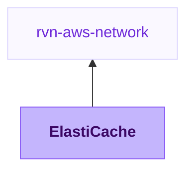

{/* Generated by scripts/sync-module-catalog.mjs from the Ravion module catalog. Do not edit by hand. */}

**Type:** `rvn-elasticache` · **Latest version:** `1.0.1`

## Dependencies and consumers

_Every dependency input can be specified manually to reference existing external infrastructure rather than a Ravion module._

## Readme

Creates and manages Amazon ElastiCache for Redis, Valkey, Memcached, or serverless Redis-compatible caches.

### Overview

Use this module when an application needs a managed in-memory cache in AWS. It provisions ElastiCache in a selected Ravion VPC network with subnet placement, security group access, optional Redis or Valkey authentication, encryption controls, backups, CloudWatch alarms, and a Secrets Manager connection string.

The module supports provisioned Redis, Valkey, and Memcached caches. It also supports ElastiCache Serverless for Redis-compatible engines when you want AWS-managed scaling instead of fixed node capacity.

### Use cases

| Scenario | Benefit |
| --- | --- |
| Application cache | Create a private Redis, Valkey, or Memcached cache attached to an existing Ravion VPC network. |
| Production Redis-compatible cache | Enable replicas, automatic failover, Multi-AZ, encryption, backups, and CloudWatch alarms. |
| Serverless cache | Use ElastiCache Serverless for Redis or Valkey workloads with data storage and ECPU usage limits. |
| Shared connection details | Store the cache connection string in AWS Secrets Manager for application services to consume. |

### Networking and access

Select a VPC network first. Ravion maps the network's AWS account, region, VPC ID, and private subnet IDs into this module. The cache subnet group or serverless cache uses those private subnets by default.

Security group creation is enabled by default. Add allowed security group IDs for application services that should connect to the cache. IPv4 and IPv6 CIDR access is available for controlled network ranges, but security group references are usually safer for application-to-cache traffic.

### Engine and capacity

Choose Valkey for Redis-compatible workloads unless you specifically need Redis OSS. AWS prices Valkey 20% lower than Redis OSS for node-based ElastiCache and 33% lower for ElastiCache Serverless, with a 90% lower Serverless minimum data storage size. Choose Redis when you have a Redis OSS compatibility requirement, or Memcached for simple volatile object caching without Redis data structures. Provisioned Redis and Valkey support replicas, optional cluster mode sharding, automatic failover, Multi-AZ, backups, AUTH tokens, and encryption. Memcached uses cache node count instead of Redis-style replication groups.

For provisioned caches, choose a node type such as `cache.t4g.micro` or `cache.r7g.large`. For serverless caches, set the data storage maximum and ECPU per second maximum to control cost and capacity limits.

### Security

Transit encryption and at-rest encryption default on for Redis and Valkey. AUTH token generation is enabled by default when transit encryption is enabled. You can provide a specific token when required, but generated tokens avoid hardcoding credentials in Ravion configuration.

The module can create a Secrets Manager secret with the cache connection string. Keep this enabled when application modules need a stable secret reference for connecting to the cache.

### Backups and maintenance

Redis and Valkey provisioned caches can retain automatic snapshots for up to 35 days and can create a final snapshot during deletion when a final snapshot identifier is provided. Serverless caches can restore from snapshot ARNs and can set a daily snapshot time.

Maintenance windows, immediate apply, and automatic minor version upgrades control when AWS applies compatible engine and infrastructure changes for provisioned caches.

### Observability

CloudWatch dashboard metrics are shown for provisioned Redis or Valkey, Memcached, and serverless caches. CloudWatch alarms are optional. When enabled, the module can alarm on CPU utilization, memory usage, current connections, and evictions.

### Configuration

| Field | Required | Default | Notes |
| --- | --- | --- | --- |
| VPC network | Yes | None | Supplies AWS account, region, VPC ID, and private subnet IDs. |
| Name slug | Yes | Project and environment given IDs | Prefix for ElastiCache resources. |
| Engine | Yes | valkey | Valkey is the recommended default for Redis-compatible workloads because AWS prices it 20% lower than Redis OSS for node-based caches and 33% lower for Serverless. |
| Serverless | No | false | Creates an ElastiCache Serverless cache for Redis or Valkey. |
| Engine major version | Yes | None | Current latest major versions include Valkey 9, Redis OSS 7, and Memcached 1.6. |
| Engine minor version | Yes | None | Appended to the major version. Use 0 for Valkey 9.0, 1 for Redis OSS 7.1, or 22 for Memcached 1.6.22. |
| Node type | Yes for provisioned caches | cache.t4g.micro | ElastiCache node size for provisioned clusters. |
| Cache nodes | No | 1 | Memcached node count. |
| Cluster mode | No | false | Enables Redis or Valkey sharding when one primary shard is not enough for data size or throughput. |
| Node groups | No | 1 | Redis or Valkey shard count. Only shown when cluster mode is enabled. |
| Replicas per node group | No | 0 | Replica count per Redis or Valkey shard. |
| Security group creation | No | true | Creates ingress rules from allowed security groups and CIDRs. |
| Transit encryption | No | true | Applies to Redis and Valkey. Required for AUTH tokens. |
| At-rest encryption | No | true | Applies to Redis and Valkey. |
| AUTH token generation | No | true | Generates a Redis or Valkey AUTH token when no explicit token is provided. |
| Automatic failover | No | false | Requires at least one Redis or Valkey replica. |
| Multi-AZ | No | false | Spreads Redis or Valkey replicas across availability zones. |
| Snapshot retention days | No | 0 | Set 1-35 for automatic Redis or Valkey backups. |
| Serverless usage limits | No | 10 GB and 5000 ECPU/s | Applies only to serverless caches. |
| Connection string secret | No | true | Stores cache connection details in Secrets Manager. |
| CloudWatch alarms | No | false | Adds CPU, memory, connection, and eviction alarms. |
| Tags | No | Standard Ravion tags | Additional tags merged with Ravion ownership and identity tags. |
| Advanced Terraform variables | No | Empty object | Escape hatch for one-off Terraform variable overrides. |

### Advanced configuration

Use parameter group settings for engine parameters such as Redis eviction policy or Memcached options. Use notification topic ARN to send ElastiCache events to an SNS topic. Use advanced Terraform variables for one-off overrides not represented directly in the UI. Values in advanced Terraform variables override generated variables.

Terraform settings let you override the OpenTofu version, Terraform execution environment inherited from the VPC network, and Ravion state backend workspace name.

### Design decisions

The module places caches in private subnets by default through the VPC network reference. Redis and Valkey encryption, AUTH token generation, security group creation, and connection string secret creation default on because they are safer defaults for application caches.

The normal form exposes common sizing, security, availability, backup, observability, and secret settings. Rare settings such as global replication group attachment and log delivery configuration are intentionally left to advanced Terraform variables.

### Learn more

- [Amazon ElastiCache documentation](https://docs.aws.amazon.com/AmazonElastiCache/latest/dg/WhatIs.html)
- [ElastiCache for Redis OSS security](https://docs.aws.amazon.com/AmazonElastiCache/latest/red-ug/auth.html)
- [ElastiCache for Valkey](https://docs.aws.amazon.com/AmazonElastiCache/latest/dg/engine-versions.html)
- [ElastiCache Serverless](https://docs.aws.amazon.com/AmazonElastiCache/latest/dg/elasticache-serverless.html)
- [Source module](https://github.com/ravionhq/modules/tree/rvn-elasticache@1.0.1/cache/elasticache)

## Inputs reference

All inputs for `rvn-elasticache` version `1.0.1`. Use the `name` shown for each field as the input key in module config.

<ResponseField name="network" type="$ref:rvn-aws-network" required>
  **VPC network.**

  - Immutable after creation
</ResponseField>

### Cache

<ResponseField name="name" type="string" required>
  **Name slug.** Name prefix for all ElastiCache resources.

  - Default: `<<project.given_id>>-<<environment.given_id>>`
  - Immutable after creation
  - Pattern: `^[a-z0-9]([a-z0-9-]{0,38}[a-z0-9])?$` — 1-40 lowercase letters, numbers, and hyphens. Start and end with a letter or number.
</ResponseField>

### Version

<ResponseField name="engine" type="string" required>
  **Engine.** Choose Valkey for Redis-compatible workloads with lower AWS pricing, Redis for Redis OSS compatibility requirements, or Memcached for simple non-persistent object caching without Redis data structures. AWS prices Valkey 20% lower than Redis OSS for node-based ElastiCache and 33% lower for Serverless, with a 90% lower Serverless minimum data storage size.

  - Default: `valkey`
  - Allowed values: `valkey` (Valkey), `redis` (Redis), `memcached` (Memcached)
  - Immutable after creation
</ResponseField>

<ResponseField name="engine_major_version" type="string" required>
  **Engine major version.** Major engine version. Current latest major versions include Valkey 9, Redis OSS 7, and Memcached 1.6.

  - Immutable after creation
</ResponseField>

<ResponseField name="engine_minor_version" type="string" required>
  **Engine minor version.** Minor or patch version appended to the major version.
</ResponseField>

<ResponseField name="minor_version_auto_upgrade_enabled" type="boolean">
  **Auto minor version upgrades.** Enable automatic minor engine version upgrades during the maintenance window.

  - Default: `true`
  - Shown when: `{"serverless_enabled":false}`
</ResponseField>

### Size & topology

<ResponseField name="serverless_enabled" type="boolean">
  **Serverless.** Create an ElastiCache Serverless cache instead of provisioned nodes. Supported for Redis and Valkey.

  - Default: `false`
  - Immutable after creation
  - Shown when: `{"engine":["redis","valkey"]}`
</ResponseField>

<ResponseField name="node_type" type="string" required>
  **Node type.** ElastiCache node size for provisioned clusters.

  - Default: `cache.t4g.micro`
  - Pattern: `^cache\..+` — Node type must start with cache.
  - Shown when: `{"serverless_enabled":false}`
</ResponseField>

<ResponseField name="num_cache_nodes" type="number">
  **Cache nodes.** Number of Memcached cache nodes.

  - Default: `1`
  - Min: `1`
  - Max: `40`
  - Shown when: `{"engine":"memcached","serverless_enabled":false}`
</ResponseField>

<ResponseField name="cluster_mode_enabled" type="boolean">
  **Cluster mode.** Enable cluster mode when one primary shard is not enough for your data size or throughput. Leave disabled for simpler Redis or Valkey deployments with one primary and optional replicas.

  - Default: `false`
  - Shown when: `{"engine":["redis","valkey"],"serverless_enabled":false}`
</ResponseField>

<ResponseField name="num_node_groups" type="number">
  **Node groups.** Number of Redis or Valkey shards. Use 1 when cluster mode is disabled.

  - Default: `1`
  - Min: `1`
  - Max: `500`
  - Shown when: `{"cluster_mode_enabled":true,"engine":["redis","valkey"],"serverless_enabled":false}`
</ResponseField>

<ResponseField name="replicas_per_node_group" type="number">
  **Replicas per node group.** Number of replica nodes in each Redis or Valkey node group.

  - Default: `0`
  - Min: `0`
  - Max: `5`
  - Shown when: `{"engine":["redis","valkey"],"serverless_enabled":false}`
</ResponseField>

<ResponseField name="port" type="number">
  **Port.** Port where the cache accepts connections. Leave blank for engine defaults.

  - Min: `1`
  - Max: `65535`
</ResponseField>

<ResponseField name="network_type" type="string">
  **Network type.** Network type for the replication group.

  - Default: `ipv4`
  - Allowed values: `ipv4` (IPv4), `ipv6` (IPv6), `dual_stack` (Dual stack)
  - Shown when: `{"serverless_enabled":false}`
</ResponseField>

<ResponseField name="ip_discovery" type="string">
  **IP discovery.** IP address discovery method.

  - Default: `ipv4`
  - Allowed values: `ipv4` (IPv4), `ipv6` (IPv6)
  - Shown when: `{"serverless_enabled":false}`
</ResponseField>

### Security

<ResponseField name="security_group_creation_enabled" type="boolean">
  **Security group creation.** Create a security group with ingress rules for this cache.

  - Default: `true`
</ResponseField>

<ResponseField name="security_group_id" type="string" required>
  **Security group ID.** Existing security group ID to use when security group creation is disabled.

  - Pattern: `^sg-.+` — Security group ID must start with sg-.
  - Shown when: `{"security_group_creation_enabled":false}`
</ResponseField>

<ResponseField name="allowed_security_group_ids" type="string_array">
  **Allowed security groups.** Security groups allowed to connect to this cache.

  - Pattern: `^sg-.+` — Security group ID must start with sg-.
</ResponseField>

<ResponseField name="allowed_cidr_blocks" type="string_array">
  **Allowed IPv4 CIDR blocks.** IPv4 CIDR blocks allowed to connect to this cache.
</ResponseField>

<ResponseField name="allowed_ipv6_cidr_blocks" type="string_array">
  **Allowed IPv6 CIDR blocks.** IPv6 CIDR blocks allowed to connect to this cache.
</ResponseField>

<ResponseField name="transit_encryption_enabled" type="boolean">
  **Transit encryption.** Enable TLS encryption for Redis and Valkey traffic.

  - Default: `true`
  - Shown when: `{"engine":["redis","valkey"]}`
</ResponseField>

<ResponseField name="at_rest_encryption_enabled" type="boolean">
  **At-rest encryption.** Enable encryption at rest for Redis and Valkey.

  - Default: `true`
  - Shown when: `{"engine":["redis","valkey"]}`
</ResponseField>

<ResponseField name="kms_key_arn" type="string">
  **KMS key ARN.** KMS key ARN for at-rest encryption. Leave blank to use the AWS managed key.

  - Shown when: `{"at_rest_encryption_enabled":true,"engine":["redis","valkey"]}`
</ResponseField>

<ResponseField name="auth_token_enabled" type="boolean">
  **AUTH token generation.** Generate an AUTH token for Redis or Valkey when no token is provided. Requires transit encryption.

  - Default: `true`
  - Shown when: `{"engine":["redis","valkey"],"transit_encryption_enabled":true}`
</ResponseField>

<ResponseField name="auth_token" type="string">
  **AUTH token.** Optional explicit AUTH token. Leave blank to generate one when AUTH token generation is enabled.

  - Shown when: `{"engine":["redis","valkey"],"transit_encryption_enabled":true}`
</ResponseField>

<ResponseField name="auth_token_length" type="number">
  **AUTH token length.** Length of the generated AUTH token.

  - Default: `32`
  - Min: `16`
  - Max: `128`
  - Shown when: `{"auth_token_enabled":true,"engine":["redis","valkey"],"transit_encryption_enabled":true}`
</ResponseField>

### Availability

<ResponseField name="automatic_failover_enabled" type="boolean">
  **Automatic failover.** Enable automatic failover. Requires at least one replica.

  - Default: `false`
  - Shown when: `{"engine":["redis","valkey"],"serverless_enabled":false}`
</ResponseField>

<ResponseField name="multi_az_enabled" type="boolean">
  **Multi-AZ.** Enable Multi-AZ support for the replication group.

  - Default: `false`
  - Shown when: `{"engine":["redis","valkey"],"serverless_enabled":false}`
</ResponseField>

<ResponseField name="data_tiering_enabled" type="boolean">
  **Data tiering.** Enable data tiering for r6gd or r7gd node types.

  - Default: `false`
  - Shown when: `{"engine":["redis","valkey"],"serverless_enabled":false}`
</ResponseField>

### Backups

<ResponseField name="snapshot_retention_limit" type="number">
  **Snapshot retention days.** Number of days to retain automatic snapshots. Set to 0 to disable backups.

  - Default: `0`
  - Min: `0`
  - Max: `35`
  - Shown when: `{"engine":["redis","valkey"],"serverless_enabled":false}`
</ResponseField>

<ResponseField name="snapshot_window" type="string">
  **Snapshot window.** Daily UTC window for automatic snapshots.

  - Shown when: `{"engine":["redis","valkey"],"serverless_enabled":false}`
</ResponseField>

<ResponseField name="final_snapshot_identifier" type="string">
  **Final snapshot identifier.** Final snapshot name to create when deleting the replication group. Leave blank to skip final snapshot creation.

  - Shown when: `{"engine":["redis","valkey"],"serverless_enabled":false}`
</ResponseField>

<ResponseField name="serverless_snapshot_arns_to_restore" type="string_array">
  **Serverless snapshot ARNs to restore.** Snapshot ARNs to restore into the serverless cache.

  - Shown when: `{"engine":["redis","valkey"],"serverless_enabled":true}`
</ResponseField>

<ResponseField name="serverless_daily_snapshot_time" type="string">
  **Serverless daily snapshot time.** Daily UTC time for serverless automated snapshots.

  - Shown when: `{"engine":["redis","valkey"],"serverless_enabled":true}`
</ResponseField>

### Serverless usage limits

<ResponseField name="serverless_data_storage_maximum" type="number">
  **Data storage maximum (GB).** Maximum serverless data storage in GB.

  - Default: `10`
  - Min: `1`
  - Max: `5000`
  - Shown when: `{"serverless_enabled":true}`
</ResponseField>

<ResponseField name="serverless_ecpu_per_second_maximum" type="number">
  **ECPU per second maximum.** Maximum serverless ECPU per second.

  - Default: `5000`
  - Min: `1000`
  - Max: `15000000`
  - Shown when: `{"serverless_enabled":true}`
</ResponseField>

<ResponseField name="serverless_security_group_ids" type="string_array">
  **Serverless security groups.** Security groups to associate with the serverless cache. Leave blank to use this module's security group.

  - Pattern: `^sg-.+` — Security group ID must start with sg-.
  - Shown when: `{"serverless_enabled":true}`
</ResponseField>

### Maintenance

<ResponseField name="maintenance_window" type="string">
  **Maintenance window.** Weekly UTC maintenance window.

  - Shown when: `{"serverless_enabled":false}`
</ResponseField>

<ResponseField name="immediate_apply_enabled" type="boolean">
  **Apply immediately.** Apply changes immediately instead of during the next maintenance window.

  - Default: `false`
  - Shown when: `{"serverless_enabled":false}`
</ResponseField>

### Parameter group

<ResponseField name="parameter_group_family" type="string">
  **Parameter group family.** Parameter group family. Leave blank to derive it from engine and version.

  - Shown when: `{"serverless_enabled":false}`
</ResponseField>

<ResponseField name="parameters" type="object_array">
  **Parameters.** Parameter name/value pairs for the ElastiCache parameter group.

  - Default: `[]`
  - Shown when: `{"serverless_enabled":false}`

  <Expandable title="item fields">
    <ResponseField name="name" type="string" required>
      **Name.**
    </ResponseField>
    <ResponseField name="value" type="string" required>
      **Value.**
    </ResponseField>
  </Expandable>
</ResponseField>

### Notifications

<ResponseField name="notification_topic_arn" type="string">
  **Notification topic ARN.** SNS topic ARN for ElastiCache notifications.

  - Shown when: `{"serverless_enabled":false}`
</ResponseField>

### Secrets Manager

<ResponseField name="secret_creation_enabled" type="boolean">
  **Connection string secret.** Create a Secrets Manager secret containing the cache connection string.

  - Default: `true`
</ResponseField>

<ResponseField name="secret_name" type="string">
  **Secret name.** Secret name. Leave blank to use the generated connection string secret name.

  - Shown when: `{"secret_creation_enabled":true}`
</ResponseField>

<ResponseField name="secret_kms_key_arn" type="string">
  **Secret KMS key ARN.** KMS key ARN used to encrypt the connection string secret.

  - Shown when: `{"secret_creation_enabled":true}`
</ResponseField>

<ResponseField name="secret_recovery_window_in_days" type="number">
  **Secret recovery window (days).** Days AWS Secrets Manager waits before deleting the secret. Set to 0 for immediate deletion.

  - Default: `7`
  - Min: `0`
  - Max: `30`
  - Shown when: `{"secret_creation_enabled":true}`
</ResponseField>

### Observability

<ResponseField name="cloudwatch_alarms_creation_enabled" type="boolean">
  **CloudWatch alarms.** Create CloudWatch alarms for CPU, memory, connections, and evictions.

  - Default: `false`
</ResponseField>

<ResponseField name="cloudwatch_alarm_cpu_threshold" type="number">
  **CPU alarm threshold (%).** CPU utilization threshold in percent.

  - Default: `80`
  - Min: `0`
  - Max: `100`
  - Shown when: `{"cloudwatch_alarms_creation_enabled":true}`
</ResponseField>

<ResponseField name="cloudwatch_alarm_memory_threshold" type="number">
  **Memory alarm threshold (%).** Memory utilization threshold in percent.

  - Default: `80`
  - Min: `0`
  - Max: `100`
  - Shown when: `{"cloudwatch_alarms_creation_enabled":true}`
</ResponseField>

<ResponseField name="cloudwatch_alarm_connections_threshold" type="number">
  **Connections alarm threshold.** Current connections alarm threshold.

  - Default: `1000`
  - Min: `1`
  - Shown when: `{"cloudwatch_alarms_creation_enabled":true}`
</ResponseField>

<ResponseField name="cloudwatch_alarm_evictions_threshold" type="number">
  **Evictions alarm threshold.** Evictions alarm threshold.

  - Default: `100`
  - Min: `0`
  - Shown when: `{"cloudwatch_alarms_creation_enabled":true}`
</ResponseField>

<ResponseField name="cloudwatch_alarm_evaluation_periods" type="number">
  **Alarm evaluation periods.** Number of periods over which CloudWatch compares alarm data to the threshold.

  - Default: `2`
  - Min: `1`
  - Shown when: `{"cloudwatch_alarms_creation_enabled":true}`
</ResponseField>

<ResponseField name="cloudwatch_alarm_period" type="number">
  **Alarm period.** Alarm period in seconds.

  - Default: `300`
  - Allowed values: `10` (10 seconds), `30` (30 seconds), `60` (60 seconds), `300` (5 minutes), `900` (15 minutes), `3600` (1 hour)
  - Shown when: `{"cloudwatch_alarms_creation_enabled":true}`
</ResponseField>

<ResponseField name="cloudwatch_alarm_actions" type="string_array">
  **Alarm actions.** ARNs to notify when an alarm transitions to ALARM.

  - Shown when: `{"cloudwatch_alarms_creation_enabled":true}`
</ResponseField>

<ResponseField name="cloudwatch_ok_actions" type="string_array">
  **OK actions.** ARNs to notify when an alarm transitions to OK.

  - Shown when: `{"cloudwatch_alarms_creation_enabled":true}`
</ResponseField>

### Misc

<ResponseField name="tags" type="keyvalue">
  **Tags.** A map of tags to assign to all resources. Default tags are `Owner`, `ProjectGivenId`, `EnvironmentGivenId`, `ModuleGivenId`, `ModuleId`
</ResponseField>

### Terraform settings

<ResponseField name="opentofu_version" type="string">
  **OpenTofu version override.** Override the environment's default version for this module
</ResponseField>

<ResponseField name="ravion_state_backend_workspace" type="string">
  **Ravion Terraform workspace name.** Override Terraform state backend workspace name. Defaults to project + environment + module given ids.

  - Immutable after creation
</ResponseField>

<ResponseField name="advanced_terraform_variables" type="object">
  **Advanced Terraform variables.** Optional raw Terraform variable overrides for advanced module inputs or one-off overrides. Values here override the generated variables above.

  - Default: `{}`
</ResponseField>
