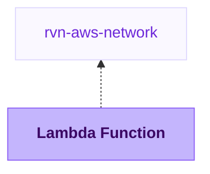

{/* Generated by scripts/sync-module-catalog.mjs from the Ravion module catalog. Do not edit by hand. */}

**Type:** `rvn-lambda` · **Latest version:** `1.0.1`

## Dependencies and consumers

_Every dependency input can be specified manually to reference existing external infrastructure rather than a Ravion module._

## Readme

AWS Lambda function with zip or container image deployments, alias-based releases, IAM, logs, and optional function URLs.

### Overview

The Lambda Function module creates an AWS Lambda function, execution role, CloudWatch log group, optional artifact bucket, and a live alias that Ravion updates during deployments. Terraform provisions the long-lived function infrastructure with either a bootstrap zip package or a bootstrap container image. Deployments publish a new function version and move the live alias.

Terraform source: [ravionhq/modules/compute/lambda](https://github.com/ravionhq/modules/tree/rvn-lambda@1.0.1/compute/lambda)

### Use cases

| Scenario | Lambda Function helps by... |
| -------- | --------------------------- |
| Event handlers | Running code from queues, streams, schedules, or custom invoke permissions |
| Lightweight APIs | Exposing a function URL when API Gateway is not required |
| Background tasks | Running short-lived compute without managing servers or containers |
| Zip deployments | Building a package from Git and promoting it through a stable alias |
| Container image deployments | Building or deploying Lambda-compatible images from Amazon ECR |

### Build and deployment

Lambda type and package type are immutable after creation. Lambda@Edge functions must be created in us-east-1, and AWS Lambda does not support changing an existing function between zip packages and container images.

For zip package functions, builds use a Dockerfile to produce Lambda package contents from the selected Git repository. The build uploads a zip file to the module-managed code bucket. Deployments take an S3 object key, update the Lambda function code, publish a new version, and move the live alias to that version.

If Build source is Pull from S3 for zip packages, Ravion skips the build step and you provide an existing S3 object key at deploy time.

For container image functions, Nixpacks and Dockerfile builds produce a Lambda-compatible container image, push it to a module-managed ECR repository, and deployments promote a tag or digest from that repository. Pull from image registry skips the build step and promotes a tag or digest from the ECR repository configured on the module. Image start command, entry point, and working directory overrides are optional; leave them empty to use the image defaults.

Terraform creates image package functions by pushing a small Lambda-compatible bootstrap image into a module-managed ECR repository during the same apply. For Pull from image registry, that bootstrap image lets the function be created before the first deployment promotes the configured ECR image tag or digest.

### Function configuration

Runtime, handler, memory, timeout, architecture, environment variables, layers, tracing, image config, and ephemeral storage are managed by the stack. Handler, runtime, layers, code signing, SnapStart, Lambda@Edge constraints, and the code bucket apply only to zip package functions. Change these settings through a stack change so Terraform remains the source of truth for function configuration. The deploy step focuses on code promotion.

### Networking and integrations

Connect to a VPC when the function needs private subnet access to databases, caches, or internal services. Invoke permissions let AWS services or accounts call the function. Event source mappings connect queues and streams directly to the function. File systems mount EFS access points under /mnt paths.

### Configuration

| Section | Field | Required | Default | Notes |
| ------- | ----- | -------- | ------- | ----- |
| AWS account & region | AWS account | Yes | none | Account where Lambda resources are created |
| AWS account & region | Region | Yes | none | Region for the Lambda function and code bucket |
| Lambda function | Function name | Yes | Generated from project, environment, and module IDs | Immutable AWS function name |
| Lambda function | Lambda type | Yes | Regional Lambda | Immutable because Lambda@Edge must be created in us-east-1 |
| Lambda function | Package type | Yes | Zip package | Immutable AWS package type |
| Lambda function | Handler | Zip only | index.handler | Zip package entrypoint |
| Lambda function | Runtime | Zip only | nodejs20.x | Lambda runtime string |
| Lambda function | Memory | Yes | 128 MB | Also affects CPU allocation |
| Lambda function | Timeout | Yes | 5 seconds | Maximum invocation runtime |
| Build config | Build source | Yes | Dockerfile | Zip packages support Dockerfile, Nixpacks, or Pull from S3. Container images support Dockerfile, Nixpacks, or Pull from image registry |
| Build config | Git repository | Required for builds | none | Source repository for Nixpacks and Dockerfile builds |
| Build config | Image repository | Pull from image registry only | none | Existing ECR repository URI without a tag or digest |
| Build config | Start command | No | Image default | Optional image CMD override |
| Build config | Package output directory | Required for zip builds | /app | Directory zipped and uploaded |
| Networking | Connect to a VPC | No | false | Shows subnet and security group fields |
| IAM role | Create IAM role | No | true | Use an existing role by turning this off |
| Logs | Create log group | No | true | Creates /aws/lambda/\{function name\} by default |
| Function URL | Enable function URL | No | false | Creates an HTTPS endpoint for direct invokes |
| IAM permissions | Invoke permissions | No | [] | Allows services or accounts to invoke the function |
| Event sources and aliases | Event source mappings | No | [] | Connects queues or streams to the function |
| Image registry lifecycle | Scan images on push | No | true | ECR basic vulnerability scanning for the module-managed repository |
| Terraform settings | Advanced Terraform variables | No | \{\} | Escape hatch for uncommon Terraform inputs |

### Design decisions

- Lambda type is immutable. Create a new Lambda module/function to migrate between Regional Lambda and CloudFront Lambda@Edge, especially when the existing function is outside us-east-1.
- Package type is immutable. Create a new Lambda module/function to migrate between zip packages and container images.
- Zip package functions use the Lambda build pipeline to upload zip packages to S3 and the Lambda deploy manager to promote those packages.
- Container image functions use the image build pipeline to push Dockerfile or Nixpacks builds to ECR. Pull from image registry promotes tags or digests from an existing ECR repository.
- Terraform creates a bootstrap zip package for zip functions and creates image package functions with a bootstrap image in the module-managed ECR repository.
- Runtime configuration stays in Terraform to avoid deploy-time configuration drift.
- The zip code bucket is versioned, but the build output currently passes the S3 key as the primary deploy input.

### Learn more

- [AWS Lambda developer guide](https://docs.aws.amazon.com/lambda/latest/dg/welcome.html)
- [Configuring Lambda functions](https://docs.aws.amazon.com/lambda/latest/dg/configuration-function-common.html)
- [Lambda function URLs](https://docs.aws.amazon.com/lambda/latest/dg/urls-configuration.html)
- [Lambda event source mappings](https://docs.aws.amazon.com/lambda/latest/dg/invocation-eventsourcemapping.html)

## Inputs reference

All inputs for `rvn-lambda` version `1.0.1`. Use the `name` shown for each field as the input key in module config.

### AWS account & region

<ResponseField name="aws_account_id" type="string" required>
  **AWS account.**

  - Immutable after creation
</ResponseField>

<ResponseField name="aws_region" type="string" required>
  **Region.**

  - Immutable after creation
</ResponseField>

### Lambda function config

<ResponseField name="lambda_type" type="string" required>
  **Lambda type.**

  - Default: `regional`
  - Allowed values: `regional` (Regional Lambda), `edge` (CloudFront Lambda@Edge)
  - Immutable after creation
</ResponseField>

<ResponseField name="name" type="string" required>
  **Function name.** Name for the Lambda function and related resources.

  - Default: `<<project.given_id>>-<<environment.given_id>>-<<module.given_id>>`
  - Immutable after creation
  - Pattern: `^[A-Za-z0-9_-]{1,64}$` — 1-64 letters, numbers, underscores, or hyphens.
</ResponseField>

<ResponseField name="description" type="string">
  **Function description.** Description shown for the Lambda function in AWS.
</ResponseField>

<ResponseField name="package_type" type="string" required>
  **Package type.**

  - Default: `Zip`
  - Allowed values: `Zip` (Zip package), `Image` (Container image)
  - Immutable after creation
</ResponseField>

<ResponseField name="architecture" type="string" required>
  **Architecture.** CPU architecture used by the function.

  - Default: `x86_64`
  - Allowed values: `x86_64`, `arm64`
  - Shown when: `{"lambda_type":"regional"}`
</ResponseField>

<ResponseField name="version_publishing_enabled" type="boolean">
  **Version publishing.** Publish a new immutable Lambda version on function updates. Required for Lambda@Edge and aliases that target published versions.

  - Default: `false`
  - Shown when: `{"lambda_type":"regional"}`
</ResponseField>

### Zip package

<ResponseField name="runtime" type="string" required>
  **Runtime.** Lambda runtime for Zip packages.

  - Default: `$values:first`
  - Allowed values: `nodejs22.x` (Node.js 22.x), `nodejs20.x` (Node.js 20.x), `python3.13` (Python 3.13), `python3.12` (Python 3.12), `python3.11` (Python 3.11), `ruby3.4` (Ruby 3.4), `ruby3.3` (Ruby 3.3), `java21` (Java 21), `java17` (Java 17), `dotnet8` (.NET 8), `provided.al2023` (Go provided AL2023)
  - Shown when: `{"package_type":"Zip"}`
</ResponseField>

<ResponseField name="handler" type="string" required>
  **Handler.** Function entrypoint for the zip package, such as index.handler.

  - Shown when: `{"package_type":"Zip"}`
</ResponseField>

<ResponseField name="s3_bucket" type="string">
  **Package S3 bucket.** S3 bucket containing the deployment package. Leave empty to create a managed code bucket.

  - Shown when: `{"package_type":"Zip"}`
</ResponseField>

<ResponseField name="s3_key" type="string">
  **Package S3 key.** S3 key of the deployment package. Required when Package S3 bucket is set.

  - Shown when: `{"package_type":"Zip"}`
</ResponseField>

<ResponseField name="code_bucket_name" type="string">
  **Code bucket name.** Name for the s3 bucket used for Lambda zip artifacts. Must be globally unique. Defaults to \<function-name>-code-\<account-id>.

  - Immutable after creation
  - Pattern: `^[a-z0-9][a-z0-9.-]{1,61}[a-z0-9]$` — Use a valid S3 bucket name: lowercase letters, numbers, hyphens, and periods; start and end with a letter or number.
  - Shown when: `{"package_type":"Zip"}`
</ResponseField>

<ResponseField name="code_bucket_force_destroy_enabled" type="boolean">
  **Force destroy code bucket.** Delete the code bucket even when it contains package objects during stack destroy.

  - Default: `true`
  - Shown when: `{"package_type":"Zip"}`
</ResponseField>

<ResponseField name="placeholder_object_key" type="string">
  **Bootstrap object key.** S3 key for the initial bootstrap deployment package in the managed code bucket.

  - Default: `bootstrap-package.zip`
  - Shown when: `{"package_type":"Zip"}`
</ResponseField>

### Build config

<ResponseField name="build_source" type="string" required>
  **Build source.**

  - Default: `dockerfile`
  - Allowed values: `dockerfile` (Dockerfile), `s3_package` (Pull from S3), `image_registry` (Pull from image registry)
</ResponseField>

<ResponseField name="source_repo" type="gitrepo" required>
  **Git repository.** Repository containing the application source for Dockerfile or Railpack builds.

  - Shown when: `{"build_source":["nixpacks","dockerfile"]}`
</ResponseField>

<ResponseField name="source_base_path" type="string">
  **Source base path.** Repository-relative source and build root.

  - Default: `.`
  - Shown when: `{"build_source":["nixpacks","dockerfile"]}`
</ResponseField>

<ResponseField name="output_directory" type="string" required>
  **Package output directory.** Directory inside the built image that contains the Lambda package files.

  - Default: `/app`
  - Shown when: `{"build_source":["nixpacks","dockerfile"],"package_type":"Zip"}`
</ResponseField>

<ResponseField name="image_repository" type="string" required>
  **Image repository.** ECR repository URI without a tag or digest, such as 123456789012.dkr.ecr.us-east-1.amazonaws.com/my-function. The repository must be in the same region as the function. A repository in a different AWS account works when its repository policy grants pull access to the function's account and the Lambda service principal.

  - Shown when: `{"build_source":"image_registry","package_type":"Image"}`
</ResponseField>

<ResponseField name="initial_image_ref" type="string" required>
  **Initial image tag or digest.** Tag or digest used only to create the function before its first deployment. It must already exist in the image repository above. Deployments promote the tag or digest you pass at deploy time; changing this value afterward has no effect. Do not include the repository URI.

  - Shown when: `{"build_source":"image_registry","package_type":"Image"}`
</ResponseField>

<ResponseField name="image_start_command" type="string_array">
  **Start command.** Optional command arguments that override the image default command (CMD). Leave empty to use the image default.

  - Default: `[]`
  - Shown when: `{"build_source":"image_registry","lambda_type":"regional","package_type":"Image"}`
</ResponseField>

<ResponseField name="image_entry_point" type="string_array">
  **Entry point.** Optional entry point arguments that override the image default ENTRYPOINT.

  - Default: `[]`
  - Shown when: `{"build_source":"image_registry","lambda_type":"regional","package_type":"Image"}`
</ResponseField>

<ResponseField name="image_working_directory" type="string">
  **Working directory.** Optional working directory override inside the image.

  - Shown when: `{"build_source":"image_registry","lambda_type":"regional","package_type":"Image"}`
</ResponseField>

### Docker

<ResponseField name="dockerfile" type="string">
  **Dockerfile path.** Path to the Dockerfile to use for the build, relative to the repository root or configured source base path.

  - Shown when: `{"build_source":"dockerfile"}`
</ResponseField>

<ResponseField name="dockerfile_context" type="string">
  **Docker build context path.** Directory to use as the Docker build context, relative to the repository root or configured source base path.

  - Shown when: `{"build_source":"dockerfile"}`
</ResponseField>

### Nixpacks

<ResponseField name="nixpacks_install_cmd" type="string">
  **Install command.**

  - Shown when: `{"build_source":"nixpacks"}`
</ResponseField>

<ResponseField name="nixpacks_build_cmd" type="string">
  **Build command.**

  - Shown when: `{"build_source":"nixpacks"}`
</ResponseField>

<ResponseField name="nixpacks_start_cmd" type="string">
  **Start command.**

  - Shown when: `{"build_source":"nixpacks","package_type":"Image"}`
</ResponseField>

<ResponseField name="nixpacks_config_file_path" type="string">
  **Nixpacks config file path.** Path to a custom Nixpacks config file, relative to the repository root or configured source base path.

  - Shown when: `{"build_source":"nixpacks"}`
</ResponseField>

<ResponseField name="nixpacks_build_path" type="string">
  **Nixpacks build path.** Application path for Nixpacks to build, relative to the repository root or configured source base path.

  - Shown when: `{"build_source":"nixpacks"}`
</ResponseField>

<ResponseField name="nixpacks_version" type="string">
  **Nixpacks version.** Optional Nixpacks version to use for the build. Leave blank to use the default version.

  - Shown when: `{"build_source":"nixpacks"}`
</ResponseField>

<ResponseField name="nixpacks_nix_pkgs" type="string_array">
  **Nix packages.** Additional Nix packages to install during the Nixpacks build.

  - Shown when: `{"build_source":"nixpacks"}`
</ResponseField>

<ResponseField name="nixpacks_apt_pkgs" type="string_array">
  **APT packages.** Additional APT packages to install during the Nixpacks build.

  - Shown when: `{"build_source":"nixpacks"}`
</ResponseField>

<ResponseField name="nixpacks_nix_libs" type="string_array">
  **Nix libraries.** Additional Nix libraries to make available during the Nixpacks build.

  - Shown when: `{"build_source":"nixpacks"}`
</ResponseField>

### Runtime configuration

<ResponseField name="memory_size" type="number" required>
  **Memory (MB).** Memory allocated to the function. Lambda CPU scales with memory.

  - Default: `128`
  - Min: `128`
  - Max: `10240`
  - Shown when: `{"lambda_type":"regional"}`
</ResponseField>

<ResponseField name="timeout" type="number" required>
  **Timeout (secs).** Maximum runtime for a single invocation.

  - Default: `5`
  - Min: `1`
  - Max: `900`
  - Shown when: `{"lambda_type":"regional"}`
</ResponseField>

<ResponseField name="ephemeral_storage_size" type="number">
  **Ephemeral storage (MB).** Size of the function's /tmp directory.

  - Default: `512`
  - Min: `512`
  - Max: `10240`
  - Shown when: `{"lambda_type":"regional"}`
</ResponseField>

<ResponseField name="layers" type="string_array">
  **Lambda layers.** Versioned Lambda layer ARNs to attach to the function.

  - Default: `[]`
  - Shown when: `{"lambda_type":"regional","package_type":"Zip"}`
</ResponseField>

<ResponseField name="reserved_concurrent_executions" type="number">
  **Reserved concurrency.** Reserved concurrent executions for this function. Use -1 to remove limits.

  - Min: `-1`
  - Shown when: `{"lambda_type":"regional"}`
</ResponseField>

<ResponseField name="kms_key_arn" type="string">
  **Environment KMS key ARN.** Optional customer-managed KMS key ARN used to encrypt environment variables.

  - Shown when: `{"lambda_type":"regional"}`
</ResponseField>

<ResponseField name="tracing_mode" type="string">
  **X-Ray tracing.** Choose whether Lambda actively traces invocations with AWS X-Ray.

  - Default: `PassThrough`
  - Allowed values: `PassThrough` (Pass through), `Active`
  - Shown when: `{"lambda_type":"regional"}`
</ResponseField>

<ResponseField name="code_signing_config_arn" type="string">
  **Code signing config ARN.** Optional Lambda code signing configuration ARN.

  - Shown when: `{"lambda_type":"regional","package_type":"Zip"}`
</ResponseField>

<ResponseField name="dead_letter_target_arn" type="string">
  **Dead-letter target ARN.** Optional SQS queue or SNS topic ARN for asynchronous invocation failures.

  - Shown when: `{"lambda_type":"regional"}`
</ResponseField>

<ResponseField name="file_system_configs" type="object_array">
  **File systems.** EFS access points mounted into the function.

  - Default: `[]`
  - Shown when: `{"lambda_type":"regional"}`

  <Expandable title="item fields">
    <ResponseField name="arn" type="string" required>
      **EFS access point ARN.** EFS access point ARN.
    </ResponseField>
    <ResponseField name="local_mount_path" type="string" required>
      **Local mount path.** Mount path inside the function. AWS requires paths under /mnt/.
    </ResponseField>
  </Expandable>
</ResponseField>

### Environment variables

<ResponseField name="build_environment_variables" type="object">
  **Build environment variables.** Environment variables available during builds. Values can be plain strings or references loaded from Parameter Store or Secrets Manager.

  - Shown when: `{"build_source":["nixpacks","dockerfile"]}`
</ResponseField>

<ResponseField name="dockerfile_inject_env_variables" type="boolean">
  **Inject environment variables in Dockerfile.** Pass build environment variables into Dockerfile builds as build arguments.

  - Default: `false`
  - Shown when: `{"build_source":"dockerfile"}`
</ResponseField>

<ResponseField name="environment_variables" type="object">
  **Runtime environment variables.** Environment variables passed to the Lambda function.

  - Default: `{}`
  - Shown when: `{"lambda_type":"regional"}`
</ResponseField>

### VPC config

<ResponseField name="vpc_config_enabled" type="boolean">
  **VPC access.** Optional. Attach the Lambda function to a VPC only when it needs private network access.

  - Default: `false`
  - Shown when: `{"lambda_type":"regional"}`
</ResponseField>

<ResponseField name="network" type="$ref:rvn-aws-network" required>
  **VPC network.** Optional VPC network for Lambda VPC access. Leave empty for a Lambda function that does not attach to a VPC.

  - Immutable after creation
  - Shown when: `{"lambda_type":"regional","vpc_config_enabled":true}`
</ResponseField>

<ResponseField name="private_subnet_placement_enabled" type="boolean">
  **Run in private subnets.** Use private subnets from the selected VPC network. Turn off to use public subnets.

  - Default: `true`
  - Shown when: `{"lambda_type":"regional","vpc_config_enabled":true}`
</ResponseField>

<ResponseField name="vpc_security_group_ids" type="string_array" required>
  **Security group IDs.** Security group IDs to attach to the Lambda function ENIs.

  - Shown when: `{"lambda_type":"regional","vpc_config_enabled":true}`
</ResponseField>

<ResponseField name="vpc_ipv6_allowed_for_dual_stack" type="boolean">
  **IPv6 allowed for dual stack.** Allow outbound IPv6 for dual-stack subnets.

  - Default: `false`
  - Shown when: `{"lambda_type":"regional","vpc_config_enabled":true}`
</ResponseField>

### IAM permissions

<ResponseField name="role_creation_enabled" type="boolean">
  **Create IAM role.** Create and manage the Lambda execution role in this module.

  - Default: `true`
  - Immutable after creation
</ResponseField>

<ResponseField name="role_arn" type="string" required>
  **Existing role ARN.** IAM role ARN to use when this module should not create the role.

  - Shown when: `{"role_creation_enabled":false}`
</ResponseField>

<ResponseField name="role_name" type="string">
  **Role name.** Custom IAM role name. Defaults to \<function-name>-lambda-role.

  - Immutable after creation
  - Shown when: `{"role_creation_enabled":true}`
</ResponseField>

<ResponseField name="role_path" type="string">
  **Role path.** IAM path for the created role.

  - Default: `/`
  - Immutable after creation
  - Shown when: `{"role_creation_enabled":true}`
</ResponseField>

<ResponseField name="role_permissions_boundary" type="string">
  **Permissions boundary ARN.** Optional IAM permissions boundary for the created role.

  - Shown when: `{"role_creation_enabled":true}`
</ResponseField>

<ResponseField name="basic_execution_policy_enabled" type="boolean">
  **Basic execution policy.** Attach AWSLambdaBasicExecutionRole to the created role.

  - Default: `true`
  - Shown when: `{"role_creation_enabled":true}`
</ResponseField>

<ResponseField name="vpc_execution_policy_enabled" type="boolean">
  **VPC execution policy.** Attach AWSLambdaVPCAccessExecutionRole to the created role when VPC config is set.

  - Default: `true`
  - Shown when: `{"lambda_type":"regional","role_creation_enabled":true}`
</ResponseField>

<ResponseField name="role_managed_policy_arns" type="string_array">
  **Managed policy ARNs.** Additional managed policies to attach to the created role.

  - Default: `[]`
  - Shown when: `{"role_creation_enabled":true}`
</ResponseField>

<ResponseField name="role_inline_policies" type="object">
  **Inline role policies.** Map of inline policy name to JSON policy document for the created role.

  - Default: `{}`
  - Shown when: `{"role_creation_enabled":true}`
</ResponseField>

<ResponseField name="permissions" type="object_array">
  **Invoke permissions.** Permission statements for services or accounts that invoke this function.

  - Default: `[]`
  - Shown when: `{"lambda_type":"regional"}`

  <Expandable title="item fields">
    <ResponseField name="statement_id" type="string">
      **Statement ID.** Optional unique statement ID.
    </ResponseField>
    <ResponseField name="action" type="string" required>
      **Action.** Lambda action allowed by this permission.

      - Default: `lambda:InvokeFunction`
    </ResponseField>
    <ResponseField name="principal" type="string" required>
      **Principal.** Service principal or AWS account allowed to invoke the function.
    </ResponseField>
    <ResponseField name="source_arn" type="string">
      **Source ARN.** Optional source ARN that scopes the invoke permission.
    </ResponseField>
    <ResponseField name="source_account" type="string">
      **Source account.** Optional source AWS account ID.
    </ResponseField>
    <ResponseField name="qualifier" type="string">
      **Qualifier.** Optional function version or alias qualifier.
    </ResponseField>
  </Expandable>
</ResponseField>

### Logs

<ResponseField name="log_group_creation_enabled" type="boolean">
  **Create log group.** Create and manage the CloudWatch log group for this function.

  - Default: `true`
</ResponseField>

<ResponseField name="log_group_name" type="string">
  **Log group name.** Custom CloudWatch log group name. Defaults to /aws/lambda/\{function name\}.

  - Shown when: `{"log_group_creation_enabled":true}`
</ResponseField>

<ResponseField name="log_retention_days" type="number">
  **Log retention days.** Days to retain CloudWatch logs. Use 0 to retain indefinitely.

  - Default: `30`
  - Allowed values: `0` (Never expire), `1` (1 day), `3` (3 days), `5` (5 days), `7` (7 days), `14` (14 days), `30` (30 days), `60` (60 days), `90` (90 days), `180` (180 days), `365` (1 year)
  - Shown when: `{"log_group_creation_enabled":true}`
</ResponseField>

<ResponseField name="log_kms_key_id" type="string">
  **Log KMS key ID.** Optional KMS key ID or ARN for log group encryption.

  - Shown when: `{"log_group_creation_enabled":true}`
</ResponseField>

### Function URL

<ResponseField name="function_url_enabled" type="boolean">
  **Function URL.** Create an HTTPS endpoint for the function.

  - Default: `false`
  - Shown when: `{"lambda_type":"regional"}`
</ResponseField>

<ResponseField name="function_url_auth_type" type="string" required>
  **Function URL auth type.** Choose whether the function URL requires AWS IAM authorization.

  - Default: `AWS_IAM`
  - Allowed values: `AWS_IAM` (AWS IAM), `NONE` (None)
  - Shown when: `{"function_url_enabled":true,"lambda_type":"regional"}`
</ResponseField>

<ResponseField name="function_url_invoke_mode" type="string" required>
  **Function URL invoke mode.** Choose buffered responses or response streaming.

  - Default: `BUFFERED`
  - Allowed values: `BUFFERED` (Buffered), `RESPONSE_STREAM` (Response stream)
  - Shown when: `{"function_url_enabled":true,"lambda_type":"regional"}`
</ResponseField>

<ResponseField name="function_url_cors_enabled" type="boolean">
  **Function URL CORS.** Configure CORS headers for the function URL.

  - Default: `false`
  - Shown when: `{"function_url_enabled":true,"lambda_type":"regional"}`
</ResponseField>

<ResponseField name="function_url_cors_allow_origins" type="string_array" required>
  **Allowed origins.** Origins allowed to call the function URL.

  - Shown when: `{"function_url_cors_enabled":true,"function_url_enabled":true,"lambda_type":"regional"}`
</ResponseField>

<ResponseField name="function_url_cors_allow_methods" type="string_array" required>
  **Allowed methods.** HTTP methods allowed by function URL CORS.

  - Default: `["GET","POST"]`
  - Allowed values: `GET`, `POST`, `PUT`, `PATCH`, `DELETE`, `HEAD`, `OPTIONS`
  - Shown when: `{"function_url_cors_enabled":true,"function_url_enabled":true,"lambda_type":"regional"}`
</ResponseField>

<ResponseField name="function_url_cors_allow_headers" type="string_array">
  **Allowed headers.** HTTP headers allowed in CORS requests.

  - Default: `[]`
  - Shown when: `{"function_url_cors_enabled":true,"function_url_enabled":true,"lambda_type":"regional"}`
</ResponseField>

<ResponseField name="function_url_cors_allow_credentials" type="boolean">
  **Allow credentials.** Allow browsers to include credentials in CORS requests.

  - Default: `false`
  - Shown when: `{"function_url_cors_enabled":true,"function_url_enabled":true,"lambda_type":"regional"}`
</ResponseField>

<ResponseField name="function_url_cors_expose_headers" type="string_array">
  **Exposed headers.** Response headers browsers may expose to client code.

  - Default: `[]`
  - Shown when: `{"function_url_cors_enabled":true,"function_url_enabled":true,"lambda_type":"regional"}`
</ResponseField>

<ResponseField name="function_url_cors_max_age" type="number">
  **Max age (secs).** Seconds browsers can cache the CORS preflight response.

  - Min: `0`
  - Shown when: `{"function_url_cors_enabled":true,"function_url_enabled":true,"lambda_type":"regional"}`
</ResponseField>

### Event sources and aliases

<ResponseField name="event_source_mappings" type="object_array">
  **Event source mappings.** Event source mappings for streams, queues, and self-managed sources. Use advanced Terraform variables for uncommon nested mapping options.

  - Default: `[]`
  - Shown when: `{"lambda_type":"regional"}`

  <Expandable title="item fields">
    <ResponseField name="event_source_arn" type="string" required>
      **Event source ARN.** Event source ARN, such as SQS, Kinesis, DynamoDB Streams, or MQ.
    </ResponseField>
    <ResponseField name="enabled" type="boolean">
      **Enabled.** Enable this event source mapping.

      - Default: `true`
    </ResponseField>
    <ResponseField name="batch_size" type="number">
      **Batch size.** Number of records Lambda reads from the source per batch.

      - Min: `1`
    </ResponseField>
    <ResponseField name="maximum_batching_window_in_seconds" type="number">
      **Maximum batching window (secs).** Maximum time in seconds to gather records before invoking the function.

      - Min: `0`
    </ResponseField>
    <ResponseField name="starting_position" type="string">
      **Starting position.** Starting position for stream sources.

      - Allowed values: `TRIM_HORIZON` (Trim horizon), `LATEST` (Latest), `AT_TIMESTAMP` (At timestamp)
    </ResponseField>
    <ResponseField name="destination_config_on_failure_arn" type="string">
      **On-failure destination ARN.** Destination ARN used when Lambda cannot process records.
    </ResponseField>
  </Expandable>
</ResponseField>

<ResponseField name="aliases" type="object_map">
  **Aliases.** Lambda aliases keyed by alias name. Use aliases when callers need a stable function ARN, when routing traffic between published versions, or when integrating with services that should not point directly at $LATEST.

  - Default: `{}`
  - Shown when: `{"lambda_type":"regional"}`

  <Expandable title="item fields">
    <ResponseField name="description" type="string">
      **Description.** Alias description.
    </ResponseField>
    <ResponseField name="function_version" type="string">
      **Function version.** Function version the alias points to.
    </ResponseField>
    <ResponseField name="routing_additional_version_weights" type="object">
      **Additional version weights.** Additional version weights for traffic shifting.
    </ResponseField>
  </Expandable>
</ResponseField>

### Advanced Lambda settings

<ResponseField name="snap_start_apply_on" type="string">
  **SnapStart.** Enable Lambda SnapStart for published versions. AWS currently supports this for Java runtimes.

  - Allowed values: `PublishedVersions` (Published versions)
  - Shown when: `{"lambda_type":"regional","package_type":"Zip"}`
</ResponseField>

### Builder config

<ResponseField name="build_infrastructure_type" type="string" required>
  **Builder instance type.** Use on-demand EC2 for predictable availability or EC2 Spot for lower cost with possible capacity delays or interruption.

  - Default: `ec2`
  - Allowed values: `ec2` (EC2), `ec2-spot` (EC2 spot)
  - Shown when: `{"build_source":["dockerfile","railpack","nixpacks"]}`
</ResponseField>

<ResponseField name="build_instance_size" type="string" required>
  **Builder instance size.** EC2 instance type for builds. Start with the default value, then increase or decrease it based on the resource usage report at the end of builds.

  - Default: `c7a.4xlarge`
  - Shown when: `{"build_source":["dockerfile","railpack","nixpacks"]}`
</ResponseField>

<ResponseField name="build_execution_environment_id" type="string">
  **Builder execution environment.** Optional execution environment ID or given ID for builds. Defaults to the module Terraform execution environment.

  - Shown when: `{"build_source":["dockerfile","railpack","nixpacks"]}`
</ResponseField>

<ResponseField name="build_ami" type="string">
  **Builder AMI.** Optional AMI ID for build runners. Leave empty to use the default runner image.

  - Shown when: `{"build_source":["dockerfile","railpack","nixpacks"]}`
</ResponseField>

### Image registry lifecycle

<ResponseField name="ecr_scan_on_push_enabled" type="boolean">
  **Scan images on push.** Ask ECR to run its basic vulnerability scan whenever a new image is pushed. Keep this on for early dependency and OS package findings; disable only if another scanner owns image scanning or duplicate findings are noisy.

  - Default: `true`
  - Shown when: `{"build_source":["dockerfile","nixpacks"],"lambda_type":"regional","package_type":"Image"}`
</ResponseField>

<ResponseField name="ecr_force_deletion_enabled" type="boolean">
  **Force delete image repository.** Allow the ECR repository to be deleted even when it contains images. Use with care.

  - Default: `false`
  - Shown when: `{"build_source":["dockerfile","nixpacks"],"lambda_type":"regional","package_type":"Image"}`
</ResponseField>

### Misc

<ResponseField name="tags" type="keyvalue">
  **Tags.** A map of tags to assign to all resources. Default tags are `Owner`, `ProjectGivenId`, `EnvironmentGivenId`, `ModuleGivenId`, `ModuleId`
</ResponseField>

### Terraform settings

<ResponseField name="opentofu_version" type="string">
  **OpenTofu version override.** Override the environment's default version for this module
</ResponseField>

<ResponseField name="ravion_state_backend_workspace" type="string">
  **Ravion Terraform workspace name.** Override Terraform state backend workspace name. Defaults to project + environment + module given ids.

  - Immutable after creation
</ResponseField>

<ResponseField name="advanced_terraform_variables" type="object">
  **Advanced Terraform variables.** Optional raw Terraform variable overrides for advanced module inputs or one-off overrides. Values here override the generated variables above.

  - Default: `{}`
</ResponseField>

<ResponseField name="execution_environment_id" type="string">
  **Terraform execution environment.** Override the execution environment for Terraform runners. Must use the same AWS account as selected above.
</ResponseField>
