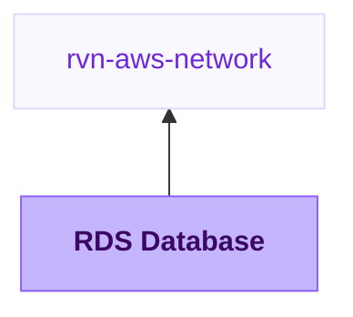

{/* Generated by scripts/sync-module-catalog.mjs from the Ravion module catalog. Do not edit by hand. */}

**Type:** `rvn-rds` · **Latest version:** `1.1.1`

## Dependencies and consumers

_Every dependency input can be specified manually to reference existing external infrastructure rather than a Ravion module._

## Readme

Creates and manages an Amazon RDS database. Supports PostgreSQL, MySQL, MariaDB, Oracle, and SQL Server engines.

### Overview

Use this module when an application needs a managed relational database in AWS. It provisions an RDS instance with subnet placement, security group access, backups, monitoring, optional read replicas, and CloudWatch alarms.

The module supports PostgreSQL, MySQL, MariaDB, Oracle, and SQL Server engines. Aurora uses a different AWS resource model and is not configured by this module.

### Use cases

| Scenario | Benefit |
| --- | --- |
| Application database | Create a private RDS instance attached to an existing Ravion VPC network. |
| Production database | Enable Multi-AZ, deletion protection, automated backups, performance insights, and CloudWatch alarms. |
| Read-heavy workload | Add read replicas for supported engines. |
| Sensitive data | Keep public access disabled, use encryption, manage credentials in Secrets Manager, and restrict ingress. |

### Networking

Select a VPC network first. Ravion maps the network's AWS account, region, VPC ID, and private subnet IDs into this module. The database subnet group uses the selected private subnets by default.

Public access is disabled by default. Keep it disabled for normal application databases and allow access through security group IDs from application services or controlled CIDR blocks.

### Database engine and sizing

Choose the engine, optional engine major version, optional engine minor version, instance class, and allocated storage. If engine major version is blank, AWS selects the latest available version for that engine.

Storage type defaults to gp3. Max allocated storage controls RDS storage autoscaling; keep it at 0 to disable autoscaling. AWS supports increasing allocated storage after creation, but not reducing it in place.

### Credentials and security

Manage password in Secrets Manager is enabled by default, so AWS creates and stores the master password for the database. Before importing a database whose existing password is managed outside Secrets Manager, disable password management and enable Preserve existing master password. Leaving password management enabled causes AWS to generate a new master password. Preservation verifies that the named database already exists in AWS, preventing a new database from reaching AWS without any source of master credentials.

Storage encryption is enabled by default. Provide a storage KMS key ARN when you need a customer-managed key for storage. IAM database authentication is shown only for MySQL and PostgreSQL.

### Availability, backups, and maintenance

Multi-AZ creates a standby in another availability zone for failover. The single availability zone field is hidden when Multi-AZ is enabled. Read replicas are shown only for engines that support RDS read replicas and are hidden for SQL Server.

Automated backups default to 7 days. You can set the backup window and control final snapshot behavior. Deletion protection is enabled by default.

Automatic minor engine version upgrades are configured next to the engine version fields and, when enabled, happen during the configured maintenance window. Major version upgrades and immediate changes are opt-in.

### Observability

Performance insights is enabled by default with 7 days of retention. Enhanced monitoring can be enabled by setting a monitoring interval.

CloudWatch alarms are optional. When enabled, the module can alarm on CPU utilization, free storage space, and database connections. The free storage alarm threshold is entered in GiB in Ravion and converted to bytes for Terraform. The Ravion UI also shows RDS CloudWatch metrics for CPU, free storage, connections, read IOPS, and write IOPS.

### Configuration

| Field | Required | Default | Notes |
| --- | --- | --- | --- |
| VPC network | Yes | None | Supplies AWS account, region, VPC ID, and private subnet IDs. |
| Name slug | Yes | Project and environment given IDs | Prefix for RDS resources. |
| Engine | Yes | postgres | PostgreSQL, MySQL, MariaDB, Oracle, and SQL Server variants are supported. |
| Engine major version | Yes | None | Sets the RDS major engine version, such as 15 for PostgreSQL or 8.0 for MySQL. |
| Engine minor version | No | Blank | Appended to the major version when an exact version is required. |
| Auto minor version upgrades | No | true | Applies minor engine upgrades during the configured maintenance window. |
| Instance class | Yes | db.t4g.micro | Use a larger RDS class such as db.r6g.large for production workloads. |
| Allocated storage | Yes | 20 | Storage in GiB. |
| Master username | Yes | dbadmin | Master database user. Do not use reserved engine words such as admin. |
| Storage KMS key ARN | No | Blank | Uses a customer-managed KMS key for storage encryption. |
| Initial database name | No | Blank | Creates an initial database when supported by the engine. Reserved RDS engine words such as database are blocked. |
| Publicly accessible | No | false | Leave disabled unless public database access is intentional. |
| Security group creation | No | true | Creates ingress rules from allowed security groups and CIDRs. |
| Multi-AZ | No | false | Enables high availability standby. |
| Read replicas | No | false | Creates read replicas when supported by the engine. |
| Manage password in Secrets Manager | No | true | Stores generated master credentials in AWS Secrets Manager. Disable before importing an externally managed password. |
| Preserve existing master password | No | false | Verifies the database exists in AWS and leaves its externally managed password unchanged. |
| Backup retention days | No | 7 | Set to 0 to disable automated backups. |
| Deletion protection | No | true | Helps prevent accidental deletion. |
| Performance insights | No | true | Enables AWS Performance Insights. |
| CloudWatch alarms | No | true | Adds CPU, free storage, and connection alarms. |
| Free storage alarm threshold | No | 5 GiB | Converted to bytes before Terraform runs. |
| Tags | No | Blank | Merged with Ravion standard tags. |

### Advanced configuration

Use parameter group settings for engine parameters. Oracle settings and SQL Server settings are shown in separate engine-specific sections. Option group settings are shown only for Oracle and SQL Server engines; blue/green updates are shown only for MySQL and MariaDB. Use advanced Terraform variables for one-off overrides not represented directly in the UI. Values in advanced Terraform variables override generated variables.

Terraform settings let you override the OpenTofu version, Terraform execution environment inherited from the VPC network, and Ravion state backend workspace name.

### Design decisions

RDS instances are placed in private subnets by default through the VPC network reference. Secrets Manager password management, encryption at rest, performance insights, and deletion protection default on because they are safer defaults for long-lived databases.

The module keeps primary database choices visible and tucks optional engine, engine-specific, storage, backup, monitoring, maintenance, parameter group, and option group details behind collapsible controls. Source repository and stack plumbing remain managed by Ravion.

### Learn more

- [Amazon RDS documentation](https://docs.aws.amazon.com/rds/)
- [RDS DB instance classes](https://docs.aws.amazon.com/AmazonRDS/latest/UserGuide/Concepts.DBInstanceClass.html)
- [RDS security](https://docs.aws.amazon.com/AmazonRDS/latest/UserGuide/UsingWithRDS.html)
- [RDS monitoring](https://docs.aws.amazon.com/AmazonRDS/latest/UserGuide/CHAP_Monitoring.html)
- [Terraform source](https://github.com/ravionhq/modules/tree/rvn-rds@1.1.1/database/rds)

## Inputs reference

All inputs for `rvn-rds` version `1.1.1`. Use the `name` shown for each field as the input key in module config.

<ResponseField name="network" type="$ref:rvn-aws-network" required>
  **VPC network.**

  - Immutable after creation
</ResponseField>

### Database

<ResponseField name="name" type="string" required>
  **Name slug.** Name prefix for all RDS resources.

  - Default: `<<project.given_id>>-<<environment.given_id>>`
  - Immutable after creation
  - Pattern: `^[a-z0-9]([a-z0-9-]{0,38}[a-z0-9])?$` — 1-40 lowercase letters, numbers, and hyphens. Start and end with a letter or number.
</ResponseField>

<ResponseField name="restore_mode" type="string" required>
  **Create or restore.**

  - Default: `none`
  - Allowed values: `none` (New empty database), `snapshot` (Restore from snapshot), `point_in_time` (Point-in-time restore)
  - Immutable after creation
</ResponseField>

<ResponseField name="db_name" type="string" required>
  **Database name.**

  - Immutable after creation
  - Pattern: `^[a-z][a-z0-9_]{0,63}$` — 1-64 lowercase letters, numbers, and underscores. Start with a letter.
  - Pattern: `^(?:|[^adimnoprst].*|a(?:|[^d].*|d(?:|[^m].*|m(?:|[^i].*|i(?:|[^n].*|n.+))))|d(?:|[^a].*|a(?:|[^t].*|t(?:|[^a].*|a(?:|[^b].*|b(?:|[^a].*|a(?:|[^s].*|s(?:|[^e].*|e(?:[^s].*|s.+))))))))|i(?:|[^n].*|n(?:|[^f].*|f(?:|[^o].*|o(?:|[^r].*|r(?:|[^m].*|m(?:|[^a].*|a(?:|[^t].*|t(?:|[^i].*|i(?:|[^o].*|o(?:|[^n].*|n(?:|[^_].*|_(?:|[^s].*|s(?:|[^c].*|c(?:|[^h].*|h(?:|[^e].*|e(?:|[^m].*|m(?:|[^a].*|a.+)))))))))))))))))|m(?:|[^y].*|y(?:|[^s].*|s(?:|[^q].*|q(?:|[^l].*|l.+))))|n(?:|[^u].*|u(?:|[^l].*|l(?:|[^l].*|l.+)))|o(?:|[^r].*|r(?:|[^a].*|a(?:|[^c].*|c(?:|[^l].*|l(?:|[^e].*|e.+)))))|p(?:|[^eo].*|e(?:|[^r].*|r(?:|[^f].*|f(?:|[^o].*|o(?:|[^r].*|r(?:|[^m].*|m(?:|[^a].*|a(?:|[^n].*|n(?:|[^c].*|c(?:|[^e].*|e(?:|[^_].*|_(?:|[^s].*|s(?:|[^c].*|c(?:|[^h].*|h(?:|[^e].*|e(?:|[^m].*|m(?:|[^a].*|a.+))))))))))))))))|o(?:|[^s].*|s(?:|[^t].*|t(?:|[^g].*|g(?:|[^r].*|r(?:|[^e].*|e(?:|[^s].*|s.+)))))))|r(?:|[^do].*|d(?:|[^s].*|s(?:|[^a].*|a(?:|[^d].*|d(?:|[^m].*|m(?:|[^i].*|i(?:|[^n].*|n.+))))))|o(?:|[^o].*|o(?:|[^t].*|t.+)))|s(?:|[^y].*|y(?:|[^s].*|s.+))|t(?:|[^e].*|e(?:|[^m].*|m(?:|[^p].*|p(?:|[^l].*|l(?:|[^a].*|a(?:|[^t].*|t(?:|[^e].*|e(?:|[^01].*|0.+|1.+)))))))))$` — Pick a different name, this is reserved by AWS.
  - Shown when: `{"engine":["mysql","postgres","mariadb","oracle-ee","oracle-se2","oracle-se2-cdb"],"restore_mode":"none"}`
</ResponseField>

<ResponseField name="username" type="string" required>
  **Username.**

  - Default: `dbadmin`
  - Immutable after creation
  - Pattern: `^[A-Za-z][A-Za-z0-9_]{0,62}$` — Invalid RDS master username. Start with a letter. Letters, numbers, and underscores only.
  - Shown when: `{"restore_mode":"none"}`
</ResponseField>

<ResponseField name="snapshot_identifier" type="string">
  **Snapshot to restore.** Snapshot identifier or ARN to restore into this new database. The snapshot must be compatible with the selected engine and instance settings.

  - Immutable after creation
  - Shown when: `{"restore_mode":"snapshot"}`
</ResponseField>

<ResponseField name="point_in_time_use_latest_restorable_time" type="boolean">
  **Use latest restorable time.** Restore to the latest time AWS can recover from the selected source database backup.

  - Default: `true`
  - Immutable after creation
  - Shown when: `{"restore_mode":"point_in_time"}`
</ResponseField>

<ResponseField name="point_in_time_restore_time" type="string">
  **Restore time.** Restore to this UTC timestamp instead of the latest restorable time.

  - Immutable after creation
  - Shown when: `{"point_in_time_use_latest_restorable_time":false,"restore_mode":"point_in_time"}`
</ResponseField>

<ResponseField name="point_in_time_source_db_instance_identifier" type="string">
  **Source DB instance identifier.** Source DB instance identifier to restore from.

  - Immutable after creation
  - Shown when: `{"restore_mode":"point_in_time"}`
</ResponseField>

<ResponseField name="point_in_time_source_db_instance_automated_backups_arn" type="string">
  **Source automated backups ARN.** ARN of the source automated backups to restore from. Use this for cross-region or retained automated backup restores.

  - Immutable after creation
  - Shown when: `{"restore_mode":"point_in_time"}`
</ResponseField>

<ResponseField name="point_in_time_source_dbi_resource_id" type="string">
  **Source DB resource ID.** Source DB resource ID to restore from when using automated backups.

  - Immutable after creation
  - Shown when: `{"restore_mode":"point_in_time"}`
</ResponseField>

### Version

<ResponseField name="engine" type="string" required>
  **Engine.**

  - Default: `postgres`
  - Allowed values: `postgres` (PostgreSQL), `mysql` (MySQL), `mariadb` (MariaDB), `oracle-ee` (Oracle Enterprise Edition), `oracle-se2` (Oracle Standard Edition 2), `oracle-se2-cdb` (Oracle Standard Edition 2 CDB), `sqlserver-ee` (SQL Server Enterprise), `sqlserver-se` (SQL Server Standard), `sqlserver-ex` (SQL Server Express), `sqlserver-web` (SQL Server Web)
  - Immutable after creation
</ResponseField>

<ResponseField name="engine_major_version" type="string" required>
  **Engine major version.** Examples: 15 for PostgreSQL or SQL Server, 8.0 for MySQL, 19 for Oracle.

  - Immutable after creation
</ResponseField>

<ResponseField name="engine_minor_version" type="string">
  **Engine minor version.** Optional minor engine version appended to the major version. Example: major 15 and minor 4 becomes 15.4.
</ResponseField>

<ResponseField name="minor_version_auto_upgrade_enabled" type="boolean">
  **Auto minor version upgrades.** Enable automatic minor engine version upgrades during the configured maintenance window.

  - Default: `true`
</ResponseField>

### Size & Storage

<ResponseField name="instance_class" type="string" required>
  **Instance class.** RDS instance size, such as db.t4g.micro or db.r6g.large.

  - Default: `db.t4g.micro`
</ResponseField>

<ResponseField name="allocated_storage" type="number" required>
  **Allocated storage (GiB).** AWS supports increasing allocated storage after creation, but not reducing it in place.

  - Default: `20`
  - Min: `20`
  - Max: `65536`
</ResponseField>

<ResponseField name="max_allocated_storage" type="number">
  **Max allocated storage (GiB).** Upper limit for RDS storage autoscaling. Use 0 to disable. AWS can grow storage up to this limit, but storage cannot be reduced in place.

  - Default: `0`
  - Min: `0`
  - Max: `65536`
</ResponseField>

<ResponseField name="storage_type" type="string">
  **Storage type.**

  - Default: `gp3`
  - Allowed values: `gp3`, `gp2`, `io1`, `io2`, `standard`
</ResponseField>

<ResponseField name="iops" type="number">
  **Provisioned IOPS.**

  - Min: `1000`
  - Max: `256000`
  - Shown when: `{"storage_type":["gp3","io1","io2"]}`
</ResponseField>

<ResponseField name="storage_throughput" type="number">
  **Storage throughput (MiB/s).**

  - Min: `125`
  - Max: `1000`
  - Shown when: `{"storage_type":"gp3"}`
</ResponseField>

<ResponseField name="kms_key_id" type="string">
  **Storage KMS key ARN.**

  - Immutable after creation
</ResponseField>

<ResponseField name="ca_cert_identifier" type="string">
  **CA certificate identifier.**
</ResponseField>

### Network access

<ResponseField name="public_access_enabled" type="boolean">
  **Publicly accessible.** Keep disabled for production databases unless public access is intentional.

  - Default: `false`
</ResponseField>

<ResponseField name="port" type="number">
  **Port.** Leave blank to use the engine default port.

  - Min: `1`
  - Max: `65535`
</ResponseField>

<ResponseField name="security_group_creation_enabled" type="boolean">
  **Security group creation.**

  - Default: `true`
  - Immutable after creation
</ResponseField>

<ResponseField name="security_group_id" type="string">
  **Existing security group ID.**

  - Shown when: `{"security_group_creation_enabled":false}`
</ResponseField>

<ResponseField name="allowed_security_group_ids" type="string_array">
  **Allowed security groups.**

  - Shown when: `{"security_group_creation_enabled":true}`
</ResponseField>

<ResponseField name="allowed_cidr_blocks" type="string_array">
  **Allowed CIDR blocks.**

  - Shown when: `{"security_group_creation_enabled":true}`
</ResponseField>

### Availability & replicas

<ResponseField name="multi_az_enabled" type="boolean">
  **Multi-AZ.**

  - Default: `false`
</ResponseField>

<ResponseField name="availability_zone" type="string">
  **Availability zone.** Single-AZ placement. Hidden when Multi-AZ is enabled because AWS chooses standby placement.

  - Shown when: `{"multi_az_enabled":false}`
</ResponseField>

<ResponseField name="read_replica_creation_enabled" type="boolean">
  **Read replicas.**

  - Default: `false`
  - Shown when: `{"engine":["mysql","postgres","mariadb","oracle-ee","oracle-se2","oracle-se2-cdb"]}`
</ResponseField>

<ResponseField name="read_replica_count" type="number">
  **Read replica count.**

  - Default: `1`
  - Min: `0`
  - Max: `15`
  - Shown when: `{"engine":["mysql","postgres","mariadb","oracle-ee","oracle-se2","oracle-se2-cdb"],"read_replica_creation_enabled":true}`
</ResponseField>

<ResponseField name="read_replica_instance_class" type="string">
  **Read replica instance class.**

  - Shown when: `{"engine":["mysql","postgres","mariadb","oracle-ee","oracle-se2","oracle-se2-cdb"],"read_replica_creation_enabled":true}`
</ResponseField>

<ResponseField name="read_replica_availability_zones" type="string_array">
  **Read replica AZs.**

  - Shown when: `{"engine":["mysql","postgres","mariadb","oracle-ee","oracle-se2","oracle-se2-cdb"],"read_replica_creation_enabled":true}`
</ResponseField>

### Credentials & authentication

<ResponseField name="master_user_password_management_enabled" type="boolean">
  **Manage password in Secrets Manager.** Let AWS generate and manage the master password in Secrets Manager. Disable before importing a database whose existing password is managed externally.

  - Default: `true`
</ResponseField>

<ResponseField name="master_user_password_preservation_enabled" type="boolean">
  **Preserve existing master password.** Preserve the externally managed password of an imported database. Ravion verifies that the named database already exists in AWS.

  - Default: `false`
  - Shown when: `{"master_user_password_management_enabled":false}`
</ResponseField>

<ResponseField name="master_user_secret_kms_key_id" type="string">
  **Secrets Manager KMS key ARN.**

  - Shown when: `{"master_user_password_management_enabled":true,"restore_mode":"none"}`
</ResponseField>

<ResponseField name="iam_database_authentication_enabled" type="boolean">
  **IAM database authentication.**

  - Default: `false`
  - Shown when: `{"engine":["mysql","postgres"]}`
</ResponseField>

### SQL Server settings

<ResponseField name="license_model_sqlserver" type="string">
  **License model.**

  - Allowed values: `license-included`, `bring-your-own-license`
  - Immutable after creation
  - Shown when: `{"engine":["sqlserver-ee","sqlserver-se","sqlserver-ex","sqlserver-web"]}`
</ResponseField>

<ResponseField name="character_set_name_sqlserver" type="string">
  **Character set.**

  - Immutable after creation
  - Shown when: `{"engine":["sqlserver-ee","sqlserver-se","sqlserver-ex","sqlserver-web"]}`
</ResponseField>

<ResponseField name="timezone" type="string">
  **SQL Server time zone.**

  - Immutable after creation
  - Shown when: `{"engine":["sqlserver-ee","sqlserver-se","sqlserver-ex","sqlserver-web"]}`
</ResponseField>

<ResponseField name="domain" type="string">
  **Active Directory directory ID.**

  - Immutable after creation
  - Shown when: `{"engine":["sqlserver-ee","sqlserver-se","sqlserver-ex","sqlserver-web"]}`
</ResponseField>

<ResponseField name="domain_iam_role_name" type="string">
  **Active Directory IAM role name.**

  - Immutable after creation
  - Shown when: `{"domain":{"not":""},"engine":["sqlserver-ee","sqlserver-se","sqlserver-ex","sqlserver-web"]}`
</ResponseField>

### Oracle settings

<ResponseField name="license_model_oracle" type="string">
  **License model.**

  - Allowed values: `license-included`, `bring-your-own-license`
  - Immutable after creation
  - Shown when: `{"engine":["oracle-ee","oracle-se2","oracle-se2-cdb"]}`
</ResponseField>

<ResponseField name="character_set_name_oracle" type="string">
  **Character set.**

  - Immutable after creation
  - Shown when: `{"engine":["oracle-ee","oracle-se2","oracle-se2-cdb"]}`
</ResponseField>

### Backups

<ResponseField name="backup_retention_period" type="number">
  **Backup retention days.**

  - Default: `7`
  - Min: `0`
  - Max: `35`
</ResponseField>

<ResponseField name="backup_window" type="string">
  **Backup window.**

  - Shown when: `{"backup_retention_period":{"not":0}}`
</ResponseField>

<ResponseField name="snapshot_tag_copying_enabled" type="boolean">
  **Copy tags to snapshots.**

  - Default: `true`
</ResponseField>

<ResponseField name="automated_backups_deletion_enabled" type="boolean">
  **Delete automated backups.** Delete retained automated backups when the database is deleted. Disable this to preserve automated backups after deletion.

  - Default: `true`
  - Shown when: `{"backup_retention_period":{"not":0}}`
</ResponseField>

<ResponseField name="final_snapshot_creation_enabled" type="boolean">
  **Create final snapshot.**

  - Default: `true`
</ResponseField>

<ResponseField name="final_snapshot_identifier" type="string">
  **Final snapshot identifier.**

  - Shown when: `{"final_snapshot_creation_enabled":true}`
</ResponseField>

<ResponseField name="deletion_protection_enabled" type="boolean">
  **Deletion protection.**

  - Default: `true`
</ResponseField>

### Maintenance

<ResponseField name="maintenance_window" type="string">
  **Maintenance window.**
</ResponseField>

<ResponseField name="major_version_upgrade_enabled" type="boolean">
  **Allow major version upgrades.**

  - Default: `false`
</ResponseField>

<ResponseField name="immediate_apply_enabled" type="boolean">
  **Apply changes immediately.**

  - Default: `false`
</ResponseField>

### Monitoring

<ResponseField name="enabled_cloudwatch_logs_exports" type="string_array">
  **CloudWatch log exports.**
</ResponseField>

<ResponseField name="monitoring_interval" type="number">
  **Enhanced monitoring interval.**

  - Default: `0`
  - Allowed values: `0` (0), `1` (1), `5` (5), `10` (10), `15` (15), `30` (30), `60` (60)
</ResponseField>

<ResponseField name="monitoring_role_creation_enabled" type="boolean">
  **Monitoring IAM role creation.**

  - Default: `true`
  - Immutable after creation
  - Shown when: `{"monitoring_interval":{"not":0}}`
</ResponseField>

<ResponseField name="monitoring_role_arn" type="string">
  **Monitoring IAM role ARN.**

  - Shown when: `{"monitoring_interval":{"not":0},"monitoring_role_creation_enabled":false}`
</ResponseField>

<ResponseField name="performance_insights_enabled" type="boolean">
  **Performance insights.**

  - Default: `true`
</ResponseField>

<ResponseField name="performance_insights_retention_period" type="number">
  **Performance insights retention days.**

  - Default: `7`
  - Shown when: `{"performance_insights_enabled":true}`
</ResponseField>

<ResponseField name="performance_insights_kms_key_id" type="string">
  **Performance insights KMS key ARN.**

  - Shown when: `{"performance_insights_enabled":true}`
</ResponseField>

### CloudWatch alarms

<ResponseField name="cloudwatch_alarms_creation_enabled" type="boolean">
  **Create CloudWatch alarms.**

  - Default: `true`
</ResponseField>

<ResponseField name="cloudwatch_alarm_cpu_threshold" type="number">
  **CPU alarm threshold (%).**

  - Default: `80`
  - Min: `0`
  - Max: `100`
  - Shown when: `{"cloudwatch_alarms_creation_enabled":true}`
</ResponseField>

<ResponseField name="cloudwatch_alarm_storage_threshold_gib" type="number">
  **Free storage alarm threshold (GiB).** Displayed in GiB. Ravion converts this to bytes for Terraform.

  - Default: `5`
  - Min: `0`
  - Shown when: `{"cloudwatch_alarms_creation_enabled":true}`
</ResponseField>

<ResponseField name="cloudwatch_alarm_connections_threshold" type="number">
  **Connections alarm threshold.**

  - Default: `100`
  - Min: `1`
  - Shown when: `{"cloudwatch_alarms_creation_enabled":true}`
</ResponseField>

<ResponseField name="cloudwatch_alarm_evaluation_periods" type="number">
  **Alarm evaluation periods.**

  - Default: `2`
  - Min: `1`
  - Shown when: `{"cloudwatch_alarms_creation_enabled":true}`
</ResponseField>

<ResponseField name="cloudwatch_alarm_period" type="number">
  **Alarm period seconds.**

  - Default: `300`
  - Allowed values: `10` (10), `30` (30), `60` (60), `300` (300), `900` (900), `3600` (3600)
  - Shown when: `{"cloudwatch_alarms_creation_enabled":true}`
</ResponseField>

<ResponseField name="cloudwatch_alarm_actions" type="string_array">
  **Alarm action ARNs.**

  - Shown when: `{"cloudwatch_alarms_creation_enabled":true}`
</ResponseField>

<ResponseField name="cloudwatch_ok_actions" type="string_array">
  **OK action ARNs.**

  - Shown when: `{"cloudwatch_alarms_creation_enabled":true}`
</ResponseField>

### Parameter group

<ResponseField name="parameter_group_creation_enabled" type="boolean">
  **Parameter group creation.** Create a parameter group for this database. Disable this only when you want to attach an existing parameter group.

  - Default: `true`
  - Immutable after creation
</ResponseField>

<ResponseField name="parameter_group_name" type="string">
  **Existing parameter group name.** Name of an existing parameter group to attach when this module is not creating one.

  - Immutable after creation
  - Shown when: `{"parameter_group_creation_enabled":false}`
</ResponseField>

<ResponseField name="parameter_group_family" type="string">
  **Parameter group family.** Parameter group family, such as postgres15 or mysql8.0. Leave blank to derive it from the selected engine and major version.

  - Immutable after creation
  - Shown when: `{"parameter_group_creation_enabled":true}`
</ResponseField>

<ResponseField name="parameters" type="object_array">
  **Parameters.** Custom database engine parameters to apply to the created parameter group. Many changes require a database reboot depending on the parameter.

  - Default: `[]`
  - Shown when: `{"parameter_group_creation_enabled":true}`

  <Expandable title="item fields">
    <ResponseField name="name" type="string" required>
      **Name.** Engine parameter name, such as log_statement or max_connections.
    </ResponseField>
    <ResponseField name="value" type="string" required>
      **Value.** Parameter value to set.
    </ResponseField>
    <ResponseField name="apply_method" type="string">
      **Apply method.** Apply immediately when supported, or wait until the next database reboot.

      - Default: `immediate`
      - Allowed values: `immediate`, `pending-reboot`
    </ResponseField>
  </Expandable>
</ResponseField>

### Option group

<ResponseField name="option_group_creation_enabled" type="boolean">
  **Option group creation.**

  - Default: `false`
  - Immutable after creation
  - Shown when: `{"engine":["oracle-ee","oracle-se2","oracle-se2-cdb","sqlserver-ee","sqlserver-se","sqlserver-ex","sqlserver-web"]}`
</ResponseField>

<ResponseField name="option_group_name" type="string">
  **Existing option group name.**

  - Immutable after creation
  - Shown when: `{"engine":["oracle-ee","oracle-se2","oracle-se2-cdb","sqlserver-ee","sqlserver-se","sqlserver-ex","sqlserver-web"],"option_group_creation_enabled":false}`
</ResponseField>

<ResponseField name="option_group_engine_version" type="string">
  **Option group engine version.**

  - Immutable after creation
  - Shown when: `{"engine":["oracle-ee","oracle-se2","oracle-se2-cdb","sqlserver-ee","sqlserver-se","sqlserver-ex","sqlserver-web"],"option_group_creation_enabled":true}`
</ResponseField>

<ResponseField name="options" type="array">
  **Options.**

  - Default: `[]`
  - Shown when: `{"engine":["oracle-ee","oracle-se2","oracle-se2-cdb","sqlserver-ee","sqlserver-se","sqlserver-ex","sqlserver-web"],"option_group_creation_enabled":true}`
</ResponseField>

### Blue/green deployments

<ResponseField name="blue_green_update_enabled" type="boolean">
  **Blue/green updates.**

  - Default: `false`
  - Shown when: `{"engine":["mysql","mariadb"]}`
</ResponseField>

### Misc

<ResponseField name="tags" type="keyvalue">
  **Tags.** A map of tags to assign to all resources. Default tags are `Owner`, `ProjectGivenId`, `EnvironmentGivenId`, `ModuleGivenId`, `ModuleId`
</ResponseField>

### Terraform settings

<ResponseField name="opentofu_version" type="string">
  **OpenTofu version override.** Override the environment's default version for this module
</ResponseField>

<ResponseField name="ravion_state_backend_workspace" type="string">
  **Ravion Terraform workspace name.** Override Terraform state backend workspace name. Defaults to project + environment + module given ids.

  - Immutable after creation
</ResponseField>

<ResponseField name="advanced_terraform_variables" type="object">
  **Advanced Terraform variables.** Optional raw Terraform variable overrides for advanced module inputs or one-off overrides. Values here override the generated variables above.

  - Default: `{}`
</ResponseField>
