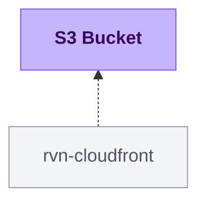

{/* Generated by scripts/sync-module-catalog.mjs from the Ravion module catalog. Do not edit by hand. */}

**Type:** `rvn-s3` · **Latest version:** `1.0.1`

## Dependencies and consumers

_Every dependency input can be specified manually to reference existing external infrastructure rather than a Ravion module._

## Readme

S3 bucket with public access blocking, encryption, versioning, CORS, lifecycle rules, and configurable bucket policies.

### Overview

Use this module to create an Amazon S3 bucket with secure defaults and common operational controls exposed in Ravion. The module blocks public access by default, enables server-side encryption, and can manage versioning, CORS rules, lifecycle rules, and bucket policy statements.

### Use cases

| Scenario | Benefit |
| --- | --- |
| Application object storage | Create a private bucket with encryption and tags. |
| Access log storage | Use ALB, NLB, or VPC Flow Logs policy templates with lifecycle expiration. |
| Browser uploads or downloads | Add CORS rules for approved web origins and methods. |
| Compliance retention | Enable versioning and lifecycle rules for noncurrent versions. |
| Custom integrations | Attach custom bucket policy statements while preserving public access block settings. |

### Security defaults

Public access block settings are enabled by default: Block public ACLs, Block public policies, Ignore public ACLs, and Restrict public buckets. Leave these enabled for private application buckets and log buckets unless you have a specific public bucket design.

The bucket uses SSE-S3 AES256 encryption by default and blocks SSE-C uploads. Set KMS key ID to use SSE-KMS. Bucket key remains enabled by default for SSE-KMS to reduce KMS request volume.

### Lifecycle rules

Lifecycle rules can expire current objects, expire noncurrent versions, transition current or noncurrent versions to colder storage classes, and abort incomplete multipart uploads. The lifecycle rule form covers the common one-transition-per-rule cases. Advanced lifecycle rules accept the Terraform lifecycle rule shape, including id, enabled, prefix, tags, expiration, noncurrent_version_expiration, transitions, noncurrent_version_transitions, and abort_incomplete_multipart_upload_days.

### CORS

CORS rules allow browser-based applications on approved origins to make cross-origin requests to bucket objects. Each rule includes allowed origins and methods, with optional allowed request headers, exposed response headers, and browser preflight cache duration.

### Bucket policies

Policy templates add statements for common AWS service integrations:

| Template | Purpose |
| --- | --- |
| Deny insecure transport | Denies S3 requests over HTTP. |
| ALB access logs | Allows Application Load Balancer log delivery. |
| NLB access logs | Allows Network Load Balancer log delivery. |
| VPC Flow Logs | Allows VPC Flow Logs delivery. |
| CloudFront OAC read | Allows selected CloudFront distributions using Origin Access Control to read objects. |

Custom policy JSON can be provided for additional statements. When templates and custom policy are both set, the module merges their statements into one bucket policy.

For private buckets served through rvn-cloudfront, apply the CloudFront module first, then add the CloudFront OAC read template here with the CloudFront distribution ARN. The bucket remains private because access is granted only to the CloudFront service principal for that distribution.

### Configuration

| Setting | Required | Default | Notes |
| --- | --- | --- | --- |
| AWS account | Yes | None | AWS account where the bucket is created. |
| Region | Yes | None | AWS Region for the bucket. |
| Bucket name | Yes | Project, environment, and module given IDs | Must be globally unique and follow S3 naming rules. |
| Force destroy | No | false | Deletes objects during bucket destroy. Use with caution. |
| Public access block settings | No | true | Four independent controls for ACLs and public bucket policies. |
| KMS key ID | No | None | Uses SSE-KMS when set; otherwise uses SSE-S3 AES256. |
| Bucket key | No | true | Applies to SSE-KMS only. |
| Versioning | No | false | Keeps multiple versions of objects. |
| CORS rules | No | Empty list | Browser cross-origin access rules for approved origins and methods. |
| Lifecycle rules | No | Empty list | Form-based expiration, transition, noncurrent version, and multipart cleanup rules. |
| Advanced lifecycle rules | No | Empty list | Raw Terraform lifecycle rule shape for tag filters, multiple transitions, and uncommon combinations. |
| Policy templates | No | Empty list | Adds common bucket policy statements. |
| CloudFront distribution ARNs | No | Empty list | Required when the CloudFront OAC read policy template is selected. |
| Custom policy JSON | No | None | Additional policy statements merged with templates. |
| Tags | No | Standard Ravion tags | Additional tags merged with Ravion ownership and identity tags. |
| Advanced Terraform variables | No | Empty object | Escape hatch for one-off Terraform variable overrides. |
| Ravion Terraform workspace name | No | Generated from project, environment, module, and stack IDs | Override only when you need a specific backend workspace name. |

### Design decisions

The module defaults to private, encrypted buckets. Public access settings are exposed because some AWS integrations need carefully scoped policies, but the secure defaults should remain enabled for most buckets.

Bucket policy creation is inferred from selected policy templates or Custom policy JSON. Internal Terraform callers can override that inference for policies whose value is known only during apply, but that escape hatch is not part of the normal Ravion form.

Ravion adds standard tags for ownership and traceability. User-provided Tags are merged on top for team, cost, or environment metadata.

### Learn more

- [Amazon S3 bucket naming rules](https://docs.aws.amazon.com/AmazonS3/latest/userguide/bucketnamingrules.html)
- [Blocking public access to your Amazon S3 storage](https://docs.aws.amazon.com/AmazonS3/latest/userguide/access-control-block-public-access.html)
- [Protecting data with server-side encryption](https://docs.aws.amazon.com/AmazonS3/latest/userguide/serv-side-encryption.html)
- [Managing your storage lifecycle](https://docs.aws.amazon.com/AmazonS3/latest/userguide/object-lifecycle-mgmt.html)
- [Source module](https://github.com/ravionhq/modules/tree/rvn-s3@1.0.1/storage/s3)

## Inputs reference

All inputs for `rvn-s3` version `1.0.1`. Use the `name` shown for each field as the input key in module config.

### AWS account & region

<ResponseField name="aws_account_id" type="string" required>
  **AWS account.**

  - Immutable after creation
</ResponseField>

<ResponseField name="aws_region" type="string" required>
  **Region.**

  - Immutable after creation
</ResponseField>

### Bucket

<ResponseField name="name" type="string" required>
  **Bucket name.** Globally unique S3 bucket name.

  - Default: `<<project.given_id>>-<<environment.given_id>>-<<module.given_id>>`
  - Immutable after creation
  - Pattern: `^.{3,63}$` — Bucket names must be 3-63 characters long.
  - Pattern: `^[a-z0-9][a-z0-9.-]*[a-z0-9]$` — Use a valid S3 bucket name: lowercase letters, numbers, hyphens, and periods; start and end with a letter or number.
  - Pattern: `^(?!.*\.\.).*$` — Bucket names must not contain consecutive periods.
  - Pattern: `^(?!.*(\.-|-\.)).*$` — Bucket names must not contain periods next to hyphens.
  - Pattern: `^(?!\d+\.\d+\.\d+\.\d+$).*$` — Bucket names must not be formatted as an IPv4 address.
  - Pattern: `^(?!xn--)(?!.*-s3alias$).*$` — Bucket names must not start with xn-- or end with -s3alias.
</ResponseField>

<ResponseField name="force_destroy_enabled" type="boolean">
  **Force destroy.** Delete the bucket even when it contains objects. Use with caution.

  - Default: `false`
</ResponseField>

### Public access block

<ResponseField name="block_public_acls" type="boolean">
  **Block public ACLs.** Block public ACLs for this bucket.

  - Default: `true`
</ResponseField>

<ResponseField name="block_public_policy" type="boolean">
  **Block public policies.** Block public bucket policies for this bucket.

  - Default: `true`
</ResponseField>

<ResponseField name="ignore_public_acls" type="boolean">
  **Ignore public ACLs.** Ignore public ACLs on this bucket and its objects.

  - Default: `true`
</ResponseField>

<ResponseField name="restrict_public_buckets" type="boolean">
  **Restrict public buckets.** Restrict public bucket policies to AWS service principals and authorized users in this account.

  - Default: `true`
</ResponseField>

### Encryption

<ResponseField name="kms_key_id" type="string">
  **KMS key ID.** Optional AWS KMS key ID or ARN for SSE-KMS. Leave empty to use SSE-S3 AES256 encryption.
</ResponseField>

<ResponseField name="bucket_key_enabled" type="boolean">
  **Bucket key.** Enable S3 Bucket Keys for SSE-KMS to reduce KMS request costs. Applies only when KMS key ID is set.

  - Default: `true`
</ResponseField>

### Versioning

<ResponseField name="versioning_enabled" type="boolean">
  **Versioning.** Keep multiple versions of objects in the bucket.

  - Default: `false`
</ResponseField>

### Lifecycle rules

<ResponseField name="lifecycle_rule_forms" type="object_array">
  **Lifecycle rules.** Configure common lifecycle rules with form fields. Use advanced lifecycle rules below for multiple transitions, tag filters, or less common combinations.

  - Default: `[]`

  <Expandable title="item fields">
    <ResponseField name="id" type="string" required>
      **Rule ID.** Unique identifier for this lifecycle rule. Use letters, numbers, periods, underscores, or hyphens.

      - Pattern: `^[A-Za-z0-9._-]{1,255}$` — Use 1-255 letters, numbers, periods, underscores, or hyphens.
    </ResponseField>
    <ResponseField name="enabled" type="boolean">
      **Enabled.** Whether this lifecycle rule is enabled.

      - Default: `true`
    </ResponseField>
    <ResponseField name="prefix" type="string">
      **Prefix.** Object key prefix matched by this rule. Leave empty to apply to the whole bucket.
    </ResponseField>
    <ResponseField name="expiration_days" type="number">
      **Expiration days.** Days after object creation when current versions expire.

      - Min: `1`
    </ResponseField>
    <ResponseField name="expiration_date" type="string">
      **Expiration date.** Date when current versions expire, in YYYY-MM-DD format. Use either expiration days or expiration date, not both.

      - Pattern: `^\d{4}-\d{2}-\d{2}$` — Use YYYY-MM-DD format.
    </ResponseField>
    <ResponseField name="expiration_expired_object_delete_marker_enabled" type="boolean">
      **Expire delete markers.** Expire delete markers when they are the only remaining version.

      - Default: `false`
    </ResponseField>
    <ResponseField name="noncurrent_version_expiration_days" type="number">
      **Noncurrent expiration days.** Days after an object becomes noncurrent when noncurrent versions expire.

      - Min: `1`
    </ResponseField>
    <ResponseField name="noncurrent_version_newer_noncurrent_versions" type="number">
      **Newer noncurrent versions to retain.** Number of newer noncurrent versions to retain before noncurrent expiration applies.

      - Min: `1`
    </ResponseField>
    <ResponseField name="transition_storage_class" type="string">
      **Transition storage class.** Storage class for a current version transition.

      - Allowed values: `GLACIER` (Glacier Flexible Retrieval), `STANDARD_IA` (Standard-IA), `ONEZONE_IA` (One Zone-IA), `INTELLIGENT_TIERING` (Intelligent-Tiering), `DEEP_ARCHIVE` (Deep Archive), `GLACIER_IR` (Glacier Instant Retrieval)
    </ResponseField>
    <ResponseField name="transition_days" type="number">
      **Transition days.** Days after object creation when the current version transitions.
    </ResponseField>
    <ResponseField name="transition_date" type="string">
      **Transition date.** Date when current versions transition, in YYYY-MM-DD format. Use either transition days or transition date, not both.

      - Pattern: `^\d{4}-\d{2}-\d{2}$` — Use YYYY-MM-DD format.
    </ResponseField>
    <ResponseField name="noncurrent_transition_storage_class" type="string">
      **Noncurrent transition storage class.** Storage class for a noncurrent version transition.

      - Allowed values: `GLACIER` (Glacier Flexible Retrieval), `STANDARD_IA` (Standard-IA), `ONEZONE_IA` (One Zone-IA), `INTELLIGENT_TIERING` (Intelligent-Tiering), `DEEP_ARCHIVE` (Deep Archive), `GLACIER_IR` (Glacier Instant Retrieval)
    </ResponseField>
    <ResponseField name="noncurrent_transition_days" type="number">
      **Noncurrent transition days.** Days after an object becomes noncurrent when it transitions.
    </ResponseField>
    <ResponseField name="noncurrent_transition_newer_noncurrent_versions" type="number">
      **Newer noncurrent versions before transition.** Number of newer noncurrent versions to retain before noncurrent transition applies.
    </ResponseField>
    <ResponseField name="abort_incomplete_multipart_upload_days" type="number">
      **Abort incomplete multipart uploads days.** Days after initiation when incomplete multipart uploads are aborted.

      - Min: `1`
    </ResponseField>
  </Expandable>
</ResponseField>

<ResponseField name="lifecycle_rules_raw" type="array">
  **Advanced lifecycle rules.** Advanced lifecycle rules in the Terraform lifecycle rule shape. Use this for tag filters, multiple transitions, or other combinations not covered by the form above.

  - Default: `[]`
</ResponseField>

### Bucket policy

<ResponseField name="policy_templates" type="string_array">
  **Policy templates.** Prebuilt bucket policy statements to add.

  - Default: `[]`
  - Allowed values: `deny_insecure_transport` (Deny insecure transport), `alb_access_logs` (ALB access logs), `nlb_access_logs` (NLB access logs), `vpc_flow_logs` (VPC Flow Logs), `cloudfront_oac_read` (CloudFront OAC read)
</ResponseField>

<ResponseField name="cloudfront_distribution_arns" type="string_array">
  **CloudFront distribution ARNs.** CloudFront distribution ARNs allowed to read objects when the CloudFront OAC read policy template is selected.

  - Default: `[]`
  - Pattern: `^arn:aws:cloudfront::[0-9]{12}:distribution/[A-Z0-9]+$` — Invalid CloudFront distribution ARN.
</ResponseField>

<ResponseField name="custom_policy" type="text">
  **Custom policy JSON.** Custom bucket policy JSON document. If policy templates are also selected, statements are merged.
</ResponseField>

### CORS

<ResponseField name="cors_rules" type="object_array">
  **CORS rules.** Configure Cross-Origin Resource Sharing rules for browser access to bucket objects.

  - Default: `[]`

  <Expandable title="item fields">
    <ResponseField name="id" type="string">
      **Rule ID.** Optional unique identifier for this CORS rule.
    </ResponseField>
    <ResponseField name="allowed_origins" type="string_array" required>
      **Allowed origins.** Origins allowed to make cross-origin requests to this bucket.
    </ResponseField>
    <ResponseField name="allowed_methods" type="string_array" required>
      **Allowed methods.** HTTP methods allowed for cross-origin requests.

      - Allowed values: `GET`, `PUT`, `HEAD`, `POST`, `DELETE`
    </ResponseField>
    <ResponseField name="allowed_headers" type="string_array">
      **Allowed headers.** Request headers allowed in cross-origin requests. Use * to allow any header.

      - Default: `[]`
    </ResponseField>
    <ResponseField name="expose_headers" type="string_array">
      **Exposed headers.** Response headers browsers may expose to client code.

      - Default: `[]`
    </ResponseField>
    <ResponseField name="max_age_seconds" type="number">
      **Max age (seconds).** Seconds browsers can cache CORS preflight responses.

      - Min: `0`
    </ResponseField>
  </Expandable>
</ResponseField>

### Terraform settings

<ResponseField name="opentofu_version" type="string">
  **OpenTofu version override.** Override the environment's default version for this module
</ResponseField>

<ResponseField name="ravion_state_backend_workspace" type="string">
  **Ravion Terraform workspace name.** Override Terraform state backend workspace name. Defaults to project + environment + module given ids.

  - Immutable after creation
</ResponseField>

<ResponseField name="advanced_terraform_variables" type="object">
  **Advanced Terraform variables.** Optional raw Terraform variable overrides for advanced module inputs or one-off overrides. Values here override the generated variables above.

  - Default: `{}`
</ResponseField>

<ResponseField name="execution_environment_id" type="string">
  **Terraform execution environment.** Override the execution environment for Terraform runners. Must use the same AWS account as selected above.
</ResponseField>

<ResponseField name="tags" type="keyvalue">
  **Tags.** A map of tags to assign to all resources. Default tags are `Owner`, `ProjectGivenId`, `EnvironmentGivenId`, `ModuleGivenId`, `ModuleId`
</ResponseField>
