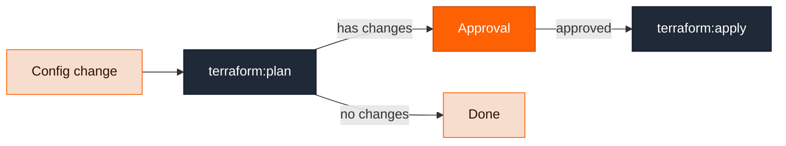

A **stack** is the infrastructure-as-code state behind a module instance. If a module's definition includes a `stack` block, every instance of that module gets exactly one stack. Modules without infrastructure — or whose definitions only configure build and deploy behavior — have no stack.

The stack tracks:

- **Resources** — every Terraform resource the module manages, with its type, address, and the change it went through in each run (create, update, delete, replace).
- **Change history** — every plan and apply, with resource-change counts and full output.
- **Outputs** — the stack's Terraform outputs. Other modules consume these through references like `<< ref.stack.output.vpc_id >>`, which is how a web service module finds its cluster and network.

## Stacks change through pipelines

You never run `terraform apply` against a stack by hand. Every stack has two pipelines attached:

| Pipeline    | Steps                                             | Runs when                                   |
| ----------- | ------------------------------------------------- | ------------------------------------------- |
| **Change**  | `terraform:plan` → `approval` → `terraform:apply` | The module is created or its config changes |
| **Destroy** | destroy plan → `approval` → `terraform:apply`     | The module is deleted                       |

A run of one of these is what the docs call a **stack change pipeline run**. It is an ordinary pipeline run — you inspect it under Pipelines with steps, logs, and Terraform results like any other run.

The flow within a change run:



- The plan and apply steps run on temporary EC2 instances in your cloud account, so your Terraform code and secrets never enter the Ravion control plane. The plan file is uploaded to S3 and the apply consumes exactly that plan.
- The approval step is skipped when the plan has no changes, or when the run was started with **autoapprove** (for example `--autoapprove` on `ravion project config apply` or `ravion stack trigger-pipeline`). Autoapprove applies to change runs only — destroy runs always require manual approval.
- Runs are locked per stack, so two runs can't apply to the same state concurrently.

### System pipelines and customization

By default, every stack runs through Ravion-managed **system pipelines**:

| Pipeline | Name                        | Given ID              |
| -------- | --------------------------- | --------------------- |
| Change   | Terraform Change Pipeline   | `tf-change-pipeline`  |
| Destroy  | Terraform Destroy Pipeline  | `tf-destroy-pipeline` |

Both appear in `ravion pipeline list`, where you can read the `pipe_` ID you need to pull their config.

System pipelines are global and read-only — Ravion manages them, and you can't edit them. They give every organization a working plan → approval → apply workflow with zero setup.

To customize the workflow — add policy checks, notifications, or different approval rules — create your own pipeline in your account and point stacks at it instead:

<Steps>
  <Step title="Create your pipeline">
    Start from the system pipeline's config, or from scratch:

    ```bash
    # Pull the system pipeline config as a starting point
    ravion pipeline config pull <system-pipeline-id> --file change-pipeline.yaml

    # Create your own pipeline and apply the edited config
    ravion pipeline create --given-id tf-change --name "Terraform change" --project-id <project-id>
    ravion pipeline config apply <pipeline-id> --file change-pipeline.yaml
    ```

    See [Pipeline config file](/config-as-code/pipeline-config-file).

  </Step>

  <Step title="Point stacks at it">
    Stacks resolve their pipelines through [default values](/cli/reference/default-value) with the definition given IDs `change_pipeline_id` and `destroy_pipeline_id`. Set a value at the organization, project, or environment level — the most specific scope wins:

    ```bash
    # Find the change_pipeline_id / destroy_pipeline_id definitions in your org
    ravion default-value definition list

    # Set your pipeline as the default for the whole organization
    ravion default-value create \
      --default-value-definition-id <definition-id> \
      --parent-type organization --parent-id <org-id> \
      --value <your-pipeline-id>
    ```

  </Step>
</Steps>

A module definition can also pin explicit pipeline IDs through its `stack.pipelines` config, which takes precedence over the default values — but only if the definition exposes that config. See the [module definition schema](/module-definitions/definition-schema).

For a worked example — inserting a policy check between plan and apply and rolling it out per environment — see [Add policy checks to Terraform pipelines](/guides/terraform-policy-checks).

### Initial run when creating a module

When you create a stack-backed module instance you choose the initial stack run behavior:

- `NONE` (default) — create the instance without running Terraform yet.
- `PLAN` — start a change run that stops at the approval gate.
- `APPLY` — start a change run with autoapprove enabled.

With the CLI this is `ravion module create --initial-stack-run`.

## Inspecting stack configuration

A module version defines the source code and input mapping used by its stack. Get the module version ID from the module instance, then inspect the version:

```bash
ravion module get <module-id> --json
ravion module version get <module-version-id> --json
```

The version's stack config includes `repo`, `ref`, and `base_path` for the Terraform or OpenTofu source. Its `terraform_variables` mapping shows how module inputs and references become Terraform input variables. Use this metadata to debug plans, trace unexpected values, or prepare an import.

## State storage

Ravion can act as your managed Terraform state backend: set `ravion_state_backend_workspace` in the module definition's stack config and Ravion stores versioned state for you, with locking. By default, the workspace is named `{project}-{environment}-{module}-{stackId}` using given IDs plus the stack ID. Alternatively, use your own remote backend such as S3 and DynamoDB. Local state backends are not supported.

<Note>
  `ravion terraform state pull`, `list`, and `show` return a 404 for a managed workspace until the first state version is written. A module created with `--initial-stack-run NONE` has no state version until an operation such as `terraform apply` or `terraform import` writes one.
</Note>

## Inspecting stacks

```bash
# List stacks and view one
ravion stack list
ravion stack get <stack-id>

# Count current-state resources across stacks
ravion stack resource-count

# Trigger a change or destroy run manually
ravion stack trigger-pipeline <stack-id> --pipeline-type change \
  --description "Apply infrastructure changes"
ravion stack trigger-pipeline <stack-id> --pipeline-type change --autoapprove \
  --description "Apply infrastructure changes automatically"

# Follow a run to completion, then inspect Terraform runs and resources
ravion pipeline run wait <pipeline-run-id> --watch --timeout 30m
ravion terraform execution-summary list --stack-id <stack-id>
ravion pipeline run get-plan <pipeline-run-id>
ravion pipeline run get-apply <pipeline-run-id>
```

See the [`ravion stack`](/cli/reference/stack) and [`ravion terraform`](/cli/reference/terraform) CLI references.
