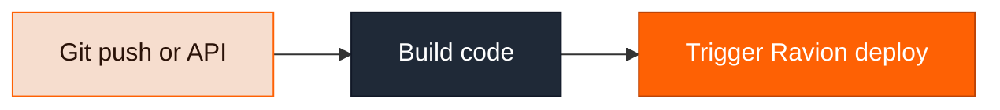
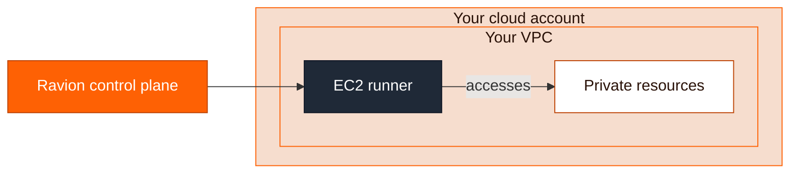

Ravion Pipelines are a full-featured CI/CD system that runs in your cloud account.

They are _optional_ for you instead of using GitHub Actions or CircleCI.

Regardless, you will need to have a pipeline _somewhere_ to build your code, upload the artifacts to a store, and trigger a deployment of that in Ravion.



### Two kinds of pipeline runs

Pipelines fill two roles in Ravion, and you'll see both in your run history:

1. **Pipelines you author** — build and deploy workflows triggered by git pushes, the API, or manually. These are the optional replacement for GitHub Actions described on this page.
2. **Stack pipelines** — the change and destroy pipelines attached to every module [stack](/modules/stack), which run Terraform plan → approval → apply whenever a module's infrastructure config changes or the module is deleted. By default these are Ravion-managed system pipelines; your platform team can substitute custom ones.

When other docs mention a "stack change pipeline run", it's the second kind: a normal pipeline run that was triggered by a config change instead of a git push.

### One pipeline, many environments

A pipeline describes a workflow, not an environment. Don't create a "Production pipeline" and a "Staging pipeline" — create one pipeline named after what it does, like **Build & Deploy**, and add a [variant](/pipelines/variants) per environment. Steps reference module instances through `<< pipeline.variant.id >>`, so the same steps deploy to whichever environment a run targets:

```yaml
variants:
  - id: production
    name: Production
  - id: staging
    name: Staging
steps:
  - id: deploy_web_app
    type: deploy
    # resolves to production.web-app or staging.web-app
    module_instance: << pipeline.variant.id >>.web-app
```

### One workflow per pipeline

A pipeline should contain steps that depend on each other. If two sets of steps never consume each other's outputs and never need to wait on each other, they are separate workflows — make them separate pipelines, not parallel groups in one pipeline.

The common mistake is a pipeline shaped like this:

```yaml
# Anti-pattern: independent workflows packed into one pipeline
steps:
  - parallel:
      - group: API
        steps:
          - id: build_api
            type: build
            module_instance: << pipeline.variant.id >>.api
          - id: deploy_api
            type: deploy
            module_instance: << pipeline.variant.id >>.api
            input:
              image_ref: << steps.build_api.output.image_digest >>
      - group: Marketing site
        steps:
          - id: build_site
            type: build
            module_instance: << pipeline.variant.id >>.marketing-site
          - id: deploy_site
            type: deploy
            module_instance: << pipeline.variant.id >>.marketing-site
            input:
              image_ref: << steps.build_site.output.image_digest >>
```

Nothing in the **API** branch reads from the **Marketing site** branch. Packing them together only couples them: a failing site build marks the whole run failed, every trigger runs both even when only one changed, and you can't re-run one without re-running the other. Split them into an **API** pipeline and a **Marketing site** pipeline, each with its own trigger and its own build → deploy steps.

Keep steps in the same pipeline when they share a dependency:

- A deploy that pins the image digest from a build.
- One image build that several module instances deploy.
- A test or `terraform:plan` step that gates a deploy or apply.
- An approval that several deploys wait on.
- Services that must roll out together, in a fixed order, because of a schema or API contract.

Use `parallel` for steps that can overlap *inside* one of these workflows — build two images before a shared deploy stage, or fan a single build out to several deploys. Reach for `group` only occasionally: it labels a nested sequence in the UI and gives it a shared concurrency limit, so it's useful to hold a multi-step branch inside a `parallel` block. A pipeline whose top level is nothing but parallel groups is almost always several pipelines. See [Blocks](/pipelines/step-types#blocks) for the semantics.

### You might want to use Ravion pipelines for the following reasons:

<Steps>
  <Step>
    You get **a single pane of glass and CLI/API surface area** to see all your builds, deploys, and infrastructure.
  </Step>

  <Step>
    You get **enhanced security and control** because you no longer have to open up your database or
    image registries to GitHub Actions. Ravion pipelines execute entirely in your cloud account.
  </Step>

  <Step>
    You can **define all your build configuration in the module** alongside your runtime config.
  </Step>
</Steps>



See [Pipeline configuration](/pipelines/config-reference) for the detailed config schema.
